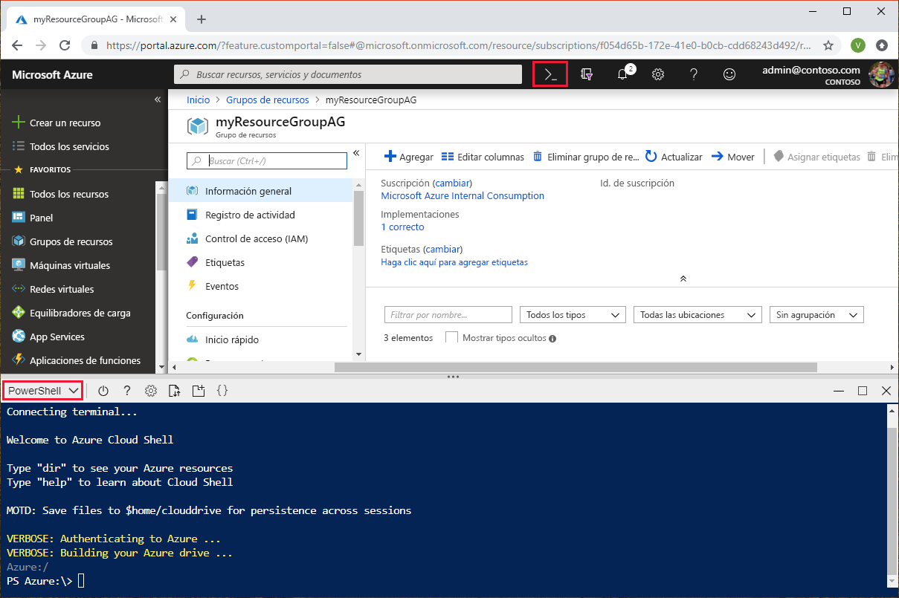
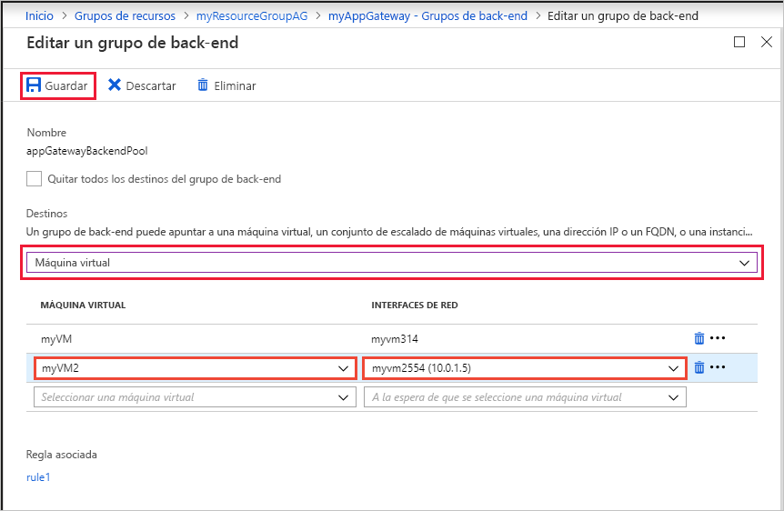
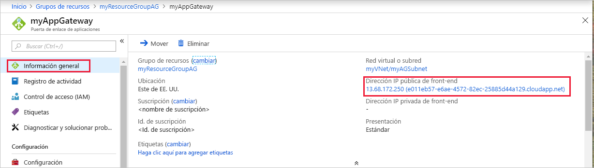

# <a name="quickstart-direct-web-traffic-with-azure-application-gateway---azure-portal"></a>Inicio rápido: Dirección del tráfico web con Azure Application Gateway: Azure Portal

En este artículo de inicio rápido se muestra cómo usar Azure Portal para crear una puerta de enlace de aplicaciones.  Después de crear la puerta de enlace de aplicaciones, pruébela para asegurarse de que funciona correctamente. Con Azure Application Gateway, puede dirigir el tráfico web de la aplicación a recursos específicos mediante la asignación de agentes de escucha a los puertos, la creación de reglas y la adición de recursos a un grupo de back-end. Por simplicidad, en este artículo se usa una configuración simple con una dirección IP del front-end público, un agente de escucha básico para hospedar un único sitio en esta puerta de enlace de aplicaciones, dos máquinas virtuales que se usan con el grupo de back-end y una regla de enrutamiento de solicitudes básica.

Si no tiene una suscripción a Azure, cree una [cuenta gratuita](https://azure.microsoft.com/free/?WT.mc_id=A261C142F) antes de empezar.

## <a name="sign-in-to-azure"></a>Inicio de sesión en Azure

Inicie sesión en [Azure Portal](https://portal.azure.com) con su cuenta de Azure.

## <a name="create-an-application-gateway"></a>Creación de una puerta de enlace de aplicaciones

Para que Azure se comunique entre los recursos que se crean, se necesita una red virtual. Puede crear una red virtual o usar una existente. En este ejemplo, crearemos una red virtual. Puede crear una red virtual a la vez que crea la puerta de enlace de aplicaciones. Se crean instancias de Application Gateway en subredes independientes. En este ejemplo se crean dos subredes: una para la puerta de enlace de aplicaciones y la otra para los servidores back-end.

1. Seleccione **Crear un recurso** en el menú de la izquierda de Azure Portal. Aparece la ventana **Nuevo**.

2. Seleccione **Redes** y **Application Gateway** en la lista **Destacados**.

### <a name="basics-page"></a>Página Datos básicos

1. En la página **Datos básicos**, especifique estos valores para la siguiente configuración de puerta de enlace de aplicaciones:

   - **Nombre**: Escriba *myAppGateway* como nombre de la puerta de enlace de aplicaciones.
   - **Grupo de recursos**: Seleccione **myResourceGroupAG** como grupo de recursos. Si no existe, seleccione **Crear nuevo** para crearlo.

     

2. Acepte los valores predeterminados para las demás opciones y seleccione **Aceptar**.

### <a name="settings-page"></a>Página Configuración

1. En la página **Configuración**, en **Configuración de subred**, seleccione **Elegir una red virtual**. <br>

2. En la página **Elegir una red virtual**, seleccione **Crear nuevo** y, a continuación, escriba valores para los siguientes valores de la red virtual:

   - **Nombre**: Escriba *myVnet* como nombre de la red virtual.

   - **Espacio de direcciones**: Especifique *10.0.0.0/16* como espacio de direcciones de la red virtual.

   - **Nombre de subred**: Especifique *myAGSubnet* como nombre de subred.<br>La subred de la puerta de enlace de aplicaciones solo puede contener puertas de enlace de aplicaciones. No se permite ningún otro recurso.

   - **Rango de direcciones de subred**: Especifique *10.0.0.0/24* como intervalo de direcciones de la subred.

     

3. Seleccione **Aceptar** para volver a la página **Configuración**.

4. Elija la **configuración IP de front-end**. En **Configuración de IP de front-end**, compruebe que **Tipo de dirección IP** está establecido en **Público**. En **Dirección IP pública**, compruebe que la opción **Crear nueva** está seleccionada. <br>Puede configurar la dirección IP de front-end para que sea pública o privada, según el caso de uso. En este ejemplo, elegimos una IP de front-end pública. 

5. Escriba *myAGPublicIPAddress* para el nombre de la dirección IP pública. 

6. Acepte los valores predeterminados para las demás opciones y seleccione **Aceptar**.<br>Por simplicidad, en este artículo se elegirán valores predeterminados, pero pueden configurarse valores personalizados para las demás opciones según el caso de uso. 

### <a name="summary-page"></a>Página de resumen

Revise la configuración en la página de **resumen** y seleccione **Aceptar** para crear la red virtual, la dirección IP pública y la puerta de enlace de aplicaciones. Azure puede tardar varios minutos en crear la puerta de enlace de aplicaciones. Espere hasta que finalice la implementación correctamente antes de continuar con la siguiente sección.

## <a name="add-backend-pool"></a>Agregar grupo de back-end

El grupo de back-end se usa para enrutar las solicitudes a los servidores back-end que atenderán la solicitud. Los grupos de back-end pueden constar de NIC, conjuntos de escalado de máquinas virtuales, direcciones IP públicas e internas, nombres de dominio completos (FQDN) y servidores back-end multiinquilino como Azure App Service. Hay que agregar los destinos de back-end a un grupo de back-end.

En este ejemplo, se usan máquinas virtuales como back-end de destino. Pueden usarse máquinas virtuales existentes o crear otras nuevas. En este ejemplo, se crean dos máquinas virtuales que Azure usa como servidores back-end para la puerta de enlace de aplicaciones. Para ello, se hará lo siguiente:

1. Crear una subred, *myBackendSubnet*, en la que se crearán las máquinas virtuales. 
2. Crear dos máquinas virtuales, *myVM* y *myVM2*, que se usarán como servidores back-end.
3. Instalar IIS en las máquinas virtuales para comprobar que la puerta de enlace de aplicaciones se ha creado correctamente.
4. Agregar los servidores back-end al grupo de back-end.

### <a name="add-a-subnet"></a>Incorporación de una subred

Agregue una subred a la red virtual que creó siguiendo estos pasos:

1. Seleccione **Todos los recursos** en el menú de la izquierda en Azure Portal, escriba *myVNet* en el cuadro de búsqueda y, a continuación, seleccione **myVNet** en los resultados de búsqueda.

2. Seleccione **Subredes** en el menú de la izquierda y seleccione **+ Subred**. 

   

3. En la página **Agregar subred**, escriba *myBackendSubnet* como el **nombre** de la subred y, después, seleccione **Aceptar**.

### <a name="create-a-virtual-machine"></a>de una máquina virtual

1. En Azure Portal, seleccione **Crear un recurso**. Aparece la ventana **Nuevo**.
2. Haga clic en **Compute** y, a continuación, seleccione **Windows Server 2016 Datacenter** en la lista **Destacados**. Aparecerá la página **Creación de una máquina virtual**.<br>Application Gateway puede enrutar el tráfico a cualquier tipo de máquina virtual que se use en el grupo de back-end. En este ejemplo se usa un Windows Server 2016 Datacenter.
3. Especifique estos valores en la pestaña **Datos básicos** de la siguiente configuración de máquina virtual:

    - **Grupo de recursos**: Seleccione **myResourceGroupAG** como nombre del grupo de recursos.
    - **Nombre de la máquina virtual**: Especifique *myVM* como nombre de la máquina virtual.
    - **Nombre de usuario**: Escriba *azureuser* como nombre del usuario administrador.
    - **Contraseña**: Escriba *Azure123456!* como la contraseña de administrador.
4. Acepte los valores predeterminados y haga clic en **Siguiente: Discos**.  
5. Acepte los valores predeterminados de la pestaña **Discos** y seleccione **Siguiente: Redes**.
6. En la pestaña **Redes**, compruebe que **myVNet** está seleccionada como **red virtual** y que la **subred** es **myBackendSubnet**. Acepte los valores predeterminados y haga clic en **Siguiente: Administración**.<br>Application Gateway puede comunicarse con instancias fuera de la red virtual en la que se encuentra, pero hay que comprobar que haya conectividad IP. 
7. En la pestaña **Administración**, establezca **Diagnósticos de arranque** en **Desactivado**. Acepte los demás valores predeterminados y seleccione **Revisar y crear**.
8. En la pestaña **Revisar y crear**, revise la configuración, corrija los errores de validación y, después, seleccione **Crear**.
9. Espere a que se complete la creación de la máquina virtual antes de continuar.

### <a name="install-iis-for-testing"></a>Instalación de IIS para pruebas

En este ejemplo se instala IIS en las máquinas virtuales con el único fin de comprobar que Azure creó correctamente la puerta de enlace de aplicaciones. 

1. Abra [Azure PowerShell](https://docs.microsoft.com/azure/cloud-shell/quickstart-powershell). Para ello, seleccione **Cloud Shell** en la barra de navegación superior de Azure Portal y, a continuación, seleccione **PowerShell** en la lista desplegable. 

    

2. Ejecute el siguiente comando para instalar IIS en la máquina virtual: 

    ```azurepowershell-interactive
    Set-AzureRmVMExtension `
      -ResourceGroupName myResourceGroupAG `
      -ExtensionName IIS `
      -VMName myVM `
      -Publisher Microsoft.Compute `
      -ExtensionType CustomScriptExtension `
      -TypeHandlerVersion 1.4 `
      -SettingString '{"commandToExecute":"powershell Add-WindowsFeature Web-Server; powershell Add-Content -Path \"C:\\inetpub\\wwwroot\\Default.htm\" -Value $($env:computername)"}' `
      -Location EastUS
    ```

3. Cree una segunda máquina virtual e instale IIS con los pasos que acaba de finalizar. Use *myVM2* como nombre de la máquina virtual y como valor de **VMName** para el cmdlet **Set-AzureRmVMExtension**.

### <a name="add-backend-servers-to-backend-pool"></a>Incorporación de servidores back-end a un grupo de back-end

1. Seleccione **Todos los recursos** y, después, seleccione **myAppGateway**.

2. Seleccione los **grupos back-end** en el menú de la izquierda. Azure creó automáticamente un grupo predeterminado, **appGatewayBackendPool** cuando creó la puerta de enlace de aplicaciones. 

3. Seleccione **appGatewayBackendPool**.

4. En **Destinos**, seleccione **Máquina virtual** de la lista desplegable.

5. En **MÁQUINA VIRTUAL** e **INTERFACES DE RED**, seleccione las máquinas virtuales **myVM** y **myVM2**, y sus interfaces de red asociadas de las listas desplegables.

    

6. Seleccione **Guardar**.

## <a name="test-the-application-gateway"></a>Prueba de la puerta de enlace de aplicaciones

No es necesario instalar IIS para crear la puerta de enlace de aplicaciones, pero se instaló en este inicio rápido para comprobar si la puerta de enlace de aplicaciones se creó correctamente. Use IIS para probar la puerta de enlace de aplicaciones:

1. Busque la dirección IP pública de la puerta de enlace de aplicaciones en la página de **información general**.. O bien, puede seleccionar **Todos los recursos**, escribir *myAGPublicIPAddress* en el cuadro de búsqueda y luego seleccionarlo en los resultados de la búsqueda. Azure muestra la dirección IP pública en la página de **información general**.
2. Copie la dirección IP pública y péguela en la barra de direcciones del explorador.
3. Compruebe la respuesta. Una respuesta válida corrobora que la puerta de enlace de aplicaciones se ha creado correctamente y puede conectarse correctamente con el back-end.


## <a name="clean-up-resources"></a>Limpieza de recursos

Cuando ya no necesite los recursos que ha creado con la puerta de enlace de aplicaciones, elimine el grupo de recursos. Mediante la eliminación del grupo de recursos también elimina la puerta de enlace de aplicaciones y todos sus recursos relacionados. 

Para eliminar el grupo de recursos:
1. En el menú de la izquierda de Azure Portal, seleccione **Grupos de recursos**.
2. En la página **Grupos de recursos**, busque **myResourceGroupAG** en la lista y selecciónelo.
3. En la **página del grupo de recursos**, seleccione **Eliminar grupo de recursos**.
4. Escriba *myResourceGroupAG* en **ESCRIBA EL NOMBRE DEL GRUPO DE RECURSOS** y seleccione **Eliminar**.

## <a name="next-steps"></a>Pasos siguientes

> [!div class="nextstepaction"]
> [Administrar el tráfico web con Application Gateway mediante la CLI de Azure](./tutorial-manage-web-traffic-cli.md)
