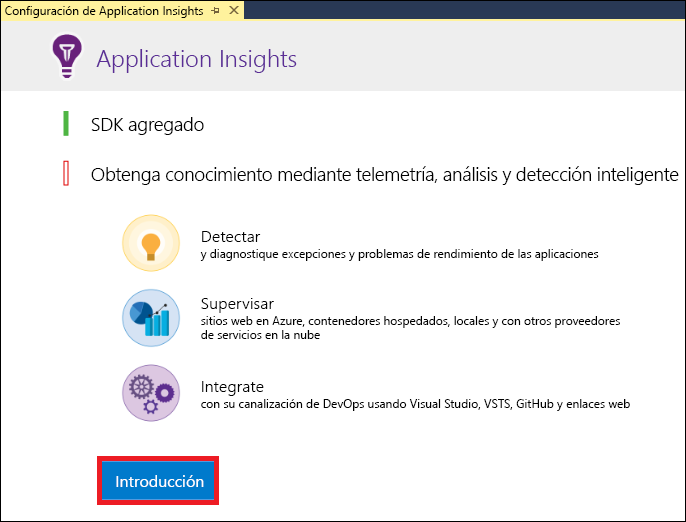
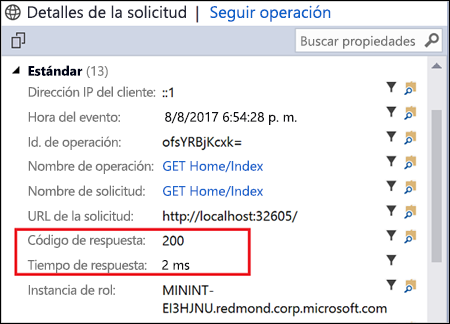
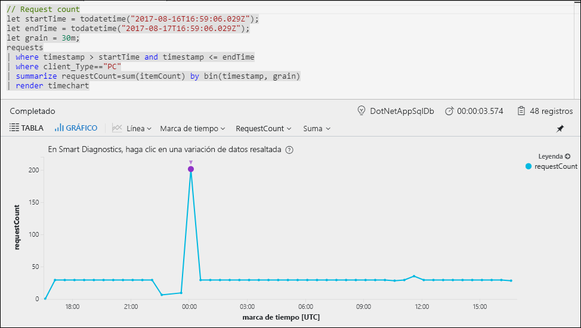
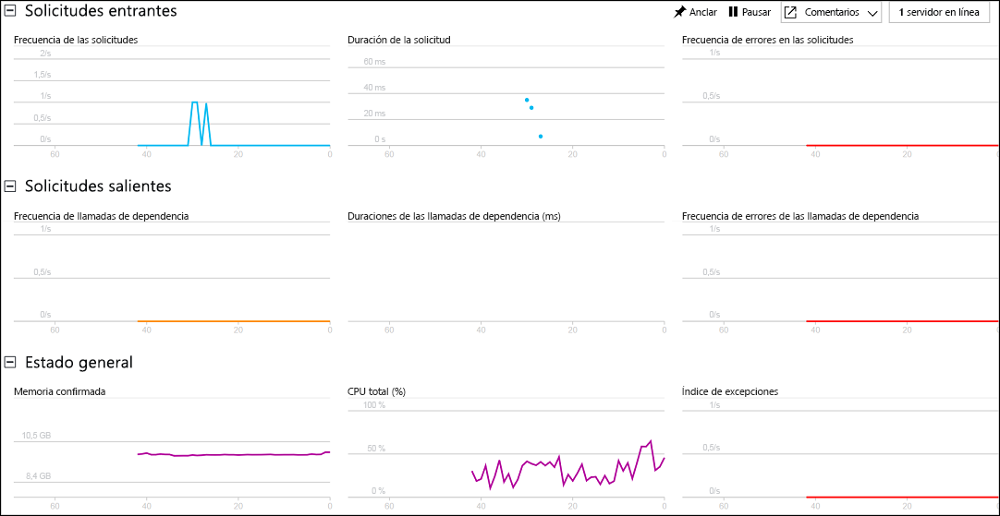

# Inicio de la supervisión de la aplicación web ASP.NET

Con Azure Application Insights puede supervisar fácilmente la disponibilidad, el rendimiento y el uso de su aplicación web.  También puede identificar y diagnosticar errores en la aplicación rápidamente sin tener que esperar a que un usuario informe de ellos.  Con la información que recopile de Application Insights sobre el rendimiento y la eficacia de la aplicación, puede tomar decisiones informadas para hacer el mantenimiento de la aplicación y mejorarla.

En esta guía de inicio rápido se muestra cómo agregar Application Insights a una aplicación web ASP.NET existente y empezar a analizar las estadísticas en vivo, que es solo uno de los distintos métodos que puede usar para analizar la aplicación. Si no tiene una aplicación web ASP.NET, puede seguir la [guía de inicio rápido de aplicaciones web ASP.NET](../app-service/app-service-web-get-started-dotnet-framework.md) para crear una.

## Requisitos previos
Para completar esta guía de inicio rápido:

- Instalar [Visual Studio 2017](https://www.visualstudio.com/downloads/) con las cargas de trabajo siguientes:
    - ASP.NET y desarrollo web
    - Desarrollo de Azure

Si no tiene una suscripción a Azure, cree una cuenta [gratuita](https://azure.microsoft.com/free/) antes de empezar.

## Habilitación de Application Insights

1. Abra el proyecto en Visual Studio 2017.
2. Seleccione **Configurar Application Insights** desde el menú Proyecto. Visual Studio agregará el SDK de Application Insights a la aplicación.

    > [!IMPORTANT]
    > El proceso para agregar Application Insights varía según el tipo de plantilla de ASP.NET. Si usa la plantilla **Vacía** o **Aplicación móvil de Azure**, seleccione **Proyecto** > **Agregar telemetría de Application Insights**. Para las demás plantillas de ASP.NET, consulte las instrucciones del paso anterior. 

3. Haga clic en **Iniciar** (en versiones anteriores de Visual Studio, haga clic en el botón **Inicio gratis**).

    

4. Seleccione su suscripción y haga clic en **Registrarse**.

5. Para ejecutar la aplicación, seleccione **Iniciar depuración** desde el menú **Depurar** o presionando la tecla F5.

## Confirmación de la configuración de la aplicación

Application Insights recopila datos de telemetría para la aplicación, independientemente de dónde se ejecute. Siga estos pasos para empezar a ver los datos.

1. Abra Application Insights haciendo clic en **Ver** -> **Otras ventanas** -> **Búsqueda de Application Insights**.  Se mostrará la telemetría de la sesión actual.  

2. Haga clic en la primera solicitud de la lista (en el ejemplo, GET Home/Index) para ver sus detalles. Observe que, junto con otra información valiosa acerca de la solicitud, se incluye el código de estado y la hora de respuesta.  

## Inicio de la supervisión en Azure Portal

Ya puede abrir Application Insights en Azure Portal para ver distintos detalles acerca de la aplicación en ejecución.

1. Haga clic con el botón derecho en **Servicios conectados Application Insights** en Explorador de soluciones y haga clic en **Abrir portal de Application Insights**.  Se mostrará cierta información acerca de la aplicación, así como varias opciones.

    

2. Haga clic en **Mapa de aplicación** para mostrar un diseño visual de las relaciones de dependencia entre los componentes de la aplicación.  Cada componente muestra KPI como la carga, el rendimiento, errores y alertas.

    

3. Haga clic en **Análisis de aplicaciones** icono  en uno de los componentes de la aplicación.  Se abrirá **Application Insights Analytics**, que proporciona un lenguaje de consulta avanzado para analizar todos los datos recopilados por Application Insights.  En este caso, se genera una consulta que representa el número de solicitudes en un gráfico.  Puede escribir sus propias consultas para analizar otros datos.

    

4. Vuelva a la página **Información general** y haga clic en **Live Stream**.  Se mostrarán estadísticas en vivo sobre la aplicación mientras se ejecuta.  Esto incluye información como el número de solicitudes entrantes, la duración de estas y los errores que se producen.  También puede inspeccionar las métricas de rendimiento crítico, como el procesador y la memoria.

    

Si está listo para hospedar su aplicación en Azure, puede publicarla ahora. Siga los pasos que se describen en la [guía de inicio rápido para crear una aplicación web de ASP.NET](../app-service/app-service-web-get-started-dotnet.md#update-the-app-and-redeploy).

## Pasos siguientes
En esta guía de inicio rápido, ha habilitado la aplicación para que la supervise Azure Application Insights.  Continúe con las guías de inicio rápido para aprender a usarlo para supervisar las estadísticas y detectar problemas en la aplicación.

> [!div class="nextstepaction"]
> [Tutoriales de Azure Application Insights](app-insights-tutorial-runtime-exceptions.md)
