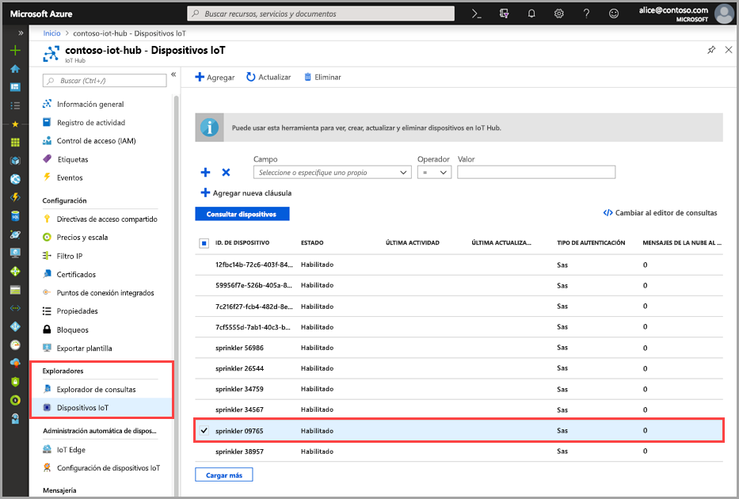
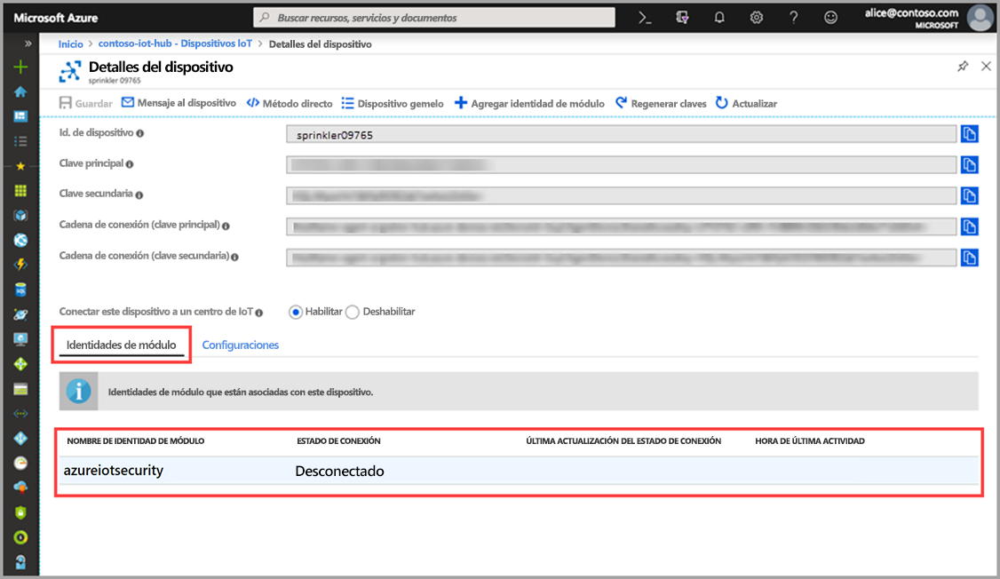

# Inicio rápido: Creación de un módulo gemelo de azureiotsecurity

> [!IMPORTANT]
> Azure Security Center for IoT está actualmente en versión preliminar pública. Esta versión preliminar se ofrece sin Acuerdo de Nivel de Servicio y no se recomienda para cargas de trabajo de producción. Es posible que algunas características no sean compatibles o que tengan sus funcionalidades limitadas. Para más información, consulte [Términos de uso complementarios de las Versiones Preliminares de Microsoft Azure](https://azure.microsoft.com/support/legal/preview-supplemental-terms/).

Las explicaciones de este inicio rápido para crear módulos gemelos de _azureiotsecurity_ individuales para los nuevos dispositivos o para crear módulos gemelos por lotes para todos los dispositivos de IoT Hub.  

## Descripción de los módulos gemelos de azureiotsecurity 

En el caso de las soluciones de IoT integradas en Azure, los dispositivos gemelos desempeñan un rol clave tanto en la administración de dispositivos como en la automatización de procesos. 

Azure Security Center (ASC) for IoT ofrece integración completa con la plataforma de administración de dispositivos de IoT existente, lo que permite no solo administrar el estado de seguridad de los dispositivos, sino también hacer uso de las funcionalidades de control de dispositivos existentes.
Para lograr La integración del ASC for IoT es preciso usar el mecanismo gemelo de IoT Hub.  

Para más información acerca del concepto general de los módulos gemelos en Azure IoT Hub, consulte [Módulos gemelos de IoT Hub](https://docs.microsoft.com/azure/iot-hub/iot-hub-devguide-module-twins). 
 
ASC for IoT usa el mecanismo de módulos gemelos y mantiene un módulo gemelo de seguridad denominado _azureiotsecurity_ para cada uno de los dispositivos.
Este módulo contiene toda la información apropiada para la seguridad del dispositivo en cuestión. 
 
Para usar las características de ASC for IoT, estos módulos gemelos de seguridad deben crearse, configurarse y usarse en todos los dispositivos del servicio.  

## Creación de un módulo gemelo de azureiotsecurity 

Los módulos gemelos _azureiotsecurity_ se pueden crear de dos maneras:
1. Mediante [script por lotes de módulos](https://aka.ms/iot-security-github-create-module): esto crea automáticamente el módulo gemelo para los nuevos dispositivos o para aquellos dispositivos sin un módulo gemelo mediante la configuración predeterminada.
2. Editando de forma manual cada módulo gemelo individualmente con configuraciones específicas para cada dispositivo.

>[!NOTE] 
> El método por lotes no sobrescribirá los módulos gemelos azureiotsecurity existentes. El método por lotes SOLO crea módulos gemelos para aquellos dispositivos que no tienen ningún módulo de seguridad. 

Para aprender a modificar o cambiar la configuración de un módulo gemelo existente, consulte [Configuración de agente](how-to-agent-configuration.md). 

Para crear manualmente un módulo gemelo _azureiotsecurity_ para un dispositivo siga estas instrucciones: 

1. En IoT Hub, busque y seleccione el dispositivo para el que desea crear el módulo gemelo de seguridad en IoT Hub.
1. Haga clic en el dispositivo y, a continuación, en **Agregar identidad de módulo**.
1. En **Nombre de identidad de módulo**, escriba **azureiotsecurity**.

1. Haga clic en **Save**(Guardar). 

## Comprobación de la creación de un módulo gemelo

Para comprobar si existe un módulo gemelo de seguridad en un dispositivo concreto:

1. En Azure IoT Hub, seleccione **IoT devices** (Dispositivos de IoT) en el menú **Explorers** (Exploradores).    
1. Escriba el identificador del dispositivo o seleccione una opción en el **campo Query device field** (Consulta dispositivo) y haga clic en **Query devices** (Consultar dispositivos). 
    
1. Seleccione el dispositivo o haga doble clic en él para abrir la página Device details (Detalles del dispositivo). 
1. Seleccione el menú **Identidades de módulo** y confirme la existencia del módulo **azureiotsecurity** en la lista de identidades de módulo asociadas con el dispositivo. 
    

Para más información acerca de cómo personalizar las propiedades de módulos gemelos de ASC for IoT, consulte [Configuración del agente](how-to-agent-configuration.md).

## Pasos siguientes

Pase al siguiente artículo para aprender a configurar alertas personalizadas...

> [!div class="nextstepaction"]
> [Configuración de alertas personalizadas](quickstart-create-custom-alerts.md)
