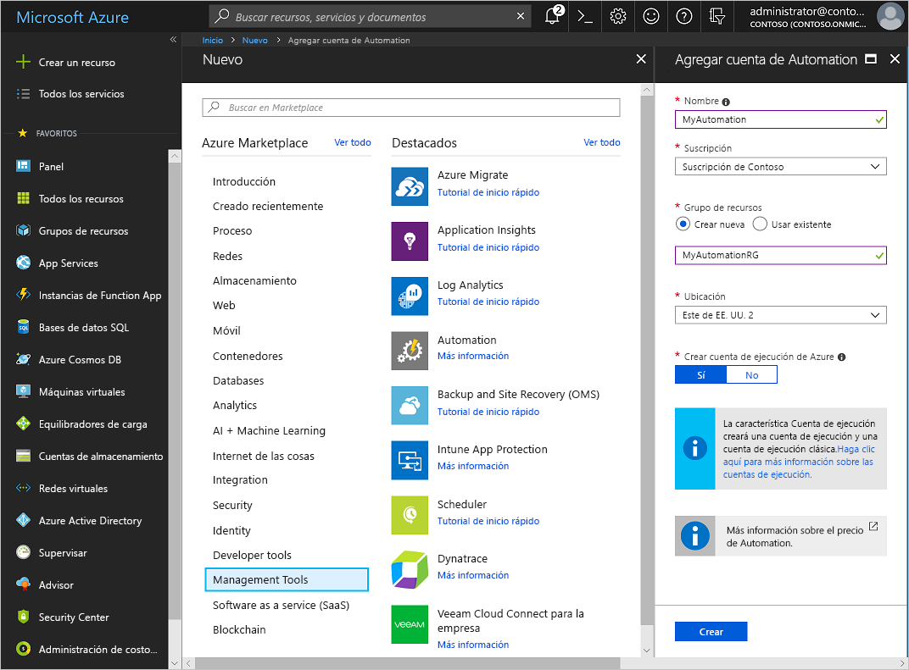
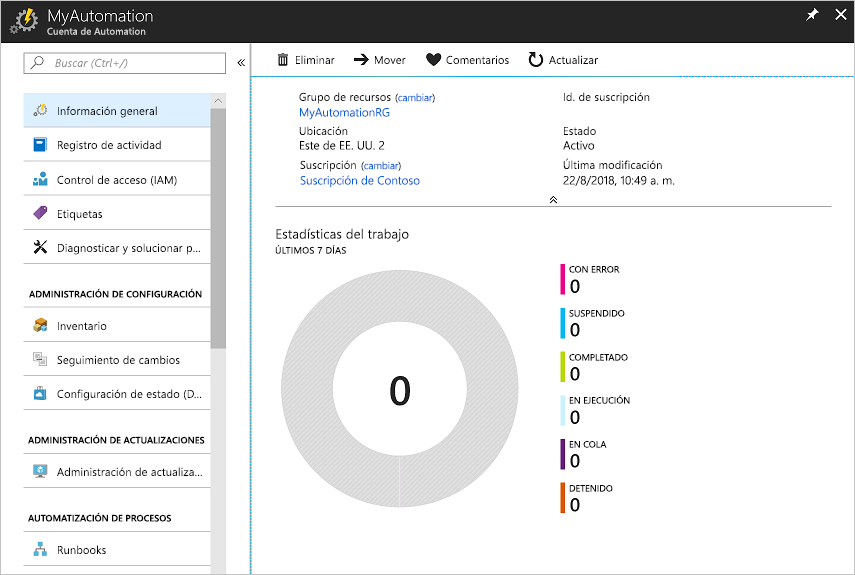
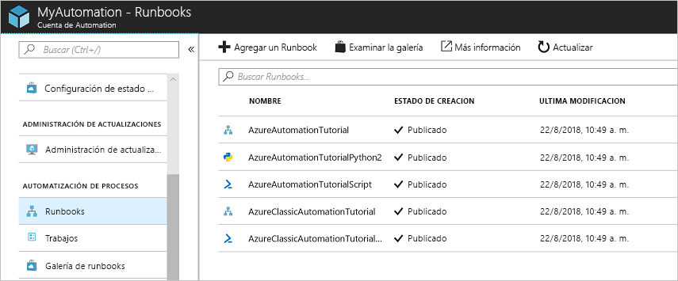
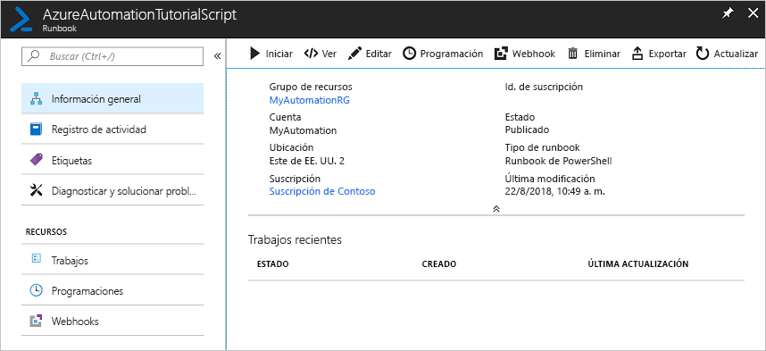
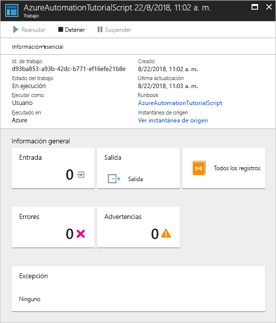

# Creación de una cuenta de Azure Automation

Las cuentas de Azure Automation se pueden crear a través de Azure. Este método proporciona una interfaz de usuario basada en explorador para crear y configurar cuentas de Automation y recursos asociados. Esta guía de inicio rápido le guía en la creación de una cuenta de Automation y la ejecución de un runbook en la cuenta.

Si no tiene una suscripción a Azure, cree una [cuenta gratuita de Azure](https://azure.microsoft.com/free/?WT.mc_id=A261C142F) antes de empezar.

## Inicio de sesión en Azure

Inicie sesión en Azure en https://portal.azure.com

## Creación de una cuenta de Automation

1. Haga clic en el botón **Crear un recurso** de la esquina superior izquierda de Azure.

1. Seleccione **Herramientas de administración** y, a continuación, **Automation**.

1. Escriba la información de la cuenta. En **Crear cuenta de ejecución de Azure**, elija **Sí** para que los artefactos destinados a simplificar la autenticación en Azure se habiliten automáticamente. Es importante tener en cuenta que al crear una cuenta de Automation, el nombre no se podrá cambiar una vez que se elige. *Los nombres de la cuenta de Automation son únicos en cada región y grupo de recursos. Los nombres de las cuentas de Automation que se han eliminado es posible que no estén disponibles de inmediato.* Una cuenta de Automation puede administrar los recursos de todas las regiones y suscripciones de un inquilino determinado. Cuando haya terminado, haga clic en **Crear** para iniciar la implementación de la cuenta de Automation.

      

    > [!NOTE]
    > Para obtener una lista actualizada de ubicaciones en las que se puede implementar una cuenta de Automation, consulte [Productos disponibles por región](https://azure.microsoft.com/en-us/global-infrastructure/services/?products=automation&regions=all).

1. Cuando la implementación haya finalizado, haga clic en ** **Todos los servicios**, seleccione **Cuentas de Automation** y seleccione la cuenta de Automation que creó.

    

## Ejecutar un runbook

Ejecute uno de los runbooks de tutorial.

1. Haga clic en **Runbooks** en **AUTOMATIZACIÓN DE PROCESOS**. Se muestra la lista de runbooks. De forma predeterminada, se habilitan varios runbooks de tutorial en la cuenta.

    

1. Seleccione el runbook **AzureAutomationTutorialScript**. Esta acción abre la página de información general del runbook.

    

1. Haga clic en **Iniciar** y, en la página **Iniciar runbook**, haga clic en **Aceptar** para iniciar el runbook.

    

1. Cuando **Estado del trabajo** cambie a **En ejecución**, haga clic en **Salida** o **Todos los registros** para ver la salida del trabajo de runbook. Para este runbook de tutorial, la salida es una lista de sus recursos de Azure.

## Limpieza de recursos

Cuando ya no los necesite, elimine el grupo de recursos, la cuenta de Automation y todos los recursos relacionados. Para ello, seleccione el grupo de recursos de la cuenta de Automation y haga clic en **Eliminar**.

## Pasos siguientes

En esta guía de inicio rápido, ha implementado una cuenta de Automation, ha iniciado un trabajo de runbook y ha visto los resultados del trabajo. Para obtener más información sobre Azure Automation, continúe en la guía de inicio rápido sobre la creación del primer runbook.

> [!div class="nextstepaction"]
> [Inicio rápido de Automation: creación de un runbook](./automation-quickstart-create-runbook.md)

