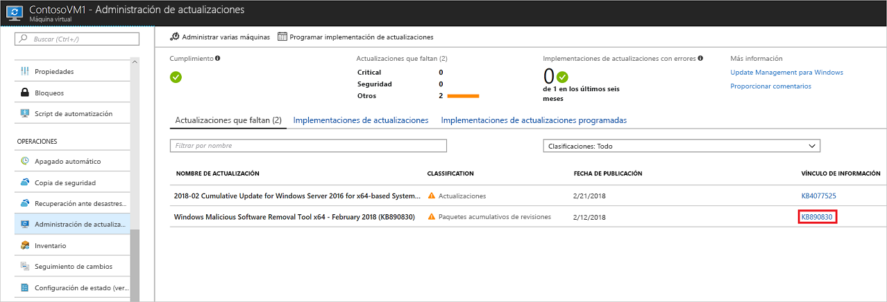
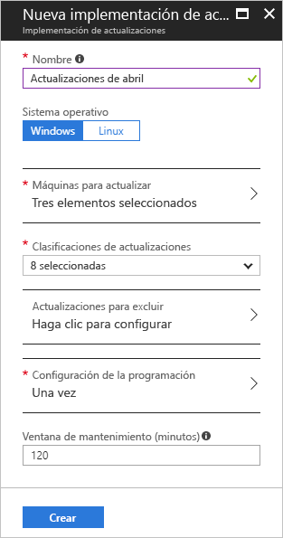
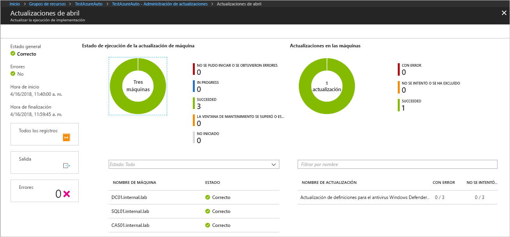

# <a name="manage-windows-updates-by-using-azure-automation"></a>Administración de las actualizaciones de Windows con Azure Automation

Puede usar la solución Update Management para administrar las actualizaciones y las revisiones de las máquinas virtuales. En este tutorial aprenderá a evaluar rápidamente el estado de las actualizaciones disponibles, programar la instalación de las actualizaciones necesarias, revisar los resultados de la implementación y crear una alerta para verificar que las actualizaciones se aplican correctamente.

Para obtener información de precios, consulte [Precios de Automation para Update Management](https://azure.microsoft.com/pricing/details/automation/).

En este tutorial, aprenderá a:

> [!div class="checklist"]
> * Incorporar máquinas virtuales a Update Management
> * Visualización de la evaluación de la actualización
> * Configurar alertas
> * Programación de una implementación de actualizaciones
> * Ver los resultados de una implementación

## <a name="prerequisites"></a>Requisitos previos

Para completar este tutorial, necesita:

* Una suscripción de Azure. Si aún no tiene uno, puede [activar su crédito mensual de Azure para suscriptores de Visual Studio](https://azure.microsoft.com/pricing/member-offers/msdn-benefits-details/) o suscribirse a una [cuenta gratuita](https://azure.microsoft.com/free/?WT.mc_id=A261C142F).
* Una [cuenta de Azure Automation](automation-offering-get-started.md) para contener los runbooks del monitor y de acción y la tarea del monitor.
* Una [máquina virtual](../virtual-machines/windows/quick-create-portal.md) para incorporar.

## <a name="sign-in-to-azure"></a>Inicio de sesión en Azure

Inicie sesión en Azure Portal en https://portal.azure.com.

## <a name="enable-update-management"></a>Habilitación de la Administración de actualizaciones

En primer lugar, habilite Update Management en la máquina virtual de este tutorial:

1. En el menú izquierdo de Azure Portal, seleccione **Máquinas virtuales**. Seleccione una máquina virtual de la lista.
2. En la página de la máquina virtual, en **Operaciones**, seleccione **Update Management**. Se abre el panel **Habilitar Update Management**.

Se realiza la validación para determinar si Update Management está habilitado para esta máquina virtual. Esta validación incluye comprobaciones de un área de trabajo de Azure Log Analytics y la cuenta de Automation vinculada, y si la solución Update Management está en el área de trabajo.

Las áreas de trabajo de [Log Analytics](../log-analytics/log-analytics-overview.md?toc=%2fazure%2fautomation%2ftoc.json) se usan para recopilar datos que se generan mediante características y servicios como Update Management. El área de trabajo proporciona una única ubicación para revisar y analizar datos desde varios orígenes.

El proceso de validación también comprueba si la máquina virtual se aprovisiona con Microsoft Monitoring Agent (MMA) y Hybrid Runbook Worker de Azure Automation. Este agente se usa para comunicarse con Azure Automation y para obtener información sobre el estado de la actualización. El agente requiere que se abra el puerto 443 para comunicarse con el servicio Azure Automation y para descargar actualizaciones.

Si se detecta que falta alguno de los siguientes requisitos previos durante la incorporación, estos se agregarán automáticamente:

* Área de trabajo de [Log Analytics](../log-analytics/log-analytics-overview.md?toc=%2fazure%2fautomation%2ftoc.json)
* Una [cuenta de Automation](./automation-offering-get-started.md)
* [Hybrid Runbook Worker](./automation-hybrid-runbook-worker.md) (habilitado en la máquina virtual)

En **Update Management**, establezca la ubicación, el área de trabajo de Log Analytics y la cuenta de Automation que use. A continuación, Seleccione **Habilitar**. Si estas opciones no están disponibles, significa que está habilitada otra solución de automatización para la máquina virtual. En ese caso, deben utilizarse la misma cuenta de Automation y área de trabajo.


La habilitación de la solución puede tardar unos minutos. Durante este tiempo, no cierre la ventana del explorador. Después de habilitar la solución, la información sobre las actualizaciones que faltan en la máquina virtual se pasa a Log Analytics. Los datos pueden tardar entre 30 minutos y 6 horas en estar disponibles para el análisis.

## <a name="view-update-assessment"></a>Visualización de la evaluación de la actualización

Una vez habilitado Update Management, se abre el panel **Update Management**. Si falta alguna actualización, verá una lista de las actualizaciones que faltan en la pestaña **Actualizaciones que faltan**.

En **Vínculo de información**, seleccione el vínculo de información de la actualización para abrir el artículo de soporte técnico sobre la actualización en una ventana nueva. Encontrará información importante acerca de la actualización en esta ventana.



Haga clic en cualquier otro lugar de la actualización para abrir el panel **Búsqueda de registros** de la actualización seleccionada. La consulta para la búsqueda de registros está predefinida para esa actualización específica. Puede modificar esta consulta o crear su propia consulta para ver información detallada sobre las actualizaciones implementadas o las que faltan en su entorno.


## <a name="configure-alerts"></a>Configurar alertas

En este paso, se establece una alerta para que sepa cuándo se han implementado correctamente las actualizaciones. La alerta que se crea se basa en una consulta de Log Analytics. Puede escribir una consulta personalizada para alertas adicionales para abarcar varios escenarios diferentes. En Azure Portal, vaya a **Monitor** y, a continuación, seleccione **Crear alerta**. 

En **Crear regla**, en **1. Definir la condición de la alerta**, seleccione **Seleccionar destino**. En **Filter by resource type** (Filtrar por tipo de recurso), seleccione **Log Analytics**. Seleccione el área de trabajo de Log Analytics y, a continuación, seleccione **Listo**.


Seleccione **Agregar criterios**.

En **Configurar lógica de señal**, en la tabla, seleccione **Búsqueda de registros personalizada**. Escriba la consulta siguiente en el cuadro de texto **Consulta de búsqueda**:

```loganalytics
UpdateRunProgress
| where InstallationStatus == 'Succeeded'
| where TimeGenerated > now(-10m)
| summarize by UpdateRunName, Computer
```
Esta consulta devuelve los equipos y el nombre de la ejecución de actualización que se completó en el período de tiempo especificado.

En **Lógica de alerta**, en **Umbral**, escriba **1**. Cuando haya finalizado, seleccione **Listo**.


En **2. Definir detalles de la alerta**, escriba un nombre y una descripción para la alerta. Establezca **Gravedad** en **Información (gravedad 2)** dado que la alerta es por una ejecución correcta.


En **3. Definir grupo de acciones**, seleccione **Nuevo grupo de acciones**. Un grupo de acciones es un conjunto de acciones que puede usar en varias alertas. Por ejemplo, notificaciones por correo electrónico, runbooks, webhooks y muchas más. Para más información sobre los grupos de acciones, consulte [Creación y administración de grupos de acciones](../monitoring-and-diagnostics/monitoring-action-groups.md).

En el cuadro **Nombre del grupo de acción**, escriba un nombre para la alerta y un nombre corto. El nombre corto se utiliza en lugar del nombre completo del grupo de acciones cuando se envían notificaciones mediante este grupo.

En **Acciones**, escriba un nombre para la acción, como **Notificaciones por correo electrónico**. En **Tipo de acción**, seleccione **Correo electrónico/SMS/Push/Voz**. En **DETALLES**, seleccione **Editar detalles**.

En el panel **Correo electrónico/SMS/Push/Voz**, escriba un nombre. Seleccione la casilla de verificación **Correo electrónico** y, a continuación, escriba una dirección de correo electrónico válida.


En el panel **Correo electrónico/SMS/Push/Voz**, seleccione **Aceptar**. En el panel **Agregar grupo de acciones**, seleccione **Aceptar**.

Para personalizar el asunto de las alertas por correo electrónico, en **Crear regla**, en **Personalizar acciones**, seleccione **Asunto de correo electrónico**. Cuando finalice, seleccione **Crear regla de alertas**. La regla le indica cuando la implementación de una actualización es correcta y qué máquinas formaron parte de la ejecución de la implementación de actualizaciones.

## <a name="schedule-an-update-deployment"></a>Programación de una implementación de actualizaciones

A continuación, programe una implementación que se ajuste a la ventana de programación y servicio de su versión para instalar las actualizaciones. Puede elegir los tipos de actualizaciones que quiere incluir en la implementación. Por ejemplo, puede incluir actualizaciones de seguridad o críticas y excluir paquetes acumulativos de actualizaciones.

Para programar una nueva implementación de actualizaciones para la máquina virtual, vaya a **Update Management** y, a continuación, seleccione **Programar implementación de actualizaciones**.

En **Nueva implementación de actualizaciones**, especifique la siguiente información:

* **Nombre**: escriba un nombre único para la implementación de actualizaciones.

* **Sistema operativo**: seleccione el sistema operativo que es el destino de la implementación de actualizaciones.

* **Equipos que se actualizan**: seleccione una búsqueda guardada, un grupo importado o elija Máquina en la lista desplegable y seleccione equipos individuales. Si elige **Máquinas**, la preparación del equipo se muestra en la columna **UPDATE AGENT READINESS** (Actualizar preparación de agente). Para obtener información acerca de los distintos métodos de creación de grupos de equipos en Log Analytics, consulte [Grupos de equipos en búsquedas de registros en Log Analytics](../log-analytics/log-analytics-computer-groups.md)

* **Clasificación de actualizaciones**: seleccione los tipos de software que la implementación de actualizaciones incluyó en la implementación. Para este tutorial, seleccione todos los tipos.

  Los tipos de clasificación son:

   |SO  |Escriba  |
   |---------|---------|
   |Windows     | Actualizaciones críticas</br>Actualizaciones de seguridad</br>Paquetes acumulativos de actualizaciones</br>Feature Packs</br>Service Packs</br>Actualizaciones de definiciones</br>Herramientas</br>Actualizaciones        |
   |Linux     | Actualizaciones críticas y de seguridad</br>Otras actualizaciones       |

   Para ver una descripción de los tipos de clasificación, consulte [Actualización de clasificaciones](automation-update-management.md#update-classifications).

* **Configuración de la programación**: abre la página **Configuración de la programación**. La hora de inicio predeterminada es 30 minutos después de la hora actual. Puede establecer la hora de inicio en cualquier momento a partir de 10 minutos en el futuro.

   También puede especificar si la implementación se produce una vez o configurar una programación periódica. Seleccione **Una vez** en **Periodicidad**. Deje el valor predeterminado de 1 día y seleccione **Aceptar**. Esta acción configura una programación periódica.

* **Ventana de mantenimiento (minutos)**: deje este campo con el valor predeterminado. Puede establecer la ventana de tiempo en la que desea que se produzca la implementación de actualizaciones. Esta configuración ayuda a garantizar que los cambios se realizan en las ventanas de servicio definidas.

* **Opciones de reinicio**: este valor determina cómo deben controlarse los reinicios. Las opciones disponibles son la siguientes:
  * Reboot if required (Default) [Reiniciar si es necesario (predeterminada)]
  * Always reboot (Reiniciar siempre)
  * Never reboot (No reiniciar nunca)
  * Only reboot (solo reiniciar), no se instalarán las actualizaciones

Cuando haya terminado de configurar la programación, seleccione **Crear**.



Volverá al panel de estado. Seleccione **Implementaciones de actualizaciones programadas** para mostrar la programación de implementación que creó.

## <a name="view-results-of-an-update-deployment"></a>Visualización de los resultados de una implementación de actualizaciones

Después de que se inicie la implementación programada, puede ver su estado en la pestaña **Implementaciones de actualizaciones** en **Update Management**. Si la implementación se está ejecutando, su estado es **En curso**. Cuando finalice la implementación, si se realiza correctamente, el estado cambia a **Correcto**. Si se producen errores con una o varias actualizaciones en la implementación, el estado es **Error parcial**.

Seleccione la implementación de actualizaciones completada para ver el panel correspondiente.



En **Resultados de actualización** encontrará un resumen del número total de actualizaciones y los resultados de la implementación en la máquina virtual. En la tabla de la derecha se muestra un análisis detallado de cada actualización y los resultados de la instalación.

En la lista siguiente se muestran los valores disponibles:

* **No intentado**: la actualización no se instaló porque no había tiempo disponible suficiente de acuerdo con la duración definida para la ventana de mantenimiento.
* **Correcto**: la actualización se realizó correctamente.
* **Error**: se produjo un error en la actualización.

Seleccione **Todos los registros** para ver todas las entradas de registro que creó la implementación.

Seleccione **Salida** para ver el flujo de trabajo del runbook responsable de administrar la implementación de actualizaciones en la máquina virtual de destino.

Seleccione **Errores** para ver información detallada acerca de los errores de la implementación.

Una vez que la implementación de actualizaciones se realiza correctamente, se envía un correo electrónico similar al del siguiente ejemplo para mostrar la correcta realización de la implementación:


## <a name="next-steps"></a>Pasos siguientes

En este tutorial aprendió lo siguiente:

> [!div class="checklist"]
> * Incorporar máquinas virtuales a Update Management
> * Visualización de la evaluación de la actualización
> * Configurar alertas
> * Programación de una implementación de actualizaciones
> * Ver los resultados de una implementación

Continúe hacia la introducción sobre la solución Update Management.

> [!div class="nextstepaction"]
> [Solución Update Management](../operations-management-suite/oms-solution-update-management.md?toc=%2fazure%2fautomation%2ftoc.json)
