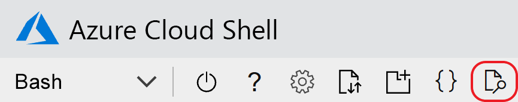

# <a name="quickstart-create-an-aspnet-core-app-with-azure-app-configuration"></a>Inicio rápido: Creación de una aplicación ASP.NET Core con Azure App Configuration

En este inicio rápido usará Azure App Configuration para centralizar el almacenamiento y la administración de la configuración de la aplicación de una aplicación de ASP.NET Core. ASP.NET Core genera un solo objeto de configuración basado en un par clave-valor mediante el uso de la configuración de uno o varios orígenes de datos especificados por una aplicación. Estos orígenes de datos se conocen como *proveedores de configuración*. Dado que el cliente .NET Core de App Configuration se implementa como un proveedor de configuraciones, el servicio parece como cualquier otro origen de datos.

## <a name="prerequisites"></a>Prerequisites

- Una suscripción a Azure: [cree una cuenta gratuita](https://azure.microsoft.com/free/)
- [SDK de .NET Core](https://dotnet.microsoft.com/download)

>[!TIP]
> Azure Cloud Shell es un shell interactivo gratuito que se puede usar para ejecutar las instrucciones de línea de comandos en este artículo.  Tiene herramientas comunes de Azure preinstaladas, lo que incluye el SDK de .NET Core. Si ha iniciado sesión en su suscripción de Azure, inicie [Azure Cloud Shell](https://shell.azure.com) desde shell.azure.com.  Para más información sobre Azure Cloud Shell, [lea la documentación](../cloud-shell/overview.md).

## <a name="create-an-app-configuration-store"></a>Creación de un almacén de App Configuration

[!INCLUDE [azure-app-configuration-create](../../includes/azure-app-configuration-create.md)]

6. Seleccione **Explorador de configuración** > **Crear** para agregar los siguientes pares clave-valor:

    | Clave | Value |
    |---|---|
    | TestApp:Settings:BackgroundColor | Blanco |
    | TestApp:Settings:FontSize | 24 |
    | TestApp:Settings:FontColor | Negro |
    | TestApp:Settings:Message | Datos de Azure App Configuration |

    Deje **Etiqueta** y **Tipo de contenido** en blanco, por ahora.

## <a name="create-an-aspnet-core-web-app"></a>Cree una aplicación web ASP.NET Core

Utilice la [interfaz de la línea de comandos (CLI) de .NET Core](https://docs.microsoft.com/dotnet/core/tools/) para crear un proyecto de aplicación web de ASP.NET Core MVC. [Azure Cloud Shell](https://shell.azure.com) proporciona estas herramientas.  También están disponibles en las plataformas Windows, macOS y Linux.

1. Cree una carpeta nueva para su proyecto. En este inicio rápido, lo llamaremos *TestAppConfig*.

1. En la nueva carpeta, ejecute el siguiente comando para crear un nuevo proyecto de aplicación web de ASP.NET Core MVC:

```dotnetcli
dotnet new mvc --no-https
```

## <a name="add-secret-manager"></a>Incorporación de Secret Manager

Para usar Secret Manager, agregue un elemento `UserSecretsId` al archivo *.csproj*.

Abra el archivo *.csproj*. Agregue un elemento `UserSecretsId` como se muestra aquí. Puede usar el mismo identificador único global, o bien puede reemplazar este valor por el suyo propio. Guarde el archivo.

> [!IMPORTANT]
> `CreateHostBuilder` reemplaza a `CreateWebHostBuilder` en .NET Core 3.0.  Seleccione la sintaxis correcta en función de su entorno.

#### <a name="net-core-2xtabcore2x"></a>[.NET Core 2.x](#tab/core2x)

```xml
<Project Sdk="Microsoft.NET.Sdk.Web">

    <PropertyGroup>
        <TargetFramework>netcoreapp2.1</TargetFramework>
        <UserSecretsId>79a3edd0-2092-40a2-a04d-dcb46d5ca9ed</UserSecretsId>
    </PropertyGroup>

    <ItemGroup>
        <PackageReference Include="Microsoft.AspNetCore.App" />
        <PackageReference Include="Microsoft.AspNetCore.Razor.Design" Version="2.1.2" PrivateAssets="All" />
    </ItemGroup>

</Project>
```

#### <a name="net-core-3xtabcore3x"></a>[.NET Core 3.x](#tab/core3x)

```xml
<Project Sdk="Microsoft.NET.Sdk.Web">
    
    <PropertyGroup>
        <TargetFramework>netcoreapp3.1</TargetFramework>
        <UserSecretsId>79a3edd0-2092-40a2-a04d-dcb46d5ca9ed</UserSecretsId>
    </PropertyGroup>

</Project>
```
---

La herramienta Secret Manager almacena información confidencial para el trabajo de desarrollo fuera de su árbol de proyecto. Este enfoque ayuda a evitar el uso compartido accidental de secretos de la aplicación en el código fuente. Para más información sobre Secret Manager, consulte [Almacenamiento seguro de secretos de aplicación en el desarrollo en ASP.NET Core](https://docs.microsoft.com/aspnet/core/security/app-secrets)

## <a name="connect-to-an-app-configuration-store"></a>Conexión a un almacén de App Configuration

1. Para agregar una referencia al paquete NuGet `Microsoft.Azure.AppConfiguration.AspNetCore`, ejecute el comando siguiente:

    ```dotnetcli
    dotnet add package Microsoft.Azure.AppConfiguration.AspNetCore --version 3.0.0-preview-011100002-1192
    ```

1. Ejecute el siguiente comando para restaurar los paquetes para el proyecto:

    ```dotnetcli
    dotnet restore
    ```

1. Agregue un secreto llamado *ConnectionStrings:AppConfig* a Secret Manager.

    Este secreto contiene la cadena de conexión necesaria para acceder a su almacén de App Configuration. Sustituya el valor en el comando siguiente por la cadena de conexión de su almacén de App Configuration.

    Este comando debe ejecutarse en el mismo directorio que el archivo *.csproj*.

    ```dotnetcli
    dotnet user-secrets set ConnectionStrings:AppConfig <your_connection_string>
    ```

    > [!IMPORTANT]
    > Algunos shells truncarán la cadena de conexión, salvo que esté entre comillas. Asegúrese de que la salida del comando `dotnet user-secrets` muestra toda la cadena de conexión. Si no lo hace, vuelva a ejecutar el comando y escriba la cadena de conexión entre comillas.

    Secret Manager solo se utiliza para probar la aplicación web localmente. Cuando la aplicación se implementa por ejemplo en [Azure App Service](https://azure.microsoft.com/services/app-service/web), usará el valor de la aplicación configuración de la aplicación **Connection Strings** (Cadenas de conexión) en App Service, en lugar de Secret Manager (Administrador de secretos) para almacenar la cadena de conexión.

    Acceda a este secreto mediante la API de configuración. Un signo de dos puntos (:) funciona en el nombre de configuración con la API de configuración en todas las plataformas compatibles. Consulte [Configuración en ASP.NET Core](https://docs.microsoft.com/aspnet/core/fundamentals/configuration/index?tabs=basicconfiguration&view=aspnetcore-2.0).

1. Abra *Program.cs* y agregue una referencia al proveedor de configuración de la aplicación .NET Core.

    ```csharp
    using Microsoft.Extensions.Configuration.AzureAppConfiguration;
    ```

1. Actualice el método `CreateWebHostBuilder` para usar App Configuration; para ello, llame al método `config.AddAzureAppConfiguration()`.

    > [!IMPORTANT]
    > `CreateHostBuilder` reemplaza a `CreateWebHostBuilder` en .NET Core 3.0.  Seleccione la sintaxis correcta en función de su entorno.

    #### <a name="net-core-2xtabcore2x"></a>[.NET Core 2.x](#tab/core2x)

    ```csharp
    public static IWebHostBuilder CreateWebHostBuilder(string[] args) =>
        WebHost.CreateDefaultBuilder(args)
            .ConfigureAppConfiguration((hostingContext, config) =>
            {
                var settings = config.Build();
                config.AddAzureAppConfiguration(settings["ConnectionStrings:AppConfig"]);
            })
            .UseStartup<Startup>();
    ```

    #### <a name="net-core-3xtabcore3x"></a>[.NET Core 3.x](#tab/core3x)

    ```csharp
    public static IHostBuilder CreateHostBuilder(string[] args) =>
        Host.CreateDefaultBuilder(args)
        .ConfigureWebHostDefaults(webBuilder =>
        webBuilder.ConfigureAppConfiguration((hostingContext, config) =>
        {
            var settings = config.Build();
            config.AddAzureAppConfiguration(settings["ConnectionStrings:AppConfig"]);
        })
        .UseStartup<Startup>());
    ```

    ---

1. Vaya a *<app root>/Views/Home* y abra *Index.cshtml*. Sustituya su contenido por el código siguiente:

    ```HTML
    @using Microsoft.Extensions.Configuration
    @inject IConfiguration Configuration

    <style>
        body {
            background-color: @Configuration["TestApp:Settings:BackgroundColor"]
        }
        h1 {
            color: @Configuration["TestApp:Settings:FontColor"];
            font-size: @Configuration["TestApp:Settings:FontSize"];
        }
    </style>

    <h1>@Configuration["TestApp:Settings:Message"]</h1>
    ```

1. Vaya a *<app root>/Views/shared* y abra *_Layout.cshtml*. Sustituya su contenido por el código siguiente:

    ```HTML
    <!DOCTYPE html>
    <html>
    <head>
        <meta charset="utf-8" />
        <meta name="viewport" content="width=device-width, initial-scale=1.0" />
        <title>@ViewData["Title"] - hello_world</title>

        <link rel="stylesheet" href="~/lib/bootstrap/dist/css/bootstrap.css" />
        <link rel="stylesheet" href="~/css/site.css" />
    </head>
    <body>
        <div class="container body-content">
            @RenderBody()
        </div>

        <script src="~/lib/jquery/dist/jquery.js"></script>
        <script src="~/lib/bootstrap/dist/js/bootstrap.js"></script>
        <script src="~/js/site.js" asp-append-version="true"></script>

        @RenderSection("Scripts", required: false)
    </body>
    </html>
    ```

## <a name="build-and-run-the-app-locally"></a>Compilación y ejecución de la aplicación en un entorno local

1. Para compilar la aplicación mediante la CLI de .NET Core, vaya al directorio raíz de la aplicación y ejecute el siguiente comando en el shell de comandos:

    ```dotnetcli
    dotnet build
    ```

1. Una vez que la compilación se haya realizado correctamente, ejecute el siguiente comando para ejecutar la aplicación web localmente:

    ```dotnetcli
    dotnet run
    ```

1. Si trabaja en un equipo local, use un explorador para ir a `http://localhost:5000`. Esta es la dirección URL predeterminada de la aplicación web hospedada localmente.  

Si trabajando en Azure Cloud Shell, seleccione el botón *Vista previa web* y después *Configurar*.  



Cuando se le pida que configure el puerto para la versión preliminar, escriba "5000" y seleccione *Abrir y examinar*.  En la página web aparecerá "Data from Azure App Configuration" (Datos de Azure App Configuration).

## <a name="clean-up-resources"></a>Limpieza de recursos

[!INCLUDE [azure-app-configuration-cleanup](../../includes/azure-app-configuration-cleanup.md)]

## <a name="next-steps"></a>Pasos siguientes

En este inicio rápido, ha creado un almacén de App Configuration y lo ha usado con una aplicación web de ASP.NET Core a través del [proveedor de App Configuration](https://go.microsoft.com/fwlink/?linkid=2074664). Para aprender a configurar una aplicación de ASP.NET Core para actualizar dinámicamente la configuración, vaya al siguiente tutorial.

> [!div class="nextstepaction"]
> [Habilitación de la configuración dinámica](./enable-dynamic-configuration-aspnet-core.md)
