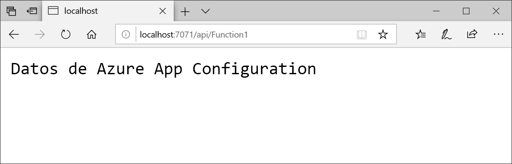

# <a name="quickstart-create-an-azure-functions-app-with-azure-app-configuration"></a>Inicio rápido: Creación de una aplicación de Azure Functions con Azure App Configuration

En este inicio rápido se incorpora el servicio Azure App Configuration en una aplicación de Azure Functions para centralizar el almacenamiento y la administración de toda la configuración de la aplicación de forma independiente del código.

## <a name="prerequisites"></a>Requisitos previos

- Una suscripción a Azure: [cree una cuenta gratuita](https://azure.microsoft.com/free/)
- [Visual Studio 2019](https://visualstudio.microsoft.com/vs) con la carga de trabajo de **desarrollo de Azure**.
- [Herramientas de Azure Functions](../azure-functions/functions-develop-vs.md#check-your-tools-version)

## <a name="create-an-app-configuration-store"></a>Creación de un almacén de App Configuration

[!INCLUDE [azure-app-configuration-create](../../includes/azure-app-configuration-create.md)]

6. Seleccione **Explorador de configuración** >  **+ Crear** para agregar los siguientes pares clave-valor:

    | Clave | Valor |
    |---|---|
    | TestApp:Settings:Message | Datos de Azure App Configuration |

    Deje **Etiqueta** y **Tipo de contenido** en blanco, por ahora.

## <a name="create-a-functions-app"></a>Creación de una aplicación de Functions

[!INCLUDE [Create a project using the Azure Functions template](../../includes/functions-vstools-create.md)]

## <a name="connect-to-an-app-configuration-store"></a>Conexión a un almacén de App Configuration

1. Haga clic con el botón derecho en el proyecto y seleccione **Administrar paquetes NuGet**. En la pestaña **Examinar**, busque y agregue los siguientes paquetes NuGet al proyecto. Si no los encuentra, seleccione la casilla **Incluir versión preliminar**.

    ```
    Microsoft.Extensions.Configuration.AzureAppConfiguration 2.1.0-preview-010380001-1099 or later
    ```

2. Abra *Function1.cs* y agregue los espacios de nombres de la configuración de .NET Core y del proveedor de configuración de App Configuration.

    ```csharp
    using Microsoft.Extensions.Configuration;
    using Microsoft.Extensions.Configuration.AzureAppConfiguration;
    ```
3. Agregue el elemento `Configuration` de la propiedad `static` para crear una instancia de base de datos única de `IConfiguration`. Después, agregue un constructor de `static` para conectarse a App Configuration mediante una llamada a `AddAzureAppConfiguration()`. Así se carga la configuración una vez en el inicio de la aplicación. La misma instancia de configuración se usará para todas las llamadas posteriores de Functions.

    ```csharp
    private static IConfiguration Configuration { set; get; }

    static Function1()
    {
        var builder = new ConfigurationBuilder();
        builder.AddAzureAppConfiguration(Environment.GetEnvironmentVariable("ConnectionString"));
        Configuration = builder.Build();
    }
    ```
4. Actualice el método `Run` para que lea los valores de la configuración.

    ```csharp
    public static async Task<IActionResult> Run(
        [HttpTrigger(AuthorizationLevel.Anonymous, "get", "post", Route = null)] HttpRequest req, ILogger log)
    {
        log.LogInformation("C# HTTP trigger function processed a request.");

        string keyName = "TestApp:Settings:Message";
        string message = Configuration[keyName];
            
        return message != null
            ? (ActionResult)new OkObjectResult(message)
            : new BadRequestObjectResult($"Please create a key-value with the key '{keyName}' in App Configuration.");
    }
    ```

## <a name="test-the-function-locally"></a>Prueba local de la función

1. Establezca una variable de entorno llamada **ConnectionString** y defínala como la clave de acceso a su almacén de App Configuration. Si usa el símbolo del sistema de Windows, ejecute el siguiente comando y reinícielo para que se aplique el cambio:

        setx ConnectionString "connection-string-of-your-app-configuration-store"

    Si usa Windows PowerShell, ejecute el siguiente comando:

        $Env:ConnectionString = "connection-string-of-your-app-configuration-store"

    Si usa macOS o Linux, ejecute el siguiente comando:

        export ConnectionString='connection-string-of-your-app-configuration-store'

2. Para probar la función, presione F5. Si se le solicita, acepte la solicitud de Visual Studio para descargar e instalar las herramientas de **Azure Functions Core (CLI)** . También es preciso que habilite una excepción de firewall para que las herramientas para controlen las solicitudes de HTTP.

3. Copie la dirección URL de la función de los resultados del runtime de Azure Functions.

    

4. Pegue la dirección URL de la solicitud HTTP en la barra de direcciones del explorador. La siguiente imagen muestra la respuesta en el explorador para la solicitud GET local devuelta por la función.

    

## <a name="clean-up-resources"></a>Limpieza de recursos

[!INCLUDE [azure-app-configuration-cleanup](../../includes/azure-app-configuration-cleanup.md)]

## <a name="next-steps"></a>Pasos siguientes

En este inicio rápido, ha creado un almacén de App Configuration y lo ha usado con una aplicación de Azure Functions a través del [proveedor de App Configuration](https://go.microsoft.com/fwlink/?linkid=2074664). Para aprender a configurar una aplicación de Azure Functions para actualizar dinámicamente la configuración, vaya al siguiente tutorial.

> [!div class="nextstepaction"]
> [Habilitación de la configuración dinámica](./enable-dynamic-configuration-azure-functions-csharp.md)
