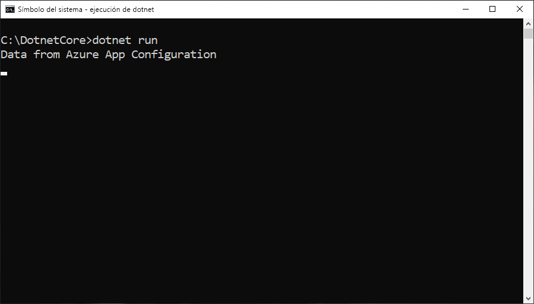

# <a name="quickstart-create-a-net-core-app-with-app-configuration"></a>Inicio rápido: Creación de una aplicación .NET Core con App Configuration

Azure App Configuration es un servicio de configuración administrado de Azure. Puede usarlo para almacenar y administrar fácilmente toda la configuración de una aplicación en un solo lugar que esté separado del código. En este manual de inicio rápido se muestra cómo incorporar el servicio en una aplicación de consola de .NET Core.

Para realizar los pasos de este inicio rápido, puede usar cualquier editor de código. [Visual Studio Code](https://code.visualstudio.com/) es una excelente opción disponible en las plataformas Windows, macOS y Linux.



## <a name="prerequisites"></a>Requisitos previos

Para realizar este inicio rápido, instale el [SDK de .NET Core](https://dotnet.microsoft.com/download).

[!INCLUDE [quickstarts-free-trial-note](../../includes/quickstarts-free-trial-note.md)]

## <a name="create-an-app-configuration-store"></a>Creación de un almacén de configuración de aplicaciones

[!INCLUDE [azure-app-configuration-create](../../includes/azure-app-configuration-create.md)]

6. Seleccione **Explorador de configuración** > **+ Crear** para agregar los siguientes pares clave-valor:

    | Clave | Valor |
    |---|---|
    | TestApp:Settings:Message | Datos de Azure App Configuration |

    Deje **Etiqueta** y **Tipo de contenido** en blanco, por ahora.

## <a name="create-a-net-core-console-app"></a>Creación de una aplicación de consola de .NET Core

Va a utilizar la [interfaz de la línea de comandos (CLI) de .NET Core](https://docs.microsoft.com/dotnet/core/tools/) para crear un proyecto de aplicación de consola de .NET Core. La ventaja de usar la CLI de .NET Core frente a Visual Studio es que está disponible en las plataformas Windows, macOS y Linux.

1. Cree una carpeta nueva para su proyecto.

2. En la nueva carpeta, ejecute el siguiente comando para crear un nuevo proyecto de aplicación web de ASP.NET Core MVC:

        dotnet new console

## <a name="connect-to-an-app-configuration-store"></a>Conexión a un almacén de configuración de aplicaciones

1. Para agregar una referencia al paquete NuGet `Microsoft.Extensions.Configuration.AzureAppConfiguration`, ejecute el comando siguiente:

        dotnet add package Microsoft.Extensions.Configuration.AzureAppConfiguration --version 1.0.0-preview-008520001

2. Ejecute el siguiente comando para restaurar los paquetes para el proyecto:

        dotnet restore

3. Abra *Program.cs* y agregue una referencia al proveedor de configuración de la aplicación .NET Core.

    ```csharp
    using Microsoft.Extensions.Configuration;
    using Microsoft.Extensions.Configuration.AzureAppConfiguration;
    ```

4. Actualice el método `Main` para usar App Configuration; para ello, llame al método `builder.AddAzureAppConfiguration()`.

    ```csharp
    static void Main(string[] args)
    {
        var builder = new ConfigurationBuilder();
        builder.AddAzureAppConfiguration(Environment.GetEnvironmentVariable("ConnectionString"));

        var config = builder.Build();
        Console.WriteLine(config["TestApp:Settings:Message"] ?? "Hello world!");
    }
    ```

## <a name="build-and-run-the-app-locally"></a>Compilación y ejecución de la aplicación en un entorno local

1. Establezca una variable de entorno llamada **ConnectionString** y defínala como la clave de acceso a su almacén de configuración de aplicaciones. Si usa el símbolo del sistema de Windows, ejecute el siguiente comando y reinícielo para que se aplique el cambio:

        setx ConnectionString "connection-string-of-your-app-configuration-store"

    Si usa Windows PowerShell, ejecute el siguiente comando:

        $Env:ConnectionString = "connection-string-of-your-app-configuration-store"

    Si usa macOS o Linux, ejecute el siguiente comando:

        export ConnectionString='connection-string-of-your-app-configuration-store'

2. Ejecute el siguiente comando para compilar la aplicación de consola:

        dotnet build

3. Una vez que la compilación se haya realizado correctamente, ejecute el siguiente comando para ejecutar la aplicación localmente:

        dotnet run

## <a name="clean-up-resources"></a>Limpieza de recursos

[!INCLUDE [azure-app-configuration-cleanup](../../includes/azure-app-configuration-cleanup.md)]

## <a name="next-steps"></a>Pasos siguientes

En este inicio rápido, ha creado un almacén de configuración de aplicaciones y lo ha usado con una aplicación de consola de .NET Core a través del [proveedor de App Configuration](https://go.microsoft.com/fwlink/?linkid=2074664). Para más información acerca del uso de App Configuration, continúe con el siguiente tutorial, ya que en él se muestra cómo realizar la autenticación.

> [!div class="nextstepaction"]
> [Integración de identidades administradas](./howto-integrate-azure-managed-service-identity.md)
