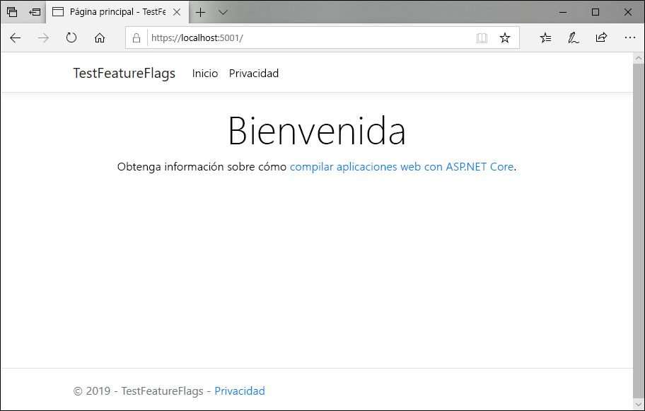
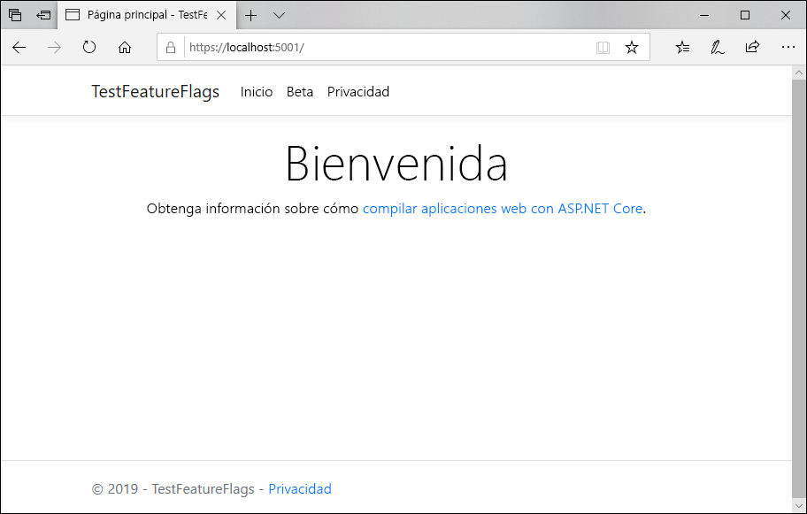

# <a name="quickstart-add-feature-flags-to-an-aspnet-core-app"></a>Inicio rápido: Adición de marcas de características a una aplicación web de ASP.NET Core

La administración de características en ASP.NET Core se puede habilitar mediante la conexión de la aplicación a Azure App Configuration. Puede usar este servicio administrado para almacenar todas las marcas de características y controlar de forma centralizada sus estados. En este inicio rápido se muestra cómo incorporar el servicio a una aplicación web de ASP.NET Core para crear una implementación de un extremo a otro de administración de características.

Las bibliotecas de administración de características de .NET Core amplían la plataforma con una compatibilidad completa con las marcas de características. Estas se compilan sobre el sistema de configuración de .NET Core. Se integran sin problemas con App Configuration a través de su proveedor de configuración de .NET Core.

Para realizar los pasos de este inicio rápido, puede usar cualquier editor de código. [Visual Studio Code](https://code.visualstudio.com/) es una excelente opción disponible en las plataformas Windows, macOS y Linux.

## <a name="prerequisites"></a>Requisitos previos

Para realizar este inicio rápido, instale el [SDK de .NET Core](https://dotnet.microsoft.com/download).

[!INCLUDE [quickstarts-free-trial-note](../../includes/quickstarts-free-trial-note.md)]

## <a name="create-an-app-configuration-store"></a>Creación de un almacén de configuración de aplicaciones

[!INCLUDE [azure-app-configuration-create](../../includes/azure-app-configuration-create.md)]

6. Seleccione **Administrador de características** > **+ Crear** para agregar las siguientes marcas de características:

    | Clave | Estado |
    |---|---|
    | Versión beta | Off |

## <a name="create-an-aspnet-core-web-app"></a>Cree una aplicación web ASP.NET Core

Va a utilizar la [interfaz de la línea de comandos (CLI) de .NET Core](https://docs.microsoft.com/dotnet/core/tools/) para crear un proyecto de aplicación web de ASP.NET Core MVC. La ventaja de usar la CLI de .NET Core frente a Visual Studio es que está disponible en las plataformas Windows, macOS y Linux.

1. Cree una carpeta nueva para su proyecto. En este inicio rápido, lo llamaremos *TestFeatureFlags*.

2. En la nueva carpeta, ejecute el siguiente comando para crear un nuevo proyecto de aplicación web de ASP.NET Core MVC:

        dotnet new mvc

## <a name="add-secret-manager"></a>Incorporación de Secret Manager

Agregue la [herramienta Secret Manager](https://docs.microsoft.com/aspnet/core/security/app-secrets) al proyecto. La herramienta Secret Manager almacena información confidencial para el trabajo de desarrollo fuera de su árbol de proyecto. Este enfoque ayuda a evitar el uso compartido accidental de secretos de la aplicación en el código fuente.

- Abra el archivo *.csproj*. Agregue un elemento `UserSecretsId` como se muestra a continuación y reemplace su valor por el suyo propio, que suele ser un GUID. Guarde el archivo.

    ```xml
    <Project Sdk="Microsoft.NET.Sdk.Web">

    <PropertyGroup>
        <TargetFramework>netcoreapp2.1</TargetFramework>
        <UserSecretsId>79a3edd0-2092-40a2-a04d-dcb46d5ca9ed</UserSecretsId>
    </PropertyGroup>

    <ItemGroup>
        <PackageReference Include="Microsoft.AspNetCore.App" />
        <PackageReference Include="Microsoft.AspNetCore.Razor.Design" Version="2.1.2" PrivateAssets="All" />
    </ItemGroup>

    </Project>
    ```

## <a name="connect-to-an-app-configuration-store"></a>Conexión a un almacén de configuración de aplicaciones

1. Agregue referencias a los paquetes NuGet `Microsoft.Extensions.Configuration.AzureAppConfiguration` y `Microsoft.FeatureManagement` ejecutando los comandos siguientes:

        dotnet add package Microsoft.Extensions.Configuration.AzureAppConfiguration --version 1.0.0-preview-008520001

        dotnet add package Microsoft.FeatureManagement.AspNetCore --version 1.0.0-preview-008560001-910

2. Ejecute el siguiente comando para restaurar los paquetes para el proyecto:

        dotnet restore

3. Agregue un secreto llamado *ConnectionStrings:AppConfig* a Secret Manager.

    Este secreto contiene la cadena de conexión necesaria para acceder a su almacén de configuración de aplicaciones. Sustituya el valor en el comando siguiente por la cadena de conexión de su almacén de configuración de aplicaciones.

    Este comando debe ejecutarse en el mismo directorio que el archivo *.csproj*.

        dotnet user-secrets set ConnectionStrings:AppConfig <your_connection_string>

    Secret Manager solo se utiliza para probar la aplicación web localmente. Cuando la aplicación se implementa (por ejemplo, en [Azure App Service](https://azure.microsoft.com/services/app-service/web)), usará una configuración de la aplicación (por ejemplo, **Cadenas de conexión** en App Service), en lugar de almacenar la cadena de conexión con Secret Manager.

    Se accede a este secreto con la API de configuración. Un signo de dos puntos (:) funciona en el nombre de configuración con la API de configuración en todas las plataformas compatibles. Consulte [Configuración en ASP.NET Core](https://docs.microsoft.com/aspnet/core/fundamentals/configuration/index?tabs=basicconfiguration&view=aspnetcore-2.0).

4. Abra *Program.cs* y agregue una referencia al proveedor de configuración de la aplicación .NET Core.

    ```csharp
    using Microsoft.Extensions.Configuration.AzureAppConfiguration;
    ```

5. Actualice el método `CreateWebHostBuilder` para usar App Configuration; para ello, llame al método `config.AddAzureAppConfiguration()`.

    ```csharp
    public static IWebHostBuilder CreateWebHostBuilder(string[] args) =>
        WebHost.CreateDefaultBuilder(args)
            .ConfigureAppConfiguration((hostingContext, config) =>
            {
                var settings = config.Build();
                config.AddAzureAppConfiguration(options => {
                    options.Connect(settings["ConnectionStrings:AppConfig"])
                           .UseFeatureFlags();
                });
            })
            .UseStartup<Startup>();
    ```

6. Abra *Startup.cs* y agregue referencias al administrador de características de .NET Core.

    ```csharp
    using Microsoft.FeatureManagement.AspNetCore;
    ```

7. Actualice el método `ConfigureServices` para que incluya compatibilidad con marcas de características llamando al método `services.AddFeatureManagement()` e incluyendo opcionalmente todos los filtros que se vayan a usar con marcas de características mediante la llamada a `services.AddFeatureFilter<FilterType>()`:

    ```csharp
    public void ConfigureServices(IServiceCollection services)
    {
        services.AddFeatureManagement();
    }
    ```

8. Agregue un archivo *MyFeatureFlags.cs*.

    ```csharp
    namespace TestFeatureFlags
    {
        public enum MyFeatureFlags
        {
            Beta
        }
    }
    ```

9. Agregue *BetaController.cs* al directorio de controladores:

    ```csharp
    using Microsoft.AspNetCore.Mvc;
    using Microsoft.FeatureManagement.AspNetCore;

    namespace TestFeatureFlags.Controllers
    {
        public class BetaController: Controller
        {
            private readonly IFeatureManager _featureManager;

            public BetaController(IFeatureManagerSnapshot featureManager)
            {
                _featureManager = featureManager;
            }

            [Feature(MyFeatureFlags.Beta)]
            public IActionResult Index()
            {
                return View();
            }
        }
    }
    ```

10. Abra *_ViewImports.cshtml* en el directorio Vistas y agregue el asistente de etiquetas del administrador de características:

    ```html
    @addTagHelper *, Microsoft.FeatureManagement.AspNetCore
    ```

11. Abra *_Layout.cshtml*, que se encuentra en el directorio Vistas > Compartido, y sustituya en la barra `<nav>` en `<body>` > `<header>` por el siguiente código:

    ```html
    <nav class="navbar navbar-expand-sm navbar-toggleable-sm navbar-light bg-white border-bottom box-shadow mb-3">
        <div class="container">
            <a class="navbar-brand" asp-area="" asp-controller="Home" asp-action="Index">TestFeatureFlags</a>
            <button class="navbar-toggler" type="button" data-toggle="collapse" data-target=".navbar-collapse" aria-controls="navbarSupportedContent"
            aria-expanded="false" aria-label="Toggle navigation">
            <span class="navbar-toggler-icon"></span>
            </button>
            <div class="navbar-collapse collapse d-sm-inline-flex flex-sm-row-reverse">
                <ul class="navbar-nav flex-grow-1">
                    <li class="nav-item">
                        <a class="nav-link text-dark" asp-area="" asp-controller="Home" asp-action="Index">Home</a>
                    </li>
                    <feature name="Beta">
                    <li class="nav-item">
                        <a class="nav-link text-dark" asp-area="" asp-controller="Beta" asp-action="Index">Beta</a>
                    </li>
                    </feature>
                    <li class="nav-item">
                        <a class="nav-link text-dark" asp-area="" asp-controller="Home" asp-action="Privacy">Privacy</a>
                    </li>
                </ul>
            </div>
        </div>
    </nav>
    ```

12. Cree un directorio Beta en Vistas y agregue el archivo *Index.cshtml*:

    ```html
    @{
        ViewData["Title"] = "Beta Home Page";
    }

    <h1>
        This is the beta website.
    </h1>
    ```

## <a name="build-and-run-the-app-locally"></a>Compilación y ejecución de la aplicación en un entorno local

1. Para compilar la aplicación mediante la CLI de .NET Core, ejecute el siguiente comando en el shell de comandos:

        dotnet build

2. Una vez que la compilación se haya realizado correctamente, ejecute el siguiente comando para ejecutar la aplicación web localmente:

        dotnet run

3. Inicie una ventana del explorador y vaya a `https://localhost:5001`, que es la dirección URL predeterminada de la aplicación web hospedada localmente.

    

4. Inicie sesión en el [Azure Portal](https://aka.ms/azconfig/portal). Seleccione **Todos los recursos**y seleccione la instancia de almacén de App Configuration que creó en el inicio rápido.

5. Seleccione **Administrador de características** y cambie el valor de *Beta* a *Activado*:

    | Clave | Estado |
    |---|---|
    | Versión beta | Por |

6. Actualice la página del explorador para ver los nuevos valores de configuración.

    

## <a name="clean-up-resources"></a>Limpieza de recursos

[!INCLUDE [azure-app-configuration-cleanup](../../includes/azure-app-configuration-cleanup.md)]

## <a name="next-steps"></a>Pasos siguientes

En este inicio rápido, ha creado un almacén de configuración de aplicaciones y lo ha usado para administrar características en una aplicación web de ASP.NET Core mediante las [bibliotecas de administración de características](https://go.microsoft.com/fwlink/?linkid=2074664).

* Más información acerca de la [administración de características](./concept-feature-management.md)
* [Administración de marcas de características](./manage-feature-flags.md)
* [Uso de marcas de características en una aplicación de ASP.NET Core](./use-feature-flags-dotnet-core.md)
