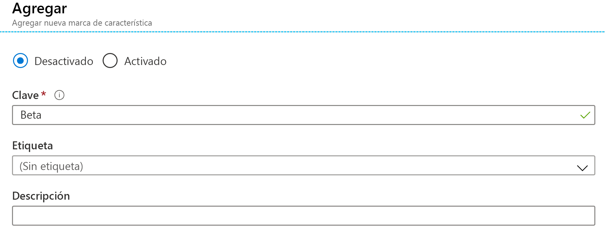

# <a name="quickstart-add-feature-flags-to-a-net-framework-app"></a>Inicio rápido: Agregar marcas de características a una aplicación en .NET Framework

En este inicio rápido, incorporará Azure App Configuration en una aplicación en .NET Framework para crear una implementación de un extremo a otro de administración de características. Puede usar el servicio App Configuration para almacenar en una ubicación central todas las marcas de características y controlar sus estados. 

Las bibliotecas de administración de características de .NET amplían la plataforma con una amplia compatibilidad con las marcas de características. Estas bibliotecas se compilan a partir del sistema de configuración de .NET. Se integran sin problemas con App Configuration mediante su proveedor de configuración de .NET.

## <a name="prerequisites"></a>Prerrequisitos

- Una suscripción a Azure: [cree una cuenta gratuita](https://azure.microsoft.com/free/)
- [Visual Studio 2019](https://visualstudio.microsoft.com/vs)
- [.NET Framework 4.8](https://dotnet.microsoft.com/download)

## <a name="create-an-app-configuration-store"></a>Creación de un almacén de App Configuration

[!INCLUDE [azure-app-configuration-create](../../includes/azure-app-configuration-create.md)]

6. Seleccione **Administrador de características** >  **+Agregar** para agregar una marca de características denominada `Beta`.

    > [!div class="mx-imgBorder"]
    > 

    Deje `label` sin definir por ahora.

## <a name="create-a-net-console-app"></a>Creación de una aplicación de consola de .NET

1. Inicie Visual Studio y seleccione **Archivo** > **Nuevo** > **Proyecto**.

1. En **Crear un proyecto**, filtre por el tipo de proyecto **Consola** y haga clic en **Aplicación de consola (.NET Framework)** . Haga clic en **Next**.

1. En **Configurar el nuevo proyecto**, asígnele al proyecto un nombre. En **Marco**, seleccione **.NET Framework 4.8** o una versión posterior. Haga clic en **Crear**.

## <a name="connect-to-an-app-configuration-store"></a>Conexión a un almacén de App Configuration

1. Haga clic con el botón derecho en el proyecto y seleccione **Administrar paquetes NuGet**. En la pestaña **Examinar**, busque y agregue los siguientes paquetes NuGet al proyecto. Si no los encuentra, seleccione la casilla **Incluir versión preliminar**.

    ```
    Microsoft.Extensions.DependencyInjection
    Microsoft.Extensions.Configuration.AzureAppConfiguration
    Microsoft.FeatureManagement
    ```

1. Abra el archivo *Program.cs* y agregue las siguientes instrucciones:

    ```csharp
    using Microsoft.Extensions.DependencyInjection;
    using Microsoft.Extensions.Configuration;
    using Microsoft.Extensions.Configuration.AzureAppConfiguration;
    using Microsoft.FeatureManagement;
    ```

1. Actualice el método `Main` para conectarse a App Configuration y especifique la opción `UseFeatureFlags` para que se recuperen las marcas de características. A continuación, muestre un mensaje si la marca de característica `Beta` está habilitada.

    ```csharp
        public static async Task Main(string[] args)
        {         
            IConfigurationRoot configuration = new ConfigurationBuilder()
                .AddAzureAppConfiguration(options =>
                {
                    options.Connect(Environment.GetEnvironmentVariable("ConnectionString"))
                           .UseFeatureFlags();
                }).Build();

            IServiceCollection services = new ServiceCollection();

            services.AddSingleton<IConfiguration>(configuration).AddFeatureManagement();

            using (ServiceProvider serviceProvider = services.BuildServiceProvider())
            {
                IFeatureManager featureManager = serviceProvider.GetRequiredService<IFeatureManager>();

                if (await featureManager.IsEnabledAsync("Beta"))
                {
                    Console.WriteLine("Welcome to the beta!");
                }
            }

            Console.WriteLine("Hello World!");
        }
    ```

## <a name="build-and-run-the-app-locally"></a>Compilación y ejecución de la aplicación en un entorno local

1. Establezca una variable de entorno llamada **ConnectionString** en la cadena de conexión del almacén de App Configuration. Si usa el símbolo del sistema de Windows, ejecute el siguiente comando:

        setx ConnectionString "connection-string-of-your-app-configuration-store"

    Si usa Windows PowerShell, ejecute el siguiente comando:

        $Env:ConnectionString = "connection-string-of-your-app-configuration-store"

1. Reinicie Visual Studio para permitir que el cambio surta efecto. 

1. Presione Ctrl + F5 para compilar y ejecutar la aplicación de consola.

    

## <a name="clean-up-resources"></a>Limpieza de recursos

[!INCLUDE [azure-app-configuration-cleanup](../../includes/azure-app-configuration-cleanup.md)]

## <a name="next-steps"></a>Pasos siguientes

En este inicio rápido, ha creado una marca de característica en App Configuration y la ha usado con una aplicación de consola en .NET Framework. Para obtener información sobre cómo actualizar dinámicamente las marcas de características y otros valores de configuración sin necesidad de reiniciar la aplicación, continúe con el tutorial siguiente.

> [!div class="nextstepaction"]
> [Habilitación de la configuración dinámica](./enable-dynamic-configuration-dotnet.md)
