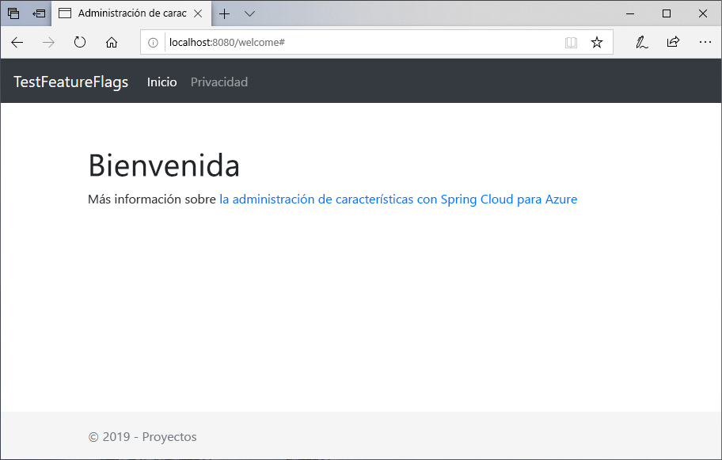
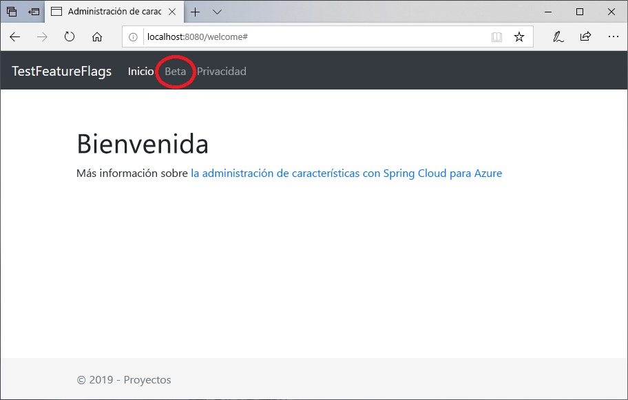

# <a name="quickstart-add-feature-flags-to-a-spring-boot-app"></a>Inicio rápido: Incorporación de marcas de características a una aplicación de Spring Boot

En este inicio rápido, incorporará Azure App Configuration en una aplicación web de Spring Boot para crear una implementación de un extremo a otro de administración de características. Puede usar el servicio App Configuration para almacenar en una ubicación central todas las marcas de características y controlar sus estados.

Las bibliotecas de administración de características de Spring Boot amplían el marco con una compatibilidad completa con las marcas de características. Estas bibliotecas **no** dependen de ninguna biblioteca de Azure. Se integran sin problemas con App Configuration mediante su proveedor de configuración de Spring Boot.

## <a name="prerequisites"></a>Prerequisites

- Una suscripción a Azure: [cree una cuenta gratuita](https://azure.microsoft.com/free/)
- Un [SDK de Java Development Kit](https://docs.microsoft.com/java/azure/jdk)admitido con la versión 8.
- [Apache Maven](https://maven.apache.org/download.cgi), versión 3.0 o posterior.

## <a name="create-an-app-configuration-store"></a>Creación de un almacén de App Configuration

[!INCLUDE [azure-app-configuration-create](../../includes/azure-app-configuration-create.md)]

6. Seleccione **Feature Manager** (Administrador de características)  >  **+ Crear** para agregar las siguientes marcas de características:

    | Clave | State |
    |---|---|
    | Beta | Off |

## <a name="create-a-spring-boot-app"></a>Creación de una aplicación Spring Boot

Para crear un proyecto de Spring Boot, se usa [Spring Initializr](https://start.spring.io/).

1. Vaya a <https://start.spring.io/>.

2. Especifique las opciones siguientes:

   - Genere un proyecto de **Maven** con **Java**.
   - Especifique una versión de **Spring Boot** igual o superior a la 2.0.
   - Especifique los nombres de **Group** (Grupo) y **Artifact** (Artefacto) de la aplicación.
   - Adición de la dependencia de **Spring Web**

3. Después de especificar las opciones anteriores, seleccione **Generar proyecto**. Cuando se le solicite, descargue el proyecto en una ruta de acceso del equipo local.

## <a name="add-feature-management"></a>Incorporación de la administración de características

1. Después de extraer los archivos en el sistema local, la aplicación sencilla de Spring Boot estará lista para editarla. Busque el archivo *pom.xml* en el directorio raíz de la aplicación.

2. Abra el archivo *pom.xml* en un editor de texto y agregue el iniciador de Spring Cloud Azure Config y Administración de características a la lista de `<dependencies>`:

    ```xml
    <dependency>
        <groupId>com.microsoft.azure</groupId>
        <artifactId>spring-cloud-starter-azure-appconfiguration-config</artifactId>
        <version>1.1.0</version>
    </dependency>
    <dependency>
        <groupId>com.microsoft.azure</groupId>
        <artifactId>spring-cloud-azure-feature-management-web</artifactId>
        <version>1.1.0</version>
    </dependency>
    <dependency>
            <groupId>org.springframework.boot</groupId>
            <artifactId>spring-boot-starter-thymeleaf</artifactId>
    </dependency>
    ```

> [!Note]
> Hay una biblioteca de administración de características que no es web y que no tiene ninguna dependencia de Spring-Web. Para ver las diferencias, consulte los [documentos](https://github.com/microsoft/spring-cloud-azure/tree/master/spring-cloud-azure-feature-management)adicionales. Además, si no usa App Configuration, consulte la [declaración de la marca de características](https://github.com/microsoft/spring-cloud-azure/tree/master/spring-cloud-azure-feature-management#feature-flag-declaration).

## <a name="connect-to-an-app-configuration-store"></a>Conexión a un almacén de App Configuration

1. Abra _bootstrap.properties_ en el directorio _resources_ de la aplicación. Si _bootstrap.properties_ no existe, créelo. Agregue la siguiente línea al archivo.

    ```properties
    spring.cloud.azure.appconfiguration.stores[0].name= ${APP_CONFIGURATION_CONNECTION_STRING}
    ```

1. En el portal de App Configuration del almacén de configuración, vaya a Claves de acceso. Seleccione la pestaña Claves de solo lectura. En esta pestaña, copie el valor de una de las cadenas de conexión y agréguelo como una variable de entorno nueva con el nombre de variable `APP_CONFIGURATION_CONNECTION_STRING`.

1. Abra el archivo de Java de la aplicación principal y agregue `@EnableConfigurationProperties` para habilitar esta característica.

    ```java
    import org.springframework.boot.context.properties.EnableConfigurationProperties;

    @SpringBootApplication
    @EnableConfigurationProperties(MessageProperties.class)
    public class DemoApplication {
        public static void main(String[] args) {
            SpringApplication.run(DemoApplication.class, args);
        }
    }
    ```

1. Cree un archivo Java llamado *MessageProperties.javaº* en el directorio del paquete de la aplicación. Agregue las siguientes líneas:

    ```java
    @ConfigurationProperties(prefix = "config")
    public class MessageProperties {
        private String message;

        public String getMessage() {
            return message;
        }

        public void setMessage(String message) {
            this.message = message;
        }
    }
    ```

1. Cree un archivo Java nuevo llamado *HelloController.java* en el directorio del paquete de la aplicación. Agregue las siguientes líneas:

    ```java
    @Controller
    @ConfigurationProperties("controller")
    public class HelloController {

        private FeatureManager featureManager;

        public HelloController(FeatureManager featureManager) {
            this.featureManager = featureManager;
        }

        @GetMapping("/welcome")
        public String mainWithParam(Model model) {
            model.addAttribute("Beta", featureManager.isEnabled("Beta"));
            return "welcome";
        }
    }
    ```

1. Cree un archivo HTML llamado *welcome.html*en el directorio de plantillas de la aplicación. Agregue las siguientes líneas:

    ```html
    <!DOCTYPE html>
    <html lang="en" xmlns:th="http://www.thymeleaf.org">
    <head>
        <meta charset="utf-8">
        <meta name="viewport" content="width=device-width, initial-scale=1, shrink-to-fit=no">
        <title>Feature Management with Spring Cloud Azure</title>

        <link rel="stylesheet" href="/css/main.css">
        <link rel="stylesheet" href="https://stackpath.bootstrapcdn.com/bootstrap/4.3.1/css/bootstrap.min.css" integrity="sha384-ggOyR0iXCbMQv3Xipma34MD+dH/1fQ784/j6cY/iJTQUOhcWr7x9JvoRxT2MZw1T" crossorigin="anonymous">

        <script src="https://code.jquery.com/jquery-3.3.1.slim.min.js" integrity="sha384-q8i/X+965DzO0rT7abK41JStQIAqVgRVzpbzo5smXKp4YfRvH+8abtTE1Pi6jizo" crossorigin="anonymous"></script>
        <script src="https://cdnjs.cloudflare.com/ajax/libs/popper.js/1.14.7/umd/popper.min.js" integrity="sha384-UO2eT0CpHqdSJQ6hJty5KVphtPhzWj9WO1clHTMGa3JDZwrnQq4sF86dIHNDz0W1" crossorigin="anonymous"></script>
        <script src="https://stackpath.bootstrapcdn.com/bootstrap/4.3.1/js/bootstrap.min.js" integrity="sha384-JjSmVgyd0p3pXB1rRibZUAYoIIy6OrQ6VrjIEaFf/nJGzIxFDsf4x0xIM+B07jRM" crossorigin="anonymous"></script>

    </head>
    <body>
        <header>
        <!-- Fixed navbar -->
        <nav class="navbar navbar-expand-md navbar-dark fixed-top bg-dark">
            <a class="navbar-brand" href="#">TestFeatureFlags</a>
            <button class="navbar-toggler" aria-expanded="false" aria-controls="navbarCollapse" aria-label="Toggle navigation" type="button" data-target="#navbarCollapse" data-toggle="collapse">
            <span class="navbar-toggler-icon"></span>
            </button>
            <div class="collapse navbar-collapse" id="navbarCollapse">
            <ul class="navbar-nav mr-auto">
                <li class="nav-item active">
                <a class="nav-link" href="#">Home <span class="sr-only">(current)</span></a>
                </li>
                <li class="nav-item" th:if="${Beta}">
                <a class="nav-link" href="#">Beta</a>
                </li>
                <li class="nav-item">
                <a class="nav-link" href="#">Privacy</a>
                </li>
            </ul>
            </div>
        </nav>
        </header>
        <div class="container body-content">
            <h1 class="mt-5">Welcome</h1>
            <p>Learn more about <a href="https://github.com/microsoft/spring-cloud-azure/blob/master/spring-cloud-azure-feature-management/README.md">Feature Management with Spring Cloud Azure</a></p>

        </div>
        <footer class="footer">
            <div class="container">
            <span class="text-muted">&copy; 2019 - Projects</span>
        </div>

        </footer>
    </body>
    </html>

    ```

1. Cree una carpeta llamada CSS en static y dentro de ella un nuevo archivo CSS llamado *main.css*. Agregue las siguientes líneas:

    ```css
    html {
    position: relative;
    min-height: 100%;
    }
    body {
    margin-bottom: 60px;
    }
    .footer {
    position: absolute;
    bottom: 0;
    width: 100%;
    height: 60px;
    line-height: 60px;
    background-color: #f5f5f5;
    }

    body > .container {
    padding: 60px 15px 0;
    }

    .footer > .container {
    padding-right: 15px;
    padding-left: 15px;
    }

    code {
    font-size: 80%;
    }
    ```

## <a name="build-and-run-the-app-locally"></a>Compilación y ejecución de la aplicación en un entorno local

1. Compile la aplicación de Spring Boot con Maven y ejecútela; por ejemplo:

    ```shell
    mvn clean package
    mvn spring-boot:run
    ```

2. Inicie una ventana del explorador y vaya a `https://localhost:8080`, que es la dirección URL predeterminada de la aplicación web hospedada localmente.

    

3. En el portal de App Configuration, seleccione **Feature Manager** (Administrador de características) y cambie el estado de la clave **Beta** a **On** (Activado):

    | Clave | State |
    |---|---|
    | Beta | Por |

4. Actualice la página del explorador para ver los nuevos valores de configuración.

    

## <a name="clean-up-resources"></a>Limpieza de recursos

[!INCLUDE [azure-app-configuration-cleanup](../../includes/azure-app-configuration-cleanup.md)]

## <a name="next-steps"></a>Pasos siguientes

En este inicio rápido, ha creado un almacén de App Configuration y lo ha usado para administrar características en una aplicación web de Spring Boot mediante las [bibliotecas de administración de características](https://go.microsoft.com/fwlink/?linkid=2074664).

- Más información sobre la [administración de características](./concept-feature-management.md).
- [Administración de marcas de características](./manage-feature-flags.md).
- [Uso de marcas de características en una aplicación central de Spring Boot](./use-feature-flags-spring-boot.md).
