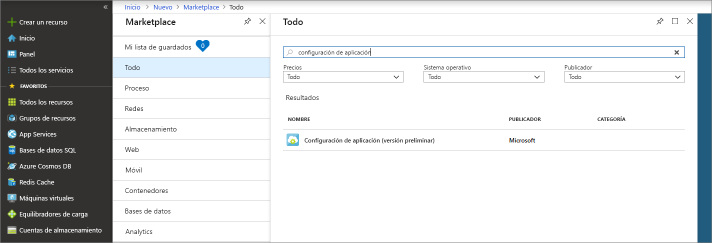
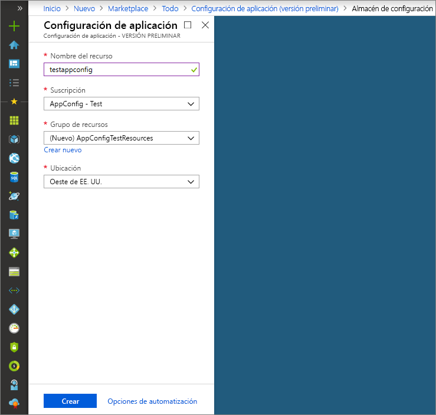

# <a name="quickstart-create-a-java-spring-app-with-app-configuration"></a>Inicio rápido: Creación de una aplicación de Java Spring con App Configuration

Azure App Configuration es un servicio de configuración administrado de Azure. Permite almacenar y administrar fácilmente toda la configuración de una aplicación en un solo lugar que está separado del código. En este manual de inicio rápido se muestra cómo incorporar el servicio en una aplicación de Java Spring.

Puede usar cualquier editor de código para realizar los pasos de esta guía de inicio rápido. Sin embargo, [Visual Studio Code](https://code.visualstudio.com/) es una excelente opción disponible en las plataformas Windows, macOS y Linux.

## <a name="prerequisites"></a>Requisitos previos

Para completar este artículo de inicio rápido, instale una instancia de [Java Development Kit (JDK)](https://aka.ms/azure-jdks) compatible con la versión 8 y [Apache Maven](http://maven.apache.org/) con la versión 3.0 o superior.

[!INCLUDE [quickstarts-free-trial-note](../../includes/quickstarts-free-trial-note.md)]

## <a name="create-an-app-configuration-store"></a>Creación de un almacén de configuración de aplicaciones

1. Para crear un almacén de configuración de aplicaciones, primero inicie sesión en [Azure Portal](https://aka.ms/azconfig/portal). En la parte superior izquierda de la página, haga clic en **+ Crear un recurso**. En el cuadro de texto **Buscar en Marketplace**, escriba **App Configuration** y presione **Entrar**.

    

2. Haga clic en **Configuración de la aplicación** en los resultados de la búsqueda y, después, en **Crear**.

3. En la página **Configuración de la aplicación** > **Crear**, escriba la siguiente configuración:

    | Configuración | Valor sugerido | Descripción |
    |---|---|---|
    | **Nombre del recurso** | Nombre único globalmente | Escriba un nombre de recurso único para usarlo en el recurso del almacén de configuración de aplicaciones. El nombre debe ser una cadena de entre 1 y 63 caracteres y solo puede contener números, letras y el carácter `-`. El nombre no puede comenzar ni terminar por el carácter `-` y no se pueden usar varios caracteres `-` consecutivos.  |
    | **Suscripción** | Su suscripción | Seleccione la suscripción de Azure que desee usar para probar App Configuration. Si su cuenta solo dispone de una suscripción, esta se seleccionará automáticamente y no aparecerá la lista desplegable **Suscripción**. |
    | **Grupo de recursos** | *AppConfigTestResources* | Seleccione o cree un grupo de recursos para el recurso del almacén de configuración de aplicaciones. Este grupo es útil para organizar los distintos recursos que quiera eliminar al mismo tiempo mediante la eliminación del grupo de recursos. Para más información, consulte el artículo sobre el [uso de grupos de recursos para administrar los recursos de Azure](https://docs.microsoft.com/azure/azure-resource-manager/resource-group-overview). |
    | **Ubicación** | *Centro de EE. UU.* | Use **Ubicación** para especificar la ubicación geográfica en la que se hospeda el recurso SignalR. Para optimizar el rendimiento, recomendamos que cree el recurso en la misma región que los demás componentes de la aplicación. |

    

4. Haga clic en **Create**(Crear). La implementación puede tardar unos minutos en completarse.

5. Una vez que se complete la implementación, haga clic en **Configuración** > **Claves de acceso**. Anote la cadena de conexión de la clave principal de solo lectura o de la clave principal de lectura y escritura. La usará más adelante para configurar la aplicación para que se comunique con el almacén de configuración de aplicaciones que acaba de crear. La cadena de conexión de dispositivo tiene el siguiente formato:

        Endpoint=<your_endpoint>;Id=<your_id>;Secret=<your_secret>

    Deberá usar toda la cadena en la aplicación.

6. Haga clic en **Explorador de pares clave-valor**  y **+ Crear** para agregar los siguientes pares clave-valor:

    | Clave | Valor |
    |---|---|
    | /application/config.message | Hola |

    Por ahora deje **Etiqueta** y **Tipo de contenido** en blanco.

## <a name="create-a-spring-boot-app"></a>Creación de una aplicación Spring Boot

Para crear un proyecto de Spring Boot usará [Spring Initializr](https://start.spring.io/).

1. Vaya a <https://start.spring.io/>.

2. Especifique las opciones siguientes:

   * Genere un proyecto de **Maven** con **Java**.
   * Especifique una versión de **Spring Boot** igual o superior a la 2.0.
   * Especifique los nombres de **Group** (Grupo) y **Artifact** (Artefacto) de la aplicación.
   * Agregue la dependencia **Web**.

3. Cuando haya especificado las opciones enumeradas anteriormente, haga clic en **Generate Project** (Generar proyecto). Cuando se le solicite, descargue el proyecto en una ruta de acceso del equipo local.

## <a name="connect-to-app-configuration-store"></a>Conexión a un almacén de configuración de aplicaciones

1. Después de extraer los archivos en el sistema local, la aplicación sencilla de Spring Boot estará lista para editarla. Busque el archivo *pom.xml* en el directorio raíz de la aplicación.

2. Abra el archivo *pom.xml* en un editor de texto y agregue el iniciador Spring Cloud Azure Config a la lista `<dependencies>`:

    ```xml
    <dependency>
        <groupId>com.microsoft.azure</groupId>
        <artifactId>spring-cloud-starter-azure-appconfiguration-config</artifactId>
        <version>1.1.0.RC2</version>
    </dependency>
    ```

3. Cree un archivo Java llamado *MessageProperties.javaº* en el directorio del paquete de la aplicación. Agregue las siguientes líneas.

    ```java
    @ConfigurationProperties(prefix = "config")
    public class MessageProperties {
        private String message;

        public String getMessage() {
            return message;
        }

        public void setMessage(String message) {
            this.message = message;
        }
    }
    ```

4. Cree un archivo Java nuevo llamado *HelloController.java* en el directorio del paquete de la aplicación. Agregue las siguientes líneas.

    ```java
    @RestController
    public class HelloController {
        private final MessageProperties properties;

        public HelloController(MessageProperties properties) {
            this.properties = properties;
        }

        @GetMapping
        public String getMessage() {
            return "Message: " + properties.getMessage();
        }
    }
    ```

5. Abra el archivo de Java de la aplicación principal y agregue `@EnableConfigurationProperties` para habilitar esta característica.

    ```java
    @SpringBootApplication
    @EnableConfigurationProperties(MessageProperties.class)
    public class AzureConfigApplication {
        public static void main(String[] args) {
            SpringApplication.run(AzureConfigApplication.class, args);
        }
    }
    ```

6. Cree un archivo denominado `bootstrap.yaml` en el directorio de recursos de la aplicación, agréguele las siguientes líneas y reemplace los valores de ejemplo por las propiedades adecuadas para su almacén de configuración de aplicaciones.

    ```yaml
    spring:
        cloud:
            azure:
                config:
                    stores:
                        - connection-string: [your-connection-string]
    ```

## <a name="build-and-run-the-app-locally"></a>Compilación y ejecución de la aplicación en un entorno local

1. Compile la aplicación de Spring Boot con Maven y ejecútela; por ejemplo:

    ```shell
    mvn clean package
    mvn spring-boot:run
    ```
2. Una vez que se está ejecutando la aplicación, puede usar *curl* para probar la aplicación, por ejemplo:

      ```shell
      curl -X GET http://localhost:8080/
      ```
    Debería ver el mensaje que ha escrito en el almacén de configuración de aplicaciones.

## <a name="clean-up-resources"></a>Limpieza de recursos

[!INCLUDE [azure-app-configuration-cleanup](../../includes/azure-app-configuration-cleanup.md)]

## <a name="next-steps"></a>Pasos siguientes

En este inicio rápido, ha creado un almacén de configuración de aplicaciones y lo ha usado con una aplicación de Java Spring. Para más información, visite la [página principal de Spring en Azure](https://docs.microsoft.com/java/azure/spring-framework/).

Para más información acerca del uso de App Configuration, continúe con el siguiente tutorial, ya que en él se muestra cómo realizar la autenticación.

> [!div class="nextstepaction"]
> [Integración de Managed Identities for Azure Resources](./integrate-azure-managed-service-identity.md)