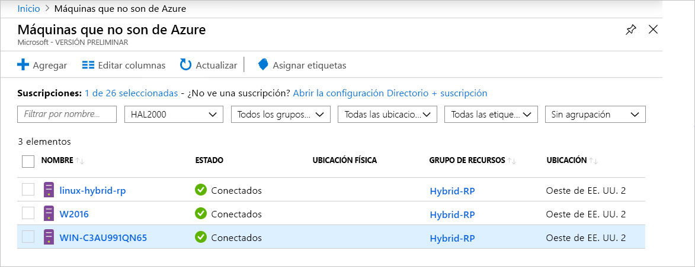

# <a name="what-is-azure-arc-for-servers"></a>¿Qué es Azure Arc para servidores?

Azure Arc para servidores le permite administrar máquinas que están fuera de Azure.
Cuando una máquina que no es de Azure está conectada a Azure, se convierte en una **máquina conectada** y se trata como un recurso de Azure. Cada **máquina conectada** tiene un identificador de recurso, se administra como parte de un grupo de recursos de una suscripción y se beneficia de las construcciones estándar de Azure como Azure Policy y el etiquetado.

Es necesario instalar un paquete de agente en cada máquina para conectarla a Azure. En el resto de este documento se explica el proceso con más detalle.

Las máquinas tendrán un estado de **Conectado** o **Desconectado** según el momento en que el agente se haya conectado. Cada conexión se denomina latido. Si una máquina no se ha conectado en los últimos 5 minutos, se mostrará como sin conexión hasta que se restaure la conectividad.  <!-- For more information on troubleshooting agent connectivity, see [Troubleshooting Azure Arc for servers](troubleshoot/arc-for-servers.md). -->



## <a name="clients"></a>Clientes

### <a name="supported-operating-systems"></a>Sistemas operativos compatibles

En la versión preliminar pública se admite:

- Windows Server 2012 R2 y versiones posteriores
- Ubuntu 16.04 y 18.04

La versión preliminar pública está diseñada con fines de evaluación y no debe usarse para administrar recursos de producción críticos.

## <a name="azure-subscription-and-service-limits"></a>Límites del servicio y la suscripción de Azure

Asegúrese de que lee los límites de Azure Resource Manager y de que planea el número de máquinas que se van a conectar según las instrucciones indicadas para la [suscripción](../../azure-subscription-service-limits.md#subscription-limits---azure-resource-manager) y para los [grupos de recursos](../../azure-subscription-service-limits.md#resource-group-limits). Más concretamente, hay un límite de 800 servidores por cada grupo de recursos de forma predeterminada.

## <a name="networking-configuration"></a>Configuración de redes

Durante la instalación y el tiempo de ejecución, el agente requiere conectividad a los **puntos de conexión del servicio Azure Arc**. Si la conectividad de salida está bloqueada mediante firewalls, asegúrese de que las siguientes direcciones URL no están bloqueadas de forma predeterminada. Todas las conexiones son de salida desde el agente a Azure y están protegidas con **SSL**. Todo el tráfico se puede enrutar a través de un proxy de **HTTPS**. Si permite los intervalos IP o los nombres de dominio a los que se permite la conexión de los servidores, debe permitir el acceso del puerto 443 a las siguientes etiquetas de servicio y nombres DNS.

Etiquetas de servicio:

* AzureActiveDirectory
* AzureTrafficManager

Para obtener una lista de direcciones IP para cada etiqueta o región de servicio, consulte el archivo JSON [Rangos de direcciones IP y etiquetas de servicio de Azure: nube pública](https://www.microsoft.com/download/details.aspx?id=56519). Microsoft publica actualizaciones semanales que incluyen cada uno de los servicios de Azure y los intervalos IP que usan. Consulte [Etiquetas de servicio](https://docs.microsoft.com/azure/virtual-network/security-overview#service-tags) para más información.

Estos nombres DNS se proporcionan junto con la información del intervalo IP de la etiqueta de servicio, ya que la mayoría de los servicios no tienen actualmente un registro de etiquetas de servicio y, por tanto, las direcciones IP están sujetas a cambios. Si se necesitan intervalos IP para la configuración del firewall, se debe usar la etiqueta de servicio **AzureCloud** para permitir el acceso a todos los servicios de Azure. No deshabilite la supervisión de seguridad ni la inspección de estas direcciones URL, pero permítalas como haría con otro tráfico de Internet.

| Entorno de dominio | Puntos de conexión del servicio de Azure necesarios |
|---------|---------|
|management.azure.com|Azure Resource Manager|
|login.windows.net|Azure Active Directory|
|dc.services.visualstudio.com|Application Insights|
|agentserviceapi.azure-automation.net|Configuración de invitado|
|*-agentservice-prod-1.azure-automation.net|Configuración de invitado|
|*.his.hybridcompute.azure-automation.net|Servicio de identidad híbrida|

### <a name="installation-network-requirements"></a>Requisitos de instalación de red

Descargue el [paquete del agente de máquinas conectadas de Azure](https://aka.ms/AzureConnectedMachineAgent) de nuestros servidores de distribución oficiales. Se debe poder acceder a los siguientes sitios desde el entorno. Puede optar por descargar el paquete en un recurso compartido de archivos e instalar el agente desde allí. En este caso, es posible que se necesite modificar el script de incorporación generado desde Azure Portal.

Windows:

* `aka.ms`
* `download.microsoft.com`

Linux:

* `aka.ms`
* `packages.microsoft.com`

Consulte la sección [Configuración del servidor proxy](quickstart-onboard-powershell.md#proxy-server-configuration) para más información sobre cómo configurar el agente para que use el proxy.

## <a name="register-the-required-resource-providers"></a>Registro de los proveedores de recursos necesarios

Una vez que se ha aprobado el registro de "marcas de características", debe registrar los proveedores de recursos necesarios.

* **Microsoft.HybridCompute**
* **Microsoft.GuestConfiguration**

Puede registrar los proveedores de recursos con los siguientes comandos:

Azure PowerShell:

```azurepowershell-interactive
Login-AzAccount
Set-AzContext -SubscriptionId [subscription you want to onboard]
Register-AzResourceProvider -ProviderNamespace Microsoft.HybridCompute
Register-AzResourceProvider -ProviderNamespace Microsoft.GuestConfiguration
```

CLI de Azure:

```azurecli-interactive
az account set --subscription "{Your Subscription Name}"
az provider register --namespace 'Microsoft.HybridCompute'
az provider register --namespace 'Microsoft.GuestConfiguration'
```

Para registrar también los proveedores de recursos mediante el portal siga los pasos que se describen en [Azure Portal](../../azure-resource-manager/resource-manager-supported-services.md#azure-portal).

## <a name="supported-scenarios"></a>Escenarios admitidos

Después de registrar un nodo puede empezar a administrar los nodos con otros servicios de Azure.

En la versión preliminar pública se admiten los siguientes escenarios para **máquinas conectadas**.

## <a name="guest-configuration"></a>Configuración de invitado

Después de conectar la máquina a Azure, puede asignar directivas de Azure a las **máquinas conectadas** con la misma experiencia que empleó en la asignación de directivas a máquinas virtuales de Azure.

Para más información, consulte [Información sobre la configuración de invitado de Azure Policy](../../governance/policy/concepts/guest-configuration.md).

Los registros del agente de configuración de invitado para una **máquina conectada** se encuentran en las siguientes ubicaciones:

* Windows: `%ProgramFiles%\AzureConnectedMachineAgent\logs\dsc.log`
* Linux: - `/opt/logs/dsc.log`

## <a name="log-analytics"></a>Log Analytics

Los datos de registro que recopila [Microsoft Monitoring Agent (MMA)](https://docs.microsoft.com/azure/azure-monitor/log-query/log-query-overview) y que se almacenan en el área de trabajo de Log Analytics contienen ya propiedades específicas de la máquina, como **ResourceId**, que se pueden usar para el acceso al registro centrado en recursos.

- En las máquinas que ya tienen Microsoft Monitoring Agent instalado, la **funcionalidad** de Azure Arc se habilita a través de los paquetes de administración actualizados.
- Se necesita [Microsoft Monitoring Agent versión 10.20.18011 o superior](https://docs.microsoft.com/azure/virtual-machines/extensions/oms-windows#agent-and-vm-extension-version) para la integración de Azure Arc para servidores.
- Al consultar los datos de registro en [Azure Monitor](https://docs.microsoft.com/azure/azure-monitor/log-query/log-query-overview#log-queries), el esquema de datos devuelto contendrá la propiedad **ResourceId** híbrida con el formato `/subscriptions/<SubscriptionId/resourceGroups/<ResourceGroup>/providers/Microsoft.HybridCompute/machines/<MachineName>`.

Para más información, consulte [Introducción a los análisis de registros de Azure Monitor](https://docs.microsoft.com/azure/azure-monitor/log-query/get-started-portal).

<!-- MMA agent version 10.20.18011 and later -->

## <a name="next-steps"></a>Pasos siguientes

Hay dos métodos para conectar máquinas mediante Azure Arc para servidores.

* **Interactivamente**: siga el [inicio rápido del portal](quickstart-onboard-portal.md) para generar un script desde el portal y ejecutarlo en la máquina. Esta es la mejor opción si se conecta una máquina a la vez.
* **A escala**: siga el [inicio rápido de PowerShell](quickstart-onboard-powershell.md) para crear una entidad de servicio que conecte máquinas de forma no interactiva.
