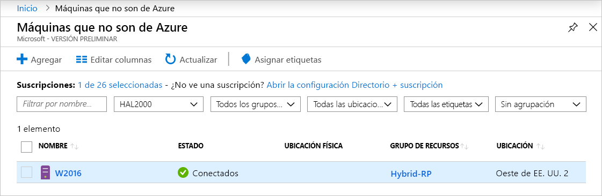
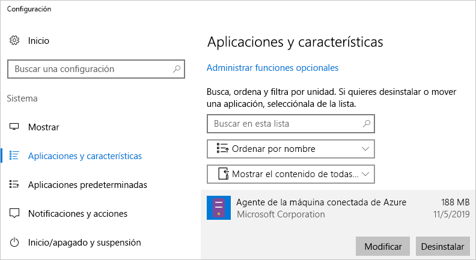

# <a name="quickstart-connect-machines-to-azure-using-azure-arc-for-servers---portal"></a>Inicio rápido: Conexión de máquinas a Azure mediante Azure Arc para servidores mediante el portal

Si no tiene una suscripción a Azure, cree una [cuenta gratuita](https://azure.microsoft.com/free/?WT.mc_id=A261C142F) antes de empezar.

## <a name="prerequisites"></a>Prerequisites

Revise los clientes compatibles y la configuración de red necesaria en la [introducción de Azure Arc para servidores](overview.md).

## <a name="generate-the-agent-install-script-using-the-azure-portal"></a>Generación del script de instalación del agente mediante Azure Portal

1. Inicio [https://aka.ms/hybridmachineportal](https://aka.ms/hybridmachineportal)
1. Haga clic en **+Agregar**.
1. Siga el asistente hasta el final.
1. La última página tiene un script generado que puede copiar (o descargar).

El script debe ejecutarse en la máquina de destino a la que desea conectarse. El script descarga el agente, lo instala y conecta la máquina en una sola operación.

En los servidores que no son de Azure podrá administrar este proceso:

1. Inicie sesión en el servidor (mediante SSH, RDP o la conexión remota con PowerShell)
1. Inicie un shell: Bash en Linux, PowerShell como administrador en Windows
1. Péguelo en el script desde el portal y ejecútelo en el servidor para que se conecte a Azure.
1. La autenticación predeterminada para incorporar un servidor individual es *interactiva* mediante el "inicio de sesión del dispositivo" de Azure. Al ejecutar el script, verá un mensaje parecido al siguiente:

  ```none
  To sign in, use a web browser to open the page https://microsoft.com/devicelogin and enter the code B3V3NLWRF to authenticate.
  ```
  
   Abra un explorador y escriba el código para autenticar. No es necesario que el explorador se esté ejecutando en el servidor que está incorporando, podría estar en otro equipo como, por ejemplo, en su portátil.

1. Si desea autenticarse de forma no interactiva, siga los pasos descritos en [Creación de una entidad de servicio](quickstart-onboard-powershell.md#create-a-service-principal-for-onboarding-at-scale) y modifique el script que se generó en el portal.

> [!NOTE]
> Si va a usar Internet Explorer en el servidor por primera vez para iniciar sesión, se producirá un error. Vuelva a abrir el explorador y hágalo de nuevo.

## <a name="execute-the-script-on-target-nodes"></a>Ejecución del script en los nodos de destino

Inicie sesión en cada nodo y ejecute el script que generó en el portal. Una vez que el script se complete correctamente, vaya a Azure Portal y compruebe que el servidor se ha conectado correctamente.



## <a name="clean-up"></a>Limpieza

Para desconectar una máquina de Azure Arc para servidores, debe realizar dos pasos.

1. Seleccione la máquina en [Portal](https://aka.ms/hybridmachineportal), haga clic en los puntos suspensivos (`...`) y seleccione **Eliminar**.
1. Desinstale el agente de la máquina.

   En Windows, puede usar el panel de control "Aplicaciones y características" para desinstalar el agente.
  
  

   Si desea crear un script para la desinstalación, puede utilizar el ejemplo siguiente, que recupera el **PackageId** y desinstalar el agente mediante `msiexec /X`.

   Busque en la clave del Registro `HKEY_LOCAL_MACHINE\Software\Microsoft\Windows\CurrentVersion\Uninstall` y busque **PackageId**. A continuación, puede desinstalar el agente mediante `msiexec`.

   En el ejemplo siguiente se muestra cómo desinstalar el agente.

   ```powershell
   Get-ChildItem -Path HKLM:\Software\Microsoft\Windows\CurrentVersion\Uninstall | `
   Get-ItemProperty | `
   Where-Object {$_.DisplayName -eq "Azure Connected Machine Agent"} | `
   ForEach-Object {MsiExec.exe /Quiet /X "$($_.PsChildName)"}
   ```

   En Linux, ejecute el siguiente comando para desinstalar el agente.

   ```bash
   sudo apt purge hybridagent
   ```

## <a name="next-steps"></a>Pasos siguientes

> [!div class="nextstepaction"]
> [Asignación de una directiva a máquinas conectadas](../../governance/policy/assign-policy-portal.md)
