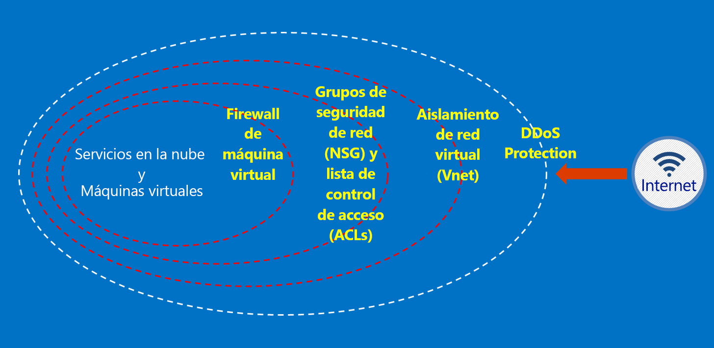

# ¿Qué es Azure Australia?

En 2014 se lanzó Azure en Australia, con dos regiones: Este de Australia (Sídney) y Sudeste de Australia (Melbourne). En abril de 2018 se lanzaron dos nuevas regiones de Azure ubicadas en Canberra: Centro de Australia y Centro de Australia 2. Estas dos regiones se han diseñado específicamente para satisfacer las necesidades de la infraestructura nacional crítica y de la administración pública; ofrecen conectividad y flexibilidad especializadas para que pueda localizar los sistemas en la nube, con los niveles de seguridad y resistencia que se esperan de las redes clasificadas como secretas. Azure Australia es una plataforma para la transformación digital de la infraestructura nacional crítica y de la administración pública; es también la única nube crítica disponible en Australia diseñada específicamente para esas necesidades.

Los sistemas y datos para la administración pública australiana deben cumplir requisitos específicos de esta para conectarse a, procesar y operar en [Microsoft Azure Australia](https://azure.microsoft.com/global-infrastructure/australia/). Los recursos de esta página también proporcionan una guía general aplicable a todos los clientes con un foco específico en la configuración y el funcionamiento seguros.

Consulte la página de Australia en el [Portal de confianza de servicios de Microsoft](https://aka.ms/au-irap) para obtener información actualizada sobre las evaluaciones del programa IRAP (evaluadores registrados de seguridad de la información) de Azure Australia, la certificación y la inclusión en la lista de servicios en la nube certificados (CCSL). En la página de Australia también encontrará otros consejos de Microsoft específicos para los proveedores de infraestructuras gubernamentales y críticas.

## Principios para proteger los datos del cliente en Azure Australia

Azure Australia proporciona una serie de características y servicios que puede usar para crear soluciones en la nube que satisfagan sus necesidades de datos regulados o controlados. Una solución de cliente compatible no es más que una implementación eficaz de las funcionalidades de Azure Australia estándar, combinada con un sólido procedimiento de seguridad de datos.

Al hospedar una solución en Azure Australia, Microsoft controla muchos de estos requisitos en el nivel de la infraestructura en la nube.

En el diagrama siguiente se muestra el modelo de defensa en profundidad de Azure. Por ejemplo, Microsoft ofrece DDoS básico en la infraestructura en la nube, junto con funcionalidades de cliente (como dispositivos de seguridad o servicios DDoS premium) para las necesidades de aplicación específicas de cliente.

En estos artículos se describen los principios fundamentales para proteger los servicios y las aplicaciones, con una guía y procedimientos recomendados sobre cómo aplicar estos principios. En otras palabras, se describe el modo en que los clientes deben hacer un uso inteligente de Azure Australia para cumplir las obligaciones y responsabilidades que se necesitan en una solución que trata información confidencial y clasificada de la administración pública.

Existen dos categorías de documentación que se proporcionan para las agencias de la administración pública de Australia que migran a Azure.

## Seguridad en Azure Australia

Hay una serie de elementos clave que se deben implementar, como la identidad, el control de acceso basado en rol, la protección de datos mediante cifrado y la administración de derechos, y la supervisión y el control de configuración efectivos. En esta sección se incluye una serie de artículos en los que se explican las capacidades integradas de Azure y cómo se relacionan con ISM y ASD Essential 8.

Se puede acceder a estos artículos a través del menú en *Conceptos -> Seguridad en Azure Australia*.

## Puertas de enlace en Azure Australia

Otro paso clave para los organismos públicos es el establecimiento de funcionalidades de seguridad perimetral. Estas funcionalidades son las puertas de enlace seguras a Internet (SIG) y, cuando usa Azure, es su responsabilidad asegurarse de que estas protecciones estás activas. Microsoft no utiliza estas puertas de enlace; sin embargo, al combinar nuestros servicios de redes perimetrales que protegen a todos los clientes con servicios específicos implementados en el entorno de Azure, puede conseguir una funcionalidad equivalente.

Puede acceder a estos artículos a través del menú en *Conceptos -> Puertas de enlace en Azure Australia*.

## Pasos siguientes

* Si se centra en la protección de los datos en Azure, empiece en [Seguridad de los datos](secure-your-data.md).
* Si se centra en la creación de una puerta de enlace en Azure, empiece en [Auditoría, registro y visibilidad de las puertas de enlace](gateway-log-audit-visibility.md).
