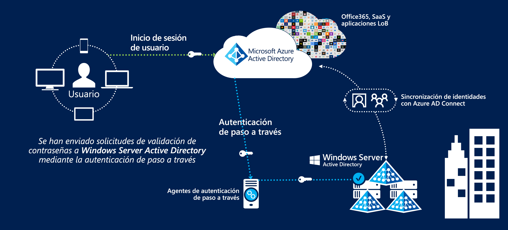

# Federación de identidades en Azure Australia

La oferta de administración y federación de identidades con la nube pública es uno de los primeros pasos más cruciales para el uso de la nube. El servicio de Microsoft Azure Active Directory almacena información de usuario para permitir el acceso a los servicios en la nube y es un requisito previo para consumir otros servicios de Azure.

En este artículo se describen los puntos de diseño claves para implementar Azure Active Directory, sincronizar usuarios de un dominio de Active Directory Domain Services e implementar una autenticación segura. Se destacan específicamente las recomendaciones del Manual de Seguridad de la Información (ISM) del Centro de Seguridad Cibernética australiano y los informes de certificación de Azure.

La clasificación de la información almacenada en Azure Active Directory debe sustentar las decisiones acerca del diseño. Se incluye el siguiente fragmento traducido del [informe de certificación de ACSC para Microsoft Azure](https://aka.ms/au-irap):

>**Informe de certificación de ACSC para Microsoft Azure** Azure Active Directory (Azure AD) debe configurarse con los Servicios de federación de Active Directory cuando las entidades de la Commonwealth clasifican el uso y el contenido de datos de su instancia de Active Directory como PROTECTED. Si bien los datos de Active Directory con la clasificación UNCLASSIFIED en Marcas de limitación de difusión no requieren federación, las entidades de la Commonwealth pueden implementarla para reducir los riesgos asociados al servicio que se proporciona desde fuera de Australia.

Así, la información que se sincroniza y el mecanismo por el que se autentican los usuarios son los dos aspectos clave que se tratan aquí.

## Consideraciones clave sobre el diseño

### Sincronización de usuarios

Al implementar Azure AD Connect, se deben tomar varias decisiones sobre los datos que se sincronizarán. Azure AD Connect se basa en Microsoft Identity Manager y proporciona un conjunto sólido de características para [transformar](https://docs.microsoft.com/azure/active-directory/hybrid/how-to-connect-sync-best-practices-changing-default-configuration) datos entre directorios.

Se pueden usar los servicios de consultoría de Microsoft para realizar una evaluación de ADRAP de la instalación de Windows Server Active Directory existente. La herramienta de ADRAP ayuda a determinar los problemas que se deben corregir antes de sincronizar con Azure Active Directory. Por lo general, los contratos de soporte técnico Premier de Microsoft incluyen este servicio.

La [herramienta IDFix](https://docs.microsoft.com/office365/enterprise/install-and-run-idfix) examina el dominio de Active Directory local en busca de problemas antes de sincronizar con Azure AD. IDFix es un primer paso clave antes de implementar Azure AD Connect. Aunque un examen de IDFix puede identificar un gran número de problemas, muchos de ellos se pueden resolver rápidamente con scripts o solucionar con transformaciones de datos en Azure AD Connect.

Azure AD requiere que los usuarios tengan un dominio de nivel superior enrutable externamente para habilitar la autenticación. Si el dominio tiene un sufijo UPN que no es enrutable externamente, debe establecer el [identificador de inicio de sesión alternativo](https://docs.microsoft.com/azure/active-directory/hybrid/plan-connect-userprincipalname) en AD Connect en el atributo mail del usuario. Después, los usuarios inician sesión en los servicios de Azure con su dirección de correo electrónico en lugar de hacerlo con el inicio de sesión del dominio.

El sufijo UPN de las cuentas de usuario también se puede modificar mediante herramientas como PowerShell; sin embargo, pueden producirse consecuencias imprevistas en otros sistemas conectados y ya no se considera un procedimiento recomendado.

A la hora de decidir qué atributos se deben sincronizar con Azure Active Directory, es más seguro suponer que se necesitan todos los atributos. No es habitual que un directorio contenga datos reales de tipo PROTECTED; sin embargo, se recomienda realizar una auditoría. Si hay datos de tipo PROTECTED en el directorio, evalúe el impacto de omitir o transformar el atributo. A modo de guía útil, puede consultar una lista de atributos que [se necesitan](https://docs.microsoft.com/azure/active-directory/hybrid/reference-connect-sync-attributes-synchronized) en los servicios en la nube de Microsoft.

### Authentication

Es importante comprender las opciones disponibles y cómo se pueden usar para mantener la seguridad de los usuarios finales.
Microsoft ofrece [tres soluciones nativas](https://docs.microsoft.com/azure/active-directory/hybrid/plan-connect-user-signin) para autenticar a los usuarios en Azure Active Directory:

* Sincronización de hash de contraseña: Azure AD Connect sincroniza las contraseñas con hash de Active Directory Domain Services en Azure Active Directory.
* [Autenticación de paso a través](https://docs.microsoft.com/azure/active-directory/hybrid/how-to-connect-pta): las contraseñas permanecen en Active Directory Domain Services. Los usuarios se autentican en Active Directory Domain Services a través de un agente. No se almacenan contraseñas en Azure AD.
* [SSO federado](https://docs.microsoft.com/azure/active-directory/hybrid/how-to-connect-fed-whatis): Azure Active Directory está federado con los Servicios de federación de Active Directory (AD FS); durante el inicio de sesión, Azure dirige a los usuarios a los Servicios de federación de Active Directory (AD FS) para que se autentiquen. No se almacenan contraseñas en Azure AD.

La sincronización de hash de contraseñas se puede usar en escenarios en los que se almacenan datos de tipo OFFICIAL:Sensitive e inferiores en el directorio. Los escenarios en los que se almacenan datos de tipo PROTECTED requerirán una de las dos opciones restantes.

Las tres opciones son compatibles con la [reescritura diferida de contraseñas](https://docs.microsoft.com/azure/active-directory/authentication/concept-sspr-writeback), que se recomienda deshabilitar en la [Guía del consumidor de ACSC](https://aka.ms/au-irap). Sin embargo, las organizaciones deben evaluar el riesgo de deshabilitar la escritura diferida de contraseñas a cambio de las mejoras de productividad y la reducción en el esfuerzo de compatibilidad que supone el uso de los restablecimientos de contraseña de autoservicio.

#### Autenticación de paso a través (PTA)

La autenticación de paso a través se lanzó ya completada la evaluación de IRAP, por lo que debe evaluarse individualmente para determinar cómo se adapta la solución al perfil de riesgo de la organización. Microsoft prefiere la autenticación de paso a través antes que la federación, ya que mejora la posición de la seguridad.

La autenticación de paso a través presenta varios factores de diseño que se deben tener en cuenta:

* El agente de la autenticación de paso a través debe ser capaz de establecer conexiones salientes con los servicios en la nube de Microsoft.
* Es preferible instalar más de un agente para asegurarse de que el servicio tendrá una alta disponibilidad. Se recomienda implementar al menos tres agentes y hasta un máximo de doce.
* Se recomienda evitar la instalación del agente directamente en un controlador de dominio de Active Directory. De forma predeterminada, al implementar Azure AD Connect con la autenticación de paso a través, el agente se instalará en el servidor de AD Connect.
* La autenticación de paso a través es una opción con menor mantenimiento que los Servicios de federación de Active Directory (AD FS) porque no necesita una infraestructura de servidor dedicada, administración de certificados ni reglas de firewall de entrada.

#### Servicios de federación de Active Directory (ADFS)

Los Servicios de federación de Active Directory se incluyeron dentro de la evaluación de IRAP y su uso en entornos de tipo PROTECTED está aprobado.

Los Servicios de federación de Active Directory presentan varios factores de diseño que se deben tener en cuenta:

* Los Servicios de federación requerirán la entrada de red para el tráfico HTTPS desde Internet o, como mínimo, los puntos de conexión de servicio de Microsoft.
* Los Servicios de federación usan PKI y certificados, que requieren una administración y una renovación continuas.
* Los Servicios de federación deben implementarse en servidores dedicados y necesitan la infraestructura de red pertinente para que se pueda acceder a ellos externamente de forma segura.

### Multi-Factor Authentication (MFA)

En la sección de ISM sobre la autenticación multifactor se recomienda implementarla en los siguientes escenarios según el perfil de riesgo:

* Autenticación de usuarios estándar
* Autenticación de cuentas con privilegios
* Autenticación de acceso remoto de usuarios
* Usuarios que realizan acciones con privilegios

Azure Active Directory proporciona Multi-Factor Authentication, que se puede habilitar para todos los usuarios o para un subconjunto de ellos (por ejemplo, solo cuentas con privilegios). Microsoft también proporciona una solución denominada Acceso Condicional, que permite un control más pormenorizado sobre la forma en la que se aplica la autenticación multifactor (por ejemplo, solo cuando los usuarios inician sesión desde intervalos de direcciones IP remotas).

Azure Multi-Factor Authentication admite las siguientes formas de validación aceptables por ISM:

* llamada de teléfono
* Mensaje SMS
* Aplicación Microsoft Authenticator
* Tokens de hardware admitidos

Privileged Identity Management, un componente de Azure Active Directory, se puede usar para exigir el uso de la autenticación multifactor cuando los usuarios elevan sus permisos para cumplir la cuarta recomendación.

## Pasos siguientes

Revise el artículo sobre [controles de acceso basados en roles y Privileged Identity Management](role-privileged.md).
