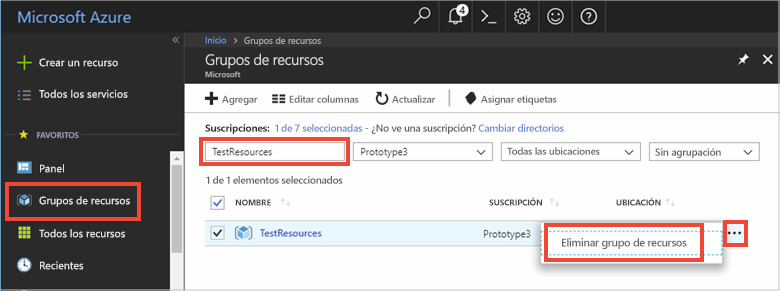

# <a name="quickstart-use-azure-cache-for-redis-with-a-net-framework-application"></a>Inicio rápido: Uso de Azure Redis Cache con una aplicación .NET Framework

En este inicio rápido incorporará Azure Redis Cache en una aplicación .NET Framework para acceder a una caché dedicada y segura, a la que se puede acceder desde cualquier aplicación de Azure. Concretamente, usará el cliente [StackExchange.Redis](https://github.com/StackExchange/StackExchange.Redis) con código C# en una aplicación de consola de .NET.

## <a name="prerequisites"></a>Prerrequisitos

- Una suscripción a Azure: [cree una cuenta gratuita](https://azure.microsoft.com/free/)
- [Visual Studio 2019](https://www.visualstudio.com/downloads/)
- [.NET Framework 4 o superior](https://www.microsoft.com/net/download/dotnet-framework-runtime), requisito del cliente StackExchange.Redis.

## <a name="create-a-cache"></a>Creación de una caché
[!INCLUDE [redis-cache-create](../../includes/redis-cache-create.md)]

[!INCLUDE [redis-cache-access-keys](../../includes/redis-cache-access-keys.md)]

Cree un archivo en el equipo llamado *CacheSecrets.config* y colóquelo en una ubicación donde no se vaya a insertar en el repositorio con el código fuente de la aplicación de ejemplo. En esta guía de inicio rápido, el archivo *CacheSecrets.config* se encuentra aquí, *C:\AppSecrets\CacheSecrets.config*.

Edite el archivo *CacheSecrets.config* y agregue el contenido siguiente:

```xml
<appSettings>
    <add key="CacheConnection" value="<cache-name>.redis.cache.windows.net,abortConnect=false,ssl=true,password=<access-key>"/>
</appSettings>
```

Reemplace `<cache-name>` por su nombre de host de caché.

Reemplace `<access-key>` por la clave principal de la caché.


## <a name="create-a-console-app"></a>Creación de una aplicación de consola

En Visual Studio, haga clic en **Archivo** > **Nuevo** > **proyecto**.

En **Visual C#** , haga clic en **Escritorio clásico de Windows** y, a continuación, haga clic en **Aplicación de consola** y **Aceptar** para crear una nueva aplicación de consola.


<a name="configure-the-cache-clients"></a>

## <a name="configure-the-cache-client"></a>Configuración del cliente de caché

En esta sección, configurará la aplicación de consola para utilizar el cliente [StackExchange.Redis](https://github.com/StackExchange/StackExchange.Redis) para .NET.

En Visual Studio, haga clic en **Herramientas** > **Administrador de paquetes NuGet** > **Consola del administrador de paquetes** y ejecute el siguiente comando desde la ventana de la consola del administrador de paquetes.

```powershell
Install-Package StackExchange.Redis
```

Una vez completada la instalación, el cliente de caché *StackExchange.Redis* está disponible para su uso con el proyecto.


## <a name="connect-to-the-cache"></a>Conexión a la memoria caché

En Visual Studio, abra el archivo *App.config* y actualícelo para incluir un atributo `appSettings` `file` que haga referencia al archivo *CacheSecrets.config*.

```xml
<?xml version="1.0" encoding="utf-8" ?>
<configuration>
    <startup> 
        <supportedRuntime version="v4.0" sku=".NETFramework,Version=v4.7.1" />
    </startup>

    <appSettings file="C:\AppSecrets\CacheSecrets.config"></appSettings>  

</configuration>
```

En el Explorador de soluciones, haga clic con el botón derecho en **Referencias** y haga clic en **Agregar una referencia**. Agregue una referencia al ensamblado **System.Configuration**.

Agregue las siguientes instrucciones `using` a *Program.cs*:

```csharp
using StackExchange.Redis;
using System.Configuration;
```

La clase `ConnectionMultiplexer` administra la conexión con Azure Redis Cache. Esta clase debe compartirse y reutilizarse en toda la aplicación cliente. No cree una nueva conexión para cada operación. 

Nunca almacene credenciales en el código fuente. Para simplificar este ejemplo, solo se usa un archivo de configuración externo llamado secrets. Un enfoque más adecuado sería utilizar [Azure Key Vault con certificados](https://docs.microsoft.com/rest/api/keyvault/certificate-scenarios).

En *Program.cs*, agregue los siguientes miembros a la clase `Program` de la aplicación de consola:

```csharp
        private static Lazy<ConnectionMultiplexer> lazyConnection = new Lazy<ConnectionMultiplexer>(() =>
        {
            string cacheConnection = ConfigurationManager.AppSettings["CacheConnection"].ToString();
            return ConnectionMultiplexer.Connect(cacheConnection);
        });

        public static ConnectionMultiplexer Connection
        {
            get
            {
                return lazyConnection.Value;
            }
        }
```


Este enfoque para compartir una instancia de `ConnectionMultiplexer` en la aplicación usa una propiedad estática que devuelve una instancia conectada. El código proporciona una manera segura para subprocesos de inicializar solo una instancia de `ConnectionMultiplexer` conectada. `abortConnect` está establecido en false, lo que significa que la llamada se realizará correctamente incluso si no se establece ninguna conexión a Azure Redis Cache. Una de las características principales de `ConnectionMultiplexer` es que restaura automáticamente la conectividad a la caché una vez que el problema de red u otras causas se resuelven.

El valor de la configuración de aplicación *CacheConnection* se utiliza para hacer referencia a la cadena de conexión de la caché de Azure Portal como el parámetro de contraseña.

## <a name="executing-cache-commands"></a>Ejecución de comandos de caché

Agregue el código siguiente al procedimiento `Main` de la clase `Program` de la aplicación de consola:

```csharp
        static void Main(string[] args)
        {
            // Connection refers to a property that returns a ConnectionMultiplexer
            // as shown in the previous example.
            IDatabase cache = lazyConnection.Value.GetDatabase();

            // Perform cache operations using the cache object...

            // Simple PING command
            string cacheCommand = "PING";
            Console.WriteLine("\nCache command  : " + cacheCommand);
            Console.WriteLine("Cache response : " + cache.Execute(cacheCommand).ToString());

            // Simple get and put of integral data types into the cache
            cacheCommand = "GET Message";
            Console.WriteLine("\nCache command  : " + cacheCommand + " or StringGet()");
            Console.WriteLine("Cache response : " + cache.StringGet("Message").ToString());

            cacheCommand = "SET Message \"Hello! The cache is working from a .NET console app!\"";
            Console.WriteLine("\nCache command  : " + cacheCommand + " or StringSet()");
            Console.WriteLine("Cache response : " + cache.StringSet("Message", "Hello! The cache is working from a .NET console app!").ToString());

            // Demonstrate "SET Message" executed as expected...
            cacheCommand = "GET Message";
            Console.WriteLine("\nCache command  : " + cacheCommand + " or StringGet()");
            Console.WriteLine("Cache response : " + cache.StringGet("Message").ToString());

            // Get the client list, useful to see if connection list is growing...
            cacheCommand = "CLIENT LIST";
            Console.WriteLine("\nCache command  : " + cacheCommand);
            Console.WriteLine("Cache response : \n" + cache.Execute("CLIENT", "LIST").ToString().Replace("id=", "id="));

            lazyConnection.Value.Dispose();
        }
```

Las instancias de Azure Cache for Redis tienen un número configurable de bases de datos (valor predeterminado de 16) que se pueden usar para separar de forma lógica los datos dentro de una instancia de Azure Redis Cache. El código se conecta a la base de datos predeterminada, DB 0. Para más información, consulte [What are Redis databases?](cache-faq.md#what-are-redis-databases) (¿Qué son las bases de datos de Redis?) y [Configuración predeterminada del servidor Redis](cache-configure.md#default-redis-server-configuration).

Los elementos en la memoria caché se pueden almacenar y recuperar mediante los métodos `StringSet` y `StringGet`.

Redis almacena la mayoría de los datos como cadenas Redis, pero estas cadenas pueden contener muchos tipos de datos, como por ejemplo datos binarios serializados, que se pueden usar cuando se almacenan objetos .NET en caché.

Presione **Ctrl+F5** para compilar y ejecutar la aplicación de consola.

En el ejemplo siguiente, puede ver que la clave `Message` tenía anteriormente un valor almacenado en caché, que se estableció mediante la Consola de Redis en Azure Portal. La aplicación actualizó ese valor almacenado en caché. La aplicación también ejecutó los comandos `PING` y `CLIENT LIST`.


## <a name="work-with-net-objects-in-the-cache"></a>Trabajar con objetos .NET en la memoria caché

Azure Redis Cache puede almacenar en caché objetos .NET así como tipos de datos primitivos, pero antes de poder almacenar en caché un objeto .NET, se debe serializar. La serialización del objeto .NET es responsabilidad del desarrollador de la aplicación, que tiene total flexibilidad a la hora de elegir el serializador.

Una manera sencilla para serializar objetos es usar los métodos de serialización `JsonConvert` de [Newtonsoft.Json](https://www.nuget.org/packages/Newtonsoft.Json/) y serializar a y desde JSON. En esta sección, agregará un objeto .NET a la memoria caché.

En Visual Studio, haga clic en **Herramientas** > **Administrador de paquetes NuGet** > **Consola del administrador de paquetes** y ejecute el siguiente comando desde la ventana de la consola del administrador de paquetes.

```powershell
Install-Package Newtonsoft.Json
```

Agregue la siguiente instrucción `using` al principio del archivo *Program.cs*:

```csharp
using Newtonsoft.Json;
```

Agregue la siguiente definición de clase `Employee` a *Program.cs*:

```csharp
        class Employee
        {
            public string Id { get; set; }
            public string Name { get; set; }
            public int Age { get; set; }

            public Employee(string EmployeeId, string Name, int Age)
            {
                this.Id = EmployeeId;
                this.Name = Name;
                this.Age = Age;
            }
        }
```

En la parte inferior del procedimiento `Main()` de *Program.cs*, antes de llamar a `Dispose()`, agregue las siguientes líneas de código para almacenar en caché y recuperar un objeto .NET serializado:

```csharp
            // Store .NET object to cache
            Employee e007 = new Employee("007", "Davide Columbo", 100);
            Console.WriteLine("Cache response from storing Employee .NET object : " + 
                cache.StringSet("e007", JsonConvert.SerializeObject(e007)));

            // Retrieve .NET object from cache
            Employee e007FromCache = JsonConvert.DeserializeObject<Employee>(cache.StringGet("e007"));
            Console.WriteLine("Deserialized Employee .NET object :\n");
            Console.WriteLine("\tEmployee.Name : " + e007FromCache.Name);
            Console.WriteLine("\tEmployee.Id   : " + e007FromCache.Id);
            Console.WriteLine("\tEmployee.Age  : " + e007FromCache.Age + "\n");
```

Presione **Ctrl+F5** para compilar y ejecutar la aplicación de consola para probar la serialización de objetos .NET. 


## <a name="clean-up-resources"></a>Limpieza de recursos

Si va a seguir con el tutorial siguiente, puede mantener los recursos creados en esta guía de inicio rápido y volverlos a utilizar.

En caso contrario, si ya ha terminado con la aplicación de ejemplo de la guía de inicio rápido, puede eliminar los recursos de Azure creados en este tutorial para evitar cargos. 

> [!IMPORTANT]
> La eliminación de un grupo de recursos es irreversible y el grupo de recursos y todos los recursos que contiene se eliminarán de forma permanente. Asegúrese de no eliminar por accidente el grupo de recursos o los recursos equivocados. Si ha creado los recursos para hospedar este ejemplo dentro de un grupo de recursos existente que contiene recursos que desea mantener, puede eliminar cada recurso individualmente de sus hojas respectivas, en lugar de eliminar el grupo de recursos.
>

Inicie sesión en [Azure Portal](https://portal.azure.com) y haga clic en **Grupos de recursos**.

Escriba el nombre del grupo de recursos en el cuadro de texto **Filtrar por nombre...** . En las instrucciones de este artículo se usa un grupo de recursos llamado *TestResources*. En el grupo de recursos de la lista de resultados, haga clic en **...** y, a continuación, en **Eliminar grupo de recursos**.



Se le pedirá que confirme la eliminación del grupo de recursos. Escriba el nombre del grupo de recursos para confirmar y haga clic en **Eliminar**.

Transcurridos unos instantes, el grupo de recursos y todos los recursos que contiene se eliminan.


<a name="next-steps"></a>

## <a name="next-steps"></a>Pasos siguientes

En este inicio rápido, ha aprendido a usar Azure Redis Cache desde una aplicación .NET. Continúe con el siguiente inicio rápido para usar Azure Redis Cache con una aplicación web ASP.NET.

> [!div class="nextstepaction"]
> [Creación de una aplicación web ASP.NET que usa Azure Redis Cache.](./cache-web-app-howto.md)


