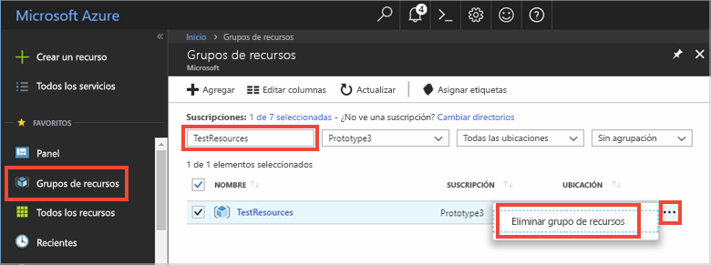

# <a name="quickstart-create-a-python-app-that-uses-azure-cache-for-redis"></a>Inicio rápido: Creación de una aplicación de Python que use Azure Cache for Redis

En este artículo incorporará Azure Cache for Redis en una aplicación de Python para acceder a una caché dedicada y segura, a la que se puede acceder desde cualquier aplicación de Azure.

## <a name="prerequisites"></a>Requisitos previos

- Una suscripción a Azure: [cree una cuenta gratuita](https://azure.microsoft.com/free/)
- [Python 2 o 3](https://www.python.org/downloads/)

## <a name="create-an-azure-cache-for-redis-on-azure"></a>Creación de una instancia de Azure Redis Cache en Azure
[!INCLUDE [redis-cache-create](../../includes/redis-cache-create.md)]

[!INCLUDE [redis-cache-create](../../includes/redis-cache-access-keys.md)]

## <a name="install-redis-py"></a>Instalación de redis-py

[Redis-py](https://github.com/andymccurdy/redis-py) es una interfaz de Python para Azure Redis Cache. Use la herramienta de paquetes de Python, *pip*, para instalar el paquete redis-py. 

En el ejemplo siguiente, se utiliza *pip3* para que Python 3 instale el paquete redis-py en Windows 10 mediante un símbolo del sistema para desarrolladores de Visual Studio 2019 con privilegios elevados de administrador.

```python
    pip3 install redis
```


## <a name="read-and-write-to-the-cache"></a>Lectura y escritura en la memoria caché

Ejecute Python y pruebe el uso de la memoria caché desde la línea de comandos. Reemplace `<Your Host Name>` y `<Your Access Key>` con los valores de Azure Redis Cache. 

```python
>>> import redis
>>> r = redis.StrictRedis(host='<Your Host Name>.redis.cache.windows.net',
        port=6380, db=0, password='<Your Access Key>', ssl=True)
>>> r.set('foo', 'bar')
True
>>> r.get('foo')
b'bar'
```

> [!IMPORTANT]
> En Redis, versión 3.0 o posterior, se aplica la comprobación del certificado SSL. ssl_ca_certs debe establecerse explícitamente al conectar con Redis. En el caso de RH Linux, ssl_ca_certs puede encontrarse en el módulo de certificado "/etc/pki/tls/certs/ca-bundle.crt".

## <a name="create-a-python-script"></a>Creación de un script de Python

Cree un archivo de texto de script denominado *PythonApplication1.py*.

Agregue el siguiente script a *PythonApplication1.py* y guarde el archivo. Este script probará el acceso a la caché. Reemplace `<Your Host Name>` y `<Your Access Key>` con los valores de Azure Redis Cache. 

```python
import redis

myHostname = "<Your Host Name>.redis.cache.windows.net"
myPassword = "<Your Access Key>"

r = redis.StrictRedis(host=myHostname, port=6380,
                      password=myPassword, ssl=True)

result = r.ping()
print("Ping returned : " + str(result))

result = r.set("Message", "Hello!, The cache is working with Python!")
print("SET Message returned : " + str(result))

result = r.get("Message")
print("GET Message returned : " + result.decode("utf-8"))

result = r.client_list()
print("CLIENT LIST returned : ")
for c in result:
    print("id : " + c['id'] + ", addr : " + c['addr'])
```

Ejecute el script con Python.


## <a name="clean-up-resources"></a>Limpieza de recursos

Si va a seguir con otro tutorial, puede mantener los recursos creados en esta guía de inicio rápido y volverlos a utilizar.

En caso contrario, si ya ha terminado con la aplicación de ejemplo de la guía de inicio rápido, puede eliminar los recursos de Azure creados en este tutorial para evitar cargos. 

> [!IMPORTANT]
> La eliminación de un grupo de recursos es irreversible y el grupo de recursos y todos los recursos que contiene se eliminarán de forma permanente. Asegúrese de no eliminar por accidente el grupo de recursos o los recursos equivocados. Si ha creado los recursos para hospedar este ejemplo dentro de un grupo de recursos existente que contiene recursos que desea mantener, puede eliminar cada recurso individualmente de sus hojas respectivas, en lugar de eliminar el grupo de recursos.
>

Inicie sesión en [Azure Portal](https://portal.azure.com) y después seleccione **Grupos de recursos**.

En el cuadro de texto **Filtrar por nombre**, escriba el nombre del grupo de recursos. En las instrucciones de este artículo se usa un grupo de recursos llamado *TestResources*. En el grupo de recursos de la lista de resultados, seleccione **...** y, después, **Eliminar grupo de recursos**.



Se le pedirá que confirme la eliminación del grupo de recursos. Escriba el nombre del grupo de recursos para confirmar y seleccione **Eliminar**.

Transcurridos unos instantes, el grupo de recursos y todos los recursos que contiene se eliminan.

## <a name="next-steps"></a>Pasos siguientes

> [!div class="nextstepaction"]
> [Creación de una aplicación web ASP.NET sencilla que use Azure Redis Cache.](./cache-web-app-howto.md)

<!--Image references-->
[1]: ./media/cache-python-get-started/redis-cache-new-cache-menu.png
[2]: ./media/cache-python-get-started/redis-cache-cache-create.png
