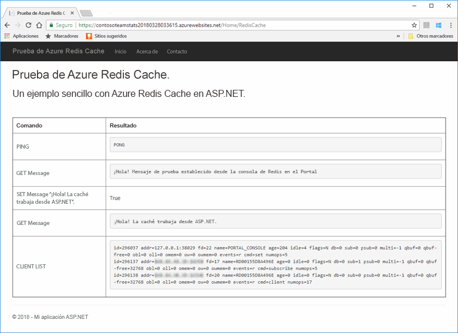
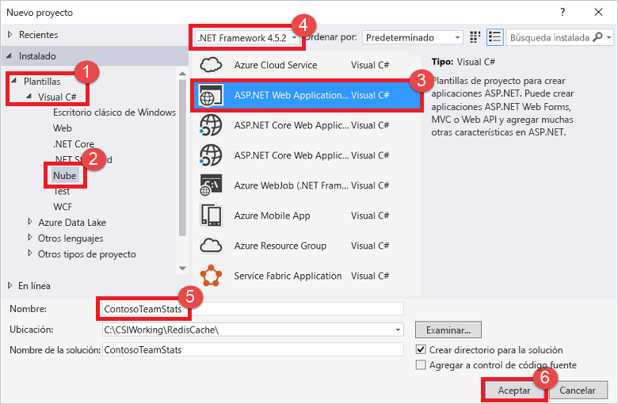
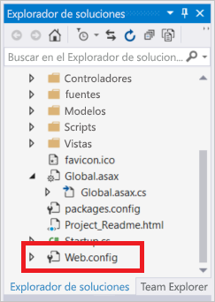
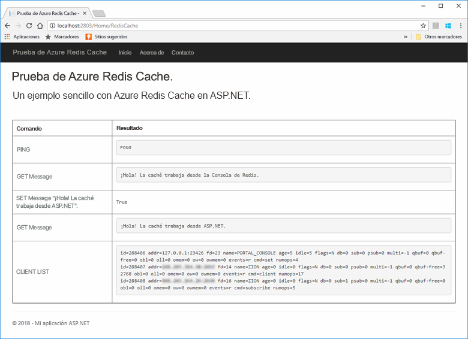
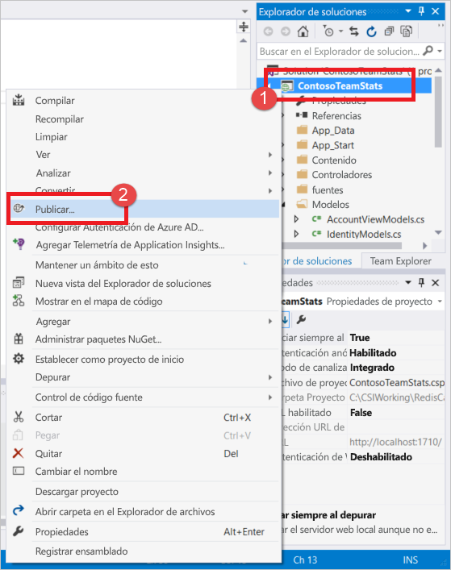
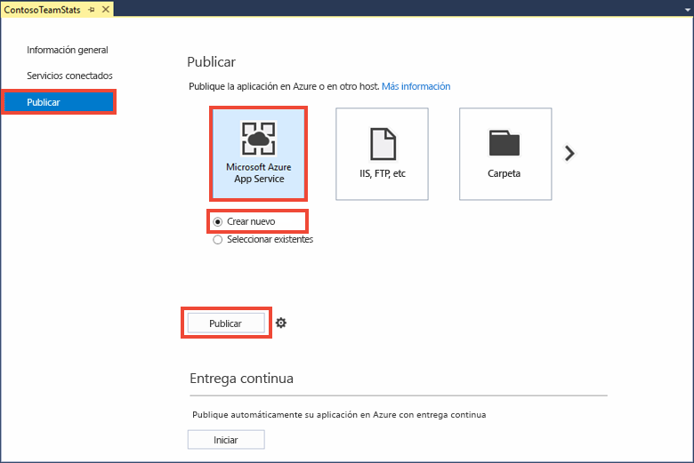
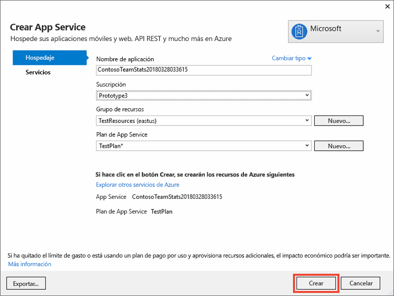
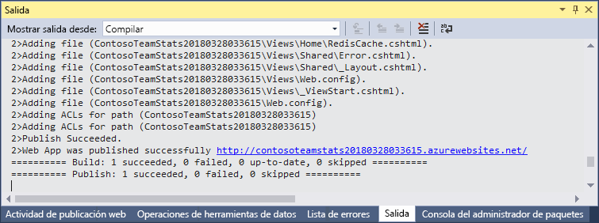
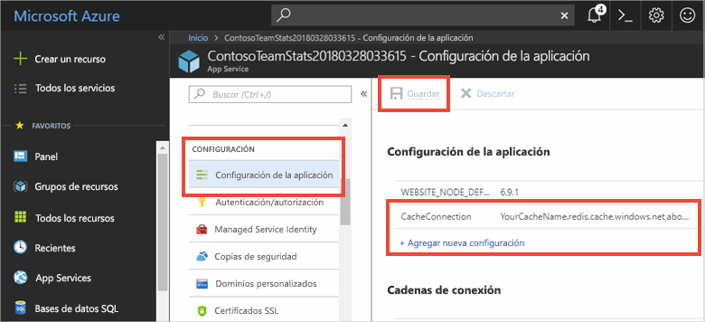
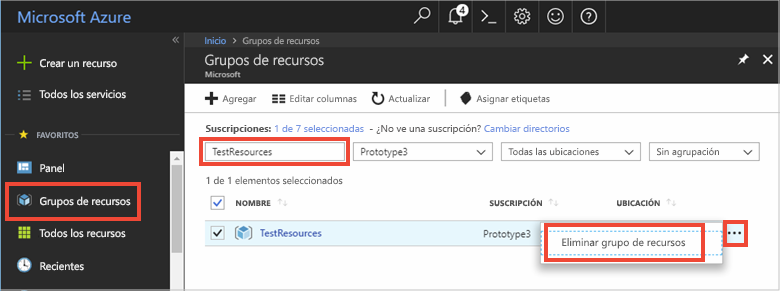

# <a name="quickstart-create-an-aspnet-web-app"></a>Inicio rápido: Creación de una aplicación web de ASP.NET 

## <a name="introduction"></a>Introducción

En esta guía de inicio rápido se muestra cómo crear e implementar una aplicación web de ASP.NET en Azure App Service mediante Visual Studio 2017. La aplicación de ejemplo se conecta a Azure Redis Cache para almacenar y recuperar datos de la memoria caché. Después de finalizar el inicio rápido, tendrá una aplicación web en ejecución hospedada en Azure que lee y escribe en una instancia de Azure Redis Cache.



[!INCLUDE [quickstarts-free-trial-note](../../includes/quickstarts-free-trial-note.md)]

## <a name="prerequisites"></a>Requisitos previos

Para completar esta guía de inicio rápido, instale [Visual Studio 2017](https://www.visualstudio.com/downloads/) con los entornos siguientes:
* ASP.NET y desarrollo web
* Desarrollo de Azure

## <a name="create-the-visual-studio-project"></a>Creación del proyecto de Visual Studio

1. Abra Visual Studio y después seleccione **Archivo** >**Nuevo** > **Proyecto**.

2. En el cuadro de diálogo **Nuevo proyecto**, realice estos pasos:

    

    a. En la lista **Plantillas**, expanda el nodo **Visual C#**.

    b. Seleccione **Nube**.

    c. Seleccione **Aplicación web ASP.NET**.

    d. Asegúrese de que se selecciona **.NET Framework 4.5.2** o superior.

    e. En el cuadro **Nombre**, asigne un nombre al proyecto. En este ejemplo, hemos usado **ContosoTeamStats**.

    f. Seleccione **Aceptar**.
   
3. Seleccione **MVC** como tipo de proyecto.

4. Asegúrese de especificar **Sin autenticación** en la opción **Autenticación**. Dependiendo de la versión de Visual Studio, puede establecerse otro valor predeterminado de **autenticación**. Para cambiarlo, seleccione **Cambiar autenticación** y después **Sin autenticación**.

5. Haga clic en **Aceptar** para crear el proyecto.

## <a name="create-a-cache"></a>Creación de una caché

A continuación, creará la caché de la aplicación.

[!INCLUDE [redis-cache-create](../../includes/redis-cache-create.md)]

[!INCLUDE [redis-cache-access-keys](../../includes/redis-cache-access-keys.md)]

#### <a name="to-edit-the-cachesecretsconfig-file"></a>Para editar el archivo *CacheSecrets.config*

3. Cree un archivo en el equipo llamado *CacheSecrets.config*. Colóquelo en una ubicación en la que no se pueda comprobar con el código fuente de la aplicación de ejemplo. En esta guía de inicio rápido, el archivo *CacheSecrets.config* se encuentra en *C:\AppSecrets\CacheSecrets.config*.

4. Edite el archivo *CacheSecrets.config*. Después, agregue el siguiente contenido:

    ```xml
    <appSettings>
        <add key="CacheConnection" value="<cache-name>.redis.cache.windows.net,abortConnect=false,ssl=true,password=<access-key>"/>
    </appSettings>
    ```

5. Reemplace `<cache-name>` por su nombre de host de caché.

6. Reemplace `<access-key>` por la clave principal de la caché.

    > [!TIP]
    > Puede usar la clave de acceso secundaria durante la rotación de claves como una clave alternativa mientras vuelve a generar la clave de acceso principal.
>
7. Guarde el archivo.

## <a name="update-the-mvc-application"></a>Actualización de la aplicación MVC

En esta sección, actualizará la aplicación para admitir una nueva vista que muestra una prueba sencilla realizada para una instancia de Azure Redis Cache.

* [Actualización del archivo web.config con una configuración de aplicación para la caché](#Update-the-webconfig-file-with-an-app-setting-for-the-cache)
* [Configuración de la aplicación para usar el cliente de StackExchange.Redis](#configure-the-application-to-use-stackexchangeredis)
* [Actualización de HomeController y Layout](#update-the-homecontroller-and-layout)
* [Adición de una nueva vista de RedisCache](#add-a-new-rediscache-view)

### <a name="update-the-webconfig-file-with-an-app-setting-for-the-cache"></a>Actualización del archivo web.config con una configuración de aplicación para la caché

Cuando se ejecuta la aplicación localmente, la información de *CacheSecrets.config* se usa para conectarse a la instancia de Azure Redis Cache. Más adelante se implementará esta aplicación en Azure. En ese momento, define una configuración de aplicación en Azure que la aplicación usa para recuperar la información de conexión de la caché en lugar de este archivo. 

Como el archivo *CacheSecrets.config* no se ha implementado en Azure con la aplicación, solo lo usará al probar la aplicación localmente. Es importante mantener esta información lo más segura posible para impedir el acceso malintencionado a los datos de la caché.

#### <a name="to-update-the-webconfig-file"></a>Para actualizar el archivo *web.config*
1. En el **Explorador de soluciones**, haga doble clic en el archivo *web.config* para abrirlo.

    

2. En el archivo *web.config*, busque el elemento `<appSetting>`. Después, agregue el atributo `file` siguiente. Si utiliza un nombre de archivo o una ubicación diferente, sustituya los valores por los que se muestran en el ejemplo.

* Antes: `<appSettings>`
* Después: ` <appSettings file="C:\AppSecrets\CacheSecrets.config">`

El sistema en tiempo de ejecución de ASP.NET combina el contenido del archivo externo con las marcas del elemento `<appSettings>` . El entorno de ejecución omite el atributo de archivo si no se encuentra el archivo especificado. Los secretos (cadena de conexión a la caché) no se incluyen como parte del código fuente de la aplicación. Al implementar la aplicación web en Azure, el archivo *CacheSecrets.config* no se implementará.

### <a name="to-configure-the-application-to-use-stackexchangeredis"></a>Para configurar la aplicación para que use StackExchange.Redis

1. Para configurar la aplicación para que use el paquete NuGet [StackExchange.Redis](https://github.com/StackExchange/StackExchange.Redis) para Visual Studio, seleccione **Herramientas > Administrador de paquetes NuGet > Consola del Administrador de paquetes**.

2. Ejecute el siguiente comando desde la ventana `Package Manager Console`:

    ```powershell
    Install-Package StackExchange.Redis
    ```

3. El paquete NuGet se descarga y agrega las referencias de ensamblado requeridas para que la aplicación cliente acceda a Azure Redis Cache con el cliente de caché Azure Redis Cache StackExchange. Si prefiere usar una versión con nombre seguro de la biblioteca de cliente `StackExchange.Redis`, instale el paquete `StackExchange.Redis.StrongName`.

### <a name="to-update-the-homecontroller-and-layout"></a>Para actualizar HomeController y Layout

1. En el **Explorador de soluciones**, expanda la carpeta **Controllers** y abra el archivo *HomeController.cs*.

2. Agregue las dos siguientes instrucciones `using` en la parte superior del archivo para admitir el cliente de caché y la configuración de aplicación.

    ```csharp
    using System.Configuration;
    using StackExchange.Redis;
    ```

3. Agregue el método siguiente a la clase `HomeController` para admitir una nueva acción `RedisCache` que ejecuta algunos comandos en la nueva caché.

    ```csharp
        public ActionResult RedisCache()
        {
            ViewBag.Message = "A simple example with Azure Cache for Redis on ASP.NET.";

            var lazyConnection = new Lazy<ConnectionMultiplexer>(() =>
            {
                string cacheConnection = ConfigurationManager.AppSettings["CacheConnection"].ToString();
                return ConnectionMultiplexer.Connect(cacheConnection);
            });

            // Connection refers to a property that returns a ConnectionMultiplexer
            // as shown in the previous example.
            IDatabase cache = lazyConnection.Value.GetDatabase();

            // Perform cache operations using the cache object...

            // Simple PING command
            ViewBag.command1 = "PING";
            ViewBag.command1Result = cache.Execute(ViewBag.command1).ToString();

            // Simple get and put of integral data types into the cache
            ViewBag.command2 = "GET Message";
            ViewBag.command2Result = cache.StringGet("Message").ToString();

            ViewBag.command3 = "SET Message \"Hello! The cache is working from ASP.NET!\"";
            ViewBag.command3Result = cache.StringSet("Message", "Hello! The cache is working from ASP.NET!").ToString();

            // Demostrate "SET Message" executed as expected...
            ViewBag.command4 = "GET Message";
            ViewBag.command4Result = cache.StringGet("Message").ToString();

            // Get the client list, useful to see if connection list is growing...
            ViewBag.command5 = "CLIENT LIST";
            ViewBag.command5Result = cache.Execute("CLIENT", "LIST").ToString().Replace(" id=", "\rid=");

            lazyConnection.Value.Dispose();

            return View();
        }
    ```

4. En el **Explorador de soluciones**, expanda la carpeta **Vistas** > **Compartido**. Después, abra el archivo *_Layout.cshtml*.

    Sustituya:
    
    ```csharp
    @Html.ActionLink("Application name", "Index", "Home", new { area = "" }, new { @class = "navbar-brand" })
    ```

    por:

    ```csharp
    @Html.ActionLink("Azure Cache for Redis Test", "RedisCache", "Home", new { area = "" }, new { @class = "navbar-brand" })
    ```

### <a name="to-add-a-new-rediscache-view"></a>Para agregar una nueva vista de RedisCache

1. En el **Explorador de soluciones**, expanda la carpeta **Vistas** y, luego, haga clic con el botón derecho en la carpeta **Inicio**. Elija **Agregar** > **Ver...** .

2. En el cuadro de diálogo **Agregar vista**, escriba **RedisCache** como nombre de la vista. A continuación, seleccione **Agregar**.

3. Reemplace el código del archivo *RedisCache.cshtml* por el código siguiente:

    ```csharp
    @{
        ViewBag.Title = "Azure Cache for Redis Test";
    }

    <h2>@ViewBag.Title.</h2>
    <h3>@ViewBag.Message</h3>
    <br /><br />
    <table border="1" cellpadding="10">
        <tr>
            <th>Command</th>
            <th>Result</th>
        </tr>
        <tr>
            <td>@ViewBag.command1</td>
            <td><pre>@ViewBag.command1Result</pre></td>
        </tr>
        <tr>
            <td>@ViewBag.command2</td>
            <td><pre>@ViewBag.command2Result</pre></td>
        </tr>
        <tr>
            <td>@ViewBag.command3</td>
            <td><pre>@ViewBag.command3Result</pre></td>
        </tr>
        <tr>
            <td>@ViewBag.command4</td>
            <td><pre>@ViewBag.command4Result</pre></td>
        </tr>
        <tr>
            <td>@ViewBag.command5</td>
            <td><pre>@ViewBag.command5Result</pre></td>
        </tr>
    </table>
    ```

## <a name="run-the-app-locally"></a>Ejecución de la aplicación de forma local

De forma predeterminada, el proyecto está configurado para hospedar la aplicación localmente en [IIS Express](https://docs.microsoft.com/iis/extensions/introduction-to-iis-express/iis-express-overview) para pruebas y depuración.

### <a name="to-run-the-app-locally"></a>Para ejecutar la aplicación localmente
1. En Visual Studio, seleccione **Depurar** > **Iniciar depuración** para crear e iniciar la aplicación localmente para pruebas y depuración.

2. En el explorador, seleccione **Azure Redis Cache Test** (Prueba de Azure Redis Cache) en la barra de navegación.

3. En el ejemplo siguiente, la clave `Message` tenía anteriormente un valor almacenado en caché, que se estableció mediante la consola de Azure Redis Cache en el portal. La aplicación actualizó ese valor almacenado en caché. La aplicación también ejecutó los comandos `PING` y `CLIENT LIST`.

    

## <a name="publish-and-run-in-azure"></a>Publicación y ejecución en Azure

Cuando haya probado con éxito la aplicación localmente, puede implementarla en Azure y ejecutarla en la nube.

### <a name="to-publish-the-app-to-azure"></a>Para publicar la aplicación en Azure

1. En Visual Studio, haga clic con el botón derecho en el nodo del proyecto en el Explorador de soluciones. Después, seleccione **Publicar**.

    

2. Seleccione **Microsoft Azure App Service**, después **Crear nuevo** y después seleccione **Publicar**.

    

3. En el cuadro de diálogo **Crear servicio de aplicaciones**, realice los cambios siguientes:

    | Configuración | Valor recomendado | DESCRIPCIÓN |
    | ------- | :---------------: | ----------- |
    | **Nombre de la aplicación** | Use el valor predeterminado. | El nombre de la aplicación es el nombre de host de la aplicación cuando se implementa en Azure. El nombre puede tener un sufijo de marca de tiempo que se le agrega, si es necesario, para que sea único. |
    | **Suscripción** | Elija la suscripción de Azure. | En esta suscripción se cargan los costos de hospedaje relacionados. Si tiene varias suscripciones de Azure, compruebe que se selecciona la suscripción deseada.|
    | **Grupos de recursos** | Use el mismo grupo de recursos donde creó la caché (por ejemplo, *TestResourceGroup*). | El grupo de recursos le ayuda a administrar todos los recursos como un grupo. Más adelante, si desea eliminar la aplicación, puede eliminar simplemente el grupo. |
    | **plan de App Service** | Seleccione **Nuevo** y después cree un nuevo plan de App Service llamado *TestingPlan*. <br />Use la misma **ubicación** que utilizó al crear la caché. <br />Elija **Libre** para el tamaño. | Un plan de App Service define un conjunto de recursos de proceso con los que se ejecuta una aplicación web. |

    

4. Después de definir la configuración del hospedaje de App Service, seleccione **Crear**.

5. Supervise la ventana **Salida** en Visual Studio para ver el estado de la publicación. Cuando se haya publicado la aplicación, se registra la dirección URL de la aplicación:

    

### <a name="add-the-app-setting-for-the-cache"></a>Adición de la configuración de aplicación para la caché

Cuando se publica la nueva aplicación, agregue una nueva configuración de aplicación. Esta configuración se usará para almacenar la información de conexión de caché. 

#### <a name="to-add-the-app-setting"></a>Para agregar la configuración de aplicación 

1. Escriba el nombre de la aplicación en la barra de búsqueda en la parte superior de Azure Portal para buscar la nueva aplicación que ha creado.

    

2. Agregue una nueva configuración de aplicación llamada **CacheConnection** para la aplicación que se usará para conectarse a la caché. Use el mismo valor que configuró para `CacheConnection` en el archivo *CacheSecrets.config*. El valor contiene la clave de acceso y el nombre de host de la caché.

    

### <a name="run-the-app-in-azure"></a>Ejecución de la aplicación en Azure

En el explorador, vaya a la dirección URL de la aplicación. La dirección URL aparece en los resultados de la operación de publicación en la ventana de salida de Visual Studio. También se proporciona en Azure Portal en la página de información general de la aplicación que creó.

Seleccione **Azure Redis Cache Test** (Prueba de Azure Redis Cache) en la barra de navegación para probar el acceso a la memoria caché.


## <a name="clean-up-resources"></a>Limpieza de recursos

Si va a seguir con el tutorial siguiente, puede mantener los recursos creados en esta guía de inicio rápido y volverlos a utilizar.

En caso contrario, si ya ha terminado con la aplicación de ejemplo de la guía de inicio rápido, puede eliminar los recursos de Azure creados en este tutorial para evitar cargos. 

> [!IMPORTANT]
> La eliminación de un grupo de recursos es irreversible. Cuando elimine un grupo de recursos, todos los recursos contenidos en él se eliminan permanentemente. Asegúrese de no eliminar por accidente el grupo de recursos o los recursos equivocados. Si ha creado los recursos para hospedar este ejemplo dentro de un grupo de recursos existente que contiene recursos que desea mantener, puede eliminar cada recurso individualmente de sus hojas respectivas, en lugar de eliminar el grupo de recursos.

### <a name="to-delete-a-resource-group"></a>Para eliminar un grupo de recursos

1. Inicie sesión en [Azure Portal](https://portal.azure.com) y después seleccione **Grupos de recursos**.

2. En el cuadro de texto **Filtrar por nombre...**, escriba el nombre del grupo de recursos. En las instrucciones de este artículo se usa un grupo de recursos llamado *TestResources*. En el grupo de recursos, en la lista de resultados, seleccione **...** y, después, **Eliminar grupo de recursos**.

    

Se le pedirá que confirme la eliminación del grupo de recursos. Escriba el nombre del grupo de recursos para confirmar y, después, seleccione **Eliminar**.

Transcurridos unos instantes, el grupo de recursos y todos sus recursos se eliminan.

## <a name="next-steps"></a>Pasos siguientes

En el siguiente tutorial, va a utilizar Azure Redis Cache en un escenario más realista para mejorar el rendimiento de una aplicación. Va a actualizar esta aplicación para almacenar en caché los resultados de la tabla de clasificación mediante el patrón cache-aside con ASP.NET y una base de datos.

> [!div class="nextstepaction"]
> [Creación de una tabla de clasificación cache-aside en ASP.NET](cache-web-app-cache-aside-leaderboard.md)
