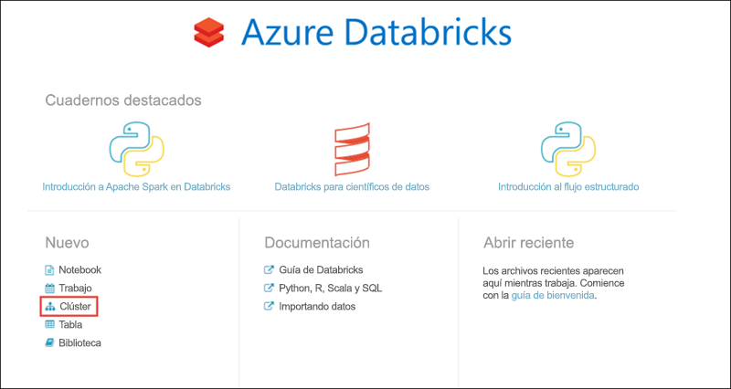
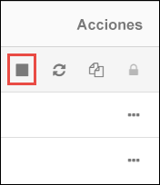

# <a name="tutorial-stream-data-into-azure-databricks-using-event-hubs"></a>Tutorial: Streaming de datos a Azure Databricks con Event Hubs

En este tutorial, se conecta un sistema de ingesta de datos con Azure Databricks para transmitir datos a un clúster de Apache Spark casi en tiempo real. El sistema de ingesta de datos se configura con Azure Event Hubs y, después, se conecta a Azure Databricks para procesar los mensajes entrantes. Para acceder a un flujo de datos, utilice las API de Twitter para la ingesta de tweets en Event Hubs. Una vez que tiene los datos en Azure Databricks, puede ejecutar trabajos analíticos para analizar con mayor profundidad los datos.

Al final de este tutorial, habría transmitido tweets de Twitter (que contengan el término "Azure") y leído los tweets de Azure Databricks.

La siguiente ilustración muestra el flujo de la aplicación:


En este tutorial se describen las tareas siguientes:

> [!div class="checklist"]
> * Creación de un área de trabajo de Azure Databricks
> * Creación de un clúster de Spark en Azure Databricks
> * Creación de una aplicación de Twitter para acceder a datos de streaming
> * Creación de cuadernos en Azure Databricks
> * Asociación de bibliotecas a Event Hubs y la API de Twitter
> * Envío de tweets a Event Hubs
> * Lectura de tweets desde Event Hubs

Si no tiene una suscripción a Azure, cree una [cuenta gratuita](https://azure.microsoft.com/free/) antes de empezar.

> [!Note]
> Este tutorial no puede llevarse a cabo mediante una **suscripción de evaluación gratuita de Azure**.
> Si tiene una cuenta gratuita, vaya a su perfil y cambiar la suscripción a **pago por uso**. Para más información consulte el sitio de [cuentas gratuitas de Azure](https://azure.microsoft.com/free/). Después, [quite el límite de gasto](https://docs.microsoft.com/azure/billing/billing-spending-limit#why-you-might-want-to-remove-the-spending-limit) y [solicite un aumento de la cuota](https://docs.microsoft.com/azure/azure-portal/supportability/resource-manager-core-quotas-request) para las vCPU de su región. Cuando crea su área de trabajo de Azure Databricks, puede seleccionar el plan de tarifa de la **Trial (Premium - 14-Days Free DBUs)** para que el área de trabajo acceda a las DBU Premium de Azure Databricks gratis durante 14 días.

## <a name="prerequisites"></a>Prerequisites

Antes de comenzar este tutorial, asegúrese de que se cumplen los requisitos siguientes:
- Un espacio de nombres de Azure Event Hubs.
- Un centro de eventos en el espacio de nombres.
- Una cadena de conexión para acceder al espacio de nombres de Event Hubs. La cadena de conexión debe tener un formato similar a `Endpoint=sb://<namespace>.servicebus.windows.net/;SharedAccessKeyName=<key name>;SharedAccessKey=<key value>`.
- Un nombre de directiva de acceso compartido y la clave de directiva para Event Hubs.

Puede cumplir estos requisitos siguiendo los pasos descritos en el artículo [Creación de un espacio de nombres y un centro de eventos de Azure Event Hubs](../event-hubs/event-hubs-create.md).

## <a name="sign-in-to-the-azure-portal"></a>Inicio de sesión en Azure Portal

Inicie sesión en [Azure Portal](https://portal.azure.com/).

## <a name="create-an-azure-databricks-workspace"></a>Creación de un área de trabajo de Azure Databricks

En esta sección, creará un área de trabajo de Azure Databricks mediante Azure Portal.

1. En Azure Portal, seleccione **Crear un recurso** > **Datos y análisis** > **Azure Databricks**.

    

3. En **Azure Databricks Service**, proporcione los valores para crear un área de trabajo de Databricks.

    

    Proporcione los valores siguientes:

    |Propiedad  |Descripción  |
    |---------|---------|
    |**Workspace name** (Nombre del área de trabajo)     | Proporcione un nombre para el área de trabajo de Databricks        |
    |**Suscripción**     | En el cuadro desplegable, seleccione la suscripción de Azure.        |
    |**Grupos de recursos**     | Especifique si desea crear un nuevo grupo de recursos o utilizar uno existente. Un grupo de recursos es un contenedor que almacena los recursos relacionados con una solución de Azure. Para más información, consulte [Información general del grupo de recursos de Azure](../azure-resource-manager/management/overview.md). |
    |**Ubicación**     | Seleccione **Este de EE. UU. 2**. Para otras regiones disponibles, consulte [Productos disponibles por región](https://azure.microsoft.com/regions/services/).        |
    |**Plan de tarifa**     |  Elija entre **Standard** o **Premium**. Para más información sobre estos planes, consulte la [página de precios de Databricks](https://azure.microsoft.com/pricing/details/databricks/).       |

    Seleccione **Anclar al panel** y, después, seleccione **Crear**.

4. La cuenta tarda unos minutos en crearse. Durante la creación de la cuenta, el portal muestra el icono **Enviando implementación para Azure Databricks** a la derecha. Puede que deba desplazarse a la derecha del panel para ver el icono. También hay una barra de progreso que se muestra en la parte superior de la pantalla. Puede ver cualquier área para el progreso.

    

## <a name="create-a-spark-cluster-in-databricks"></a>Creación de un clúster de Spark en Databricks

1. En Azure Portal, vaya al área de trabajo de Databricks que ha creado y, después, seleccione **Launch Workspace** (Iniciar área de trabajo).

2. Se le redirigirá al portal de Azure Databricks. En el portal, seleccione **Cluster**.

    

3. En la página **Nuevo clúster**, proporcione los valores para crear un clúster.

    

    Acepte los demás valores predeterminados, salvo los siguientes:

   * Escriba un nombre para el clúster.
   * Para este artículo, cree un clúster con el entorno de ejecución **6.0**.
   * Asegúrese de que selecciona la casilla **Terminate after \_\_ minutes of inactivity** (Terminar después de \_\_ minutos de inactividad). Proporcione una duración (en minutos) para terminar el clúster, si este no se usa.

   Seleccione el tamaño adecuado del nodo de trabajo y del nodo de controlador del clúster de acuerdo con sus criterios técnicos y su [presupuesto](https://azure.microsoft.com/pricing/details/databricks/).

     Seleccione **Create cluster** (Crear clúster). Una vez que el clúster se está ejecutando, puede asociarle notebooks y ejecutar trabajos de Spark.

## <a name="create-a-twitter-application"></a>Crear una aplicación de Twitter

Para recibir un flujo de tweets, cree una aplicación en Twitter. Siga las instrucciones para crear una aplicación de Twitter y anote los valores que necesita para finalizar este tutorial.

1. En un explorador web, vaya a [Twitter For Developers](https://developer.twitter.com/en/apps) y seleccione **Create an app** (Crear una aplicación). Es posible que vea un mensaje en el que se le indique que es necesario solicitar una cuenta de desarrollador de Twitter. Hágalo; una vez que la aplicación se haya aprobado, verá un correo electrónico de confirmación. Tenga en cuenta que una cuenta de desarrollador puede tardar varios días en aprobarse.

    

2. En la página **Create an application** (Crear una aplicación), proporcione los detalles de la nueva aplicación y, a continuación, seleccione **Create your Twitter application** (Crear su aplicación de Twitter).

    

    

3. En la página de la aplicación, seleccione la pestaña **Keys and Tokens** (Claves y tokens de acceso) y copie los valores de **Consumer API Key** (Clave de API de consumidor) y **Consumer API Secret Key** (Clave secreta de API de consumidor). Además, seleccione **Create** (Crear) en **Access Token and Access Token Secret** (Token de acceso y secreto de token de acceso) para generar los tokens de acceso. Copie los valores de **Access Token** (Token de acceso) y **Access Token Secret** (Secreto del token de acceso).

    

Guarde los valores que ha recuperado de la aplicación de Twitter. Necesitará estos valores más adelante en el tutorial.

## <a name="attach-libraries-to-spark-cluster"></a>Asociación de bibliotecas a un clúster de Spark

En este tutorial, se utilizan las API de Twitter para enviar tweets a Event Hubs. Se utiliza también el [conector de Event Hubs para Apache Spark](https://github.com/Azure/azure-event-hubs-spark) para leer y escribir datos en Azure Event Hubs. Para usar estas API como parte del clúster, puede agregarlas como bibliotecas a Azure Databricks y, luego, asociarlas al clúster de Spark. En las instrucciones siguientes se muestra cómo agregar una biblioteca.

1. En el área de trabajo de Azure Databricks, seleccione **Clusters** (Clústeres) y elija el clúster de Spark existente. En el menú del clúster, elija **Libraries** (Bibliotecas) y haga clic en **Install New** (Instalar nueva).

   

   

2. En la página de nueva biblioteca, en **Source** (Origen) seleccione **Maven**. Especifique individualmente las siguientes coordenadas para el conector de Spark Event Hubs y la API de Twitter en **Coordenadas**.

   * Conector de Event Hubs para Spark: `com.microsoft.azure:azure-eventhubs-spark_2.11:2.3.12`
   * API de Twitter: `org.twitter4j:twitter4j-core:4.0.7`

3. Seleccione **Instalar**.

4. En el menú del clúster, asegúrese de que las dos bibliotecas estén instaladas y conectadas correctamente.

    

6. Repita estos pasos para el paquete de Twitter, `twitter4j-core:4.0.7`.

## <a name="create-notebooks-in-databricks"></a>Creación de cuadernos en Databricks

En esta sección, se crearán dos cuadernos en el área de trabajo de Databricks con los nombres siguientes:

- **SendTweetsToEventHub**: un cuaderno de productor que se usa para obtener tweets de Twitter y transmitirlos a Event Hubs.
- **ReadTweetsFromEventHub**: un cuaderno de consumidor que se utiliza para leer los tweets de Event Hubs.

1. En el panel izquierdo, seleccione **Workspace** (Área de trabajo). En la lista desplegable **Workspace** (Área de trabajo), seleccione **Create** > **Notebook** (Crear > Cuaderno).

    

2. En el cuadro de diálogo **Create Notebook** (Crear cuaderno), escriba **SendTweetsToEventHub**, seleccione **Scala** como lenguaje y seleccione el clúster de Spark que creó anteriormente.

    

    Seleccione **Crear**.

3. Repita los pasos para crear el cuaderno **ReadTweetsFromEventHub**.

## <a name="send-tweets-to-event-hubs"></a>Envío de tweets a Event Hubs

En el cuaderno **SendTweetsToEventHub**, pegue el código siguiente y reemplace los marcadores de posición por los valores del espacio de nombres de Event Hubs y la aplicación de Twitter que creó anteriormente. Este cuaderno transmite los tweets con la palabra clave "Azure" a Event Hubs en tiempo real.

> [!NOTE]
> La API de Twitter tiene ciertas [cuotas](https://developer.twitter.com/en/docs/basics/rate-limiting.html) y restricciones de solicitud. Si no está satisfecho con la limitación de velocidad estándar de la API de Twitter, puede generar contenido de texto sin usar la API de Twitter en este ejemplo. Para ello, establezca la variable **dataSource** en `test` y no en `twitter` y rellene la lista **testSource** con la entrada de prueba preferida.

```scala
    import scala.collection.JavaConverters._
    import com.microsoft.azure.eventhubs._
    import java.util.concurrent._
    import scala.collection.immutable._
    import scala.concurrent.Future
    import scala.concurrent.ExecutionContext.Implicits.global

    val namespaceName = "<EVENT HUBS NAMESPACE>"
    val eventHubName = "<EVENT HUB NAME>"
    val sasKeyName = "<POLICY NAME>"
    val sasKey = "<POLICY KEY>"
    val connStr = new ConnectionStringBuilder()
                .setNamespaceName(namespaceName)
                .setEventHubName(eventHubName)
                .setSasKeyName(sasKeyName)
                .setSasKey(sasKey)

    val pool = Executors.newScheduledThreadPool(1)
    val eventHubClient = EventHubClient.create(connStr.toString(), pool)

    def sleep(time: Long): Unit = Thread.sleep(time)

    def sendEvent(message: String, delay: Long) = {
      sleep(delay)
      val messageData = EventData.create(message.getBytes("UTF-8"))
      eventHubClient.get().send(messageData)
      System.out.println("Sent event: " + message + "\n")
    }

    // Add your own values to the list
    val testSource = List("Azure is the greatest!", "Azure isn't working :(", "Azure is okay.")

    // Specify 'test' if you prefer to not use Twitter API and loop through a list of values you define in `testSource`
    // Otherwise specify 'twitter'
    val dataSource = "test"

    if (dataSource == "twitter") {

      import twitter4j._
      import twitter4j.TwitterFactory
      import twitter4j.Twitter
      import twitter4j.conf.ConfigurationBuilder

      // Twitter configuration!
      // Replace values below with you

      val twitterConsumerKey = "<CONSUMER API KEY>"
      val twitterConsumerSecret = "<CONSUMER API SECRET>"
      val twitterOauthAccessToken = "<ACCESS TOKEN>"
      val twitterOauthTokenSecret = "<TOKEN SECRET>"

      val cb = new ConfigurationBuilder()
        cb.setDebugEnabled(true)
        .setOAuthConsumerKey(twitterConsumerKey)
        .setOAuthConsumerSecret(twitterConsumerSecret)
        .setOAuthAccessToken(twitterOauthAccessToken)
        .setOAuthAccessTokenSecret(twitterOauthTokenSecret)

      val twitterFactory = new TwitterFactory(cb.build())
      val twitter = twitterFactory.getInstance()

      // Getting tweets with keyword "Azure" and sending them to the Event Hub in realtime!
      val query = new Query(" #Azure ")
      query.setCount(100)
      query.lang("en")
      var finished = false
      while (!finished) {
        val result = twitter.search(query)
        val statuses = result.getTweets()
        var lowestStatusId = Long.MaxValue
        for (status <- statuses.asScala) {
          if(!status.isRetweet()){
            sendEvent(status.getText(), 5000)
          }
          lowestStatusId = Math.min(status.getId(), lowestStatusId)
        }
        query.setMaxId(lowestStatusId - 1)
      }

    } else if (dataSource == "test") {
      // Loop through the list of test input data
      while (true) {
        testSource.foreach {
          sendEvent(_,5000)
        }
      }

    } else {
      System.out.println("Unsupported Data Source. Set 'dataSource' to \"twitter\" or \"test\"")
    }

    // Closing connection to the Event Hub
    eventHubClient.get().close()
```

Presione **MAYÚS + ENTRAR** para ejecutar el cuaderno. Verá una salida similar al siguiente fragmento. Cada evento de la salida es un tweet que contiene el término "Azure" y que se ingiere en Event Hubs.

    Sent event: @Microsoft and @Esri launch Geospatial AI on Azure https://t.co/VmLUCiPm6q via @geoworldmedia #geoai #azure #gis #ArtificialIntelligence

    Sent event: Public preview of Java on App Service, built-in support for Tomcat and OpenJDK
    https://t.co/7vs7cKtvah
    #cloudcomputing #Azure

    Sent event: 4 Killer #Azure Features for #Data #Performance https://t.co/kpIb7hFO2j by @RedPixie

    Sent event: Migrate your databases to a fully managed service with Azure SQL Database Managed Instance | #Azure | #Cloud https://t.co/sJHXN4trDk

    Sent event: Top 10 Tricks to #Save Money with #Azure Virtual Machines https://t.co/F2wshBXdoz #Cloud

    ...
    ...

## <a name="read-tweets-from-event-hubs"></a>Lectura de tweets desde Event Hubs

En el cuaderno **ReadTweetsFromEventHub**, pegue el código siguiente y reemplace los marcadores de posición por los valores de la instancia de Azure Event Hubs que creó anteriormente. Este cuaderno lee los tweets que transmitió anteriormente a Event Hubs usando el cuaderno **SendTweetsToEventHub**.

```scala

    import org.apache.spark.eventhubs._
    import com.microsoft.azure.eventhubs._

    // Build connection string with the above information
    val namespaceName = "<EVENT HUBS NAMESPACE>"
    val eventHubName = "<EVENT HUB NAME>"
    val sasKeyName = "<POLICY NAME>"
    val sasKey = "<POLICY KEY>"
    val connStr = new com.microsoft.azure.eventhubs.ConnectionStringBuilder()
                .setNamespaceName(namespaceName)
                .setEventHubName(eventHubName)
                .setSasKeyName(sasKeyName)
                .setSasKey(sasKey)

    val customEventhubParameters =
      EventHubsConf(connStr.toString())
      .setMaxEventsPerTrigger(5)

    val incomingStream = spark.readStream.format("eventhubs").options(customEventhubParameters.toMap).load()

    incomingStream.printSchema

    // Sending the incoming stream into the console.
    // Data comes in batches!
    incomingStream.writeStream.outputMode("append").format("console").option("truncate", false).start().awaitTermination()
```

Obtendrá la siguiente salida:


    root
     |-- body: binary (nullable = true)
     |-- offset: long (nullable = true)
     |-- seqNumber: long (nullable = true)
     |-- enqueuedTime: long (nullable = true)
     |-- publisher: string (nullable = true)
     |-- partitionKey: string (nullable = true)

    -------------------------------------------
    Batch: 0
    -------------------------------------------
    +------+------+--------------+---------------+---------+------------+
    |body  |offset|sequenceNumber|enqueuedTime   |publisher|partitionKey|
    +------+------+--------------+---------------+---------+------------+
    |[50 75 62 6C 69 63 20 70 72 65 76 69 65 77 20 6F 66 20 4A 61 76 61 20 6F 6E 20 41 70 70 20 53 65 72 76 69 63 65 2C 20 62 75 69 6C 74 2D 69 6E 20 73 75 70 70 6F 72 74 20 66 6F 72 20 54 6F 6D 63 61 74 20 61 6E 64 20 4F 70 65 6E 4A 44 4B 0A 68 74 74 70 73 3A 2F 2F 74 2E 63 6F 2F 37 76 73 37 63 4B 74 76 61 68 20 0A 23 63 6C 6F 75 64 63 6F 6D 70 75 74 69 6E 67 20 23 41 7A 75 72 65]                              |0     |0             |2018-03-09 05:49:08.86 |null     |null        |
    |[4D 69 67 72 61 74 65 20 79 6F 75 72 20 64 61 74 61 62 61 73 65 73 20 74 6F 20 61 20 66 75 6C 6C 79 20 6D 61 6E 61 67 65 64 20 73 65 72 76 69 63 65 20 77 69 74 68 20 41 7A 75 72 65 20 53 51 4C 20 44 61 74 61 62 61 73 65 20 4D 61 6E 61 67 65 64 20 49 6E 73 74 61 6E 63 65 20 7C 20 23 41 7A 75 72 65 20 7C 20 23 43 6C 6F 75 64 20 68 74 74 70 73 3A 2F 2F 74 2E 63 6F 2F 73 4A 48 58 4E 34 74 72 44 6B]            |168   |1             |2018-03-09 05:49:24.752|null     |null        |
    +------+------+--------------+---------------+---------+------------+

    -------------------------------------------
    Batch: 1
    -------------------------------------------
    ...
    ...

Dado que la salida está en modo binario, utilice el siguiente fragmento de código para convertirla en una cadena.

```scala
    import org.apache.spark.sql.types._
    import org.apache.spark.sql.functions._

    // Event Hub message format is JSON and contains "body" field
    // Body is binary, so we cast it to string to see the actual content of the message
    val messages =
      incomingStream
      .withColumn("Offset", $"offset".cast(LongType))
      .withColumn("Time (readable)", $"enqueuedTime".cast(TimestampType))
      .withColumn("Timestamp", $"enqueuedTime".cast(LongType))
      .withColumn("Body", $"body".cast(StringType))
      .select("Offset", "Time (readable)", "Timestamp", "Body")

    messages.printSchema

    messages.writeStream.outputMode("append").format("console").option("truncate", false).start().awaitTermination()
```

Ahora, la salida será similar al siguiente fragmento de código:

    root
     |-- Offset: long (nullable = true)
     |-- Time (readable): timestamp (nullable = true)
     |-- Timestamp: long (nullable = true)
     |-- Body: string (nullable = true)

    -------------------------------------------
    Batch: 0
    -------------------------------------------
    +------+-----------------+----------+-------+
    |Offset|Time (readable)  |Timestamp |Body
    +------+-----------------+----------+-------+
    |0     |2018-03-09 05:49:08.86 |1520574548|Public preview of Java on App Service, built-in support for Tomcat and OpenJDK
    https://t.co/7vs7cKtvah
    #cloudcomputing #Azure          |
    |168   |2018-03-09 05:49:24.752|1520574564|Migrate your databases to a fully managed service with Azure SQL Database Managed Instance | #Azure | #Cloud https://t.co/sJHXN4trDk    |
    |0     |2018-03-09 05:49:02.936|1520574542|@Microsoft and @Esri launch Geospatial AI on Azure https://t.co/VmLUCiPm6q via @geoworldmedia #geoai #azure #gis #ArtificialIntelligence|
    |176   |2018-03-09 05:49:20.801|1520574560|4 Killer #Azure Features for #Data #Performance https://t.co/kpIb7hFO2j by @RedPixie                                                    |
    +------+-----------------+----------+-------+
    -------------------------------------------
    Batch: 1
    -------------------------------------------
    ...
    ...

Eso es todo. Con Azure Databricks, ha transmitido correctamente datos a Azure Event Hubs casi en tiempo real. A continuación, ha consumido los datos de la transmisión mediante el conector de Event Hubs para Apache Spark. Para más información sobre cómo usar el conector de Event Hubs para Spark, consulte la [documentación del conector](https://github.com/Azure/azure-event-hubs-spark/tree/master/docs).

## <a name="clean-up-resources"></a>Limpieza de recursos

Cuando haya terminado de ejecutar el tutorial, puede finalizar el clúster. Para ello, desde el área de trabajo de Azure Databricks, en el panel izquierdo, seleccione **Clusters** (Clústeres). En el clúster que desea finalizar, mueva el cursor sobre el botón de puntos suspensivos en la columna **Actions** (Acciones) y seleccione el icono **Terminate** (Finalizar).



Si no finaliza manualmente el clúster, este se detendrá automáticamente si seleccionó la casilla **Terminate after \_\_ minutes of inactivity** (Finalizar después de \_\_ minutos de inactividad) al crear el clúster. En tal caso, el clúster se detendrá automáticamente si ha estado inactivo durante el tiempo especificado.

## <a name="next-steps"></a>Pasos siguientes
En este tutorial, ha aprendido a:

> [!div class="checklist"]
> * Creación de un área de trabajo de Azure Databricks
> * Creación de un clúster de Spark en Azure Databricks
> * Creación de una aplicación de Twitter para generar datos de streaming
> * Creación de cuadernos en Azure Databricks
> * Conexión de bibliotecas para Event Hubs y la API de Twitter
> * Envío de tweets a Event Hubs
> * Lectura de tweets desde Event Hubs

Avance al siguiente tutorial para aprender a realizar análisis de opiniones de los datos transmitidos con Azure Databricks y [Cognitive Services API](../cognitive-services/text-analytics/overview.md).

> [!div class="nextstepaction"]
>[Análisis de sentimiento sobre los datos de streaming con Azure Databricks](databricks-sentiment-analysis-cognitive-services.md)
