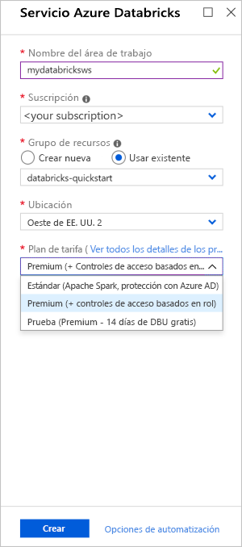
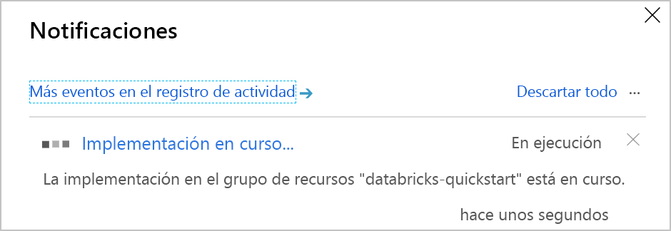
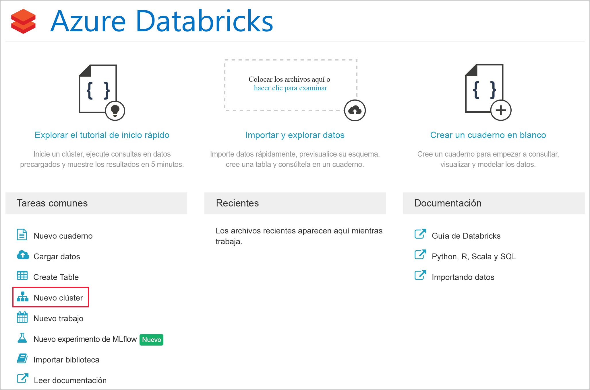
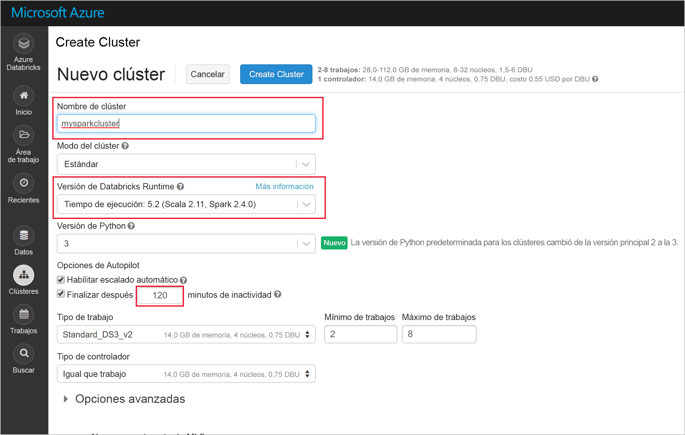
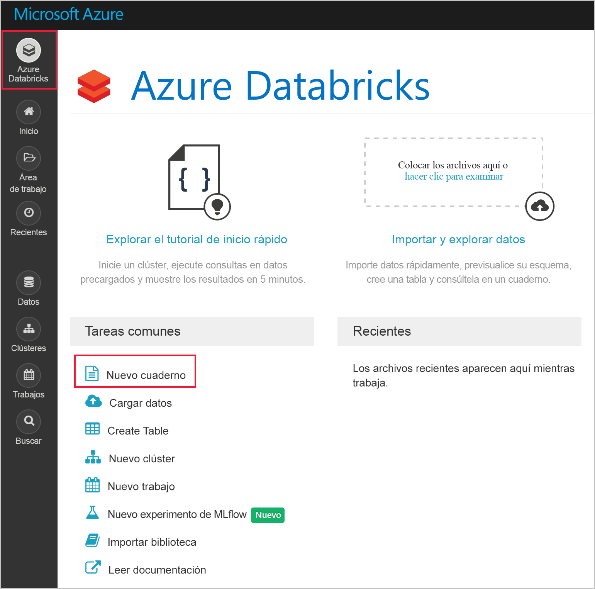
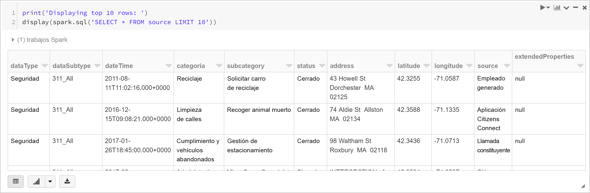
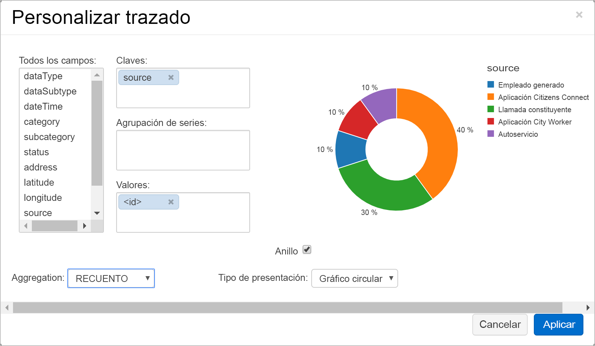

# <a name="quickstart-run-a-spark-job-on-azure-databricks-using-the-azure-portal"></a>Inicio rápido: Ejecución de un trabajo de Spark en Azure Databricks con Azure Portal

En este inicio rápido usará Azure Portal para crear un área de trabajo de Azure Databricks con un clúster de Apache Spark. Ejecutará un trabajo en el clúster y usará gráficos personalizados para generar informes en tiempo real a partir de datos de seguridad de Boston.

## <a name="prerequisites"></a>Prerrequisitos

- Una suscripción a Azure: [cree una cuenta gratuita](https://azure.microsoft.com/free/)

## <a name="sign-in-to-the-azure-portal"></a>Inicio de sesión en Azure Portal

Inicie sesión en [Azure Portal](https://portal.azure.com).

> [!Note]
> Este tutorial no puede llevarse a cabo mediante una **suscripción de evaluación gratuita de Azure**.
> Si tiene una cuenta gratuita, vaya a su perfil y cambiar la suscripción a **pago por uso**. Para más información consulte el sitio de [cuentas gratuitas de Azure](https://azure.microsoft.com/free/). Después, [quite el límite de gasto](https://docs.microsoft.com/azure/billing/billing-spending-limit#why-you-might-want-to-remove-the-spending-limit) y [solicite un aumento de la cuota](https://docs.microsoft.com/azure/azure-portal/supportability/resource-manager-core-quotas-request) para las vCPU de su región. Cuando crea su área de trabajo de Azure Databricks, puede seleccionar el plan de tarifa de la **Trial (Premium - 14-Days Free DBUs)** para que el área de trabajo acceda a las DBU Premium de Azure Databricks gratis durante 14 días.

## <a name="create-an-azure-databricks-workspace"></a>Creación de un área de trabajo de Azure Databricks

En esta sección, creará un área de trabajo de Azure Databricks mediante Azure Portal.

1. En Azure Portal, seleccione **Crear un recurso** > **Análisis** > **Azure Databricks**.

    

2. En **Azure Databricks Service**, proporcione los valores para crear un área de trabajo de Databricks.

    

    Proporcione los valores siguientes:
    
    |Propiedad  |Descripción  |
    |---------|---------|
    |**Workspace name** (Nombre del área de trabajo)     | Proporcione un nombre para el área de trabajo de Databricks        |
    |**Suscripción**     | En el cuadro desplegable, seleccione la suscripción de Azure.        |
    |**Grupos de recursos**     | Especifique si desea crear un nuevo grupo de recursos o utilizar uno existente. Un grupo de recursos es un contenedor que almacena los recursos relacionados con una solución de Azure. Para más información, consulte [Información general del grupo de recursos de Azure](../azure-resource-manager/management/overview.md). |
    |**Ubicación**     | Seleccione **Oeste de EE. UU. 2**. Para otras regiones disponibles, consulte [Productos disponibles por región](https://azure.microsoft.com/regions/services/).        |
    |**Plan de tarifa**     |  Elija entre **Estándar**, **Premium** o **Evaluación gratuita**. Para más información sobre estos planes, consulte la [página de precios de Databricks](https://azure.microsoft.com/pricing/details/databricks/).       |

3. Seleccione **Revisar y crear** y, a continuación, **Crear**. Se tarda unos minutos en crear el área de trabajo. Durante la creación del área de trabajo, puede ver el estado de implementación en **Notificaciones**. Una vez finalizado este proceso, la cuenta de usuario se agrega automáticamente como usuario administrador al área de trabajo.

    

## <a name="create-a-spark-cluster-in-databricks"></a>Creación de un clúster de Spark en Databricks

> [!NOTE]
> Para usar una cuenta gratuita para crear el clúster de Azure Databricks, antes de crear el clúster, vaya a su perfil y cambie su suscripción a **pago por uso**. Para más información consulte el sitio de [cuentas gratuitas de Azure](https://azure.microsoft.com/free/).

1. En Azure Portal, vaya al área de trabajo de Databricks que ha creado y, después, haga clic en **Launch Workspace** (Iniciar área de trabajo).

2. Se le redirigirá al portal de Azure Databricks. En el portal, haga clic en **Nuevo clúster**.

    

3. En la página **Nuevo clúster**, proporcione los valores para crear un clúster.

    

    Acepte los demás valores predeterminados, salvo los siguientes:

   * Escriba un nombre para el clúster.
   * Para este artículo, cree un clúster con el entorno de ejecución **5.3**.
   * Asegúrese de que selecciona la casilla **Terminate after \_\_ minutes of inactivity** (Terminar después de \_\_ minutos de inactividad). Proporcione una duración (en minutos) para terminar el clúster, si este no se usa.
    
     Seleccione **Create cluster** (Crear clúster). Una vez que el clúster se está ejecutando, puede asociarle notebooks y ejecutar trabajos de Spark.

Para obtener más información sobre la creación de clústeres, consulte [Create a Spark cluster in Azure Databricks](/azure/databricks/clusters/create) (Creación de un clúster de Spark en Azure Databricks).

## <a name="run-a-spark-sql-job"></a>Ejecución de un trabajo de Spark SQL

Realice las tareas siguientes para crear un cuaderno en Databricks, configúrelo para leer los datos desde una instancia de Azure Open Datasets y, luego, ejecute un trabajo de Spark SQL sobre los datos.

1. En el panel izquierdo, seleccione **Azure Databricks**. En **Common Tasks** (Tareas comunes), seleccione **New Notebook** (Nuevo cuaderno).

    

2. En el cuadro de diálogo **Create Notebook** (Crear cuaderno), seleccione **Python** como lenguaje y seleccione el clúster de Spark que creó anteriormente.

    

    Seleccione **Crear**.

3. En este paso, creará un DataFrame de Spark con los datos de seguridad de Boston de [Azure Open Datasets](https://azure.microsoft.com/services/open-datasets/catalog/boston-safety-data/#AzureDatabricks) y usará SQL para consultar los datos.

   El siguiente comando establece la información de acceso de almacenamiento de Azure. Pegue este código de PySpark en la primera celda y use **Mayús + Intro** para ejecutarlo.

   ```python
   blob_account_name = "azureopendatastorage"
   blob_container_name = "citydatacontainer"
   blob_relative_path = "Safety/Release/city=Boston"
   blob_sas_token = r"?st=2019-02-26T02%3A34%3A32Z&se=2119-02-27T02%3A34%3A00Z&sp=rl&sv=2018-03-28&sr=c&sig=XlJVWA7fMXCSxCKqJm8psMOh0W4h7cSYO28coRqF2fs%3D"
   ```

   El comando siguiente permite que Spark lea desde Blob Storage de forma remota. Pegue este código de PySpark en la siguiente celda y use **Mayús + Intro** para ejecutarlo.

   ```python
   wasbs_path = 'wasbs://%s@%s.blob.core.windows.net/%s' % (blob_container_name, blob_account_name, blob_relative_path)
   spark.conf.set('fs.azure.sas.%s.%s.blob.core.windows.net' % (blob_container_name, blob_account_name), blob_sas_token)
   print('Remote blob path: ' + wasbs_path)
   ```

   El siguiente comando crea un DataFrame. Pegue este código de PySpark en la siguiente celda y use **Mayús + Intro** para ejecutarlo.

   ```python
   df = spark.read.parquet(wasbs_path)
   print('Register the DataFrame as a SQL temporary view: source')
   df.createOrReplaceTempView('source')
   ```

4. Ejecute una instrucción SQL para devolver las 10 primeras filas de datos de la vista temporal llamada **source**. Pegue este código de PySpark en la siguiente celda y use **Mayús + Intro** para ejecutarlo.

   ```python
   print('Displaying top 10 rows: ')
   display(spark.sql('SELECT * FROM source LIMIT 10'))
   ```

5. Verá un resultado tabular como se muestra en la siguiente captura de pantalla (solo se ven algunas columnas):

    

6. Ahora, creará una representación visual de estos datos para mostrar cuántos eventos de seguridad se generan mediante Citizens Connect App y City Worker App en lugar de otros orígenes. En la parte inferior de la salida tabular, haga clic en el icono **Bar chart** (Gráfico de barras) y, luego, en **Plot Options** (Opciones de trazado).

    

8. En **Personalizar trazado**, arrastre y coloque los valores como se muestra en la captura de pantalla.

    

   * Establezca **Keys** (Claves) en **source**.
   * Establezca **Values** (Valores) en **<\id>** .
   * Establezca **Agregación** en **COUNT** (recuento).
   * Establezca **Display type** (Tipo de visualización) en **Pie chart** (Gráfico de barras).

     Haga clic en **Aplicar**.

## <a name="clean-up-resources"></a>Limpieza de recursos

Cuando haya terminado el artículo, puede finalizar el clúster. Para ello, desde el área de trabajo de Azure Databricks, en el panel izquierdo, seleccione **Clusters** (Clústeres). En el clúster que desea finalizar, mueva el cursor sobre el botón de puntos suspensivos en la columna **Actions** (Acciones) y seleccione el icono **Terminate** (Finalizar).


Si no finaliza manualmente el clúster, este se detendrá automáticamente si seleccionó la casilla **Terminate after \_\_ minutes of inactivity** (Finalizar después de \_\_ minutos de inactividad) al crear el clúster. En tal caso, el clúster se detiene automáticamente si ha estado inactivo durante el tiempo especificado.

## <a name="next-steps"></a>Pasos siguientes

En este artículo, creó un clúster de Spark en Azure Databricks y ejecutó un trabajo de Spark mediante datos de Azure Open Datasets. También puede mirar [Spark data sources](/azure/databricks/data/data-sources/index) (Orígenes de datos de Spark) para aprender a importar datos desde otros orígenes de datos en Azure Databricks. Vaya al siguiente artículo para aprender cómo realizar una operación ETL (extraer, transformar y cargar datos) mediante Azure Databricks.

> [!div class="nextstepaction"]
>[Extracción, transformación y carga de datos mediante Azure Databricks](databricks-extract-load-sql-data-warehouse.md)
