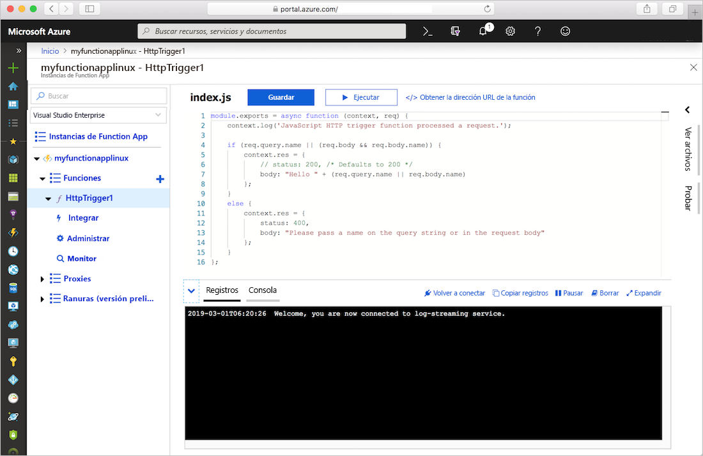
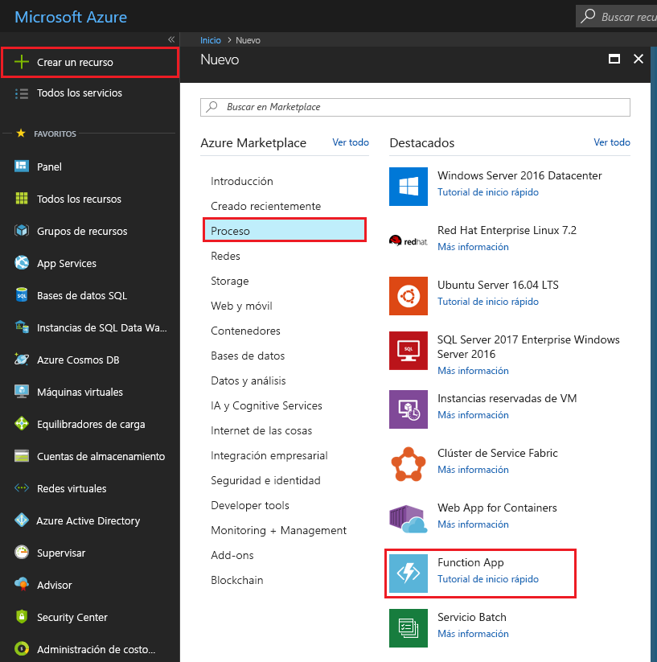
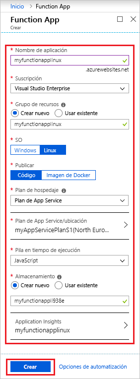
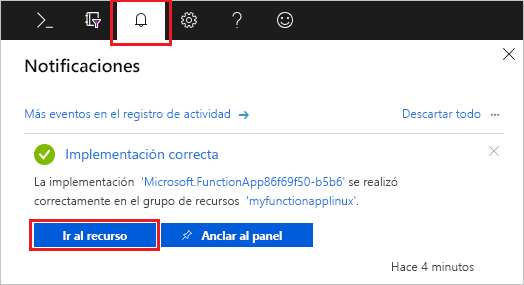
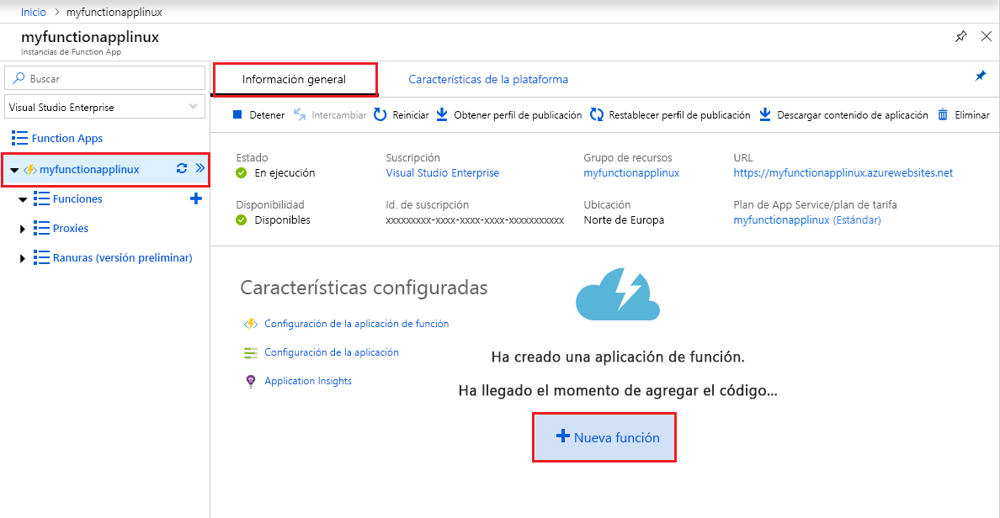
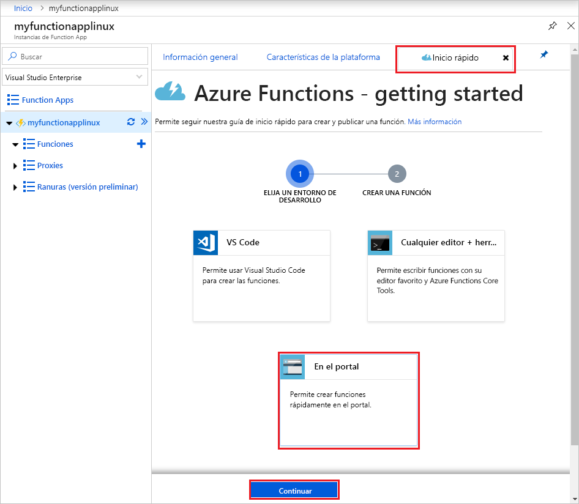
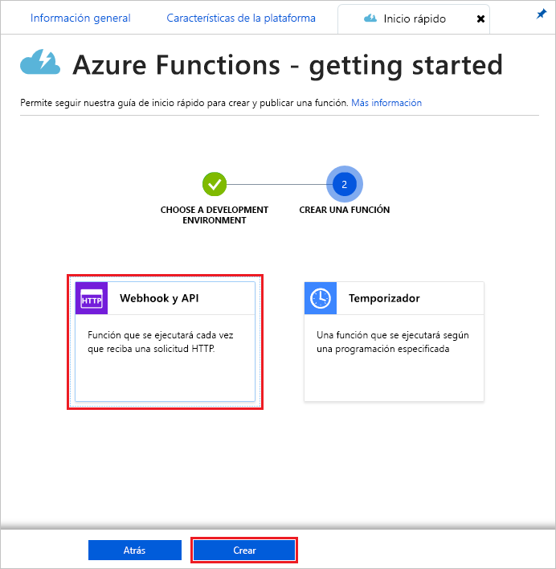
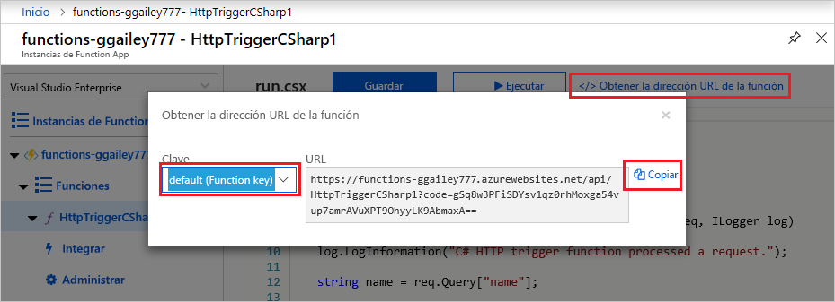
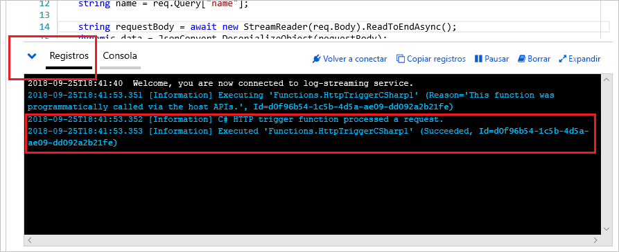

# Creación de una aplicación de función en Linux en un plan de Azure App Service

Azure Functions permite hospedar sus funciones en Linux en un contenedor de Azure App Service predeterminado. En este artículo se describe el uso de [Azure Portal](https://portal.azure.com) para crear una aplicación de función hospedada en Linux que se ejecute en un plan de [App Service](functions-scale.md#app-service-plan). También puede [traer su propio contenedor personalizado](functions-create-function-linux-custom-image.md).

[!INCLUDE [quickstarts-free-trial-note](../../includes/quickstarts-free-trial-note.md)]

## Inicio de sesión en Azure

Inicie sesión en Azure Portal en <https://portal.azure.com> con su cuenta de Azure.

## Creación de una aplicación de función

Debe tener una aplicación de función para hospedar la ejecución de las funciones en Linux. La aplicación de función proporciona un entorno para la ejecución del código de su aplicación. Le permite agrupar funciones como una unidad lógica para facilitar la administración, la implementación, el escalado y el uso compartido de recursos. En este artículo, creará un plan de App Service al crear la aplicación de función.

1. Seleccione el botón **Crear un recurso** de la esquina superior izquierda de Azure Portal y, después, **Proceso** > **Function App**.

    

2. Use la configuración de Function App especificada en la tabla debajo de la imagen.

    

    | Configuración      | Valor sugerido  | Descripción                                        |
    | ------------ |  ------- | -------------------------------------------------- |
    | **Nombre de la aplicación** | Nombre único globalmente | Nombre que identifica la nueva Function App. Los caracteres válidos son `a-z`, `0-9` y `-`.  | 
    | **Suscripción** | Su suscripción | Suscripción en la que se creará esta nueva aplicación de función. | 
    | **[Grupo de recursos](../azure-resource-manager/management/overview.md)** |  myResourceGroup | Nombre para el nuevo grupo de recursos en el que se va a crear la Function App. |
    | **SISTEMA OPERATIVO** | Linux | La aplicación de función se ejecuta en Linux. |
    | **Publicar** | Código | Se usa el contenedor de Linux predeterminado para su **pila en tiempo de ejecución**. Todo lo que tiene que proporcionar es el código de proyecto de aplicación de función. Otra opción consiste en publicar una [imagen de Docker](functions-create-function-linux-custom-image.md) personalizada. |
    | **[Plan de hospedaje](functions-scale.md)** | Plan de App Service | Plan de hospedaje que define cómo se asignan los recursos a la Function App. Si usa un plan de App Service, puede controlar el [escalado de la aplicación de función](functions-scale.md).  |
    | **Plan de App Service/ubicación** | Creación del plan | Elija **Crear nuevo** y proporcionar un nombre para **Plan de App Service**. Elija una **ubicación** en una [región](https://azure.microsoft.com/regions/) próxima a usted o a otros servicios a los que accedan las funciones. Elija su **[plan de tarifa](https://azure.microsoft.com/pricing/details/app-service/linux/)** deseado.  No puede ejecutar aplicaciones de función de Windows y Linux en el mismo plan de App Service. |
    | **Pila en tiempo de ejecución** | Lenguaje preferido | Elija un tiempo de ejecución que admita su lenguaje de programación de funciones preferido. Elija **.NET** para funciones de C# y F#. |
    | **[Storage](../storage/common/storage-account-create.md)** |  Nombre único globalmente |  Cree una cuenta de almacenamiento que use la aplicación de función. Los nombres de las cuentas de almacenamiento deben tener entre 3 y 24 caracteres y solo pueden incluir números y letras en minúscula. También puede usar una cuenta existente que debe cumplir los [requisitos de la cuenta de almacenamiento](storage-considerations.md#storage-account-requirements). |
    | **[Application Insights](functions-monitoring.md)** | habilitado | Application Insights está deshabilitado de forma predeterminada. Se recomienda habilitar la integración de Application Insights ahora y elegir una ubicación de hospedaje cerca de la ubicación del plan de App Service. Si quiere hacer esto más tarde, consulte [Supervisión de Azure Functions](functions-monitoring.md).  |

3. Seleccione **Crear** para aprovisionar e implementar la aplicación de función.

4. Seleccione el icono de notificación de la esquina superior derecha del portal y observe el mensaje **Implementación correcta**.

    

5. Seleccione **Ir al recurso** para ver la nueva aplicación de función.

Después, cree una función en la nueva Function App. Incluso después de que la aplicación de función está disponible, puede tardar unos minutos en inicializarse totalmente.

## Crear una función desencadenada por HTTP

En esta sección se muestra cómo crear una función en la nueva aplicación de función en el portal.

> [!NOTE]
> La experiencia del portal de desarrollo puede ser útil para probar Azure Functions. En la mayoría de los escenarios, considere la posibilidad de desarrollar sus funciones localmente y publicar el proyecto en la aplicación de función mediante [Visual Studio Code](functions-create-first-function-vs-code.md#create-an-azure-functions-project) o [Azure Functions Core Tools](functions-run-local.md#create-a-local-functions-project).  

1. En la nueva aplicación de función, elija la pestaña **Overview** (Información general) y, una vez cargada completamente, elija **+ New function** (+ Nueva función).

    

1. En la pestaña **Quickstart** (Inicio rápido), elija **In-portal** (En el portal) y seleccione **Continue** (Continuar).

    

1. Elija **WebHook y API** y, a continuación, seleccione **Crear**.

    

Se crea una función mediante una plantilla específica del idioma para una función desencadenada por HTTP.

Ahora, puede ejecutar la nueva función mediante el envío de una solicitud HTTP.

## Prueba de la función

1. En la nueva función, haga clic en **</> Obtener la dirección URL de la función** en la parte superior derecha, seleccione **default (Function key)** y, después, haga clic en **Copiar**. 

    

2. Pegue la dirección URL de la función en la barra de direcciones de su explorador. Anexe el valor `&name=<yourname>` de la cadena de consulta al final de esta dirección URL y presione la tecla `Enter` en el teclado para ejecutar la solicitud. Debería ver la respuesta devuelta por la función mostrada en el explorador.  

    El ejemplo siguiente muestra la respuesta en el explorador:

    

    La dirección URL de la solicitud incluye una clave que, de forma predeterminada, es necesaria para tener acceso a la función a través de HTTP.

3. Cuando se ejecuta la función, se escribe información de seguimiento en los registros. Para ver el resultado del seguimiento de la ejecución anterior, vuelva a la función en el portal y haga clic en la flecha que encontrará en la parte inferior de la pantalla para expandir **Registros**.

   

## Limpieza de recursos

[!INCLUDE [Clean-up resources](../../includes/functions-quickstart-cleanup.md)]

## Pasos siguientes

Ha creado una Function App con una función simple desencadenada por HTTP.  

[!INCLUDE [Next steps note](../../includes/functions-quickstart-next-steps.md)]

Para más información, consulte [Enlaces HTTP de Azure Functions](functions-bindings-http-webhook.md).
