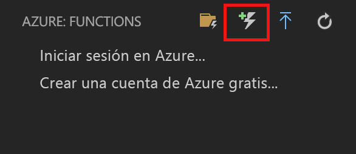
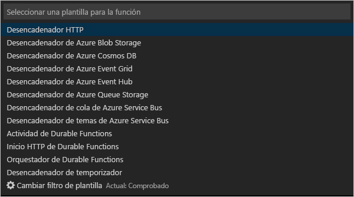
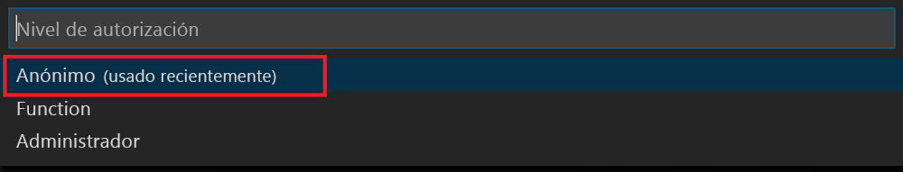
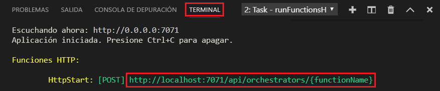

# <a name="create-your-first-durable-function-in-javascript"></a>Creación de su primera función durable en JavaScript

*Durable Functions* es una extensión de [Azure Functions](../functions-overview.md) que le permite escribir funciones con estado en un entorno sin servidor. La extensión administra el estado, establece puntos de control y reinicia en su nombre.

[!INCLUDE [v1-note](../../../includes/functions-durable-v1-tutorial-note.md)]

En este artículo, aprenderá a usar la extensión de Azure Functions para Visual Studio Code con el fin de crear y probar localmente una función durable "Hola mundo".  Esta función organizará y encadenará llamadas a otras funciones. Luego, publicará el código de función en Azure.


## <a name="prerequisites"></a>Prerrequisitos

Para completar este tutorial:

* Instale [Visual Studio Code](https://code.visualstudio.com/download).

* Asegúrese de tener la versión más reciente de [Azure Functions Core Tools](../functions-run-local.md).

* En un equipo Windows, compruebe que tiene el [Emulador de Azure Storage](../../storage/common/storage-use-emulator.md) instalado y ejecutándose. En un equipo Mac o Linux, debe usar una cuenta de Azure Storage real.

* Asegúrese de que tiene instalada la versión 8.0 o una versión posterior de [Node.js](https://nodejs.org/).

[!INCLUDE [quickstarts-free-trial-note](../../../includes/quickstarts-free-trial-note.md)]

[!INCLUDE [functions-install-vs-code-extension](../../../includes/functions-install-vs-code-extension.md)]

## <a name="create-an-azure-functions-project"></a>Creación del proyecto local 

En esta sección se usa Visual Studio Code para crear un proyecto local en Azure Functions. 

1. En Visual Studio Code, presione F1 para abrir la paleta de comandos. En la paleta de comandos, busque y seleccione `Azure Functions: Create new project...`.

1. Elija una ubicación de directorio para el área de trabajo del proyecto y elija **Seleccionar**.

    > [!NOTE]
    > Estos pasos se han diseñado para completarse fuera de un área de trabajo. Por tanto, no seleccione una carpeta de proyecto que forme parte de un área de trabajo.

1. Siguiendo las indicaciones, especifique la siguiente información del lenguaje que desee:

    | Prompt | Value | Descripción |
    | ------ | ----- | ----------- |
    | Seleccionar el lenguaje para el proyecto de la aplicación de funciones | JavaScript | Cree un proyecto local de Functions en Node.js. |
    | Selección de una versión | Azure Functions v2 | Esta opción solo se ve si las herramientas principales no estén instaladas. En este caso, las herramientas principales se instalan la primera vez que se ejecuta la aplicación. |
    | Seleccionar una plantilla para la primera función de su proyecto | Desencadenador HTTP | Cree una función desencadenada por HTTP en la nueva aplicación de funciones. |
    | Proporcionar un nombre de función | HttpTrigger | Presione ENTRAR para usar el nombre predeterminado. |
    | Nivel de autorización | Función | El nivel de autorización `function` requiere que especifique una clave de acceso al llamar al punto de conexión HTTP de la función. Esto dificulta aún más el acceso a un punto de conexión no protegido. Para más información, consulte [Claves de autorización](../functions-bindings-http-webhook-trigger.md#authorization-keys).  |
    | Seleccionar cómo desea que se abra el proyecto | Agregar a área de trabajo | Crea la aplicación de funciones en el área de trabajo actual. |

Visual Studio Code instala Azure Functions Core Tools, en caso de que sea necesario. También crea el proyecto de una aplicación de funciones en una nueva área de trabajo. Este proyecto contiene los archivos de configuración [host.json](../functions-host-json.md) y [local.settings.json](../functions-run-local.md#local-settings-file). También crea una carpeta HttpExample que contiene el archivo de definición [function.json](../functions-reference-node.md#folder-structure) y el [archivo index.js](../functions-reference-node.md#exporting-a-function), un archivo en Node.js que contiene el código de función.

También se crea un archivo package.json en la carpeta raíz.

## <a name="install-the-durable-functions-npm-package"></a>Instalación del paquete npm de Durable Functions

1. Instale el paquete npm `durable-functions` mediante la ejecución de `npm install durable-functions` en el directorio raíz de la aplicación de función.

## <a name="creating-your-functions"></a>Creación de las funciones

Ahora crearemos las tres funciones necesarias para empezar a usar Durable Functions: un inicio de HTTP, un orquestador y una función de actividad. El inicio de HTTP iniciará toda la solución y el orquestador enviará el trabajo a varias funciones de actividad.

### <a name="http-starter"></a>Inicio de HTTP

En primer lugar, cree una función desencadenada por HTTP que inicie una orquestación de función durable.

1. En *Azure: Functions*, elija el icono **Crear función**.

    

2. Seleccione la carpeta con el proyecto de la aplicación de funciones y seleccione la plantilla de función **Inicio de HTTP de Durable Functions**.

    

3. Deje el nombre predeterminado como `DurableFunctionsHttpStart`, presione ** **ENTRAT** y, luego, seleccione la autenticación **Anónima**.

    

Ahora hemos creado un punto de entrada en nuestra función durable. Vamos a agregar un orquestador.

### <a name="orchestrator"></a>Orquestador

Ahora crearemos un orquestador para coordinar las funciones de actividad.

1. En *Azure: Functions*, elija el icono **Crear función**.

    

2. Seleccione la carpeta con el proyecto de la aplicación de funciones y seleccione la plantilla de función **Orquestador de Durable Functions**. Deje el nombre como el valor predeterminado "DurableFunctionsOrchestrator".

    

Hemos agregado un orquestador para coordinar las funciones de actividad. Ahora agregaremos la función de actividad a la que se hace referencia.

### <a name="activity"></a>Actividad

Ahora crearemos una función de actividad para llevar a cabo realmente el trabajo de la solución.

1. En *Azure: Functions*, elija el icono **Crear función**.

    

2. Seleccione la carpeta con el proyecto de la aplicación de funciones y seleccione la plantilla de función **Actividad de Durable Functions**. Deje el nombre como el valor predeterminado "Hello".

    

Ya hemos agregado todos los componentes necesarios para iniciar una orquestación y encadenar funciones de actividad.

## <a name="test-the-function-locally"></a>Prueba local de la función

Azure Functions Core Tools le permite ejecutar un proyecto de Azure Functions en el equipo de desarrollo local. Se le solicita que instale estas herramientas la primera vez que inicie una función de Visual Studio Code.

1. En un equipo Windows, inicie el Emulador de Azure Storage y asegúrese de que la propiedad **AzureWebJobsStorage** de *local.settings.json* está establecida en `UseDevelopmentStorage=true`.

    En el caso de Storage Emulator 5.8, asegúrese de que la propiedad **AzureWebJobsSecretStorageType** de local.settings.json está establecida en `files`. En un equipo Mac o Linux, debe establecer la propiedad **AzureWebJobsStorage** en la cadena de conexión de una cuenta de Azure Storage existente. Más adelante en este artículo creará una cuenta de almacenamiento.

2. Para probar la función, establezca un punto de interrupción en el código de la función y presione F5 para iniciar el proyecto de la aplicación de función. La salida de Core Tools aparece en el panel **Terminal**. Si se trata de la primera vez que usa Durable Functions, se instalará la extensión Durable Functions y es posible que la compilación tarde unos segundos.

    > [!NOTE]
    > JavaScript Durable Functions requiere la versión **1.7.0** o posterior de la extensión **Microsoft.Azure.WebJobs.Extensions.DurableTask**. Ejecute el siguiente comando desde la carpeta raíz de la aplicación de Azure Functions para instalar la extensión de Durable Functions `func extensions install -p Microsoft.Azure.WebJobs.Extensions.DurableTask -v 1.7.0`

3. En el panel **Terminal**, copie el punto de conexión de la dirección URL de la función desencadenada por HTTP.

    

4. Reemplace `{functionName}` por `DurableFunctionsOrchestrator`.

5. Mediante una herramienta como [Postman](https://www.getpostman.com/) o [cURL](https://curl.haxx.se/), envíe una solicitud HTTP POST al punto de conexión de la dirección URL.

   La respuesta es el resultado inicial de la función HTTP que informa de que la orquestación durable se ha iniciado correctamente. No es aún el resultado final de la orquestación. La respuesta incluye algunas direcciones URL útiles. De momento, vamos a consultar el estado de la orquestación.

6. Copie el valor de la URL para `statusQueryGetUri` y péguelo en la barra de direcciones del explorador y ejecute la solicitud. Como alternativa también puede usar Postman para emitir la solicitud GET.

   La solicitud consultará la instancia de orquestación sobre el estado. Debe obtener una respuesta eventual que muestre que la instancia se ha completado, e incluye las salidas o resultados de la función durable. Su aspecto es similar a: 

    ```json
    {
        "instanceId": "d495cb0ac10d4e13b22729c37e335190",
        "runtimeStatus": "Completed",
        "input": null,
        "customStatus": null,
        "output": [
            "Hello Tokyo!",
            "Hello Seattle!",
            "Hello London!"
        ],
        "createdTime": "2018-11-08T07:07:40Z",
        "lastUpdatedTime": "2018-11-08T07:07:52Z"
    }
    ```

7. Para detener la depuración, presione **Mayús + F5** en VS Code.

Después de comprobar que la función se ejecuta correctamente en el equipo local es el momento de publicar el proyecto en Azure.

[!INCLUDE [functions-create-function-app-vs-code](../../../includes/functions-sign-in-vs-code.md)]

[!INCLUDE [functions-publish-project-vscode](../../../includes/functions-publish-project-vscode.md)]

## <a name="test-your-function-in-azure"></a>Prueba de una función en Azure

1. Copie la dirección URL del desencadenador HTTP del panel **Salida**. La dirección URL que llama a la función desencadenada por HTTP debería tener el formato siguiente:

        http://<functionappname>.azurewebsites.net/orchestrators/<functionname>

2. Pegue la dirección URL de la solicitud HTTP en la barra de direcciones del explorador. Debe obtener la misma respuesta de estado que antes cuando se usó la aplicación publicada.

## <a name="next-steps"></a>Pasos siguientes

Ha usado Visual Studio Code para crear y publicar una aplicación de función durable con JavaScript.

> [!div class="nextstepaction"]
> [Más información sobre los patrones comunes de funciones durables](durable-functions-overview.md#application-patterns)