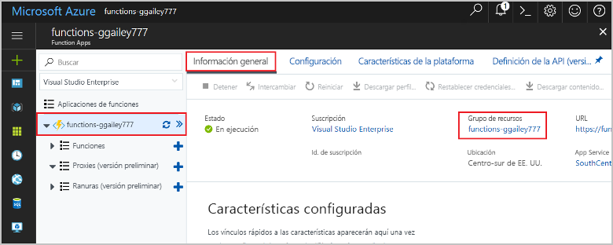

# <a name="connect-functions-to-azure-storage-using-visual-studio-code"></a>Conexión de las funciones a Azure Storage mediante Visual Studio Code

Azure Functions permite conectar funciones a servicios de Azure y otros recursos sin tener que escribir su propio código de integración. Estos *enlaces*, que representan la entrada y la salida, se declaran dentro de la definición de función. Los datos de los enlaces se proporcionan a la función como parámetros. Un desencadenador es un tipo especial de enlace de entrada. Si bien una función tiene un único desencadenador, puede tener varios enlaces de entrada y salida. Para más información, consulte [Conceptos básicos sobre los enlaces y desencadenadores de Azure Functions](functions-triggers-bindings.md).

En este artículo se muestra cómo conectar la función que creó en el [artículo de inicio rápido anterior](functions-create-first-function-vs-code.md) a Azure Storage mediante Visual Studio Code. El enlace de salida que se agrega a esta función escribe datos de la solicitud HTTP en un mensaje de la cola de Azure Queue Storage. 

La mayoría de los enlaces requieren una cadena de conexión almacenada que se usa en Functions para acceder al servicio enlazado. Para que sea más fácil, usará la cuenta de almacenamiento que creó con la aplicación de función. La conexión a esta cuenta ya está almacenada en una configuración de aplicación llamada `AzureWebJobsStorage`.  

## <a name="prerequisites"></a>Requisitos previos

Para empezar este artículo debe cumplir antes los requisitos siguientes:

* Instale la [extensión de Azure Storage para Visual Studio Code](https://marketplace.visualstudio.com/items?itemName=ms-azuretools.vscode-azurestorage).
* Instale el [Explorador de Azure Storage](https://storageexplorer.com/). El Explorador de Storage una herramienta que se va a utilizar para examinar los mensajes en cola que genera el enlace de salida. El Explorador de Storage se admite en sistemas operativos basados en Linux, Windows y macOS.
* Instale las [herramientas de la CLI de .NET Core](https://docs.microsoft.com/dotnet/core/tools/?tabs=netcore2x) (solo para proyectos de C#).
* Complete los pasos de la [parte 1 del inicio rápido de Visual Studio Code](functions-create-first-function-vs-code.md). 

En este artículo se da por supuesto que ya inició sesión en la suscripción de Azure desde Visual Studio Code. Puede iniciar sesión mediante la ejecución de `Azure: Sign In` desde la paleta de comandos. 

## <a name="download-the-function-app-settings"></a>Descarga de la configuración de la aplicación de función

En el [artículo de inicio rápido anterior](functions-create-first-function-vs-code.md) creó una aplicación de funciones en Azure junto con una cuenta de Storage. La cadena de conexión de esta cuenta se almacena de forma segura en la configuración de la aplicación en Azure. En este artículo, escribirá mensajes en una cola de almacenamiento de la misma cuenta. Para conectarse a su cuenta de almacenamiento cuando se ejecuta la función localmente, debe descargar la configuración de la aplicación en el archivo local.settings.json. 

1. Presione la tecla F1 para abrir la paleta de comandos, y busque y ejecute el comando `Azure Functions: Download Remote Settings....`. 

1. Elija la aplicación de funciones que creó en el artículo anterior. Seleccione **Sí a todo** para sobrescribir la configuración local existente. 

    > [!IMPORTANT]  
    > Como contiene secretos, el archivo local.settings.json nunca se publica, se excluye del control de código fuente.

1. Copie el valor `AzureWebJobsStorage`, que es la clave del valor de la cadena de conexión de la cuenta de Storage. Esta conexión se usa para comprobar que el enlace de salida funciona según lo previsto.

## <a name="register-binding-extensions"></a>Registro de extensiones de enlace

Dado que está utilizando un enlace de salida de Queue Storage, debe tener la extensión de enlaces de Storage instalada antes de ejecutar el proyecto. 

### <a name="javascript"></a>JavaScript

[!INCLUDE [functions-extension-bundles](../../includes/functions-extension-bundles.md)]

### <a name="c-class-library"></a>Biblioteca de clases de C\#

A excepción de los desencadenadores HTTP y el temporizador, los enlaces se implementan como paquetes de extensión. Ejecute el siguiente comando [dotnet add package](/dotnet/core/tools/dotnet-add-package) en la ventana Terminal para agregar el paquete de extensión de Storage al proyecto.

```bash
dotnet add package Microsoft.Azure.WebJobs.Extensions.Storage --version 3.0.4
```

Ahora podrá agregar el enlace de salida de almacenamiento al proyecto.

## <a name="add-an-output-binding"></a>Adición de un enlace de salida

En Functions, para cada tipo de enlace es necesario definir los elementos `direction`, `type` y un valor único de `name` en el archivo function.json. La manera de definir estos atributos depende del lenguaje de la aplicación de funciones.

### <a name="javascript"></a>JavaScript

Los atributos de enlace se definen directamente en el archivo function.json. Según el tipo de enlace, pueden ser necesarias propiedades adicionales. En la [configuración de salida de cola](functions-bindings-storage-queue.md#output---configuration) se describen los campos necesarios para un enlace de cola de Azure Storage. La extensión facilita la incorporación de enlaces al archivo function.json. 

Para crear un enlace, haga clic con el botón derecho (Ctrl + clic en macOS) en el archivo `function.json` de la carpeta HttpTrigger y elija **Agregar enlace...** Siga las indicaciones para definir las siguientes propiedades de enlace para el nuevo enlace:

| Prompt | Valor | DESCRIPCIÓN |
| -------- | ----- | ----------- |
| **Select binding direction** (Seleccionar dirección de enlace) | `out` | El enlace es un enlace de salida. |
| **Select binding with direction...** (Seleccionar enlace con dirección...) | `Azure Queue Storage` | El enlace es un enlace de cola de Azure Storage. |
| **The name used to identify this binding in your code** (Nombre identificativo del enlace en el código) | `msg` | Nombre que identifica el parámetro de enlace al que se hace referencia en el código. |
| **The queue to which the message will be sent** (Cola donde se enviará el mensaje) | `outqueue` | El nombre de la cola en la que escribe el enlace. Cuando no existe *queueName*, el enlace lo crea durante el primer uso. |
| **Select setting from "local.setting.json"** (Seleccionar configuración de "local.setting.json") | `AzureWebJobsStorage` | El nombre de una configuración de la aplicación que contiene la cadena de conexión de la cuenta de Storage. El valor `AzureWebJobsStorage` contiene la cadena de conexión de la cuenta de almacenamiento que creó con la aplicación de función. |

Se agrega un enlace a la matriz `bindings` en el archivo function.json, que debería ser ahora similar al siguiente ejemplo:

```json
{
   ...

  "bindings": [
    {
      "authLevel": "function",
      "type": "httpTrigger",
      "direction": "in",
      "name": "req",
      "methods": [
        "get",
        "post"
      ]
    },
    {
      "type": "http",
      "direction": "out",
      "name": "$return"
    },
    {
      "type": "queue",
      "direction": "out",
      "name": "msg",
      "queueName": "outqueue",
      "connection": "AzureWebJobsStorage"
    }
  ]
}
```

### <a name="c-class-library"></a>Biblioteca de clases de C\#

En un proyecto de biblioteca de clases de C#, los enlaces se definen como atributos de enlace en el método de función. Entonces, el archivo function.json se genera automáticamente en función de estos atributos.

Abra el archivo de proyecto HttpTrigger.cs y agregue la siguiente instrucción `using`:

```cs
using Microsoft.Azure.WebJobs.Extensions.Storage;
```

Agregue el siguiente parámetro a la definición de método `Run`:

```cs
[Queue("outqueue"),StorageAccount("AzureWebJobsStorage")] ICollector<string> msg
```

El parámetro `msg` es de tipo `ICollector<T>`, que representa una colección de mensajes escritos en un enlace de salida cuando se completa la función. En este caso, la salida es una cola de almacenamiento denominada `outqueue`. La cadena de conexión de la cuenta de Storage la establece `StorageAccountAttribute`. Este atributo indica la configuración que contiene la cadena de conexión de la cuenta de Storage y se puede aplicar en el nivel de clase, método o parámetro. En este caso, puede omitir `StorageAccountAttribute`, puesto que ya está usando la cuenta de almacenamiento predeterminada.

La definición del método Run debe ahora parecerse a la siguiente:  

```cs
[FunctionName("HttpTrigger")]
public static async Task<IActionResult> Run(
    [HttpTrigger(AuthorizationLevel.Function, "get", "post", Route = null)] HttpRequest req, 
    [Queue("outqueue"),StorageAccount("AzureWebJobsStorage")] ICollector<string> msg, ILogger log)
```

## <a name="add-code-that-uses-the-output-binding"></a>Adición de código que utilice el enlace de salida

Una vez definido el enlace, podrá usar el valor de `name` de este para acceder a él como atributo en la firma de función. Con un enlace de salida, no tiene que usar el código del SDK de Azure Storage para autenticarse, obtener una referencia de cola o escribir datos. El sistema en tiempo de ejecución de Functions y el enlace de salida de cola realizan esas tareas automáticamente.

### <a name="javascript"></a>JavaScript

Agregue código que utilice el objeto de enlace de salida `msg` en `context.bindings` para crear un mensaje de la cola. Agregue este código antes de la instrucción `context.res`.

```javascript
// Add a message to the Storage queue.
context.bindings.msg = "Name passed to the function: " + 
(req.query.name || req.body.name);
```

En este momento, la función debe tener el aspecto siguiente:

```javascript
module.exports = async function (context, req) {
    context.log('JavaScript HTTP trigger function processed a request.');

    if (req.query.name || (req.body && req.body.name)) {
        // Add a message to the Storage queue.
        context.bindings.msg = "Name passed to the function: " + 
        (req.query.name || req.body.name);
        context.res = {
            // status: 200, /* Defaults to 200 */
            body: "Hello " + (req.query.name || req.body.name)
        };
    }
    else {
        context.res = {
            status: 400,
            body: "Please pass a name on the query string or in the request body"
        };
    }
};
```

### <a name="c"></a>C\#

Agregue código que utilice el objeto de enlace de salida `msg` para crear un mensaje de la cola. Agregue este código antes de la devolución del método.

```cs
if (!string.IsNullOrEmpty(name))
{
    // Add a message to the output collection.
    msg.Add(string.Format("Name passed to the function: {0}", name));
}
```

En este momento, la función debe tener el aspecto siguiente:

```cs
[FunctionName("HttpTrigger")]
public static async Task<IActionResult> Run(
    [HttpTrigger(AuthorizationLevel.Function, "get", "post", Route = null)] HttpRequest req, 
    [Queue("outqueue"),StorageAccount("AzureWebJobsStorage")] ICollector<string> msg, ILogger log)
{
    log.LogInformation("C# HTTP trigger function processed a request.");

    string name = req.Query["name"];

    string requestBody = await new StreamReader(req.Body).ReadToEndAsync();
    dynamic data = JsonConvert.DeserializeObject(requestBody);
    name = name ?? data?.name;

    if (!string.IsNullOrEmpty(name))
    {
        // Add a message to the output collection.
        msg.Add(string.Format("Name passed to the function: {0}", name));
    }
    return name != null
        ? (ActionResult)new OkObjectResult($"Hello, {name}")
        : new BadRequestObjectResult("Please pass a name on the query string or in the request body");
}
```

[!INCLUDE [functions-run-function-test-local-vs-code](../../includes/functions-run-function-test-local-vs-code.md)]

Se crea una nueva cola denominada **outqueue** en su cuenta de Storage mediante el entorno de ejecución de Functions cuando el enlace de salida se usa por primera vez. Usará el Explorador de Storage para comprobar que se han creado la cola y un mensaje.

### <a name="connect-storage-explorer-to-your-account"></a>Conexión del Explorador de Storage con la cuenta

Omita esta sección si ya ha instalado el Explorador de Azure Storage y lo ha conectado a su cuenta de Azure.

1. Ejecute la herramienta [Explorador de Azure Storage], y seleccione el icono de conexión de la izquierda y **Agregar una cuenta**.

    

1. En el cuadro de diálogo **Conectar**, elija **Add an Azure account** (Agregar una cuenta de Azure), elija el **Entorno Azure** y seleccione **Iniciar sesión...** 

    

Después de iniciar sesión correctamente en su cuenta, verá todas las suscripciones de Azure asociadas con ella.

### <a name="examine-the-output-queue"></a>Examen de la cola de salida

1. En Visual Studio Code, presione la tecla F1 para abrir la paleta de comandos, busque y ejecute el comando `Azure Storage: Open in Storage Explorer` y elija el nombre de la cuenta de Storage. En el menú de la cuenta de almacenamiento, seleccione Explorador de Azure Storage.  

1. Expanda el nodo **Colas** y, después, seleccione la cola con el nombre **outqueue**. 

   La cola contiene el mensaje que creó el enlace de salida de la cola al ejecutar la función desencadenada por HTTP. Si se invoca la función con el valor predeterminado `name` de *Azure*, el mensaje de cola es *Name passed to the function: Azure* (Nombre pasado a la función: Azure).

    

1. Vuelva a ejecutar la función, envíe otra solicitud y verá aparecer un nuevo mensaje en la cola.  

Ahora, es el momento de volver a publicar la aplicación de función actualizada en Azure.

## <a name="redeploy-and-test-the-updated-app"></a>Reimplementación y prueba de la aplicación actualizada

1. En Visual Studio Code, presione F1 para abrir la paleta de comandos. En la paleta de comandos, busque y seleccione `Azure Functions: Deploy to function app...`.

1. Elija la aplicación de funciones que creó en el primer artículo. Dado que se está volviendo a implementar el proyecto en la misma aplicación, seleccione **Implementar** para descartar la advertencia sobre la sobrescritura de archivos.

1. Una vez finalizada la implementación, puede usar nuevamente cURL o un explorador para probar la función que ha vuelto a implementar. Como antes, adjunte la cadena de consulta `&name=<yourname>` a la dirección URL, como en el ejemplo siguiente:

    ```bash
    curl https://myfunctionapp.azurewebsites.net/api/httptrigger?code=cCr8sAxfBiow548FBDLS1....&name=<yourname>
    ```

1. De nuevo, [consulte el mensaje de la cola de almacenamiento](#examine-the-output-queue) para comprobar que el enlace de salida genera otra vez un nuevo mensaje en la cola.

## <a name="clean-up-resources"></a>Limpieza de recursos

En Azure, los *recursos* son aplicaciones de función, funciones o cuentas de almacenamiento, entre otros. Se agrupan en *grupos de recursos*, y se puede eliminar todo el contenido de un grupo si se elimina el grupo.

Ha creado recursos para completar estas guías de inicio rápido. Se le pueden facturar por estos recursos, dependiendo del [estado de la cuentade los ](https://azure.microsoft.com/account/) y [precios de los servicios](https://azure.microsoft.com/pricing/). Si ya no necesita los recursos, aquí se indica cómo eliminarlos:

1. En Visual Studio Code, presione F1 para abrir la paleta de comandos. En la paleta de comandos, busque y seleccione `Azure Functions: Open in portal`.

1. Elija la aplicación de funciones y presione Entrar. La página de la aplicación de funciones se abre en [Azure Portal](https://portal.azure.com).

1. En la pestaña **Introducción**, seleccione el vínculo con nombre en **Grupo de recursos**.

    

1. En la página **Grupo de recursos**, revise la lista de recursos incluidos y compruebe que son los que desea eliminar.
 
1. Seleccione **Eliminar grupo de recursos** y siga las instrucciones.

   El proceso de eliminación tardará un par de minutos. Cuando termine, aparece una notificación durante unos segundos. También puede seleccionar el icono de campana en la parte superior de la página para ver la notificación.

## <a name="next-steps"></a>Pasos siguientes

Ha actualizado la función desencadenada por HTTP para escribir datos en una cola de almacenamiento. Para más información sobre el desarrollo de funciones, consulte [Develop Azure Functions using Visual Studio Code](functions-develop-vs-code.md) (Desarrollo con Azure Functions mediante Visual Studio Code).

A continuación, debe habilitar la supervisión de Application Insights para su aplicación de función:

> [!div class="nextstepaction"]
> [Habilitación de la integración de Application Insights](functions-monitoring.md#manually-connect-an-app-insights-resource)

[Explorador de Azure Storage]: https://storageexplorer.com/
