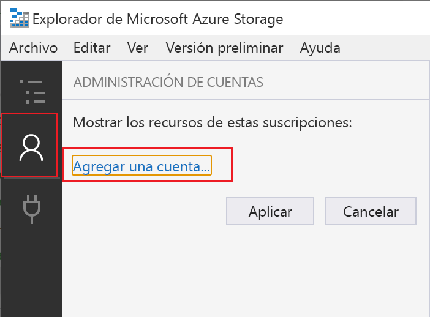
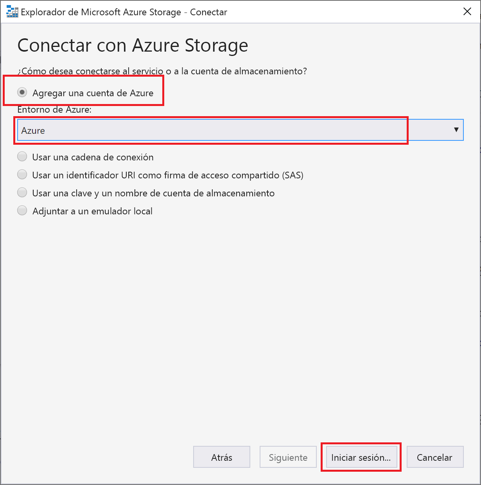
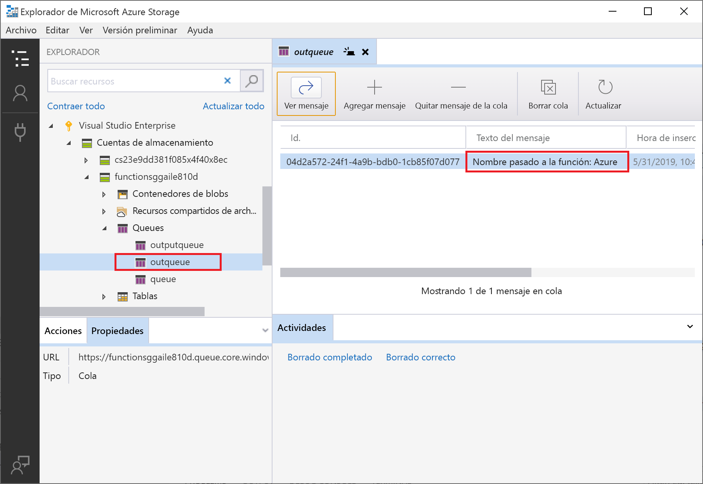

# <a name="connect-functions-to-azure-storage-using-visual-studio-code"></a>Conexión de las funciones a Azure Storage mediante Visual Studio Code

[!INCLUDE [functions-add-storage-binding-intro](../../includes/functions-add-storage-binding-intro.md)]

En este artículo se muestra cómo conectar la función que creó en el [artículo de inicio rápido anterior](functions-create-first-function-vs-code.md) a Azure Storage mediante Visual Studio Code. El enlace de salida que se agrega a esta función escribe datos de la solicitud HTTP en un mensaje de la cola de Azure Queue Storage. 

La mayoría de los enlaces requieren una cadena de conexión almacenada que se usa en Functions para acceder al servicio enlazado. Para que sea más fácil, usará la cuenta de almacenamiento que creó con la aplicación de función. La conexión a esta cuenta ya está almacenada en una configuración de aplicación llamada `AzureWebJobsStorage`.  

## <a name="prerequisites"></a>Prerequisites

Para empezar este artículo debe cumplir antes los requisitos siguientes:

* Instale la [extensión de Azure Storage para Visual Studio Code](https://marketplace.visualstudio.com/items?itemName=ms-azuretools.vscode-azurestorage).

* Instale el [Explorador de Azure Storage](https://storageexplorer.com/). El Explorador de Storage una herramienta que se va a utilizar para examinar los mensajes en cola que genera el enlace de salida. El Explorador de Storage se admite en sistemas operativos basados en Linux, Windows y macOS.

::: zone pivot="programming-language-csharp"
* Instale las [herramientas de la CLI de .NET Core](https://docs.microsoft.com/dotnet/core/tools/?tabs=netcore2x).
::: zone-end

* Complete los pasos de la [parte 1 del inicio rápido de Visual Studio Code](functions-create-first-function-vs-code.md). 

En este artículo se da por supuesto que ya inició sesión en la suscripción de Azure desde Visual Studio Code. Puede iniciar sesión mediante la ejecución de `Azure: Sign In` desde la paleta de comandos. 

## <a name="download-the-function-app-settings"></a>Descarga de la configuración de la aplicación de función

En el [artículo de inicio rápido anterior](functions-create-first-function-vs-code.md) creó una aplicación de funciones en Azure junto con una cuenta de Storage. La cadena de conexión de esta cuenta se almacena de forma segura en la configuración de la aplicación en Azure. En este artículo, escribirá mensajes en una cola de almacenamiento de la misma cuenta. Para conectarse a su cuenta de almacenamiento cuando se ejecuta la función localmente, debe descargar la configuración de la aplicación en el archivo local.settings.json. 

1. Presione la tecla F1 para abrir la paleta de comandos, y busque y ejecute el comando `Azure Functions: Download Remote Settings....`. 

1. Elija la aplicación de funciones que creó en el artículo anterior. Seleccione **Sí a todo** para sobrescribir la configuración local existente. 

    > [!IMPORTANT]  
    > Como contiene secretos, el archivo local.settings.json nunca se publica, se excluye del control de código fuente.

1. Copie el valor `AzureWebJobsStorage`, que es la clave del valor de la cadena de conexión de la cuenta de Storage. Esta conexión se usa para comprobar que el enlace de salida funciona según lo previsto.

## <a name="register-binding-extensions"></a>Registro de extensiones de enlace

Dado que está utilizando un enlace de salida de Queue Storage, debe tener la extensión de enlaces de Storage instalada antes de ejecutar el proyecto. 

::: zone pivot="programming-language-javascript,programming-language-typescript,programming-language-python,programming-language-powershell"

[!INCLUDE [functions-extension-bundles](../../includes/functions-extension-bundles.md)]

::: zone-end

::: zone pivot="programming-language-csharp"

A excepción de los desencadenadores HTTP y el temporizador, los enlaces se implementan como paquetes de extensión. Ejecute el siguiente comando [dotnet add package](/dotnet/core/tools/dotnet-add-package) en la ventana Terminal para agregar el paquete de extensión de Storage al proyecto.

```bash
dotnet add package Microsoft.Azure.WebJobs.Extensions.Storage --version 3.0.4
```

::: zone-end

Ahora podrá agregar el enlace de salida de almacenamiento al proyecto.

## <a name="add-an-output-binding"></a>Adición de un enlace de salida

En Functions, para cada tipo de enlace es necesario definir los elementos `direction`, `type` y un valor único de `name` en el archivo function.json. La manera de definir estos atributos depende del lenguaje de la aplicación de funciones.

::: zone pivot="programming-language-javascript,programming-language-typescript,programming-language-python,programming-language-powershell"

[!INCLUDE [functions-add-output-binding-json](../../includes/functions-add-output-binding-json.md)]

::: zone-end

::: zone pivot="programming-language-csharp"

[!INCLUDE [functions-add-storage-binding-csharp-library](../../includes/functions-add-storage-binding-csharp-library.md)]

::: zone-end

## <a name="add-code-that-uses-the-output-binding"></a>Adición de código que utilice el enlace de salida

Una vez definido el enlace, podrá usar el valor de `name` de este para acceder a él como atributo en la firma de función. Con un enlace de salida, no tiene que usar el código del SDK de Azure Storage para autenticarse, obtener una referencia de cola o escribir datos. El sistema en tiempo de ejecución de Functions y el enlace de salida de cola realizan esas tareas automáticamente.

::: zone pivot="programming-language-javascript"

[!INCLUDE [functions-add-output-binding-js](../../includes/functions-add-output-binding-js.md)]

::: zone-end

::: zone pivot="programming-language-typescript"

Agregue código que utilice el objeto de enlace de salida `msg` en `context.bindings` para crear un mensaje de la cola. Agregue este código antes de la instrucción `context.res`.

```typescript
// Add a message to the Storage queue.
context.bindings.msg = "Name passed to the function: " + name;
```

En este momento, la función debe tener el aspecto siguiente:

```javascript
import { AzureFunction, Context, HttpRequest } from "@azure/functions"

const httpTrigger: AzureFunction = async function (context: Context, req: HttpRequest): Promise<void> {
    context.log('HTTP trigger function processed a request.');
    const name = (req.query.name || (req.body && req.body.name));

    if (name) {
        // Add a message to the Storage queue.
        context.bindings.msg = "Name passed to the function: " + name; 
        // Send a "hello" response.
        context.res = {
            // status: 200, /* Defaults to 200 */
            body: "Hello " + (req.query.name || req.body.name)
        };
    }
    else {
        context.res = {
            status: 400,
            body: "Please pass a name on the query string or in the request body"
        };
    }
};

export default httpTrigger;
```

::: zone-end

::: zone pivot="programming-language-powershell"

Agregue código que use el cmdlet `Push-OutputBinding` para escribir texto en la cola mediante el enlace de salida `msg`. Agregue este código antes de establecer el estado correcto en la instrucción `if`.

```powershell
# Write the $name value to the queue.
$outputMsg = "Name passed to the function: $name"
Push-OutputBinding -name msg -Value $outputMsg
```

En este momento, la función debe tener el aspecto siguiente:

```powershell
using namespace System.Net

# Input bindings are passed in via param block.
param($Request, $TriggerMetadata)

# Write to the Azure Functions log stream.
Write-Host "PowerShell HTTP trigger function processed a request."

# Interact with query parameters or the body of the request.
$name = $Request.Query.Name
if (-not $name) {
    $name = $Request.Body.Name
}

if ($name) {
    # Write the $name value to the queue.
    $outputMsg = "Name passed to the function: $name"
    Push-OutputBinding -name msg -Value $outputMsg

    $status = [HttpStatusCode]::OK
    $body = "Hello $name"
}
else {
    $status = [HttpStatusCode]::BadRequest
    $body = "Please pass a name on the query string or in the request body."
}

# Associate values to output bindings by calling 'Push-OutputBinding'.
Push-OutputBinding -Name Response -Value ([HttpResponseContext]@{
    StatusCode = $status
    Body = $body
})
```

::: zone-end

::: zone pivot="programming-language-python"

[!INCLUDE [functions-add-output-binding-python](../../includes/functions-add-output-binding-python.md)]

::: zone-end

::: zone pivot="programming-language-csharp"

[!INCLUDE [functions-add-storage-binding-csharp-library-code](../../includes/functions-add-storage-binding-csharp-library-code.md)]

::: zone-end

::: zone pivot="programming-language-csharp,programming-language-javascript,programming-language-python"

[!INCLUDE [functions-run-function-test-local-vs-code](../../includes/functions-run-function-test-local-vs-code.md)]

::: zone-end

::: zone pivot="programming-language-powershell"

[!INCLUDE [functions-run-function-test-local-vs-code-ps](../../includes/functions-run-function-test-local-vs-code-ps.md)]

::: zone-end

Cuando el enlace de salida se usa por primera vez, el entorno de ejecución de Functions crea una nueva cola denominada **outqueue** en la cuenta de almacenamiento. Usará el Explorador de Storage para comprobar que se han creado la cola y un mensaje.

### <a name="connect-storage-explorer-to-your-account"></a>Conexión del Explorador de Storage con la cuenta

Omita esta sección si ya ha instalado el Explorador de Azure Storage y lo ha conectado a su cuenta de Azure.

1. Ejecute la herramienta [Explorador de Azure Storage], y seleccione el icono de conexión de la izquierda y **Agregar una cuenta**.

    

1. En el cuadro de diálogo **Conectar**, elija **Add an Azure account** (Agregar una cuenta de Azure), elija el **Entorno Azure** y seleccione **Iniciar sesión...** 

    

Después de iniciar sesión correctamente en su cuenta, verá todas las suscripciones de Azure asociadas con ella.

### <a name="examine-the-output-queue"></a>Examen de la cola de salida

1. En Visual Studio Code, presione la tecla F1 para abrir la paleta de comandos, busque y ejecute el comando `Azure Storage: Open in Storage Explorer` y elija el nombre de la cuenta de Storage. En el menú de la cuenta de almacenamiento, seleccione Explorador de Azure Storage.  

1. Expanda el nodo **Colas** y, después, seleccione la cola con el nombre **outqueue**. 

   La cola contiene el mensaje que creó el enlace de salida de la cola al ejecutar la función desencadenada por HTTP. Si se invoca la función con el valor predeterminado `name` de *Azure*, el mensaje de cola es *Name passed to the function: Azure* (Nombre pasado a la función: Azure).

    

1. Vuelva a ejecutar la función, envíe otra solicitud y verá aparecer un nuevo mensaje en la cola.  

Ahora, es el momento de volver a publicar la aplicación de función actualizada en Azure.

## <a name="redeploy-and-verify-the-updated-app"></a>Reimplementación y comprobación de la aplicación actualizada

1. En Visual Studio Code, presione F1 para abrir la paleta de comandos. En la paleta de comandos, busque y seleccione `Azure Functions: Deploy to function app...`.

1. Elija la aplicación de funciones que creó en el primer artículo. Dado que se está volviendo a implementar el proyecto en la misma aplicación, seleccione **Implementar** para descartar la advertencia sobre la sobrescritura de archivos.

1. Una vez finalizada la implementación, puede usar nuevamente cURL o un explorador para probar la función que ha vuelto a implementar. Como antes, adjunte la cadena de consulta `&name=<yourname>` a la dirección URL, como en el ejemplo siguiente:

    ```bash
    curl https://myfunctionapp.azurewebsites.net/api/httptrigger?code=cCr8sAxfBiow548FBDLS1....&name=<yourname>
    ```

1. De nuevo, [consulte el mensaje de la cola de almacenamiento](#examine-the-output-queue) para comprobar que el enlace de salida genera otra vez un nuevo mensaje en la cola.

## <a name="clean-up-resources"></a>Limpieza de recursos

En Azure, los *recursos* son aplicaciones de función, funciones o cuentas de almacenamiento, entre otros. Se agrupan en *grupos de recursos*, y se puede eliminar todo el contenido de un grupo si se elimina el grupo.

Ha creado recursos para completar estas guías de inicio rápido. Se le pueden facturar por estos recursos, dependiendo del [estado de la cuentade los ](https://azure.microsoft.com/account/) y [precios de los servicios](https://azure.microsoft.com/pricing/). Si ya no necesita los recursos, aquí se indica cómo eliminarlos:

[!INCLUDE [functions-cleanup-resources-vs-code.md](../../includes/functions-cleanup-resources-vs-code.md)]

## <a name="next-steps"></a>Pasos siguientes

Ha actualizado la función desencadenada por HTTP para escribir datos en una cola de almacenamiento. A continuación, puede obtener más información sobre el desarrollo de Functions mediante Visual Studio Code:

> [!div class="nextstepaction"]
> [Desarrollo de Azure Functions mediante Visual Studio Code](functions-develop-vs-code.md)

[Explorador de Azure Storage]: https://storageexplorer.com/
