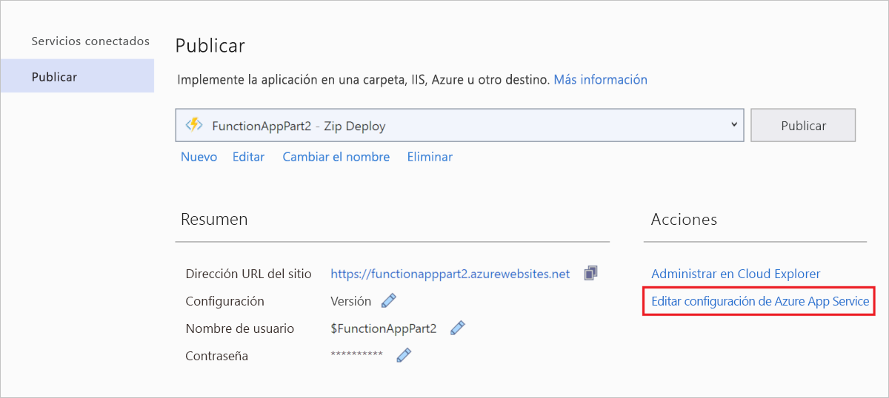

# <a name="connect-functions-to-azure-storage-using-visual-studio"></a>Conexión de las funciones a Azure Storage mediante Visual Studio

Azure Functions permite conectar funciones a servicios de Azure y otros recursos sin tener que escribir su propio código de integración. Estas conexiones predefinidas se denominan *enlaces*. Los enlaces permiten a una función usar los servicios de Azure y otros recursos como entrada y salida para una función.

Un único *desencadenador* inicia la ejecución de la función. Un desencadenador es un tipo especial de enlace de entrada. Si bien una función tiene un único desencadenador, puede tener varios enlaces de entrada y salida. Para más información, consulte [Conceptos básicos sobre los enlaces y desencadenadores de Azure Functions](functions-triggers-bindings.md).

En este artículo se muestra cómo conectar la función que creó en el [artículo de inicio rápido anterior] a Azure Storage mediante Visual Studio. El enlace de salida que se agrega a esta función escribe datos de la solicitud HTTP en un mensaje de la cola de Azure Queue Storage. 

La mayoría de los enlaces requieren una cadena de conexión almacenada que se usa en Functions para acceder al servicio enlazado. Para que sea más fácil, usará la cuenta de almacenamiento que creó con la aplicación de función. La conexión a esta cuenta ya está almacenada en una configuración de aplicación llamada `AzureWebJobsStorage`.  

## <a name="prerequisites"></a>Requisitos previos

Antes de empezar este artículo, debe realizar lo siguiente: 

 - Completar [la parte 1 del inicio rápido de Visual Studio][./functions-create-first-function-vs-code.md]. 

- Iniciar sesión en la suscripción de Azure desde Visual Studio.

## <a name="download-the-function-app-settings"></a>Descarga de la configuración de la aplicación de función

En el [artículo de inicio rápido anterior](functions-create-first-function-vs-code.md) creó una aplicación de funciones en Azure junto con una cuenta de Storage. La cadena de conexión de esta cuenta se almacena de forma segura en la configuración de la aplicación en Azure. En este artículo, escribirá mensajes en una cola de almacenamiento de la misma cuenta. Para conectarse a su cuenta de Azure Storage cuando se ejecuta la función localmente, debe descargar la configuración de la aplicación en el archivo *local.settings.json*. 

1. En el **Explorador de soluciones**, haga clic con el botón derecho en el proyecto y seleccione **Publicar**. 

1. En **Acciones**,seleccione **Editar configuración de Azure App Service**. 

    

1. En **AzureWebJobsStorage**, copie el valor de la cadena **Remote** en **Local** y seleccione **Aceptar**. 

El enlace de almacenamiento, que utiliza el valor `AzureWebJobsStorage` para la conexión, puede conectarse ahora a Queue Storage cuando se ejecuta localmente.

## <a name="register-binding-extensions"></a>Registro de extensiones de enlace

Dado que está utilizando un enlace de salida de Queue Storage, debe tener la extensión de enlaces de Storage instalada antes de ejecutar el proyecto. Excepto los desencadenadores HTTP y del temporizador, los enlaces se implementan como paquetes de extensión. 

1. En el menú **Herramientas**, seleccione **Administrador de paquetes NuGet** > **Consola del Administrador de paquetes**. 

1. En la consola de, ejecute el siguiente comando [Install-Package](/nuget/tools/ps-ref-install-package) para instalar las extensiones de Azure Storage:

    ```Command
    Install-Package Microsoft.Azure.WebJobs.Extensions.Storage -Version 3.0.6
    ````

Ahora podrá agregar el enlace de salida de almacenamiento al proyecto.

## <a name="add-an-output-binding"></a>Adición de un enlace de salida

[!INCLUDE [functions-add-storage-binding-csharp-library](../../includes/functions-add-storage-binding-csharp-library.md)]

## <a name="add-code-that-uses-the-output-binding"></a>Adición de código que utilice el enlace de salida

Una vez definido el enlace, podrá usar el valor de `name` de este para acceder a él como atributo en la firma de función. Con un enlace de salida, no tiene que usar el código del SDK de Azure Storage para autenticarse, obtener una referencia de cola o escribir datos. El sistema en tiempo de ejecución de Functions y el enlace de salida de cola realizan esas tareas automáticamente.

[!INCLUDE [functions-add-storage-binding-csharp-library-code](../../includes/functions-add-storage-binding-csharp-library-code.md)]

## <a name="run-the-function-locally"></a>Ejecución local de la función

[!INCLUDE [functions-run-function-test-local-vs](../../includes/functions-run-function-test-local-vs.md)]

Se crea una nueva cola denominada `outqueue` en su cuenta de Storage mediante el entorno de ejecución de Functions cuando el enlace de salida se usa por primera vez. Usará Cloud Explorer para comprobar que se han creado la cola y un mensaje.

## <a name="examine-the-output-queue"></a>Examen de la cola de salida

1. En el menú **Ver** de Visual Studio, seleccione **Cloud Explorer**.

1. En **Cloud Explorer**, expanda la suscripción de Azure y las **cuentas de Azure Storage** y, a continuación, expanda la cuenta de almacenamiento que usa la función. Si no recuerda el nombre de la cuenta de almacenamiento, consulte el valor de la cadena de conexión `AzureWebJobsStorage` en el archivo *local.settings.json*.  

1. Expanda el nodo **Colas** y, a continuación, haga doble clic en la cola denominada **outqueue** para ver el contenido de la cola en Visual Studio. 

   La cola contiene el mensaje que creó el enlace de salida de la cola al ejecutar la función desencadenada por HTTP. Si se invoca la función con el valor predeterminado `name` de *Azure*, el mensaje de cola es *Name passed to the function: Azure* (Nombre pasado a la función: Azure).

    

1. Vuelva a ejecutar la función, envíe otra solicitud y verá aparecer un nuevo mensaje en la cola.  

Ahora, es el momento de volver a publicar la aplicación de función actualizada en Azure.

## <a name="redeploy-and-verify-the-updated-app"></a>Reimplementación y comprobación de la aplicación actualizada

1. En el **Explorador de soluciones**, haga clic con el botón derecho en el proyecto y seleccione **Publicar** y, a continuación, elija **Publicar** para volver a publicar el proyecto en Azure.

1. Una vez finalizada la implementación, puede usar nuevamente el explorador para probar la función que ha vuelto a implementar. Como anteriormente, anexe la cadena de consulta `&name=<yourname>` a la dirección URL.

1. De nuevo, [consulte el mensaje de la cola de almacenamiento](#examine-the-output-queue) para comprobar que el enlace de salida genera otra vez un nuevo mensaje en la cola.

## <a name="clean-up-resources"></a>Limpieza de recursos

[!INCLUDE [Clean-up resources](../../includes/functions-quickstart-cleanup.md)]

## <a name="next-steps"></a>Pasos siguientes

Ha actualizado la función desencadenada por HTTP para escribir datos en una cola de almacenamiento. Para más información sobre el desarrollo de funciones, consulte [Desarrollo de Azure Functions con Visual Studio](functions-develop-vs.md).

A continuación, debe habilitar la supervisión de Application Insights para su aplicación de función:

> [!div class="nextstepaction"]
> [Habilitación de la integración de Application Insights](functions-monitoring.md#manually-connect-an-app-insights-resource)

[Azure Storage Explorer]: https://storageexplorer.com/
[Artículo de inicio rápido anterior]: functions-create-your-first-function-visual-studio.md
