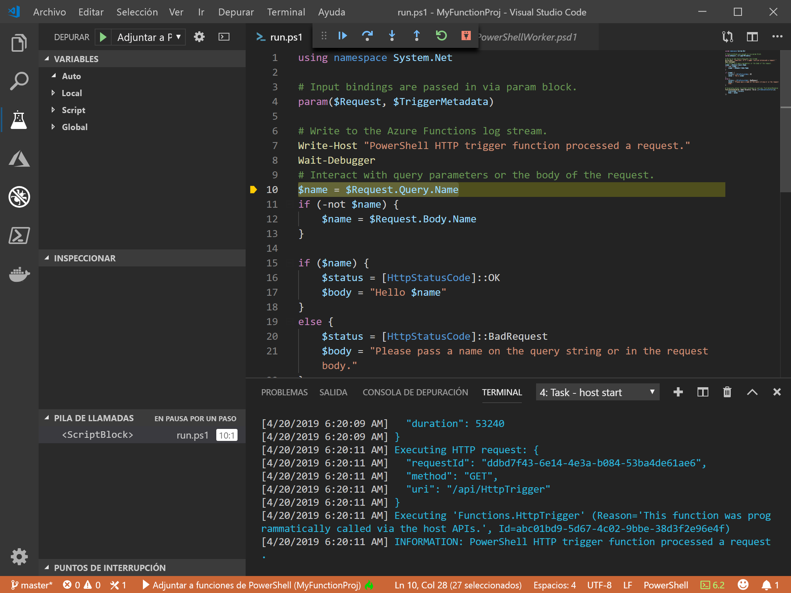
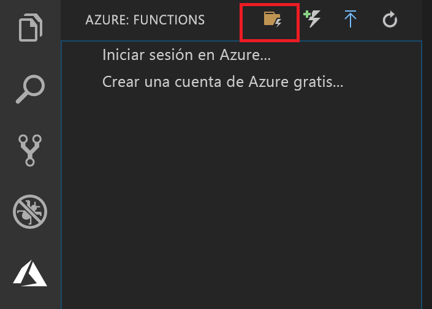

# <a name="create-your-first-powershell-function-in-azure"></a>Creación de su primera función de PowerShell en Azure

Esta guía de inicio rápido le explica cómo crear su primera función de PowerShell [sin servidor](https://azure.com/serverless) mediante Visual Studio Code.



Use la [extensión de Azure Functions para Visual Studio Code] para crear una función de PowerShell localmente y, a continuación, implementarla en una nueva aplicación de función en Azure. Actualmente, la extensión se encuentra en versión preliminar. Para más información, consulte la página de la [extensión de Azure Functions para Visual Studio Code].

Los pasos siguientes se admiten en sistemas operativos basados en Linux, Windows y macOS.

## <a name="prerequisites"></a>Prerequisites

Para completar esta guía de inicio rápido:

* Instale [PowerShell Core](/powershell/scripting/install/installing-powershell-core-on-windows).

* Instale [Visual Studio Code](https://code.visualstudio.com/) en una de las [plataformas compatibles](https://code.visualstudio.com/docs/supporting/requirements#_platforms). 

* Instale la [extensión de PowerShell para Visual Studio Code](https://marketplace.visualstudio.com/items?itemName=ms-vscode.PowerShell).

* Instale el [SDK de .NET Core 2.2 +](https://www.microsoft.com/net/download) (requerido por Azure Functions Core Tools y disponible en todas las plataformas compatibles).

* Instale la versión 2.x de [Azure Functions Core Tools](functions-run-local.md#v2).

* Necesita también una suscripción de Azure activa.

[!INCLUDE [quickstarts-free-trial-note](../../includes/quickstarts-free-trial-note.md)]

[!INCLUDE [functions-install-vs-code-extension](../../includes/functions-install-vs-code-extension.md)] 

## <a name="create-a-function-app-project"></a>Creación de un proyecto de aplicación de función

La plantilla del proyecto de Azure Functions de Visual Studio Code crea un proyecto que se puede publicar en una aplicación de función en Azure. Una aplicación de función permite agrupar funciones como una unidad lógica para facilitar la administración, la implementación, el escalado y el uso compartido de recursos.

1. En Visual Studio Code, seleccione el logotipo de Azure para mostrar la zona **Azure: Functions** y, a continuación, seleccione el icono Crear proyecto.

    

1. Elija una ubicación para el área de trabajo del proyecto de Functions y elija **Seleccionar**.

    > [!NOTE]
    > Este artículo se ha diseñado para completarse fuera de un área de trabajo. Por tanto, no seleccione una carpeta de proyecto que forme parte de un área de trabajo.

1. Seleccione **Powershell** como lenguaje para el proyecto de aplicación de función y, a continuación, **Azure Functions v2**.

1. Elija el **desencadenador HTTP** como plantilla para su primera función, utilice `HTTPTrigger` como nombre de la función y elija un nivel de autorización de **Función**.

    > [!NOTE]
    > El nivel de autorización **Función** requiere un valor para la [clave de función](functions-bindings-http-webhook.md#authorization-keys) al llamar al punto de conexión de la función en Azure. Esto dificulta que cualquier persona pueda llamar a la función.

1. Cuando se le solicite, elija **Agregar al área de trabajo**.

Visual Studio Code crea el proyecto de la aplicación de función de PowerShell en una nueva área de trabajo. Este proyecto contiene los archivos de configuración [host.json](functions-host-json.md) y [local.settings.json](functions-run-local.md#local-settings-file), que se aplican a todas las funciones del proyecto. Este [proyecto de PowerShell](functions-reference-powershell.md#folder-structure) es igual que una aplicación de función que se ejecuta en Azure.

[!INCLUDE [functions-run-function-test-local-vs-code-ps](../../includes/functions-run-function-test-local-vs-code-ps.md)]

[!INCLUDE [functions-publish-project-vscode](../../includes/functions-publish-project-vscode.md)]

## <a name="test"></a>Ejecución de la función en Azure

Para comprobar quela función publicada se ejecuta en Azure, ejecute el siguiente comando de PowerShell, reemplazando el parámetro `Uri` por la dirección URL de la función HTTPTrigger en el paso anterior. Como antes, adjunte la cadena de consulta `&name=<yourname>` a la dirección URL, como en el ejemplo siguiente:

```powershell
PS > Invoke-WebRequest -Method Get -Uri "https://glengatest-vscode-powershell.azurewebsites.net/api/HttpTrigger?code=nrY05eZutfPqLo0som...&name=PowerShell"

StatusCode        : 200
StatusDescription : OK
Content           : Hello PowerShell
RawContent        : HTTP/1.1 200 OK
                    Content-Length: 16
                    Content-Type: text/plain; charset=utf-8
                    Date: Thu, 25 Apr 2019 16:01:22 GMT

                    Hello PowerShell
Forms             : {}
Headers           : {[Content-Length, 16], [Content-Type, text/plain; charset=utf-8], [Date, Thu, 25 Apr 2019 16:01:22 GMT]}
Images            : {}
InputFields       : {}
Links             : {}
ParsedHtml        : mshtml.HTMLDocumentClass
RawContentLength  : 16
```

## <a name="next-steps"></a>Pasos siguientes

Ha usado Visual Studio Code para crear una aplicación de función de PowerShell con una función simple desencadenada por HTTP. También puede obtener más información acerca de la [depuración local de una función de PowerShell](functions-debug-powershell-local.md) con Azure Functions Core Tools. Consulte la [guía del desarrollador de PowerShell de Azure Functions](functions-reference-powershell.md).

> [!div class="nextstepaction"]
> [Habilitación de la integración de Application Insights](functions-monitoring.md#manually-connect-an-app-insights-resource)

[Azure portal]: https://portal.azure.com
[Azure Functions Core Tools]: functions-run-local.md
[Extensión de Azure Functions para Visual Studio Code]: https://marketplace.visualstudio.com/items?itemName=ms-azuretools.vscode-azurefunctions
[`Wait-Debugger`]: /powershell/module/microsoft.powershell.utility/wait-debugger?view=powershell-6
