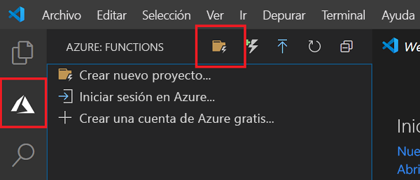
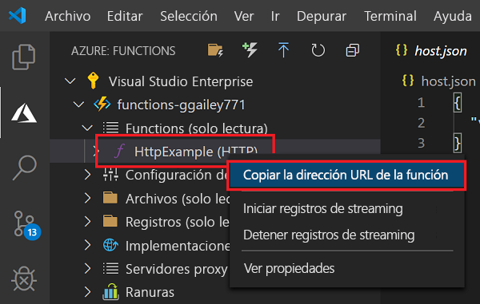
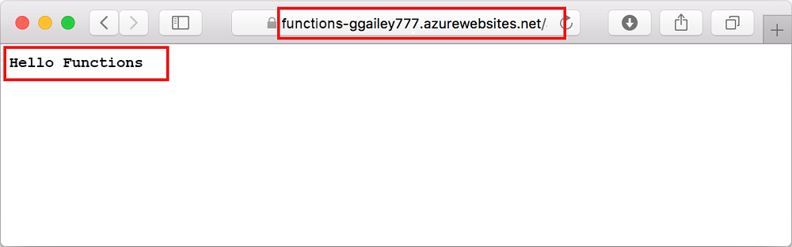

# Inicio rápido: Creación de un proyecto de Azure Functions en Visual Studio Code

En este artículo se usa Visual Studio Code para crear una función que responda a solicitudes HTTP. Después de probar el código localmente, se implementa en el entorno sin servidor de Azure Functions. Este inicio rápido supone un pequeño costo en su cuenta de Azure. 

También hay una [versión basada en la CLI](functions-create-first-azure-function-azure-cli.md) de este artículo.

## Configurar su entorno

Antes de empezar, asegúrese de que cumple los siguientes requisitos:

+ Una cuenta de Azure con una suscripción activa. [Cree una cuenta gratuita](https://azure.microsoft.com/free/?ref=microsoft.com&utm_source=microsoft.com&utm_medium=docs&utm_campaign=visualstudio).

::: zone pivot="programming-language-csharp,programming-language-powershell,programming-language-python"  
+ [Node.js](https://nodejs.org/), requerido por Windows para npm. Solo las [versiones Active LTS y Maintenance LTS ](https://nodejs.org/about/releases/). Use el comando `npm --version` para comprobar la versión.
    No se requiere para el desarrollo local en MacOS y Linux.   
::: zone-end  
::: zone pivot="programming-language-javascript,programming-language-typescript"  
+ Node.js [, las versiones Active LTS](https://nodejs.org/) y Maintenance LTS (se recomienda la 10.14.1). Use el comando `npm --version` para comprobar la versión.
::: zone-end 
::: zone pivot="programming-language-python"
+ [Python 3.7](https://www.python.org/downloads/release/python-375/) o [Python 3.6](https://www.python.org/downloads/release/python-368/), que admite Azure Functions. Python 3.8 todavía no se admite. 
::: zone-end   
::: zone pivot="programming-language-powershell"
+ [PowerShell Core](/powershell/scripting/install/installing-powershell-core-on-windows)

+ El [SDK de .NET Core 2.2+](https://www.microsoft.com/net/download)  
::: zone-end  
+ [Visual Studio Code](https://code.visualstudio.com/) en una de las [plataformas admitidas](https://code.visualstudio.com/docs/supporting/requirements#_platforms).  
::: zone pivot="programming-language-csharp"  
+ La [extensión de C#](https://marketplace.visualstudio.com/items?itemName=ms-vscode.csharp) para Visual Studio Code.  
::: zone-end  
::: zone pivot="programming-language-python"
+ La [extensión de Python](https://marketplace.visualstudio.com/items?itemName=ms-python.python) para Visual Studio Code  
::: zone-end  
::: zone pivot="programming-language-powershell"
+ La [extensión de PowerShell](https://marketplace.visualstudio.com/items?itemName=ms-vscode.PowerShell) para Visual Studio Code  
::: zone-end  

+ La [extensión de Azure Functions](https://marketplace.visualstudio.com/items?itemName=ms-azuretools.vscode-azurefunctions) para Visual Studio Code. 

## Creación del proyecto local 

En esta sección se usa Visual Studio Code para crear un proyecto local en Azure Functions en su lenguaje preferido. Más adelante en este artículo, publicará el código de función en Azure. 

1. Seleccione el icono de Azure en la barra de actividades y después en el área **Azure: Functions**, seleccione el icono **Crear un proyecto**.

    

1. Elija una ubicación de directorio para el área de trabajo del proyecto y elija **Seleccionar**.

    > [!NOTE]
    > Estos pasos se han diseñado para completarse fuera de un área de trabajo. Por tanto, no seleccione una carpeta de proyecto que forme parte de un área de trabajo.

1. Escriba la siguiente información cuando se le indique:

    ::: zone pivot="programming-language-csharp"
    + **Seleccione un lenguaje para el proyecto de funciones**: Elija `C#`.
    ::: zone-end
    ::: zone pivot="programming-language-javascript"
    + **Seleccione un lenguaje para el proyecto de funciones**: Elija `JavaScript`.
    ::: zone-end
    ::: zone pivot="programming-language-typescript"
    + **Seleccione un lenguaje para el proyecto de funciones**: Elija `TypeScript`.
    ::: zone-end
    ::: zone pivot="programming-language-powershell"
    + **Seleccione un lenguaje para el proyecto de funciones**: Elija `PowerShell`.
    ::: zone-end
    ::: zone pivot="programming-language-python"
    + **Seleccione un lenguaje para el proyecto de funciones**: Elija `Python`.

    + **Seleccione un alias de Python para crear un entorno virtual**: Elija la ubicación del intérprete de Python. Si no se muestra la ubicación, escriba la ruta de acceso completa al archivo binario de Python.  
    ::: zone-end

    + **Seleccione una plantilla para la primera función del proyecto**: Elija `HTTP trigger`.
    
    + **Especifique un nombre de función**: Escriba `HttpExample`.
    
    ::: zone pivot="programming-language-csharp"
    + **Especifique un espacio de nombres**: Escriba `My.Functions`. 
    ::: zone-end

    + **Nivel de autorización**: Elija `Anonymous`, que permite que cualquier llame al punto de conexión de la función. Para obtener información sobre el nivel de autorización, consulte [Claves de autorización](functions-bindings-http-webhook.md#authorization-keys).

    + **Seleccione cómo desea que se abra el proyecto**: Elija `Add to workspace`.

1. Con esta información, Visual Studio Code genera un proyecto de Azure Functions con un desencadenador HTTP. Los archivos del proyecto locales se pueden ver en Explorer. Para obtener más información sobre los archivos que se crean, consulte [Archivos del proyecto generados](functions-develop-vs-code.md#generated-project-files). 

::: zone pivot="programming-language-csharp,programming-language-javascript,programming-language-python"

[!INCLUDE [functions-run-function-test-local-vs-code](../../includes/functions-run-function-test-local-vs-code.md)]

::: zone-end

::: zone pivot="programming-language-powershell"

[!INCLUDE [functions-run-function-test-local-vs-code-ps](../../includes/functions-run-function-test-local-vs-code-ps.md)]

::: zone-end

Después de comprobar que la función se ejecuta correctamente en el equipo local, es el momento de usar Visual Studio Code para publicar el proyecto directamente en Azure. 

[!INCLUDE [functions-sign-in-vs-code](../../includes/functions-sign-in-vs-code.md)]

[!INCLUDE [functions-publish-project-vscode](../../includes/functions-publish-project-vscode.md)]

## Ejecución de la función en Azure

1. Vuelva al área **Azure: Functions** en la barra lateral y expanda la aplicación de funciones nueva en la suscripción. Expanda **Funciones**, haga clic con el botón derecho (Windows) o presione Ctrl + clic (MacOS) en **HttpExample** y, a continuación, elija **Copy function URL** (Copiar la dirección URL de la función).

    

1. Pegue esta dirección URL de la solicitud HTTP en la barra de dirección del navegador, agregue la `name` cadena de consulta como `?name=Functions` al final de la dirección URL y, después, ejecute la solicitud. La dirección URL que llama a la función desencadenada por HTTP debería tener el formato siguiente:

        http://<functionappname>.azurewebsites.net/api/httpexample?name=Functions 
        
    En el siguiente ejemplo se muestra la respuesta en el explorador para la solicitud GET remota devuelta por la función: 

    

## Limpieza de recursos

Cuando continúa con el paso siguiente, [Adición de un enlace de cola de Azure Storage a una función](functions-add-output-binding-storage-queue-vs-code.md), tendrá que conservar todos los recursos intactos para crear a partir de lo que ya ha hecho.

De lo contrario, puede usar los pasos siguientes para eliminar la aplicación de funciones y sus recursos relacionados para evitar incurrir en costos adicionales.

[!INCLUDE [functions-cleanup-resources-vs-code.md](../../includes/functions-cleanup-resources-vs-code.md)]

Para más información sobre los costos de Functions, consulte [Estimación de los costos según el plan de consumo](functions-consumption-costs.md).

## Pasos siguientes

Ha usado Visual Studio Code para crear una aplicación de función con una función simple desencadenada por HTTP. En el siguiente artículo, esa función se expande mediante la adición de un enlace de salida. Este enlace escribe la cadena de la solicitud HTTP en un mensaje en una cola de Azure Queue Storage. 

> [!div class="nextstepaction"]
> [Adición de un enlace de cola de Azure Storage a una función](functions-add-output-binding-storage-queue-vs-code.md)

[Azure Functions Core Tools]: functions-run-local.md
[Azure Functions extension for Visual Studio Code]: https://marketplace.visualstudio.com/items?itemName=ms-azuretools.vscode-azurefunctions
