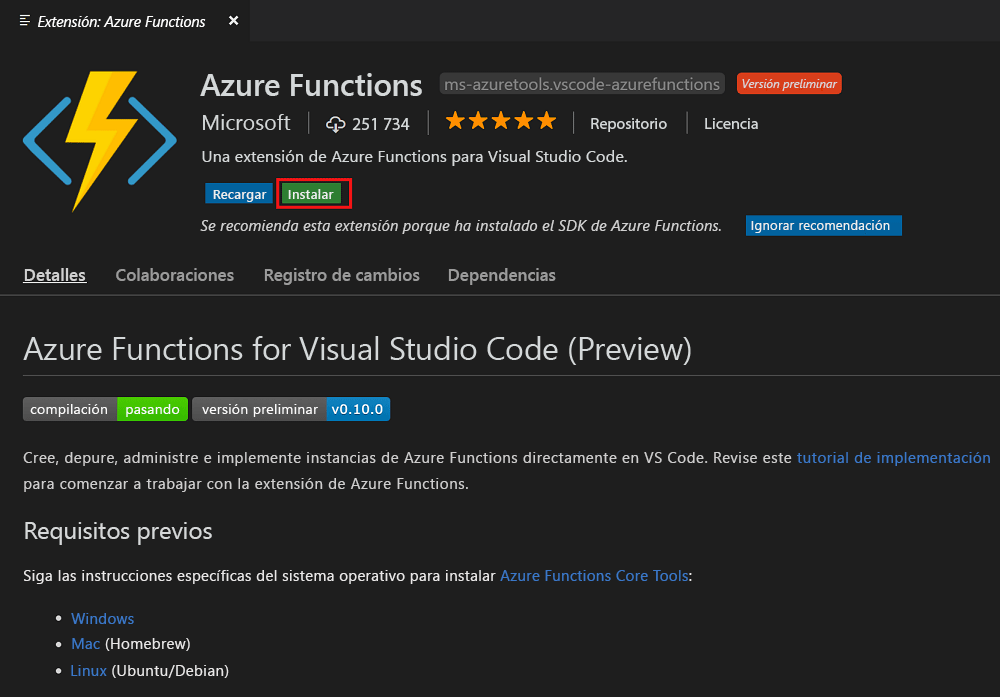
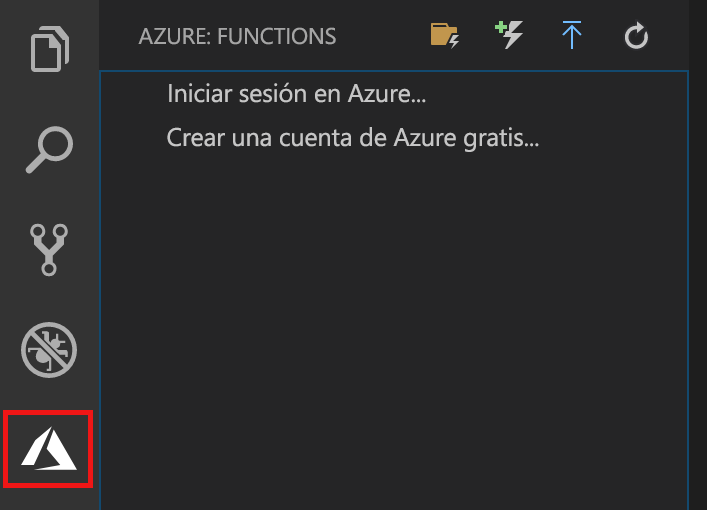
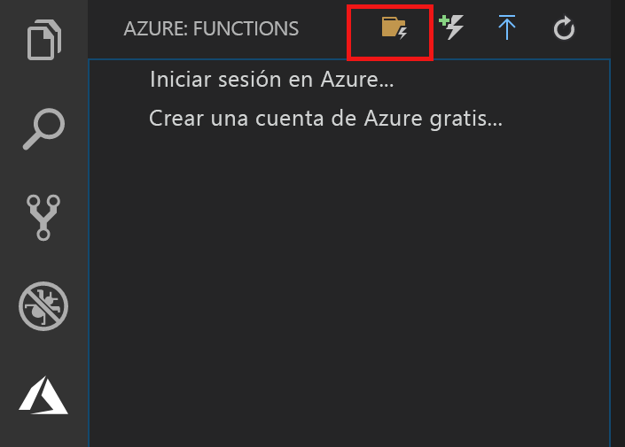
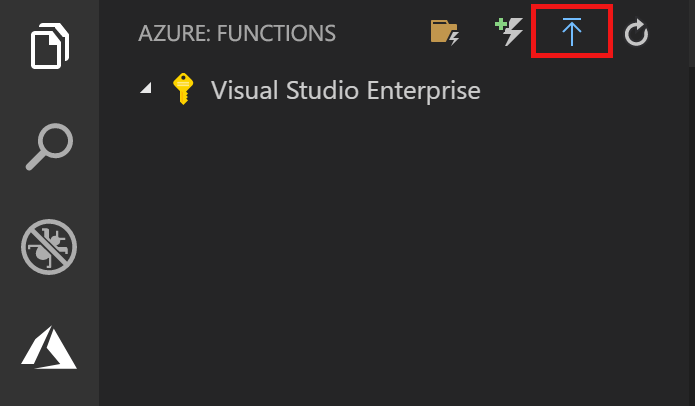
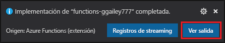
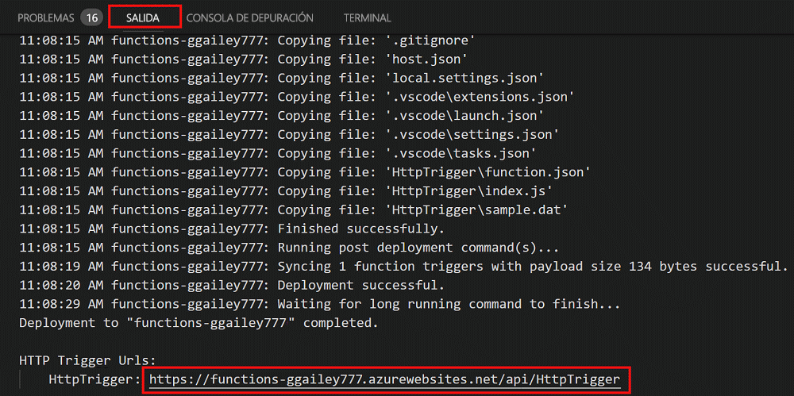

# Creación de la primera función mediante Visual Studio Code

Azure Functions permite ejecutar el código en un entorno [sin servidor](https://azure.microsoft.com/overview/serverless-computing/) sin necesidad de crear una máquina virtual o publicar una aplicación web.

En este artículo aprenderá a usar la [extensión de Azure Functions para Visual Studio Code] para crear y probar una función "hola mundo" en su equipo local mediante Microsoft Visual Studio Code. Posteriormente, puede publicar el código de la función en Azure desde Visual Studio Code.

La extensión admite actualmente funciones de C#, JavaScript y Java. Los pasos descritos en este artículo pueden variar según el lenguaje que elija para el proyecto de Azure Functions. Actualmente, la extensión se encuentra en versión preliminar. Para más información, consulte la página de la [extensión de Azure Functions para Visual Studio Code].

## Requisitos previos

Para completar esta guía de inicio rápido:

* Instale [Visual Studio Code](https://code.visualstudio.com/) en una de las [plataformas compatibles](https://code.visualstudio.com/docs/supporting/requirements#_platforms). Este artículo se ha desarrollado y probado en un dispositivo que ejecutaba macOS (High Sierra).

* Instale la versión 2.x de [Azure Functions Core Tools](functions-run-local.md#v2), que se encuentra aún en versión preliminar.

* Instale los requisitos específicos para el lenguaje elegido:

    | Idioma | Extensión |
    | -------- | --------- |
    | **C#** | [C# para Visual Studio Code](https://marketplace.visualstudio.com/items?itemName=ms-vscode.csharp) [Herramientas de la CLI de .NET Core](https://docs.microsoft.com/dotnet/core/tools/?tabs=netcore2x)*   |
    | **Java** | [Depurador para Java](https://marketplace.visualstudio.com/items?itemName=vscjava.vscode-java-debug) [JDK 1.8](http://www.oracle.com/technetwork/java/javase/downloads/index.html) [Maven 3+](https://maven.apache.org/) |
    | **JavaScript** | [Node 8.0+](https://nodejs.org/)  |

    \* Core Tools también lo requiere.

[!INCLUDE [quickstarts-free-trial-note](../../includes/quickstarts-free-trial-note.md)]

## Instalación de la extensión de Azure Functions

La extensión de Azure Functions se usa para crear, probar e implementar funciones en Azure.

1. En Visual Studio Code, abra **Extensiones** y busque `azure functions`, o [abra este vínculo en Visual Studio Code](vscode:extension/ms-azuretools.vscode-azurefunctions).

1. Seleccione **Instalar** para instalar la extensión en Visual Studio Code. 

    

1. Reinicie Visual Studio Code y seleccione el icono de Azure en la barra Actividad. Debería ver un área de Azure Functions en la barra lateral.

    

## Creación de un proyecto de Azure Functions

La plantilla del proyecto de Azure Functions de Visual Studio Code crea un proyecto que se puede publicar en una aplicación de función en Azure. Una aplicación de función permite agrupar funciones como una unidad lógica para la administración, la implementación y el uso compartido de recursos.

1. En Visual Studio Code, seleccione el logotipo de Azure para que se muestre el área **Azure: Functions** y, a continuación, seleccione el icono Crear nuevo proyecto.

    

1. Elija una ubicación para el área de trabajo del proyecto y elija **Seleccionar**.

    > [!NOTE]
    > Este artículo se ha diseñado para completarse fuera de un área de trabajo. Por tanto, no seleccione una carpeta de proyecto que forme parte de un área de trabajo.

1. Seleccione el lenguaje para el proyecto de la aplicación de función. En este artículo, se usa JavaScript.
    

1. Cuando se le solicite, elija **Agregar al área de trabajo**.

Visual Studio Code crea el proyecto de la aplicación de función en una nueva área de trabajo. Este proyecto contiene los archivos de configuración [host.json](functions-host-json.md) y [local.settings.json](functions-run-local.md#local-settings-file), además de los archivos de proyecto específicos del lenguaje. También obtendrá un nuevo repositorio de Git en la carpeta del proyecto.

## Crear una función desencadenada mediante HTTP

1. En **Azure: Functions**, elija el icono Crear función.

    

1. Seleccione la carpeta con el proyecto de la aplicación de función y seleccione la plantilla de función del **desencadenador HTTP**.

    

1. Escriba `HTTPTrigger` como nombre de la función y presione ENTRAR y, a continuación, seleccione la opción de autenticación **Anónimo**.

    

    Se crea una función en el lenguaje elegido mediante la plantilla para una función desencadenada por HTTP.

    

Puede agregar enlaces de entrada y salida a la función modificando el archivo function.json. Para más información, consulte [Conceptos básicos sobre los enlaces y desencadenadores de Azure Functions](functions-triggers-bindings.md).

Ahora que ha creado un proyecto de función y una función desencadenada por HTTP, puede probarla en el equipo local.

## Prueba local de la función

Azure Functions Core Tools le permite ejecutar un proyecto de Azure Functions en el equipo de desarrollo local. Se le solicita que instale estas herramientas la primera vez que inicie una función de Visual Studio Code.  

1. Para probar la función, establezca un punto de interrupción en el código de la función y presione F5 para iniciar el proyecto de la aplicación de función. La salida de Core Tools aparece en el panel **Terminal**.

1. En el panel **Terminal**, copie el punto de conexión de la dirección URL de la función desencadenada por HTTP.

    

1. Pegue la dirección URL de la solicitud HTTP en la barra de direcciones del explorador. Agregue la cadena de consulta `?name=<yourname>` a esta dirección URL y ejecute la solicitud. La ejecución se pone en pausa cuando se alcanza el punto de interrupción.

    

1. Si continúa la ejecución, aquí se muestra la respuesta en el explorador a la solicitud GET:

    

1. Para detener la depuración, presione Mayús + F1.

Después de comprobar que la función se ejecuta correctamente en el equipo local es el momento de publicar el proyecto en Azure.

## Inicio de sesión en Azure

Para poder publicar la aplicación, debe iniciar sesión en Azure.

1. En el área **Azure: Functions**, elija **Iniciar sesión en Azure...**. En caso de no tener ninguna cuenta, seleccione **Crear una cuenta de Azure gratis**.

    

1. Cuando se le solicite, seleccione **Copiar y abrir**, o copie el código que aparece y abra <https://aka.ms/devicelogin> en el explorador.

1. Pegue el código copiado en la página **Inicio de sesión del dispositivo**, compruebe el inicio de sesión de Visual Studio Code y luego seleccione **Continuar**.  

1. Termine el inicio de sesión mediante las credenciales de su cuenta de Azure. Cuando haya iniciado sesión correctamente, puede cerrar el explorador.

## Publicar el proyecto en Azure

Visual Studio Code le permite publicar el proyecto de Functions directamente en Azure. En el proceso, puede crear una aplicación de función y los recursos relacionados en su suscripción de Azure. La aplicación de función proporciona un contexto de ejecución para sus funciones. El proyecto se empaqueta e implementa en la nueva aplicación de función en su suscripción de Azure. 

En este artículo se da por supuesto que va a crear una nueva aplicación de función. La publicación en una aplicación de función existente sobrescribe el contenido de esa aplicación en Azure.

1. En el área **Azure: Functions**, seleccione el icono de implementación en la aplicación de función.

    

1. Elija la carpeta del proyecto que, en este caso, es el área de trabajo actual.

1. Si tiene más de una suscripción, elija la que desee para hospedar su aplicación de función y, a continuación, elija **+ Create New Function App** (+ Crear nueva aplicación de función).

1. Escriba un nombre único global que identifique la aplicación de función y presione ENTRAR. Los siguientes son caracteres válidos para un nombre de aplicación de función: `a-z`, `0-9` y `-`.

1. Elija **+ Crear un nuevo grupo de recursos**, escriba un nombre para el grupo de recursos, como `myResourceGroup` y presione ENTRAR. También puede usar un grupo de recursos existente.

1. Elija **+ Crear nueva cuenta de almacenamiento**, escriba un nombre único global para la nueva cuenta de almacenamiento que va a usar la aplicación de función y presione ENTRAR. Los nombres de las cuentas de almacenamiento deben tener entre 3 y 24 caracteres y solo pueden incluir números y letras en minúscula. También puede usar una cuenta existente.

1. Elija una ubicación en una [región](https://azure.microsoft.com/regions/) cercana a usted o a otros servicios a los que accedan las funciones.

    La creación de la aplicación de función se inicia después de elegir la ubicación. Una vez que se haya creado la aplicación de función se mostrará una notificación y se aplicará el paquete de implementación.

1. Seleccione **View Output** (Ver salida) en las notificaciones para ver la creación y los resultados de la implementación, incluidos los recursos de Azure que ha creado.

    

1. Anote la dirección URL de la nueva aplicación de función en Azure. Utilícela para probar la función después de que el proyecto se publique en Azure.

    

1. En el área **Azure: Functions** puede ver la nueva aplicación de función que aparece en su suscripción. Al expandir este nodo, puede ver las funciones de la aplicación de función, así como la configuración de la aplicación y los servidores proxy de la función.

    

    En el nodo de la aplicación de función, escriba Ctrl y haga clic (clic con el botón derecho) para realizar diversas tareas de administración y configuración de la aplicación de función en Azure. También puede decidir ver la aplicación de función en Azure Portal.

## Prueba de una función en Azure

1. Copie la dirección URL del desencadenador HTTP del panel **Salida**. Como antes, asegúrese de que agrega la cadena de consulta `?name=<yourname>` al final de esta dirección URL y ejecute la solicitud.

    La dirección URL que llama a la función desencadenada por HTTP debería tener el formato siguiente:

        http://<functionappname>.azurewebsites.net/api/<functionname>?name=<yourname> 

1. Pegue la dirección URL de la solicitud HTTP en la barra de direcciones del explorador. A continuación se muestra la respuesta en el explorador para la solicitud GET remota devuelta por la función: 

    

## Pasos siguientes

Ha usado Visual Studio Code para crear una aplicación de función con una función simple desencadenada por HTTP. Para más información sobre el desarrollo de funciones en un lenguaje específico, consulte las guías de referencia de lenguaje para [JavaScript](functions-reference-node.md), [.NET](functions-dotnet-class-library.md) o [Java](functions-reference-java.md).

A continuación, puede que desee más información sobre la prueba y depuración local desde el terminal o el símbolo del sistema mediante Azure Functions Core Tools.

> [!div class="nextstepaction"]
> [Codificación y pruebas locales](functions-run-local.md)

[Azure Functions Core Tools]: functions-run-local.md
[Extensión de Azure Functions para Visual Studio Code]: https://marketplace.visualstudio.com/items?itemName=ms-azuretools.vscode-azurefunctions
