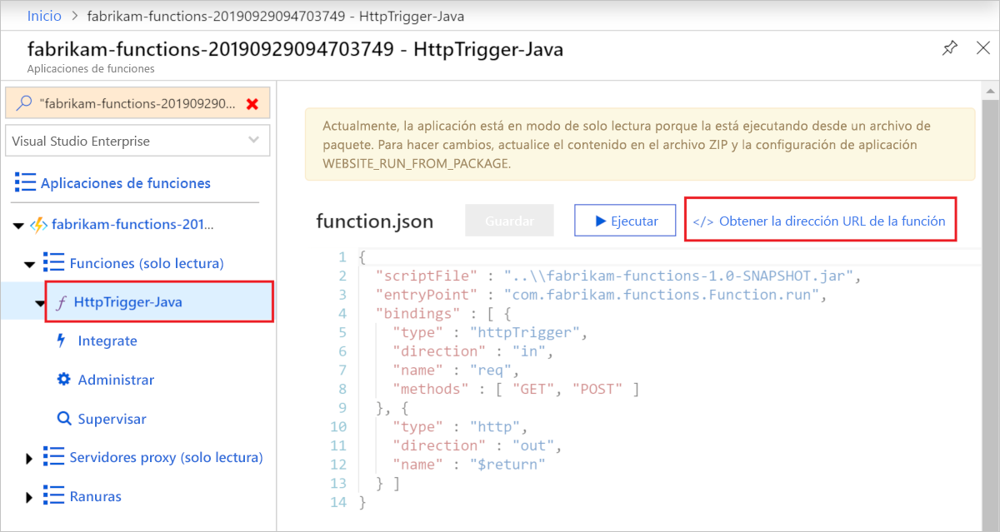

# <a name="quickstart-use-java-and-maven-to-create-and-publish-a-function-to-azure"></a>Inicio rápido: Uso de Java y Maven para crear y publicar una función en Azure

En este artículo se indica cómo compilar una función de Java en Azure Functions con la herramienta de línea de comandos de Maven. Una vez que haya terminado, el código de función se ejecutará en Azure en un [plan de hospedaje sin servidor](functions-scale.md#consumption-plan) y se desencadenará mediante una solicitud HTTP.

<!--
> [!NOTE] 
> You can also create a Kotlin-based Azure Functions project by using the azure-functions-kotlin-archetype instead. Visit the [GitHub repository](https://github.com/microsoft/azure-maven-archetypes/tree/develop/azure-functions-kotlin-archetype) for more information.
-->

## <a name="prerequisites"></a>Prerrequisitos

Para desarrollar funciones con Java, debe tener instalado lo siguiente:

- [Kit para desarrolladores de Java](https://aka.ms/azure-jdks), versión 8
- [Apache Maven](https://maven.apache.org), versión 3.0 o posterior
- [CLI de Azure]
- [Azure Functions Core Tools](./functions-run-local.md#v2), versión 2.6.666 u otra posterior

Necesita también una suscripción de Azure activa. [!INCLUDE [quickstarts-free-trial-note](../../includes/quickstarts-free-trial-note.md)]


> [!IMPORTANT]
> La variable de entorno JAVA_HOME se debe establecer en la ubicación de instalación del JDK para completar esta guía de inicio rápido.

## <a name="generate-a-new-functions-project"></a>Generación de un nuevo proyecto de Functions

En una carpeta vacía, ejecute el comando siguiente para generar el proyecto de Functions desde un [arquetipo Maven](https://maven.apache.org/guides/introduction/introduction-to-archetypes.html).

### <a name="linuxmacos"></a>Linux/macOS

```bash
mvn archetype:generate \
    -DarchetypeGroupId=com.microsoft.azure \
    -DarchetypeArtifactId=azure-functions-archetype 
```

> [!NOTE]
> Si experimenta problemas al ejecutar el comando, eche un vistazo a qué versión de `maven-archetype-plugin` se usa. Dado que se ejecuta el comando en un directorio vacío sin ningún archivo `.pom`, podría estar intentando usar un complemento de la versión anterior de `~/.m2/repository/org/apache/maven/plugins/maven-archetype-plugin` si actualizó desde una versión anterior de Maven. Si es así, intente eliminar el directorio `maven-archetype-plugin` y vuelva a ejecutar el comando.

### <a name="windows"></a>Windows

```powershell
mvn archetype:generate `
    "-DarchetypeGroupId=com.microsoft.azure" `
    "-DarchetypeArtifactId=azure-functions-archetype"
```

```cmd
mvn archetype:generate ^
    "-DarchetypeGroupId=com.microsoft.azure" ^
    "-DarchetypeArtifactId=azure-functions-archetype"
```

Maven le pide los valores necesarios para finalizar la generación del proyecto en la implementación. Indique los siguientes valores cuando se le solicite:

| Value | Descripción |
| ----- | ----------- |
| **groupId** | Un valor que identifica de forma única su proyecto entre todos los demás y que sigue las [reglas de nomenclatura de paquetes](https://docs.oracle.com/javase/specs/jls/se6/html/packages.html#7.7) de Java. En los ejemplos de este inicio rápido se usa `com.fabrikam.functions`. |
| **artifactId** | Un valor que es el nombre del archivo jar, sin un número de versión. En los ejemplos de este inicio rápido se usa `fabrikam-functions`. |
| **version** | Elija el valor predeterminado de `1.0-SNAPSHOT`. |
| **package** | Un valor que es el paquete de Java para el código de función generado. Use el valor predeterminado. En los ejemplos de este inicio rápido se usa `com.fabrikam.functions`. |
| **appName** | Escriba un nombre único global que identifique la nueva aplicación de funciones en Azure. Use el valor predeterminado, que es _artifactId_, anexado con un número aleatorio. Tome nota de este valor ya que lo necesitará más adelante. |
| **appRegion** | Elija una [región](https://azure.microsoft.com/regions/) cerca de usted o cerca de otros servicios a los que tendrán acceso las funciones. El valor predeterminado es `westus`. Ejecute este comando de la [CLI de Azure] para obtener una lista de todas las regiones:<br/>`az account list-locations --query '[].{Name:name}' -o tsv` |
| **resourceGroup** | Nombre para el nuevo [grupo de recursos](../azure-resource-manager/management/overview.md) en el que se va a crear la aplicación de funciones. Use `myResourceGroup`, que es lo que utilizan los ejemplos de este inicio rápido. Un grupo de recursos debe ser único para su suscripción de Azure.|

Escriba `Y` o presione Entrar para confirmar.

Maven crea los archivos del proyecto en una carpeta nueva llamada _artifactId_ que, en este ejemplo, es `fabrikam-functions`. 

Abra el nuevo archivo Function.java desde la ruta de acceso *src/main/java*  en un editor de texto y revise el código generado. Este código es una función [desencadenada por HTTP](functions-bindings-http-webhook.md) que devuelve el cuerpo de la solicitud. 

> [!div class="nextstepaction"]
> [He tenido un problema](https://www.research.net/r/javae2e?tutorial=functions-maven-quickstart&step=generate-project)

## <a name="run-the-function-locally"></a>Ejecución local de la función

Ejecute el siguiente comando, que cambia el directorio a la carpeta de proyecto que acaba de crear y, a continuación, compila y ejecuta el proyecto de función:

```console
cd fabrikam-function
mvn clean package 
mvn azure-functions:run
```

Verá una salida similar a la siguiente desde Azure Functions Core Tools cuando ejecute el proyecto localmente:

```Output
...

Now listening on: http://0.0.0.0:7071
Application started. Press Ctrl+C to shut down.

Http Functions:

    HttpTrigger-Java: [GET,POST] http://localhost:7071/api/HttpTrigger-Java
...
```

Desencadene la función desde la línea de comandos mediante cURL en una ventana de terminal nueva:

```CMD
curl -w "\n" http://localhost:7071/api/HttpTrigger-Java --data AzureFunctions
```

```Output
Hello AzureFunctions!
```
No se requiere la [clave de la función](functions-bindings-http-webhook-trigger.md#authorization-keys) cuando se ejecuta de manera local. Use `Ctrl+C` en el terminal para detener el código de función.

> [!div class="nextstepaction"]
> [He tenido un problema](https://www.research.net/r/javae2e?tutorial=functions-maven-quickstart&step=local-run)

## <a name="deploy-the-function-to-azure"></a>Implementación de la función en Azure

La primera vez que crea una aplicación de funciones, se crea dicha función y los recursos relacionados en Azure. Antes de poder implementar, use el comando [az login](/cli/azure/authenticate-azure-cli) de la CLI de Azure para iniciar sesión en la suscripción de Azure. 

```azurecli
az login
```

> [!TIP]
> Si su cuenta puede acceder a varias suscripciones, use [az account set](/cli/azure/account#az-account-set) para establecer la suscripción predeterminada de esta sesión. 

Use el siguiente comando de Maven para implementar el proyecto en una nueva aplicación de funciones. 

```azurecli
mvn azure-functions:deploy
```

Este destino `azure-functions:deploy` de Maven crea los siguientes recursos en Azure:

+ Un grupo de recursos Se le ha asignado el nombre de _resourceGroup_ que proporcionó anteriormente.
+ Una cuenta de almacenamiento Necesaria con Functions. El nombre se genera aleatoriamente según los requisitos de nombre de la cuenta de almacenamiento.
+ Plan de App Service. El hospedaje sin servidor de la aplicación de funciones en la región _appRegion_ especificada. El nombre se genera aleatoriamente.
+ Aplicación de funciones. Una aplicación de funciones es la unidad de implementación y ejecución de las funciones. El nombre es _appName_, anexado a un número generado de forma aleatoria. 

La implementación también empaqueta los archivos de proyecto y los implementa en la nueva aplicación de funciones mediante la [implementación de archivos zip](functions-deployment-technologies.md#zip-deploy), con el modo de ejecución desde el paquete habilitado.

Cuando se complete la implementación, verá la dirección URL que puede usar para acceder a los puntos de conexión de la aplicación de funciones. Dado que el desencadenador HTTP que publicamos usa `authLevel = AuthorizationLevel.FUNCTION`, debe obtener la clave de función para llamar al punto de conexión de la función a través de HTTP. La forma más fácil de obtener la clave de función es desde [Azure Portal].

> [!div class="nextstepaction"]
> [He tenido un problema](https://www.research.net/r/javae2e?tutorial=functions-maven-quickstart&step=deploy)

## <a name="get-the-http-trigger-url"></a>Obtención de la dirección URL del desencadenador HTTP

<!--- We can updates this to remove portal dependency after the Maven archetype returns the full URLs with keys on publish (https://github.com/microsoft/azure-maven-plugins/issues/571). -->

Puede obtener la dirección URL necesaria para desencadenar la función, con la clave de función, en Azure Portal. 

1. Vaya a [Azure Portal], inicie sesión, escriba el nombre de _appName_ para la aplicación de funciones en **Buscar** en la parte superior de la página y presione Entrar.
 
1. En la aplicación de funciones, expanda **Funciones (solo lectura)** , elija la función y, a continuación, seleccione **</> Obtener la dirección URL de la función** en la parte superior derecha. 

    

1. Seleccione **valor predeterminado (clave de función)**  y seleccione **Copiar**. 

Ahora puede usar la dirección URL copiada para acceder a la función.

## <a name="verify-the-function-in-azure"></a>Comprobación de la función en Azure

Para comprobar la aplicación de funciones que se ejecuta en Azure mediante `cURL`, reemplace la dirección URL del ejemplo siguiente por la dirección URL que copió del portal.

```azurecli
curl -w "\n" https://fabrikam-functions-20190929094703749.azurewebsites.net/api/HttpTrigger-Java?code=zYRohsTwBlZ68YF.... --data AzureFunctions
```

Esto envía una solicitud POST al punto de conexión de la función con `AzureFunctions` en el cuerpo de la solicitud. Puede ver la siguiente respuesta.

```Output
Hello AzureFunctions!
```

> [!div class="nextstepaction"]
> [He tenido un problema](https://www.research.net/r/javae2e?tutorial=functions-maven-quickstart&step=verify-deployment)

## <a name="next-steps"></a>Pasos siguientes

Ha creado un proyecto de funciones de Java con una función desencadenada por HTTP, lo ha ejecutado en la máquina local y lo ha implementado en Azure. Ahora, amplíe la función como sigue...

> [!div class="nextstepaction"]
> [Adición de un enlace de salida de la cola de Azure Storage](functions-add-output-binding-storage-queue-java.md)


[CLI de Azure]: /cli/azure
[Azure Portal]: https://portal.azure.com
