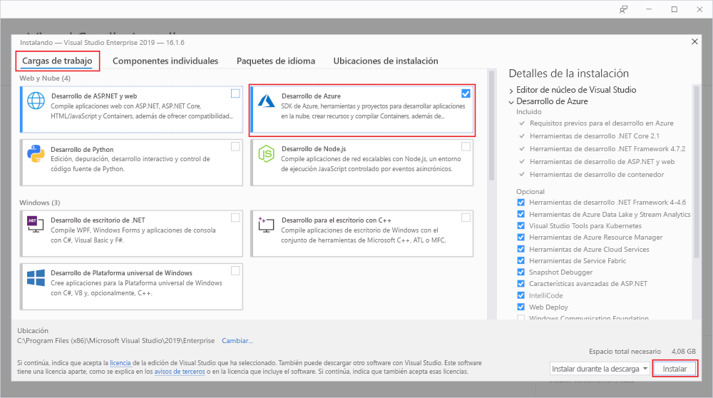
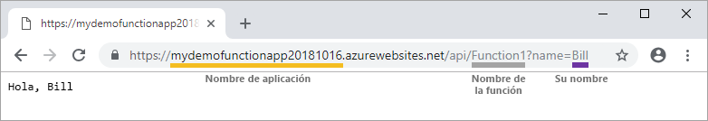

# Creación de la primera función mediante Visual Studio

Azure Functions permite ejecutar el código en un entorno [sin servidor](https://azure.microsoft.com/solutions/serverless/) sin necesidad de crear una máquina virtual o publicar una aplicación web.

En este artículo aprenderá a usar Visual Studio 2019 con el fin de crear y probar localmente una función "Hola mundo" y, después, publicarla en Azure. Este inicio rápido está diseñado para Visual Studio 2019. Antes de crear un proyecto de Functions con Visual Studio 2017, debe instalar las [herramientas de Azure Functions más recientes](functions-develop-vs.md#check-your-tools-version).

## Prerrequisitos

Para completar este tutorial, antes debe instalar [Visual Studio 2019](https://azure.microsoft.com/downloads/). Asegúrese de que la carga de trabajo de **Desarrollo de Azure** también está instalada.

[!INCLUDE [quickstarts-free-trial-note](../../includes/quickstarts-free-trial-note.md)]

## Creación de un proyecto de aplicación de función

[!INCLUDE [Create a project using the Azure Functions template](../../includes/functions-vstools-create.md)]

Visual Studio crea un proyecto y una clase que contiene código reutilizable para el tipo de función de desencadenador HTTP. El atributo `FunctionName` en el método establece el nombre de la función que, de forma predeterminada, es `Function1`. El atributo `HttpTrigger` especifica que la función es desencadenada por una solicitud HTTP. El código reutilizable envía una respuesta HTTP que incluye un valor del cuerpo de la solicitud o de la cadena de consulta.

Puede ampliar las capacidades de la función con enlaces de entrada y salida, mediante la aplicación de los atributos adecuados al método. Para más información, consulte la sección [Desencadenadores y enlaces](functions-dotnet-class-library.md#triggers-and-bindings) de la [Referencia para desarrolladores de C# de Azure Functions](functions-dotnet-class-library.md).

Ahora que ha creado un proyecto de función y una función desencadenada por HTTP, puede probarla en el equipo local.

## Ejecución local de la función

Visual Studio se integra con Azure Functions Core Tools; de este modo se pueden probar las funciones localmente mediante el entorno de ejecución completo de Functions.  

[!INCLUDE [functions-run-function-test-local-vs](../../includes/functions-run-function-test-local-vs.md)]

Después de comprobar que la función se ejecuta correctamente en el equipo local es el momento de publicar el proyecto en Azure.

## Publicar el proyecto en Azure

Debe tener una aplicación de función en la suscripción de Azure para poder publicar el proyecto. La publicación de Visual Studio crea una aplicación de funciones la primera vez que se publica el proyecto.

[!INCLUDE [Publish the project to Azure](../../includes/functions-vstools-publish.md)]

## Prueba de una función en Azure

1. Copie la URL base de la aplicación de función de la página de perfil de publicación. Reemplace la parte `localhost:port` de la dirección URL que usó al probar la función localmente por la nueva URL base. Como antes, asegúrese de que agrega la cadena de consulta `?name=<YOUR_NAME>` a esta dirección URL y ejecute la solicitud.

    La dirección URL que llama a la función desencadenada por HTTP debería tener el formato siguiente:

        http://<APP_NAME>.azurewebsites.net/api/<FUNCTION_NAME>?name=<YOUR_NAME> 

2. Pegue la dirección URL de la solicitud HTTP en la barra de direcciones del explorador. A continuación se muestra la respuesta en el explorador para la solicitud GET remota devuelta por la función:

    

## Pasos siguientes

Ha usado Visual Studio para crear y publicar una aplicación de funciones con C# en Azure con una función simple desencadenada por HTTP. Para más información sobre el desarrollo de funciones como las bibliotecas de clases de .NET, consulte [Referencia para desarrolladores de C# de Azure Functions](functions-dotnet-class-library.md).

> [!div class="nextstepaction"]
> [Adición de un enlace de cola de Azure Storage a una función](functions-add-output-binding-storage-queue-vs.md)
