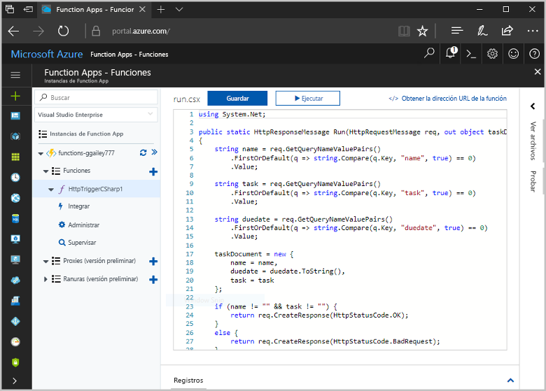
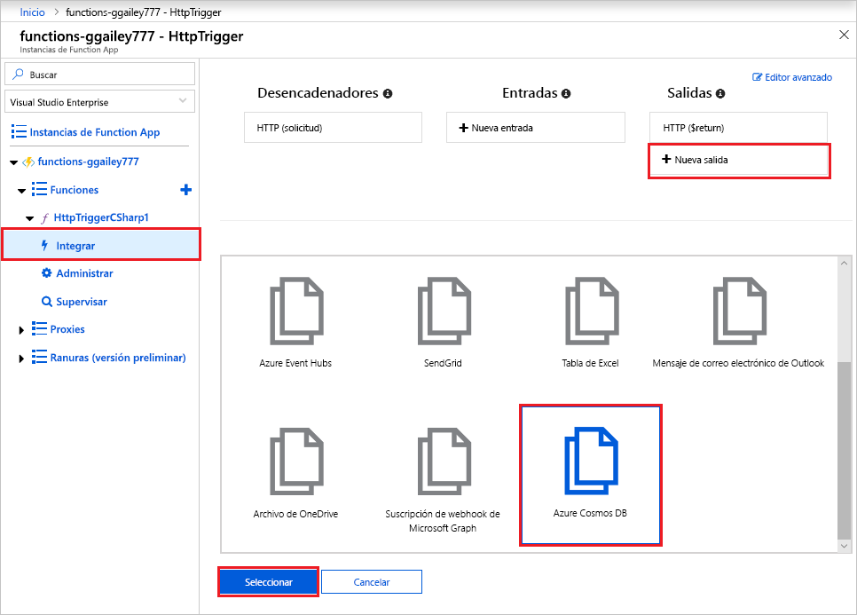
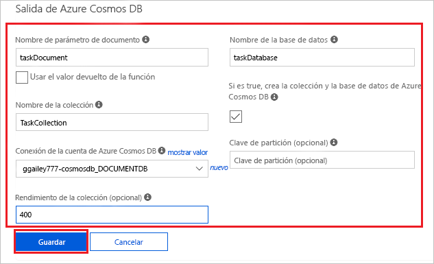
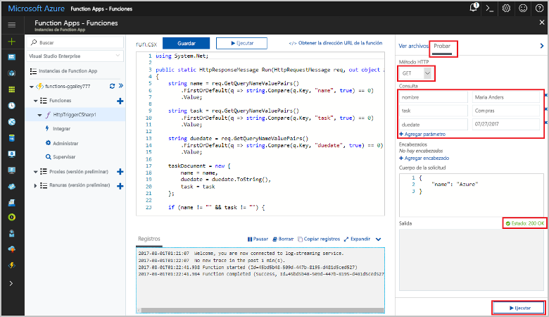
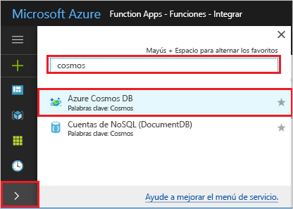
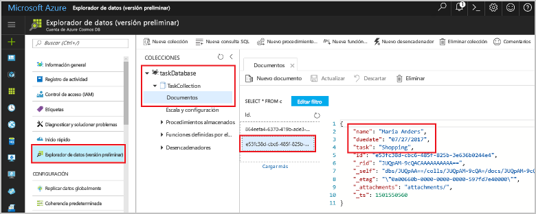

# <a name="store-unstructured-data-using-azure-functions-and-azure-cosmos-db"></a>Almacenamiento de datos no estructurados mediante Azure Functions y Cosmos DB

[Azure Cosmos DB](https://azure.microsoft.com/services/cosmos-db/) es una excelente manera de almacenar datos no estructurados y JSON. En combinación con Azure Functions, Cosmos DB facilita y agiliza el almacenamiento de datos con mucho menos código que el necesario para almacenar datos en una base de datos relacional.

> [!NOTE]
> En este momento, el desencadenador de Azure Cosmos DB y los enlaces de entrada y de salida solo funcionan con cuentas de SQL API y Graph API.

En Azure Functions, los enlaces de entrada y salida proporcionan una manera declarativa de conectarse a los datos de servicio externos desde su función. En este artículo, aprenda a actualizar una función existente para agregar un enlace de salida que almacene datos no estructurados en un documento de Azure Cosmos DB.



## <a name="prerequisites"></a>Requisitos previos

Para completar este tutorial:

[!INCLUDE [Previous quickstart note](../../includes/functions-quickstart-previous-topics.md)]

## <a name="create-an-azure-cosmos-db-account"></a>Creación de una cuenta de Azure Cosmos DB

Debe tener una cuenta de Azure Cosmos DB que use la API de SQL para poder crear el enlace de salida.

[!INCLUDE [cosmos-db-create-dbaccount](../../includes/cosmos-db-create-dbaccount.md)]

## <a name="add-an-output-binding"></a>Adición de un enlace de salida

1. En el portal, vaya a la aplicación de función que creó anteriormente y expanda la aplicación de función y la función.

1. Seleccione **Integrar** y **+ Nueva salida**, que se encuentra en la parte superior derecha de la página. Elija **Azure Cosmos DB** y haga clic en **Seleccionar**.

    

1. Si recibe un mensaje de **extensiones no instaladas**, elija **Instalar** para instalar la extensión de enlaces de Azure Cosmos DB en la aplicación de función. La instalación puede tardar un minuto o dos.

    

1. Use la configuración de **salida de Azure Cosmos DB**, tal y como se especifica en la tabla:

    

    | Configuración      | Valor sugerido  | DESCRIPCIÓN                                |
    | ------------ | ---------------- | ------------------------------------------ |
    | **Nombre del parámetro de documento** | taskDocument | Nombre que hace referencia al objeto de Cosmos DB en el código. |
    | **Nombre de la base de datos** | taskDatabase | Nombre de la base de datos para guardar documentos. |
    | **Nombre de colección** | TaskCollection | Nombre de la colección de la base de datos. |
    | **Si es true, crea la base de datos y la colección de Cosmos DB** | Activado | La colección no existe, por lo que se crea. |
    | **Conexión de la cuenta de Azure Cosmos DB** | Nueva configuración | Seleccione **Nuevo**, a continuación, elija su **suscripción**, la **cuenta de la base de datos** que creó anteriormente y **Seleccionar**. Con esto se crea una configuración de la aplicación para la conexión de la cuenta. Esta configuración la usa el enlace para establecer la conexión a la base de datos. |
    | **Capacidad de proceso de colecciones** |400 RU| Si quiere reducir la latencia, puede escalar verticalmente el rendimiento más adelante. |

1. Seleccione **Guardar** para crear el enlace.

## <a name="update-the-function-code"></a>Actualización del código de la función

Reemplace el código existente de la función por el código siguiente, en el lenguaje de su elección:

# <a name="ctabcsharp"></a>[C#](#tab/csharp)

Reemplace la función de C# existente por el código siguiente:

```csharp
#r "Newtonsoft.Json"

using Microsoft.AspNetCore.Mvc;
using Microsoft.AspNetCore.Http;
using Microsoft.Extensions.Logging;

public static IActionResult Run(HttpRequest req, out object taskDocument, ILogger log)
{
    string name = req.Query["name"];
    string task = req.Query["task"];
    string duedate = req.Query["duedate"];

    // We need both name and task parameters.
    if (!string.IsNullOrEmpty(name) && !string.IsNullOrEmpty(task))
    {
        taskDocument = new
        {
            name,
            duedate,
            task
        };

        return (ActionResult)new OkResult();
    }
    else
    {
        taskDocument = null;
        return (ActionResult)new BadRequestResult();
    }
}
```

# <a name="javascripttabjavascript"></a>[JavaScript](#tab/javascript)

Reemplace la función de JavaScript existente por el código siguiente:

```js
module.exports = async function (context, req) {

    // We need both name and task parameters.
    if (req.query.name && req.query.task) {

        // Set the output binding data from the query object.
        context.bindings.taskDocument = req.query;

        // Success.
        context.res = {
            status: 200
        };
    }
    else {
        context.res = {
            status: 400,
            body: "The query options 'name' and 'task' are required."
        };
    }
};
```
---

Este ejemplo de código lee las cadenas de consulta de la solicitud HTTP y las asigna a los campos del objeto `taskDocument`. El enlace `taskDocument` envía los datos del objeto desde este parámetro de enlace para almacenarlos en la base de datos de documentos enlazada. La base de datos se crea la primera vez que se ejecuta la función.

## <a name="test-the-function-and-database"></a>Prueba de la función y la base de datos

1. Expanda la ventana derecha y seleccione **Probar**. En **Consulta**, haga clic en **+ Agregar parámetro** y agregue los siguientes parámetros a la cadena de consulta:

    + `name`
    + `task`
    + `duedate`

1. Haga clic en **Ejecutar** y compruebe que se devuelve un estado 200.

    

1. En el lado izquierdo de Azure Portal, expanda la barra de iconos, escriba `cosmos` en el campo de búsqueda y seleccione **Azure Cosmos DB**.

    

1. Elija la cuenta de Azure Cosmos DB y luego seleccione el **Explorador de datos**.

1. Expanda los nodos de **Colecciones**, seleccione el nuevo documento y confirme que el documento contiene los valores de la cadena de consulta, junto con algunos metadatos adicionales.

    

Ha agregado correctamente un enlace al desencadenador HTTP que almacena datos no estructurados en Azure Cosmos DB.

[!INCLUDE [Clean-up section](../../includes/clean-up-section-portal.md)]

## <a name="next-steps"></a>Pasos siguientes

Para más información sobre el enlace a una base de datos de la base de datos de Cosmos, consulte [Enlaces de Cosmos DB en Azure Functions](functions-bindings-cosmosdb.md).

[!INCLUDE [functions-quickstart-next-steps](../../includes/functions-quickstart-next-steps-2.md)]
