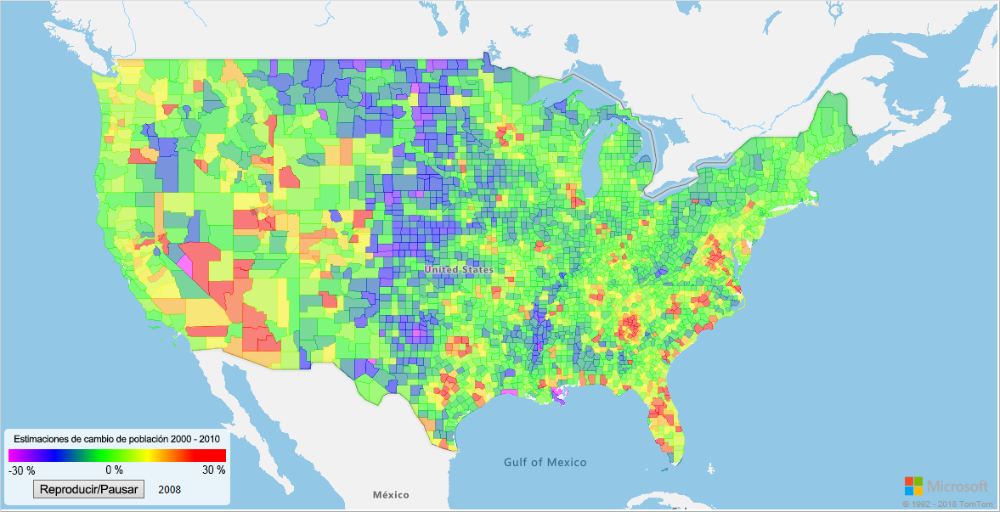
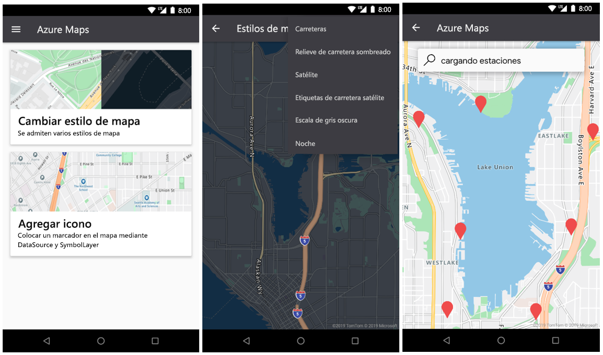

# <a name="what-is-azure-maps"></a>¿Qué es Azure Maps?

Azure Maps es una colección de servicios geoespaciales que emplea datos de mapas recientes para proporcionar contexto geográfico a las aplicaciones web y móviles. Azure Maps ofrece:

* API REST para representar mapas en varios estilos y en imágenes de satélite.
* Servicio Search para buscar direcciones, lugares y puntos de interés en todo el mundo.
* Varias opciones de enrutamiento: punto a punto, multipunto, optimización multipunto, mapas isócronos, vehículo comercial, con capa de tráfico y enrutamiento de matrices.
* Vista de flujo de tráfico y vista de incidentes para las aplicaciones que requieren información sobre tráfico.
* Servicio Mobility para solicitar logística de tránsito público, planear rutas en tiempo real y solicitar información para modos alternativos de transporte.
* Servicios de zona horaria y geolocalización, y conversión de una ubicación en zonas horarias.
* Servicios de geovalla y almacenamiento de datos de mapas, con información de ubicación hospedada en Azure. 
* Inteligencia de ubicación mediante análisis geoespacial. 

Además, los servicios Azure Maps están disponibles mediante el SDK web o Android SDK. Estas herramientas ayudan a los desarrolladores a crear y escalar rápidamente soluciones que integran la información de ubicación en las soluciones de Azure. 

Puede registrarse para obtener una [cuenta de Azure Maps](https://azure.microsoft.com/services/azure-maps/) gratuita y empezar a desarrollar.

En el siguiente vídeo se explica Azure Maps en profundidad:

<br/>

<iframe src="https://channel9.msdn.com/Shows/Internet-of-Things-Show/Azure-Maps/player?format=ny" width="960" height="540" allowFullScreen frameBorder="0"></iframe>

## <a name="map-controls"></a>Controles de mapa

### <a name="web-sdk"></a>SDK web

El SDK web de Azure Maps permite personalizar mapas interactivos con contenido propio e imágenes. Puede usar este mapa interactivo para las aplicaciones web o móviles. El control de mapa usa WebGL, que permite representar grandes conjuntos de datos con alto rendimiento. Desarrolle con el SDK mediante JavaScript o TypeScript.



### <a name="android-sdk"></a>SDK de Android

Use Android SDK de Azure Maps para crear aplicaciones de mapas móviles. 



## <a name="services-in-azure-maps"></a>Servicios de Azure Maps

Azure Maps consta de los nueve servicios siguientes que pueden proporcionar contexto geográfico a las aplicaciones de Azure.

### <a name="data-service"></a>Data Service

Los datos son imprescindibles en los mapas. Use Data Service para cargar y almacenar datos geoespaciales y usarlos con operaciones espaciales o composición de imágenes.  Acercar los datos de los clientes al servicio Azure Maps reducirá la latencia, aumentará la productividad y creará escenarios en sus aplicaciones. Para más información sobre este servicio, consulte la [documentación de Data Service API](https://docs.microsoft.com/rest/api/maps/data).

### <a name="mobility-service"></a>Mobility Service

El servicio de movilidad de Azure Maps permite el planeamiento de viajes en tiempo real. Devuelve las mejores opciones de ruta posibles y proporciona diversas clases de modos de viaje. Para las áreas metropolitanas (cuidad), estos modos pueden incluir ir a pie, en bicicleta o en transporte público. Puede solicitar el itinerario de transporte, la geometría de la línea, la lista de paradas, las llegadas programadas y en tiempo real y las alertas de servicio.

El servicio permite también buscar tipos de objetos específicos en torno a una ubicación. Los usuarios pueden buscar bicicletas, scooters o automóviles compartidos en torno a una ubicación. Los usuarios pueden solicitar el número de bicicletas disponibles en el muelle más cercano y buscar vehículos disponibles para el uso compartido. También, los usuarios pueden buscar información como la disponibilidad futura de los vehículos o el nivel actual de autonomía.

Para más información sobre el servicio, consulte la [documentación de la API de movilidad](https://docs.microsoft.com/rest/api/maps/mobility).

### <a name="render-service"></a>Render Service

El servicio Render ayuda a los desarrolladores a crear aplicaciones web y móviles con características de mapas. El servicio emplea imágenes de gráficos de trama de alta calidad, disponibles en 19 niveles de zoom, o imágenes de mapa en formato vectorial totalmente personalizables.


Render Service ahora ofrece varias API en versión preliminar que permiten a los desarrolladores trabajar con imágenes de satélite. Para más información, lea la [documentación de Render API](https://docs.microsoft.com/rest/api/maps/render).

### <a name="route-service"></a>Route Service

Contiene sólidos cálculos de geometría de infraestructuras del mundo real y direcciones para varios modos de transporte. El servicio permite a los desarrolladores calcular direcciones entre distintos modos de viaje, como automóvil, camión, bicicleta o a pie. El servicio también tiene en cuenta entradas como las condiciones del tráfico, las restricciones de peso o el transporte de materiales peligrosos.


El servicio de ruta ofrece una vista previa de características avanzadas, como: 

* Procesamiento por lotes de varias solicitudes de ruta.
* Matrices de tiempo y distancia de viaje entre un conjunto de orígenes y destinos.
* Búsqueda de rutas o distancias que los usuarios pueden recorrer en función de los requisitos de tiempo o combustible. 

Para más información sobre las funcionalidades de ruta, lea la [documentación de Route API](https://docs.microsoft.com/rest/api/maps/route).

### <a name="search-service"></a>Servicio de búsqueda

El servicio de búsqueda ayuda a los desarrolladores a buscar direcciones, lugares, listados de empresas por nombre o categoría y otra información geográfica. El servicio de búsqueda puede realizar la [codificación geográfica inversa](https://en.wikipedia.org/wiki/Reverse_geocoding) de direcciones y cruces de calles en función de la longitud y la latitud.


El servicio de búsqueda también proporciona características avanzadas, como:

* Búsqueda a lo largo de una ruta
* Búsqueda dentro de un área más amplia
* Procesamiento por lotes de un grupo de solicitudes de búsqueda
* Búsqueda del área más grande en lugar de un punto de ubicación 

Las API de búsqueda en grupo y por zona son actualmente versiones preliminares. Para más información sobre las funcionalidades de búsqueda, lea la [documentación de Search API](https://docs.microsoft.com/rest/api/maps/search).

### <a name="spatial-operations-service"></a>Servicio Spatial Operations

El servicio Azure Maps Spatial Operations toma información de la ubicación. Analiza rápidamente la información para informar a los clientes de eventos en curso que suceden en un tiempo y un espacio. Permite análisis en tiempo real y el modelado predictivo de los eventos. 

El servicio permite a los clientes mejorar su inteligencia de ubicación gracias a una biblioteca de cálculos matemáticos geoespaciales comunes. Los cálculos comunes incluyen el punto más cercano, la distancia ortodrómica y los búferes. Para más información sobre el servicio y las diversas características, lea la [documentación de Spatial Operations API](https://docs.microsoft.com/rest/api/maps/spatial).

### <a name="time-zone-service"></a>Time Zone Service

El servicio Time Zone permite consultar la información de zona horaria actual, histórica y futura. Puede usar pares de latitud y longitud o un [identificador de IANA](https://www.iana.org/). Además, permite:

* Convertir los identificadores de zona horaria de Microsoft Windows en zonas horarias de IANA
* Recuperar un desplazamiento de zona horaria a UTC
* Obtener la hora actual de una zona horaria seleccionada 

Una respuesta JSON típica de una consulta a Time Zone Service se parece al ejemplo siguiente:

```JSON
{
    "Version": "2017c",
    "ReferenceUtcTimestamp": "2017-11-20T23:09:48.686173Z",
    "TimeZones": [{
        "Id": "America/Los_Angeles",
        "ReferenceTime": {
            "Tag": "PST",
            "StandardOffset": "-08:00:00",
            "DaylightSavings": "00:00:00",
            "WallTime": "2017-11-20T15:09:48.686173-08:00",
            "PosixTzValidYear": 2017,
            "PosixTz": "PST+8PDT,M3.2.0,M11.1.0"
        }
    }]
}
```

Para más información sobre este servicio, lea la [documentación de Time Zone API](https://docs.microsoft.com/rest/api/maps/timezone).

### <a name="traffic-service"></a>Traffic Service

El servicio Traffic es un conjunto de servicios web que los desarrolladores pueden usar para crear aplicaciones web o móviles que requieren información del tráfico. El servicio proporciona dos tipos de datos:

* Flujo de tráfico: velocidades observadas en tiempo real y duración del viaje de todas las principales carreteras de la red.
* Incidentes de tráfico: una vista actualizada de atascos e incidentes de tráfico en torno a la red de carreteras.


Para más información, consulte la [documentación de la Traffic API](https://docs.microsoft.com/rest/api/maps/traffic).

### <a name="ip-to-location-service"></a>Servicio IP to Location

Use este servicio para obtener una vista previa del código de país de dos letras recuperado de una dirección IP. Este servicio puede ayudarle a mejorar la experiencia del usuario al proporcionar contenido de la aplicación personalizado según la ubicación geográfica.

Para más información sobre el servicio IP to Location en la API REST, lea la [documentación de API de geolocalización de Azure Maps](https://docs.microsoft.com/rest/api/maps/geolocation).

## <a name="programming-model"></a>Modelo de programación

Azure Maps se ha diseñado pensando en la movilidad y puede ayudarlo a desarrollar aplicaciones multiplataforma. Usa un modelo de programación independiente del lenguaje y admite salidas JSON mediante las [API REST](https://docs.microsoft.com/rest/api/maps/).

Además, Azure Maps ofrece un cómodo [control de mapa de JavaScript](https://docs.microsoft.com/javascript/api/azure-maps-control) con un modelo de programación simple. El desarrollo es rápido y sencillo para aplicaciones web y móviles.

## <a name="usage"></a>Uso

Para acceder a los servicios de Azure Maps basta con ir a [Azure Portal](https://portal.azure.com) y crear una cuenta de Azure Maps.

Azure Maps usa un esquema de autenticación basado en claves. Su cuenta incluye dos claves que ya se han generado de manera automática, use la que desee. Comience a integrar estas funcionalidades de ubicación en su aplicación y realice una solicitud al servicio Azure Maps.

## <a name="supported-regions"></a>Regiones admitidas

Las API de Azure Maps están actualmente disponibles en todos los países y regiones, excepto:

* China
* Corea del Sur

Verifique que la ubicación de la dirección IP actual está en un país admitido.

## <a name="next-steps"></a>Pasos siguientes

Pruebe una aplicación de ejemplo que presente Azure Maps:

> [!div class="nextstepaction"]
> [Inicio rápido: Creación de una aplicación web](quick-demo-map-app.md)

Manténgase al día con Azure Maps: 

> [!div class="nextstepaction"]
> [Blog de Azure Maps](https://azure.microsoft.com/blog/topics/azure-maps/)
