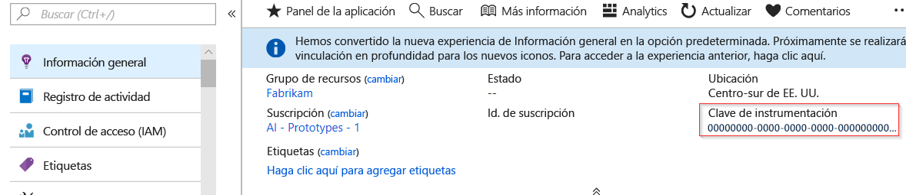
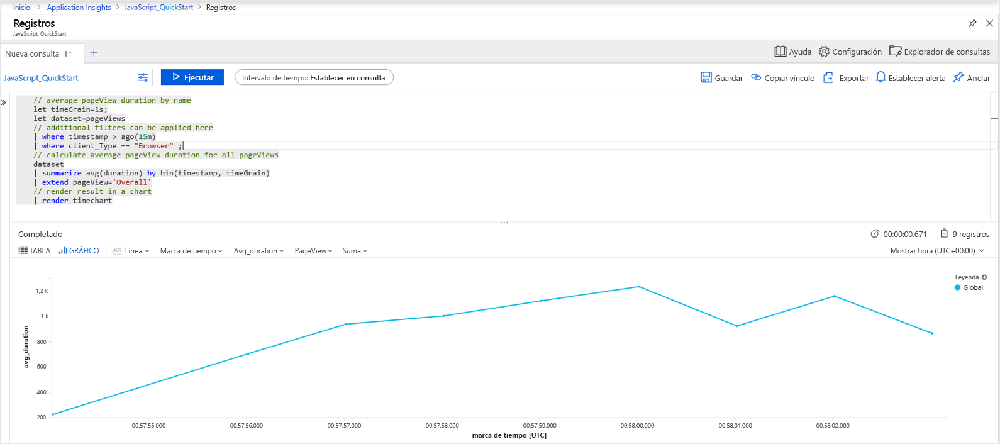
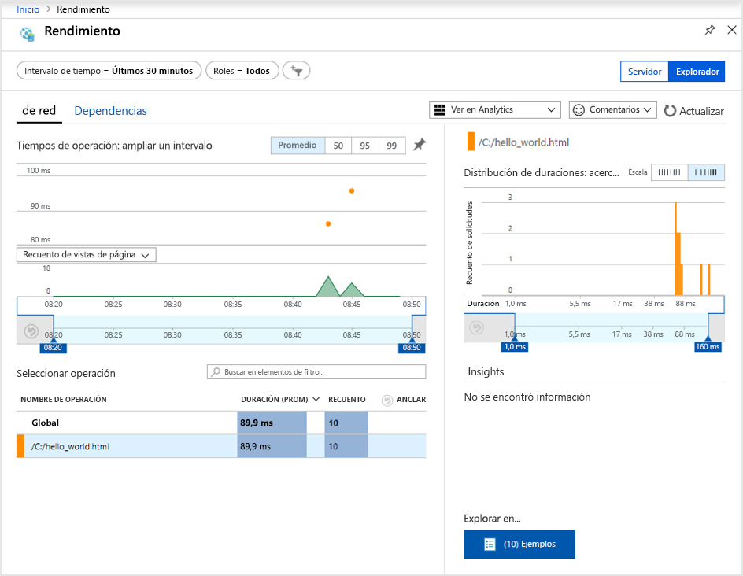
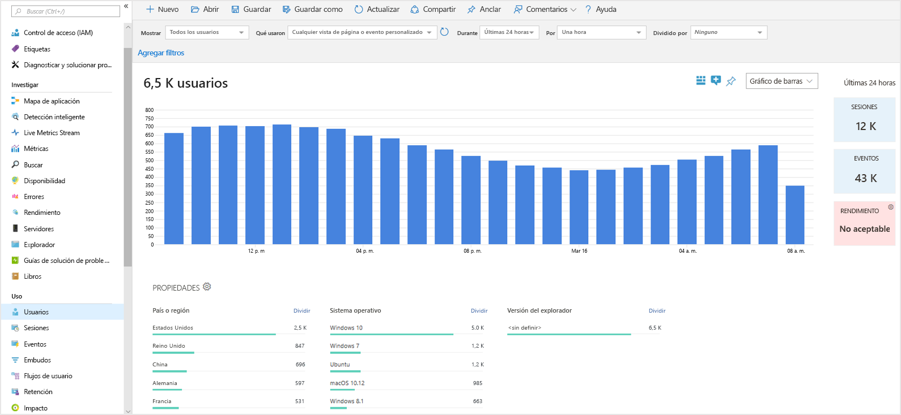
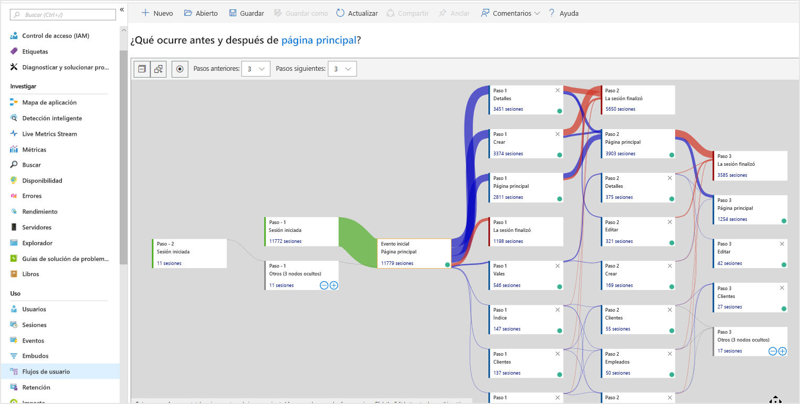

# <a name="quickstart-start-monitoring-your-website-with-azure-monitor-application-insights"></a>Inicio rápido: Empezar a supervisar un sitio web con Azure Monitor Application Insights

En este inicio rápido, aprenderá a agregar el SDK de JavaScript para Application Insights de código abierto a un sitio web. También aprenderá a conocer mejor la experiencia de lado cliente/explorador de los visitantes de su sitio web.

Con Application Insights de Azure Monitor puede supervisar fácilmente la disponibilidad, el rendimiento y el uso del sitio web. También puede identificar y diagnosticar errores en la aplicación rápidamente sin tener que esperar a que un usuario informe de ellos. Application Insights proporciona funcionalidades de supervisión tanto del lado servidor como del lado cliente/explorador.

## <a name="prerequisites"></a>Prerrequisitos

* Una cuenta de Azure con una suscripción activa. [Cree una cuenta gratuita](https://azure.microsoft.com/free/?ref=microsoft.com&utm_source=microsoft.com&utm_medium=docs&utm_campaign=visualstudio).
* Un sitio web al que puede agregar el SDK de JavaScript para Application Insights.

## <a name="enable-application-insights"></a>Habilitación de Application Insights

Application Insights recopila datos de telemetría desde cualquier aplicación conectada a Internet, mediante la ejecución local o en la nube. Siga estos pasos para empezar a ver los datos.

1. Inicie sesión en [Azure Portal](https://portal.azure.com/).
2. Seleccione **Crear un recurso** > **Herramientas de administración** > **Application Insights**.

   > [!NOTE]
   >Si esta es la primera vez que crea un recurso de Application Insights, puede obtener más información en el artículo [Creación de recursos en Application Insights](https://docs.microsoft.com/azure/azure-monitor/app/create-new-resource).

   Aparece un cuadro de configuración, use la tabla siguiente para rellenar los campos de entrada.

    | Configuración        | Value           | Descripción  |
   | ------------- |:-------------|:-----|
   | **Nombre**      | Nombre único global | Nombre que identifica la aplicación que está supervisando. |
   | **Grupo de recursos**     | myResourceGroup      | Nombre del nuevo grupo de recursos que hospeda los datos de Application Insights. puede crear un grupo de recursos o use uno existente. |
   | **Ubicación** | Este de EE. UU. | Elija una ubicación cerca de usted o de donde se hospeda la aplicación |

3. Haga clic en **Crear**.

## <a name="create-an-html-file"></a>Creación de un archivo HTML

1. En el equipo local, cree un archivo llamado ``hello_world.html``. En este ejemplo el archivo se colocará en la raíz de la unidad C: en ``C:\hello_world.html``.
2. Copie el script siguiente en ``hello_world.html``:

    ```html
    <!DOCTYPE html>
    <html>
    <head>
    <title>Azure Monitor Application Insights</title>
    </head>
    <body>
    <h1>Azure Monitor Application Insights Hello World!</h1>
    <p>You can use the Application Insights JavaScript SDK to perform client/browser-side monitoring of your website. To learn about more advanced JavaScript SDK configurations visit the <a href="https://github.com/Microsoft/ApplicationInsights-JS/blob/master/API-reference.md" title="API Reference">API reference</a>.</p>
    </body>
    </html>
    ```

## <a name="configure-application-insights-sdk"></a>Configuración del SDK de Application Insights

1. Seleccione **Introducción** > **Información esencial** > copie la **clave de instrumentación** de la aplicación.

   

2. Agregue el siguiente script en ``hello_world.html`` antes de la etiqueta de cierre ``</head>``:

   ```javascript
   <script type="text/javascript">
      var sdkInstance="appInsightsSDK";window[sdkInstance]="appInsights";var aiName=window[sdkInstance],aisdk=window[aiName]||function(e){function n(e){t[e]=function(){var n=arguments;t.queue.push(function(){t[e].apply(t,n)})}}var t={config:e};t.initialize=!0;var i=document,a=window;setTimeout(function(){var n=i.createElement("script");n.src=e.url||"https://az416426.vo.msecnd.net/scripts/b/ai.2.min.js",i.getElementsByTagName("script")[0].parentNode.appendChild(n)});try{t.cookie=i.cookie}catch(e){}t.queue=[],t.version=2;for(var r=["Event","PageView","Exception","Trace","DependencyData","Metric","PageViewPerformance"];r.length;)n("track"+r.pop());n("startTrackPage"),n("stopTrackPage");var s="Track"+r[0];if(n("start"+s),n("stop"+s),n("setAuthenticatedUserContext"),n("clearAuthenticatedUserContext"),n("flush"),!(!0===e.disableExceptionTracking||e.extensionConfig&&e.extensionConfig.ApplicationInsightsAnalytics&&!0===e.extensionConfig.ApplicationInsightsAnalytics.disableExceptionTracking)){n("_"+(r="onerror"));var o=a[r];a[r]=function(e,n,i,a,s){var c=o&&o(e,n,i,a,s);return!0!==c&&t["_"+r]({message:e,url:n,lineNumber:i,columnNumber:a,error:s}),c},e.autoExceptionInstrumented=!0}return t}(
      {
         instrumentationKey:"INSTRUMENTATION_KEY"
      }
      );window[aiName]=aisdk,aisdk.queue&&0===aisdk.queue.length&&aisdk.trackPageView({});
   </script>
   ```

3. Modifique ``hello_world.html`` y agregue la clave de instrumentación.

4. Abra ``hello_world.html`` en una sesión de explorador local. Esta acción crea una vista de página individual. Puede actualizar el explorador para generar varias vistas de páginas de prueba.

## <a name="start-monitoring-in-the-azure-portal"></a>Inicio de la supervisión en Azure Portal

1. Ya puede volver a abrir la página de **información general** de Application Insights en Azure Portal para ver los detalles de la aplicación en ejecución. La página de **información general** es donde ha recuperado la clave de instrumentación. Los cuatro gráficos predeterminados de la página de introducción se extienden a los datos de la aplicación del lado servidor. Dado que estamos instrumentando las interacciones del lado cliente/explorador con el SDK de JavaScript, esta vista concreta no se aplica, salvo que también tengamos instalado un SDK del lado servidor.

2. Haga clic en el  **Analytics**.  Esta acción abre **Analytics**, que proporciona un lenguaje de consulta avanzado para analizar todos los datos recopilados por Application Insights. Para ver los datos relacionados con las solicitudes de explorador del lado cliente, ejecute la siguiente consulta:

    ```kusto
    // average pageView duration by name
    let timeGrain=1s;
    let dataset=pageViews
    // additional filters can be applied here
    | where timestamp > ago(15m)
    | where client_Type == "Browser" ;
    // calculate average pageView duration for all pageViews
    dataset
    | summarize avg(duration) by bin(timestamp, timeGrain)
    | extend pageView='Overall'
    // render result in a chart
    | render timechart
    ```

   

3. Vuelva a la página **Introducción**. Haga clic en **Explorador** en el encabezado **Investigar** y, después, seleccione **Rendimiento**. Aquí encontrará las métricas relacionadas con el rendimiento del sitio web. También hay una vista correspondiente para analizar los errores y excepciones de su sitio web. Puede hacer clic en **Ejemplos** para profundizar en los detalles de cada transacción. Desde aquí, puede tener acceso a la experiencia de los [detalles de la transacción de un extremo a otro](../../azure-monitor/app/transaction-diagnostics.md).

   

4. Para comenzar a explorar las [herramientas de análisis del comportamiento del usuario](../../azure-monitor/app/usage-overview.md), en el menú principal de Application Insights seleccione [**Usuarios**](../../azure-monitor/app/usage-segmentation.md) bajo el encabezado **Uso**. Como las pruebas se realizan desde una sola máquina, solo se verán los datos de un usuario. Para un sitio web en vivo, la distribución de los usuarios podría tener el aspecto siguiente:

     

5. Si se hubiera instrumentado un sitio web más complejo con múltiples páginas, otra herramienta útil es [**Flujos de usuario**](../../azure-monitor/app/usage-flows.md). Con **Flujos de usuario** puede hacer un seguimiento de la ruta que siguen los visitantes a través de las distintas partes del sitio web.

   

Para obtener configuraciones más avanzadas para supervisar sitios web, consulte la [referencia a JavaScript SDK API](https://github.com/Microsoft/ApplicationInsights-JS/blob/master/API-reference.md).

## <a name="clean-up-resources"></a>Limpieza de recursos

Si planea realizar otros inicios rápidos o tutoriales, no limpie los recursos creados en este inicio rápido. Sin embargo, si no tiene previsto continuar, siga estos pasos para eliminar todos los recursos creados en esta guía de inicio rápido en Azure Portal.

> [!NOTE]
> Si ha usado un grupo de recursos existente, las instrucciones siguientes no funcionarán y solo necesitará eliminar el recurso individual de Application Insights. Tenga esto en cuenta que cada vez que se elimina un grupo de recursos, se eliminarán todos los recursos de subyacente que sean miembros de ese grupo.

1. En el menú izquierdo de Azure Portal, haga clic en **Grupos de recursos** y en **myResourceGroup**.
2. En la página del grupo de recursos, haga clic en **Eliminar**, escriba **myResourceGroup** en el cuadro de texto y haga clic en **Eliminar**.

## <a name="next-steps"></a>Pasos siguientes

> [!div class="nextstepaction"]
> [Búsqueda y diagnóstico de problemas de rendimiento](https://docs.microsoft.com/azure/application-insights/app-insights-analytics)
