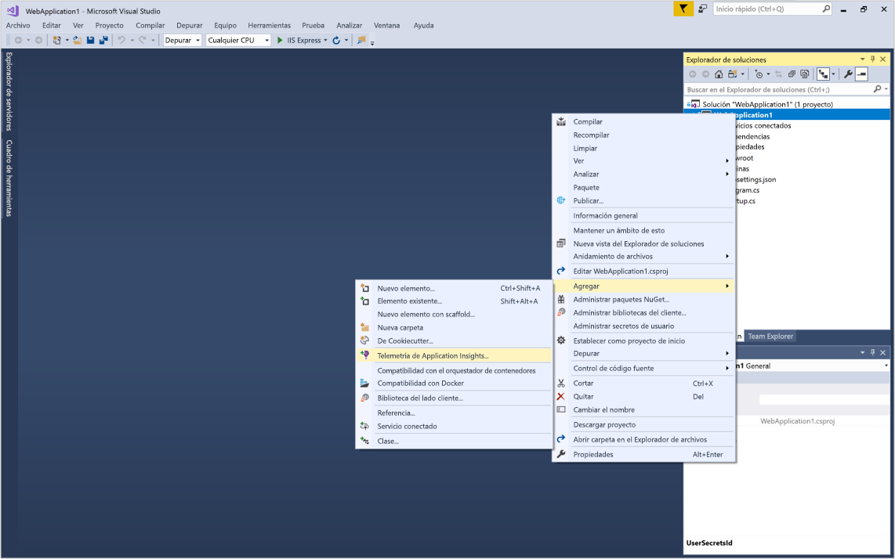
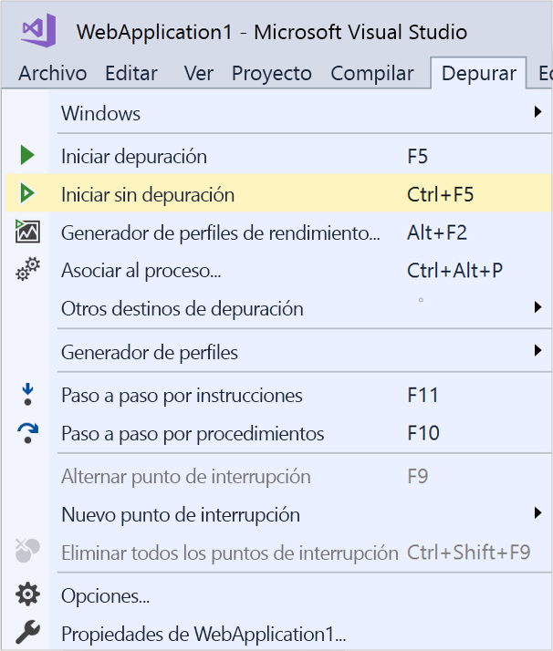
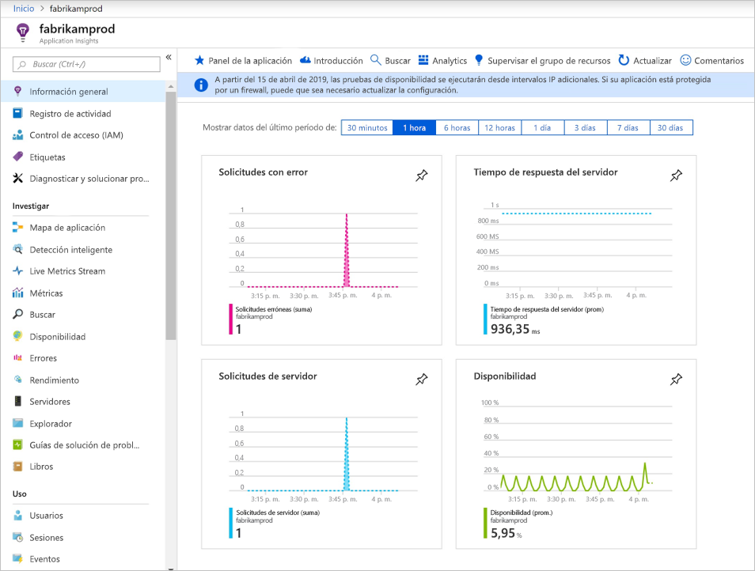
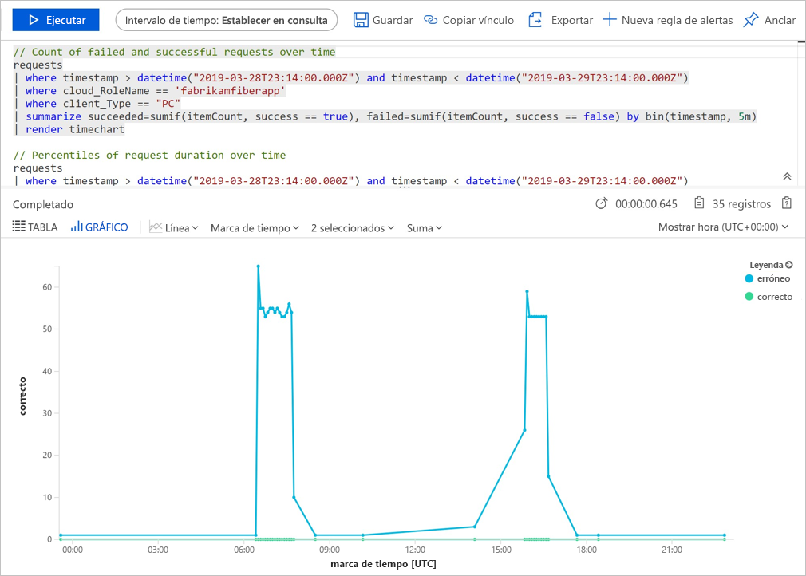
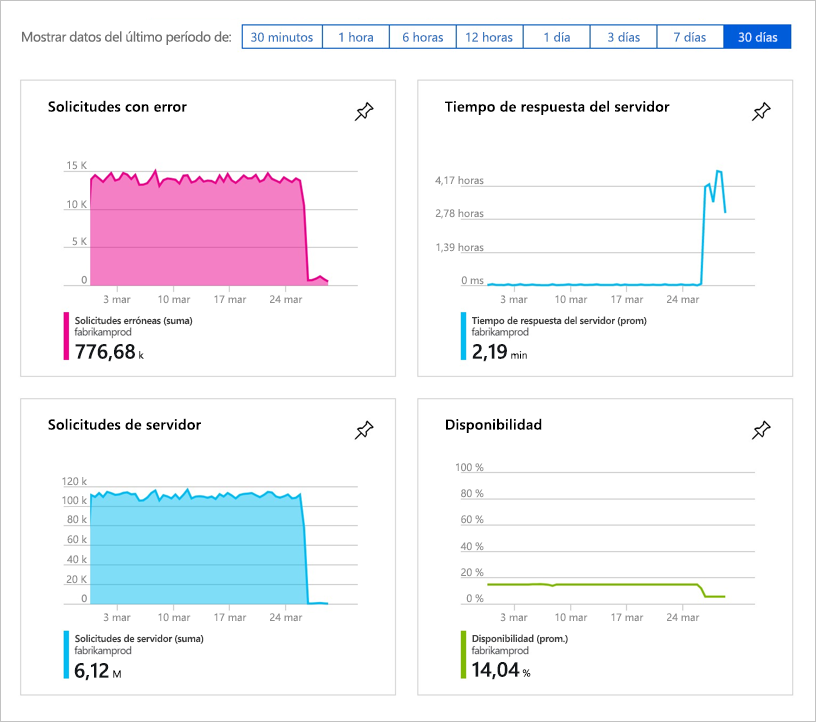
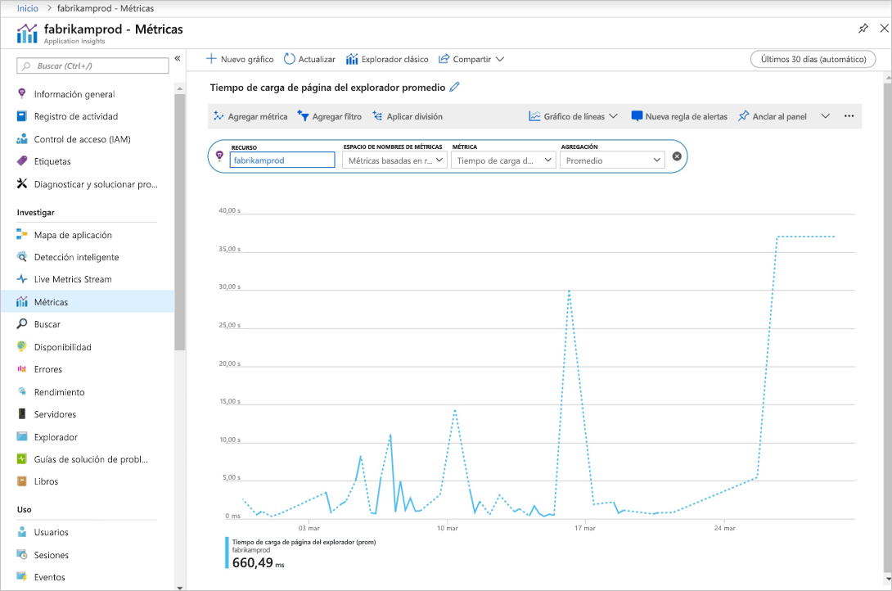

# Inicio de la supervisión de la aplicación web ASP.NET Core

Con Azure Application Insights puede supervisar fácilmente la disponibilidad, el rendimiento y el uso de su aplicación web. También puede identificar y diagnosticar errores en la aplicación rápidamente sin tener que esperar a que un usuario informe de ellos. 

Esta guía de inicio rápido le ayudará a agregar el SDK de Application Insights a una aplicación web ASP.NET Core existente. Para información sobre cómo configurar Application Insights sin Visual Studio, consulte este [artículo](https://docs.microsoft.com/azure/azure-monitor/app/asp-net-core).

## Prerrequisitos

Para completar esta guía de inicio rápido:

- [Instale Visual Studio 2019](https://visualstudio.microsoft.com/downloads/?utm_medium=microsoft&utm_source=docs.microsoft.com&utm_campaign=inline+link&utm_content=download+vs2019) con las cargas de trabajo siguientes:
  - ASP.NET y desarrollo web
  - Desarrollo de Azure
- [Instalación del SDK de .NET Core 2.0](https://dotnet.microsoft.com/download)
- Necesitará una suscripción de Azure y una aplicación web .NET Core existente.

Si no tiene una aplicación web ASP.NET Core, puede usar nuestra guía detallada para [crear una aplicación ASP.NET Core y agregar Application Insights.](../../azure-monitor/app/asp-net-core.md)

Si no tiene una suscripción a Azure, cree una cuenta [gratuita](https://azure.microsoft.com/free/) antes de empezar.

## Inicio de sesión en Azure Portal

Inicie sesión en [Azure Portal](https://portal.azure.com/).

## Habilitación de Application Insights

Application Insights recopila datos de telemetría desde cualquier aplicación conectada a Internet, independientemente de si se está ejecutando localmente o en la nube. Siga estos pasos para empezar a ver los datos.

1. Seleccione **Crear un recurso** > **Herramientas de desarrollo** > **Application Insights**.

   > [!NOTE]
   >Si esta es la primera vez que crea un recurso de Application Insights, puede obtener más información visitando la documentación [Creación de recursos en Application Insights](https://docs.microsoft.com/azure/azure-monitor/app/create-new-resource).

    Aparece un cuadro de configuración, use la tabla siguiente para rellenar los campos de entrada.

   | Configuración        |  Value           | Descripción  |
   | ------------- |:-------------|:-----|
   | **Nombre**      | Nombre único global | Nombre que identifica la aplicación que se está supervisando |
   | **Grupo de recursos**     | myResourceGroup      | Nombre del nuevo grupo de recursos que hospedará los datos de Application Insights. puede crear un grupo de recursos o use uno existente. |
   | **Ubicación** | Este de EE. UU. | Elija una ubicación cerca de usted o de donde se hospeda la aplicación |

2. Haga clic en **Crear**.

## Configuración del SDK de Application Insights

1. Abra el **proyecto** de la aplicación web ASP.NET Core en Visual Studio > haga clic con el botón derecho en el nombre de la aplicación en el **Explorador de soluciones** > seleccione **Agregar** > **Telemetría de Application Insights**.

    

2. Haga clic en el botón **Comenzar**

3. Seleccione su cuenta y su suscripción > Seleccione el **recurso existente** que creó en Azure Portal > Haga clic en **Registrar**.

4. Seleccione **Proyecto** > **Administrar paquetes NuGet** > **Origen de paquete: Nuget.org** > **Actualizar** para actualizar los paquetes del SDK de Application Insights a la versión estable más reciente.

5. Seleccione **Depurar** > **Iniciar sin depurar** (Ctrl + F5) para iniciar la aplicación.

    

> [!NOTE]
> Los datos tardan unos 3-5 minutos en empezar a aparecer en el portal. Si se trata de una aplicación de prueba de poco tráfico, tenga en cuenta que la mayoría de las métricas se capturan solo cuando hay solicitudes u operaciones activas.

## Inicio de la supervisión en Azure Portal

1. Vuelva a abrir la **Información general** de Application Insights en Azure Portal; para ello, seleccione **Inicio** y, bajo los recursos recientes, seleccione el recurso que creó anteriormente para ver los detalles acerca de la aplicación que se ejecuta actualmente.

   

2. Haga clic en **Mapa de la aplicación** para ver un diseño visual de las relaciones de dependencia entre los componentes de la aplicación. Cada componente muestra KPI como la carga, el rendimiento, errores y alertas.

   

3. Haga clic en el icono **App Analytics****Ver en Analytics**. Se abrirá **Application Insights Analytics**, que proporciona un lenguaje de consulta avanzado para analizar todos los datos recopilados por Application Insights. En este caso, se genera una consulta que representa el número de solicitudes en un gráfico. Puede escribir sus propias consultas para analizar otros datos.

   

4. Vuelva a la página **Información general** y examine los paneles de indicadores clave de rendimiento.  Este panel proporciona estadísticas sobre el estado de aplicación, incluido el número de solicitudes entrantes, la duración de las solicitudes y los errores que se producen. 

   

5. A la izquierda, haga clic en **Métrica**. Utilice el Explorador de métricas para investigar el estado y la utilización del recurso. Puede hacer clic en **Agregar nuevo gráfico** para crear vistas personalizadas adicionales o seleccionar **Editar** para modificar los tipos de gráfico existentes, el alto, la paleta de colores, las agrupaciones o las métricas. Por ejemplo, puede hacer un gráfico que muestre el tiempo de carga de páginas promedio del explorador si selecciona "Tiempo de carga de páginas del explorador" en la lista desplegable de las métricas y "Promedio" en la agregación. Para más información acerca del Explorador de métricas de Azure, consulte [Introducción al Explorador de métricas de Azure](../../azure-monitor/platform/metrics-getting-started.md).

     

## Vídeo

- Vídeo externo detallado sobre cómo [configurar Application Insights con .NET Core y Visual Studio](https://www.youtube.com/watch?v=NoS9UhcR4gA&t) desde cero.
- Vídeo externo detallado sobre cómo [configurar Application Insights con .NET Core y Visual Studio Code](https://youtu.be/ygGt84GDync) desde cero.

## Limpieza de recursos
Cuando haya realizado las pruebas, puede eliminar el grupo de recursos y todos los recursos relacionados. Para ello, siga estos pasos.

> [!NOTE]
> Si ha usado un grupo de recursos existente, las instrucciones siguientes no funcionarán y solo necesitará eliminar el recurso individual de Application Insights. Tenga esto en cuenta que cada vez que se elimina un grupo de recursos, se eliminarán todos los recursos de subyacente que sean miembros de ese grupo.

1. En el menú izquierdo de Azure Portal, haga clic en **Grupos de recursos** y en **myResourceGroup**.
2. En la página del grupo de recursos, haga clic en **Eliminar**, escriba **myResourceGroup** en el cuadro de texto y haga clic en **Eliminar**.

## Pasos siguientes

> [!div class="nextstepaction"]
> [Búsqueda y diagnóstico de excepciones en tiempo de ejecución](https://docs.microsoft.com/azure/application-insights/app-insights-tutorial-runtime-exceptions)
