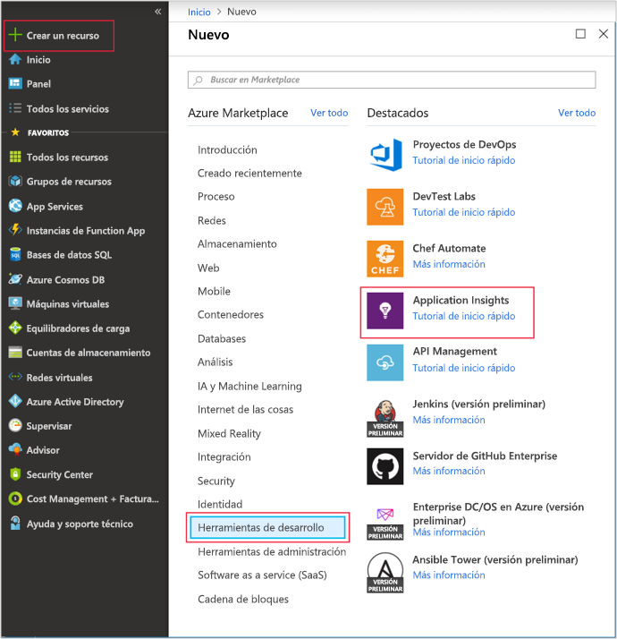
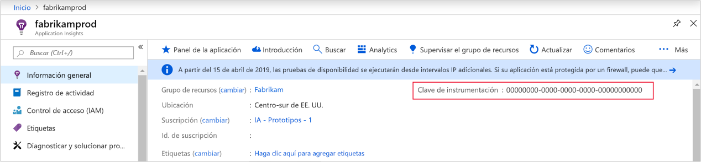
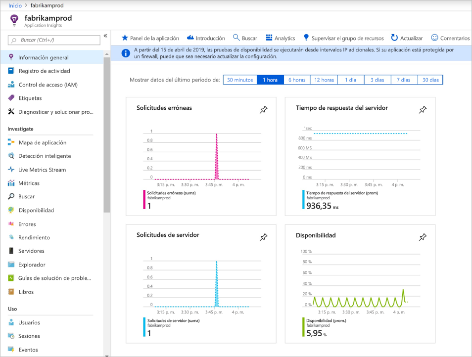
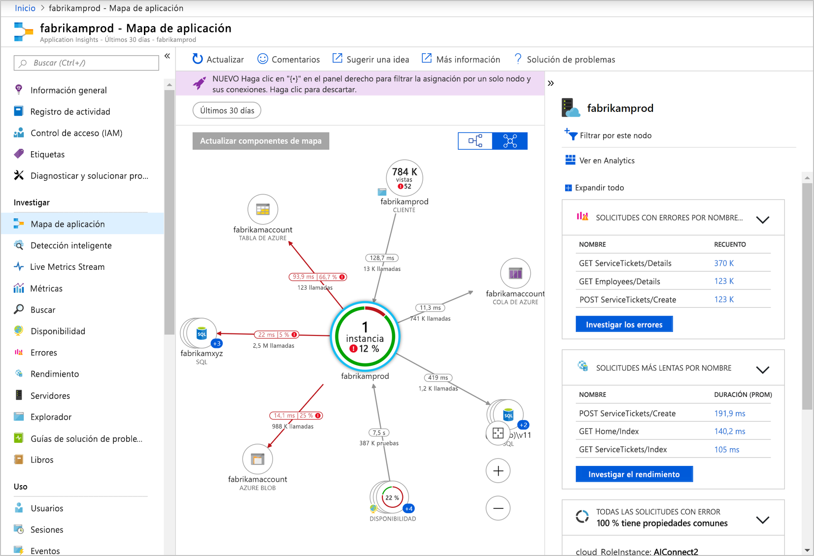
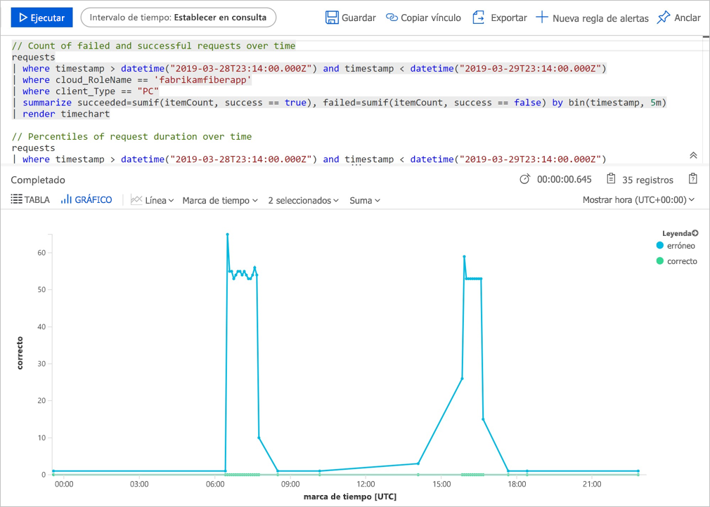
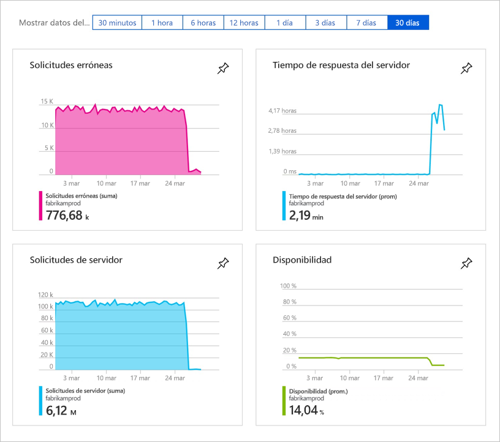
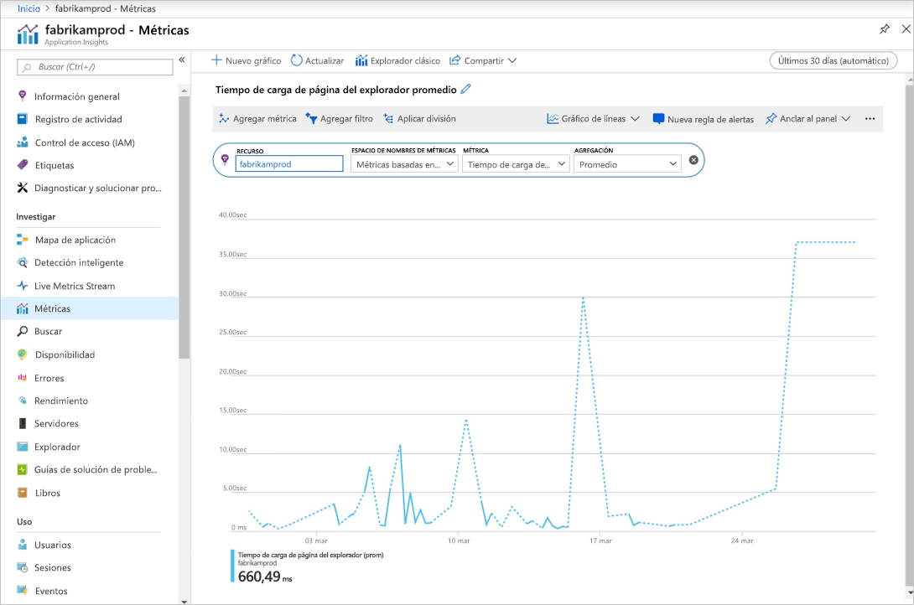

# <a name="quickstart-start-monitoring-your-nodejs-web-application-with-azure-application-insights"></a>Inicio rápido: Empiece a supervisar su aplicación web creada con Node.js con Azure Application Insights

En este inicio rápido, se agrega la versión 0.22 del SDK de Application Insights para Node.js a una aplicación web de Node.js existente.

Con Azure Application Insights puede supervisar fácilmente la disponibilidad, el rendimiento y el uso de su aplicación web. También puede identificar y diagnosticar errores en la aplicación rápidamente sin tener que esperar a que un usuario informe de ellos. Con la versión 0.20 del SDK y posteriores, puede supervisar los paquetes externos comunes, como MongoDB, MySQL y Redis.

## <a name="prerequisites"></a>Prerrequisitos

* Una cuenta de Azure con una suscripción activa. [Cree una cuenta gratuita](https://azure.microsoft.com/free/?ref=microsoft.com&utm_source=microsoft.com&utm_medium=docs&utm_campaign=visualstudio).
* Una aplicación de Node.js en funcionamiento.

## <a name="enable-application-insights"></a>Habilitación de Application Insights

Application Insights puede recopilar datos de telemetría de cualquier aplicación conectada a Internet, independientemente de que se ejecute en un entorno local o en la nube. Siga estos pasos para empezar a ver los datos.

1. Inicie sesión en [Azure Portal](https://portal.azure.com/).

2. Seleccione **Crear un recurso** > **Herramientas de desarrollo** > **Application Insights**.

   

   > [!NOTE]
   >Si esta es la primera vez que crea un recurso de Application Insights, puede obtener más información visitando la documentación [Creación de recursos en Application Insights](https://docs.microsoft.com/azure/azure-monitor/app/create-new-resource).

   Aparece una página de configuración, use la tabla siguiente para rellenar los campos de entrada. 

    | Configuración        | Value           | Descripción  |
   | ------------- |:-------------|:-----|
   | **Nombre**      | Nombre único global | Nombre que identifica la aplicación que está supervisando. |
   | **Grupo de recursos**     | myResourceGroup      | Nombre del nuevo grupo de recursos que hospedará los datos de AppInsights. puede crear un grupo de recursos o use uno existente. |
   | **Ubicación** | Este de EE. UU. | Elija una ubicación cerca de usted o de donde se hospeda la aplicación |

3. Seleccione **Crear**.

## <a name="configure-appinsights-sdk"></a>Configuración del SDK de AppInsights

1. Seleccione **Información general** y copie la **clave de instrumentación** de la aplicación.

   

2. Agregue el SDK de Application Insights para Node.js a la aplicación. Desde la carpeta raíz de la aplicación, ejecute:

   ```bash
   npm install applicationinsights --save
   ```

3. Edite el primer archivo *.js* de la aplicación y agregue las dos líneas siguientes al principio del script. Si usa la [aplicación del inicio rápido de Node.js](https://docs.microsoft.com/azure/app-service/app-service-web-get-started-nodejs), se modificará el archivo *index.js*. Reemplace `<instrumentation_key>` por la clave de instrumentación de la aplicación. 

   ```JavaScript
   const appInsights = require('applicationinsights');
   appInsights.setup('<instrumentation_key>').start();
   ```

4. Reinicie la aplicación.

> [!NOTE]
> Los datos tardan unos 3-5 minutos en empezar a aparecer en el portal. Si se trata de una aplicación de prueba de poco tráfico, tenga en cuenta que la mayoría de las métricas se capturan solo cuando hay solicitudes u operaciones activas.

## <a name="start-monitoring-in-the-azure-portal"></a>Inicio de la supervisión en Azure Portal

1. Ahora puede volver a abrir la página **Introducción** de Application Insights en Azure Portal; para ello, de donde recuperó la clave de instrumentación, para ver los detalles de la aplicación en ejecución.

   

2. Seleccione **Mapa de la aplicación** para ver un diseño visual de las relaciones de dependencia entre los componentes de la aplicación. Cada componente muestra KPI como la carga, el rendimiento, errores y alertas.

   

3. Seleccione el icono **App Analytics** **Ver en Analytics**.  Esta acción abre **Application Insights Analytics**, que proporciona un lenguaje de consulta avanzado para analizar todos los datos recopilados por Application Insights. En este caso, se genera una consulta que representa el número de solicitudes en un gráfico. Puede escribir sus propias consultas para analizar otros datos.

   

4. Vuelva a la página **Información general** y examine los gráficos de indicadores clave de rendimiento.  Este panel proporciona estadísticas sobre el estado de aplicación, incluido el número de solicitudes entrantes, la duración de las solicitudes y los errores que se producen.

   

   Para habilitar el gráfico **Tiempo de carga de la vista de página** que se rellenará con los datos de **Telemetría del lado cliente**, agregue este script para cada página de las que desee realizar el seguimiento:

   ```HTML
   <!-- 
   To collect user behavior analytics tools about your application, 
   insert the following script into each page you want to track.
   Place this code immediately before the closing </head> tag,
   and before any other scripts. Your first data will appear 
   automatically in just a few seconds.
   -->
   <script type="text/javascript">
     var appInsights=window.appInsights||function(config){
       function i(config){t[config]=function(){var i=arguments;t.queue.push(function(){t[config].apply(t,i)})}}var t={config:config},u=document,e=window,o="script",s="AuthenticatedUserContext",h="start",c="stop",l="Track",a=l+"Event",v=l+"Page",y=u.createElement(o),r,f;y.src=config.url||"https://az416426.vo.msecnd.net/scripts/a/ai.0.js";u.getElementsByTagName(o)[0].parentNode.appendChild(y);try{t.cookie=u.cookie}catch(p){}for(t.queue=[],t.version="1.0",r=["Event","Exception","Metric","PageView","Trace","Dependency"];r.length;)i("track"+r.pop());return i("set"+s),i("clear"+s),i(h+a),i(c+a),i(h+v),i(c+v),i("flush"),config.disableExceptionTracking||(r="onerror",i("_"+r),f=e[r],e[r]=function(config,i,u,e,o){var s=f&&f(config,i,u,e,o);return s!==!0&&t["_"+r](config,i,u,e,o),s}),t
       }({
           instrumentationKey:"<insert instrumentation key>"
       });
       
       window.appInsights=appInsights;
       appInsights.trackPageView();
   </script>
   ```

5. En el lado izquierdo, seleccione **Métrica**. Utilice el Explorador de métricas para investigar el estado y la utilización del recurso. Puede seleccionar **Agregar nuevo gráfico** para crear vistas personalizadas adicionales o seleccionar **Editar** para modificar los tipos de gráfico existentes, el alto, la paleta de colores, las agrupaciones o las métricas. Por ejemplo, puede hacer un gráfico que muestre el tiempo de carga de páginas promedio del explorador si selecciona "Tiempo de carga de páginas del explorador" en la lista desplegable de las métricas y "Promedio" en la agregación. Para más información acerca del Explorador de métricas de Azure, consulte [Introducción al Explorador de métricas de Azure](../../azure-monitor/platform/metrics-getting-started.md).

   

Para más información sobre la supervisión de Node.js, consulte la [documentación adicional de Node.js con Application Insights](../../azure-monitor/app/nodejs.md).

## <a name="clean-up-resources"></a>Limpieza de recursos

Cuando haya finalizado las pruebas, puede eliminar el grupo de recursos y todos los recursos relacionados. Para ello, siga estos pasos.

> [!NOTE]
> Si ha usado un grupo de recursos existente, las instrucciones siguientes no funcionarán y solo necesitará eliminar el recurso individual de Application Insights. Tenga esto en cuenta que cada vez que se elimina un grupo de recursos, se eliminarán todos los recursos de subyacente que sean miembros de ese grupo.

1. En el menú izquierdo de Azure Portal, seleccione **Grupos de recursos** y **myResourceGroup**.
2. En la página del grupo de recursos, seleccione **Eliminar**, escriba **myResourceGroup** en el cuadro de texto y, después, seleccione **Eliminar**.

## <a name="next-steps"></a>Pasos siguientes

> [!div class="nextstepaction"]
> [Búsqueda y diagnóstico de problemas de rendimiento](https://docs.microsoft.com/azure/application-insights/app-insights-analytics)
