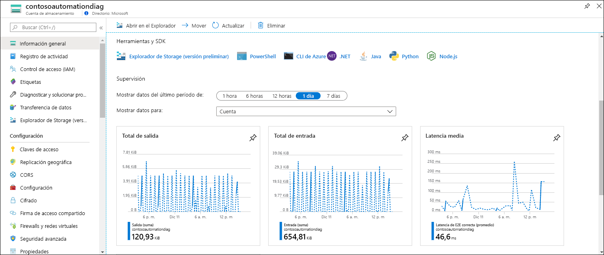
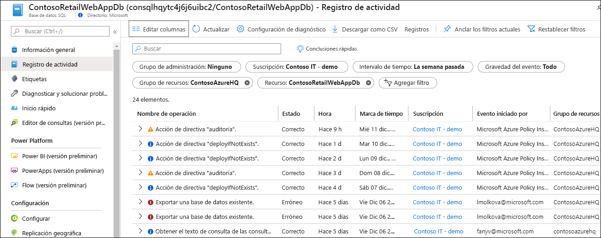
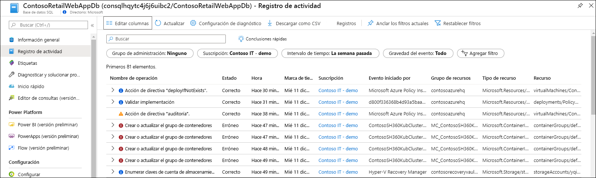
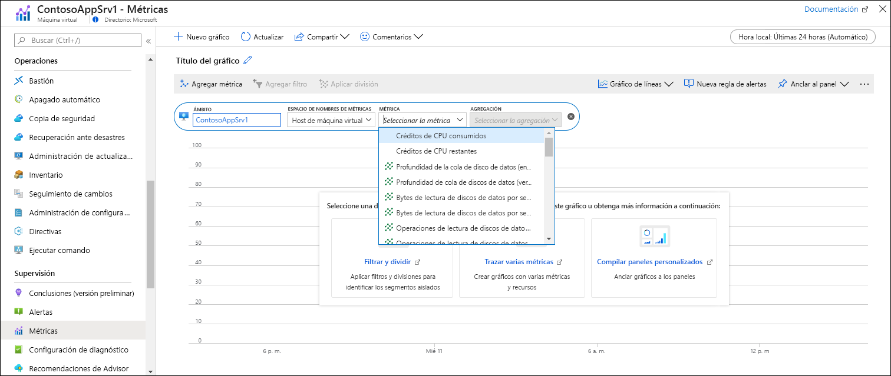
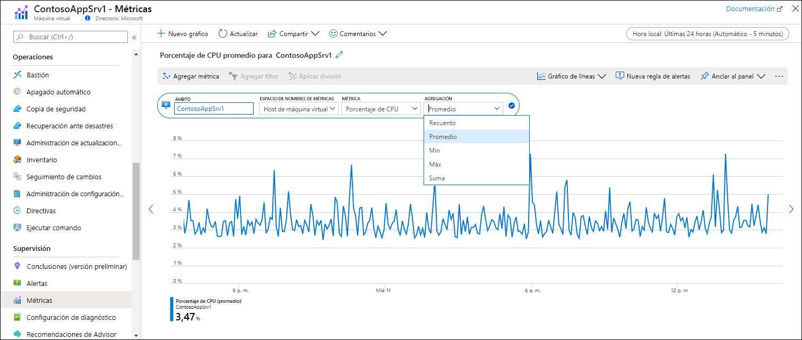
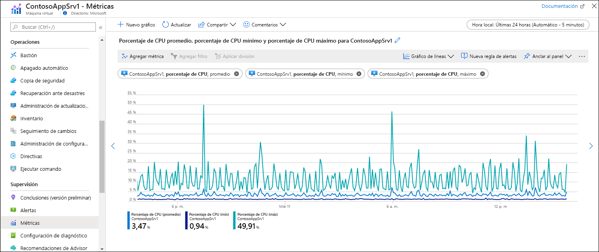

# Inicio rápido: Supervisión de recursos de Azure con Azure Monitor
[Azure Monitor](../overview.md) comienza a recopilar datos de los recursos de Azure en el momento en que se crean. Este inicio rápido proporciona un breve tutorial de los datos que se recopilan automáticamente para un recurso y de cómo verlos en la instancia de Azure Portal de un recurso determinado. Posteriormente puede agregar la configuración necesaria para recopilar datos adicionales y puede ir al menú de Azure Monitor para usar las mismas herramientas para acceder a los datos recopilados de todos los recursos de la suscripción.

Para obtener descripciones más detalladas de los datos de supervisión recopilados de los recursos de Azure, consulte [Supervisión de recursos de Azure con Azure Monitor](../insights/monitor-azure-resource.md).

## Inicio de sesión en Azure Portal

Inicie sesión en Azure Portal en [https://portal.azure.com](https://portal.azure.com). 

## Página de información general
Muchos servicios incluirán datos de supervisión en su página **Información general** para una vista rápida de su funcionamiento. Esto se basará, normalmente, en un subconjunto de métricas de plataforma almacenadas en Métricas de Azure Monitor.

1. Busque un recurso de Azure en su suscripción.
2. Vaya a la página **Información general** y observe si se muestran datos de rendimiento. Estos datos los datos proporcionará Azure Monitor. El ejemplo siguiente es la página **Información general** de una cuenta de Azure Storage y puede ver que se muestran varias métricas.

    

3. Puede hacer clic en cualquiera de los gráficos para abrir los datos en el explorador de métricas, que se describe a continuación.

## Visualización del registro de actividad
El registro de actividad proporciona información sobre las operaciones de los recursos de Azure de la suscripción. Aquí se incluirá información como cuándo se crea o modifica un recurso, cuándo se inicia un trabajo o cuándo se produce una operación determinada.

1. En la parte superior del menú del recurso, seleccione **Registro de actividad**.
2. El filtro actual se establece en los eventos relacionados con el recurso. Si no ve ningún evento, pruebe a cambiar el valor de **Intervalo de tiempo** para aumentar el ámbito de tiempo.

    

4. Si desea ver los eventos de otros recursos de la suscripción, cambie los criterios del filtro o incluso quite las propiedades del filtro.

    

## Visualización de métricas
Las métricas son valores numéricos que describen algún aspecto de un recurso en un momento concreto. Azure Monitor recopila automáticamente métricas de la plataforma a intervalos de un minuto desde todos los recursos de Azure. Estas métricas también se pueden ver mediante el explorador de métricas.

1. En la sección **Supervisión** del menú de su recurso, seleccione **Métricas**. Se abrirá el explorador de métricas con el ámbito establecido en el recurso.
2. Haga clic en **Agregar métrica** para agregar una métrica al gráfico.
   
   
   
4. Seleccione una **métrica** en la lista desplegable y, después, una **agregación**. Así se define cómo se muestrearán los valores recopilados en cada intervalo de tiempo.

    

5. Haga clic en **Agregar métrica** para agregar más combinaciones de métricas y agregaciones al gráfico.

    

## Pasos siguientes
En este inicio rápido, ha visto el registro de actividad y las métricas de un recurso de Azure que Azure Monitor recopilan automáticamente. Los registros de recursos proporcionan información sobre el funcionamiento detallado del recurso, pero se deben configurar para que se recopilen. Vaya al tutorial para recopilar registros de recursos en un área de trabajo de Log Analytics donde se pueden analizar mediante consultas de registro.

> [!div class="nextstepaction"]
> [Recopilación y análisis de registros de recurso con Azure Monitor](tutorial-resource-logs.md)
