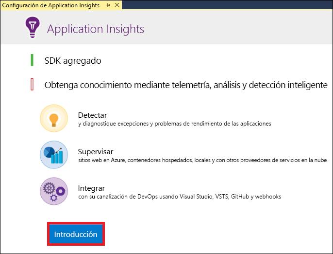
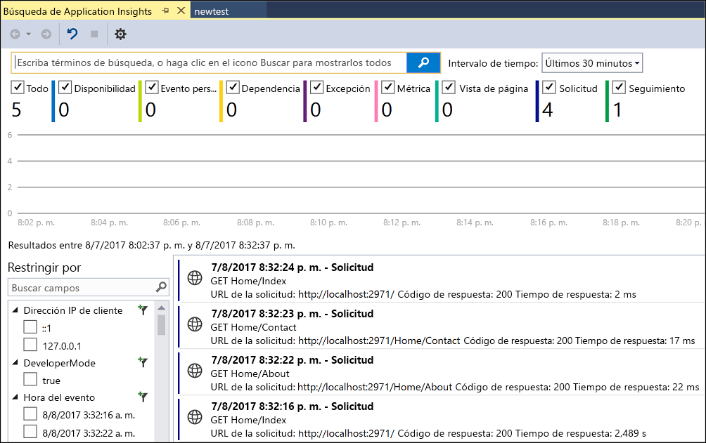
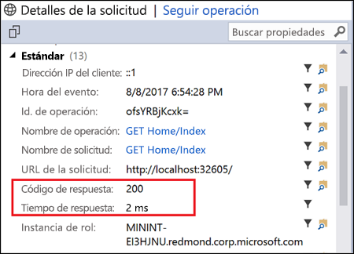
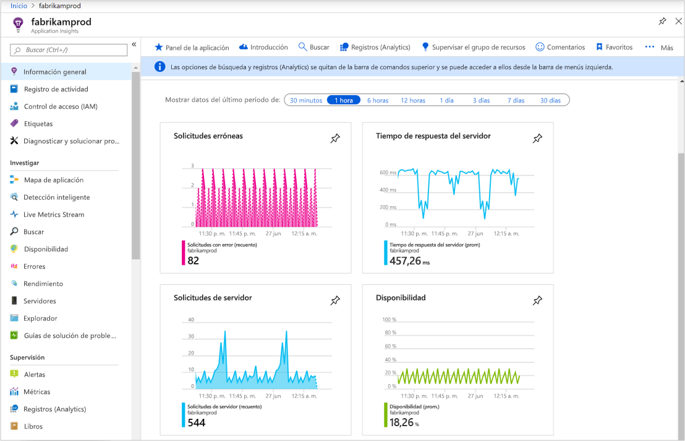
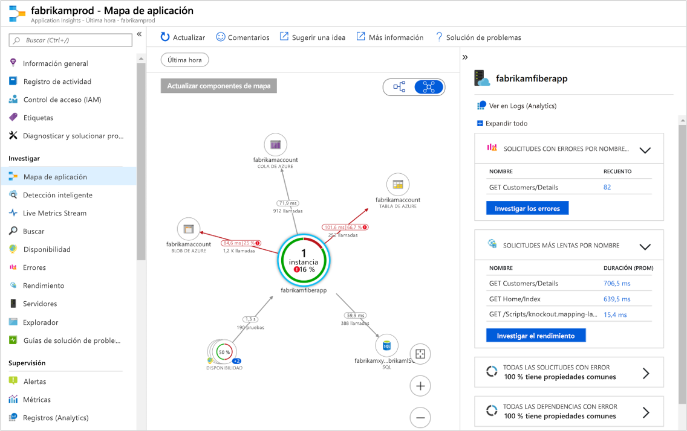
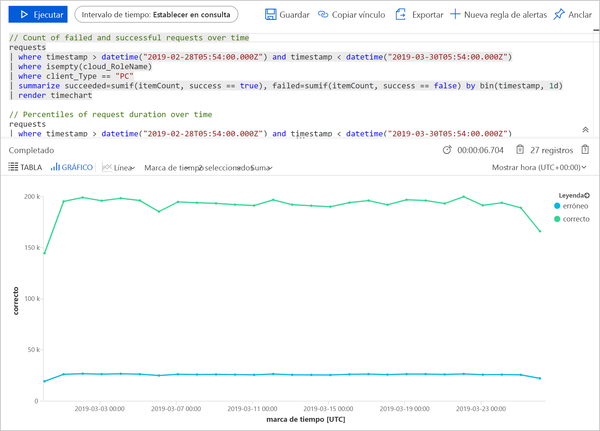
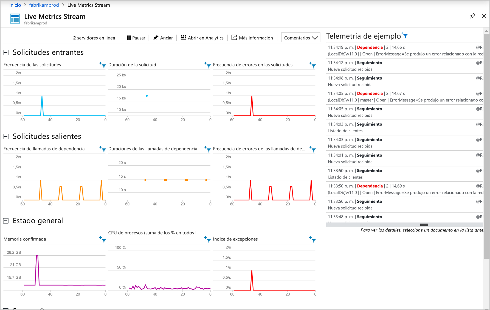

# <a name="start-monitoring-your-aspnet-web-application"></a>Inicio de la supervisión de la aplicación web ASP.NET

Con Azure Application Insights puede supervisar fácilmente la disponibilidad, el rendimiento y el uso de su aplicación web.  También puede identificar y diagnosticar errores en la aplicación rápidamente sin tener que esperar a que un usuario informe de ellos.  Con la información que recopile de Application Insights sobre el rendimiento y la eficacia de la aplicación, puede tomar decisiones informadas para hacer el mantenimiento de la aplicación y mejorarla.

En esta guía de inicio rápido se muestra cómo agregar Application Insights a una aplicación web ASP.NET existente y empezar a analizar las estadísticas en vivo, que es solo uno de los distintos métodos que puede usar para analizar la aplicación. Si no tiene una aplicación web ASP.NET, puede seguir el artículo de [Inicio rápido de creación de aplicaciones web ASP.NET](../../app-service/app-service-web-get-started-dotnet-framework.md) para crear una.

## <a name="prerequisites"></a>Prerrequisitos
Para completar esta guía de inicio rápido:

- Instale [Visual Studio 2019](https://visualstudio.microsoft.com/downloads/?utm_medium=microsoft&utm_source=docs.microsoft.com&utm_campaign=inline+link&utm_content=download+vs2019) con las cargas de trabajo siguientes:
    - ASP.NET y desarrollo web
    - Desarrollo de Azure


Si no tiene una suscripción a Azure, cree una cuenta [gratuita](https://azure.microsoft.com/free/) antes de empezar.

## <a name="enable-application-insights"></a>Habilitación de Application Insights

1. Abra el proyecto en Visual Studio 2019.
2. Seleccione **Configurar Application Insights** desde el menú Proyecto. Visual Studio agregará el SDK de Application Insights a la aplicación.

    > [!IMPORTANT]
    > El proceso para agregar Application Insights varía según el tipo de plantilla de ASP.NET. Si usa la plantilla **Vacía** o **Aplicación móvil de Azure**, seleccione **Proyecto** > **Agregar telemetría de Application Insights**. Para las demás plantillas de ASP.NET, consulte las instrucciones del paso anterior. 

3. Haga clic en **Iniciar** (en versiones anteriores de Visual Studio, haga clic en el botón **Inicio gratis**).

    

4. Seleccione su suscripción y haga clic en **Registrarse**.

5. Seleccione **Proyecto** > **Administrar paquetes NuGet** > **Origen de paquete: Nuget.org** > **Actualizar** para actualizar los paquetes del SDK de Application Insights a la versión estable más reciente.

6. Para ejecutar la aplicación, seleccione **Iniciar depuración** desde el menú **Depurar** o presionando la tecla F5.

## <a name="confirm-app-configuration"></a>Confirmación de la configuración de la aplicación

Application Insights recopila datos de telemetría para la aplicación, independientemente de dónde se ejecute. Siga estos pasos para empezar a ver los datos.

1. Abra Application Insights haciendo clic en **Ver** -> **Otras ventanas** -> **Búsqueda de Application Insights**.  Se mostrará la telemetría de la sesión actual.<BR><br>

2. Haga clic en la primera solicitud de la lista (en el ejemplo, GET Home/Index) para ver sus detalles. Observe que, junto con otra información valiosa acerca de la solicitud, se incluye el código de estado y la hora de respuesta.<br><br>

## <a name="start-monitoring-in-the-azure-portal"></a>Inicio de la supervisión en Azure Portal

Ya puede abrir Application Insights en Azure Portal para ver distintos detalles acerca de la aplicación en ejecución.

1. Expanda la carpeta **Servicios conectados** en el Explorador de soluciones y haga clic con el botón derecho en la carpeta **Application Insights** y, después, en **Abrir portal de Application Insights**.  Se mostrará cierta información acerca de la aplicación, así como varias opciones.

    

2. Haga clic en **Mapa de aplicación** para mostrar un diseño visual de las relaciones de dependencia entre los componentes de la aplicación.  Cada componente muestra KPI como la carga, el rendimiento, errores y alertas.

    

3. Haga clic en el icono **App Analytics****Ver en Registros (Analytics)** , en uno de los componentes de la aplicación. Se abrirá **Registros (Analytics)** , que proporciona un lenguaje de consulta avanzado para analizar todos los datos recopilados por Application Insights. En este caso, se genera una consulta que representa el número de solicitudes en un gráfico. Puede escribir sus propias consultas para analizar otros datos.

    

4. Haga clic en **Live Metrics Stream** a la izquierda Investigar. Se mostrarán estadísticas en vivo sobre la aplicación mientras se ejecuta. Esto incluye información como el número de solicitudes entrantes, la duración de estas y los errores que se producen. También puede inspeccionar las métricas de rendimiento crítico, como el procesador y la memoria.

    

    Si está listo para hospedar su aplicación en Azure, puede publicarla ahora. Siga los pasos que se describen en la [guía de inicio rápido para crear una aplicación web de ASP.NET](../../app-service/app-service-web-get-started-dotnet.md#update-the-app-and-redeploy).

5. Si usa Visual Studio para agregar la supervisión de Application Insights, puede agregar automáticamente la supervisión de cliente. Para agregar manualmente la supervisión de cliente a una aplicación, agregue el siguiente código de JavaScript a esta:

```html
<!-- 
To collect user behavior analytics about your application, 
insert the following script into each page you want to track.
Place this code immediately before the closing </head> tag,
and before any other scripts. Your first data will appear 
automatically in just a few seconds.
-->
<script type="text/javascript">
var appInsights=window.appInsights||function(a){
  function b(a){c[a]=function(){var b=arguments;c.queue.push(function(){c[a].apply(c,b)})}}var c={config:a},d=document,e=window;setTimeout(function(){var b=d.createElement("script");b.src=a.url||"https://az416426.vo.msecnd.net/scripts/a/ai.0.js",d.getElementsByTagName("script")[0].parentNode.appendChild(b)});try{c.cookie=d.cookie}catch(a){}c.queue=[];for(var f=["Event","Exception","Metric","PageView","Trace","Dependency"];f.length;)b("track"+f.pop());if(b("setAuthenticatedUserContext"),b("clearAuthenticatedUserContext"),b("startTrackEvent"),b("stopTrackEvent"),b("startTrackPage"),b("stopTrackPage"),b("flush"),!a.disableExceptionTracking){f="onerror",b("_"+f);var g=e[f];e[f]=function(a,b,d,e,h){var i=g&&g(a,b,d,e,h);return!0!==i&&c["_"+f](a,b,d,e,h),i}}return c
  }({
      instrumentationKey:"<your instrumentation key>"
  });

window.appInsights=appInsights,appInsights.queue&&0===appInsights.queue.length&&appInsights.trackPageView();
</script>
```

Para más información, visite el repositorio de GitHub para nuestro [SDK para JavaScript de código abierto](https://github.com/Microsoft/ApplicationInsights-JS).

## <a name="video"></a>Vídeo

* Vídeo externo detallado sobre la [configuración de Application Insights con una aplicación .NET desde cero](https://www.youtube.com/watch?v=blnGAVgMAfA).

## <a name="clean-up-resources"></a>Limpieza de recursos
Cuando haya realizado las pruebas, puede eliminar el grupo de recursos y todos los recursos relacionados. Para ello, siga estos pasos.
1. En el menú izquierdo de Azure Portal, haga clic en **Grupos de recursos** y en **myResourceGroup**.
2. En la página del grupo de recursos, haga clic en **Eliminar**, escriba **myResourceGroup** en el cuadro de texto y haga clic en **Eliminar**.

## <a name="next-steps"></a>Pasos siguientes
En este inicio rápido, ha habilitado la aplicación para que Azure Application Insights la supervise.  Continúe con las guías de inicio rápido para aprender a usarlo para supervisar las estadísticas y detectar problemas en la aplicación.

> [!div class="nextstepaction"]
> [Tutoriales de Azure Application Insights](tutorial-runtime-exceptions.md)
