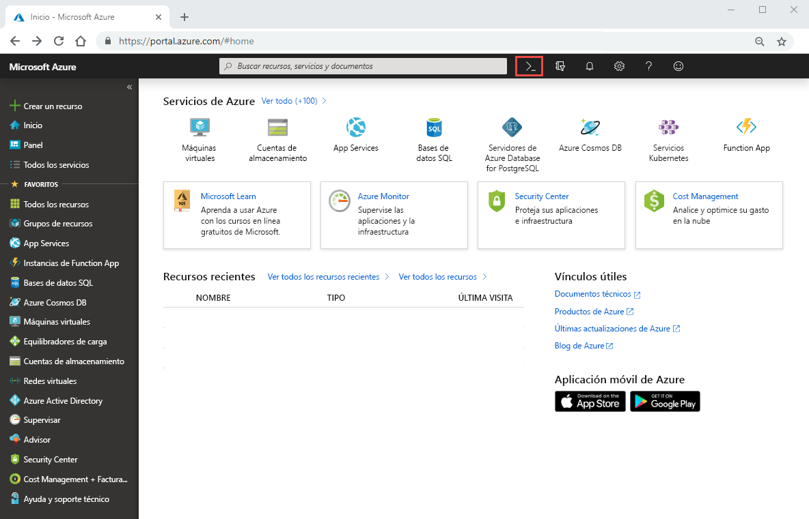

# Inicio rápido: Configuración de Azure NetApp Files y creación de un volumen de NFS 

En este artículo se muestra cómo configurar Azure NetApp Files y crear un volumen rápidamente. 

En este inicio rápido, configurará los elementos siguientes:

- Registro de Azure NetApp Files y proveedor de recursos de NetApp
- Cuenta de NetApp
- Grupo de capacidad
- Volumen de NFS para Azure NetApp Files

Si no tiene una suscripción a Azure, cree una [cuenta gratuita](https://azure.microsoft.com/free/?WT.mc_id=A261C142F) antes de empezar.

## Antes de empezar 

> [!IMPORTANT] 
> Se le debe conceder acceso al servicio Azure Files de NetApp.  Para solicitar acceso al servicio, consulte la [página de envío de la lista de espera de Azure Files de NetApp](https://forms.office.com/Pages/ResponsePage.aspx?id=v4j5cvGGr0GRqy180BHbR8cq17Xv9yVBtRCSlcD_gdVUNUpUWEpLNERIM1NOVzA5MzczQ0dQR1ZTSS4u).  Antes de continuar, debe esperar un correo electrónico de confirmación oficial del equipo de Azure NetApp Files. 

## Registro de Azure NetApp Files y del proveedor de recursos de NetApp

1. En Azure Portal, haga clic en el icono de Azure Cloud Shell en la esquina superior derecha.

    

2. Especifique la suscripción que se ha incluido en la lista blanca de Azure NetApp Files:
    
        az account set --subscription <subscriptionId>

3. Registre el proveedor de recursos de Azure: 
    
        az provider register --namespace Microsoft.NetApp --wait  

    El proceso de registro puede tardar algún tiempo en completarse.

## Creación de una cuenta de NetApp

1. En el cuadro de búsqueda de Azure Portal, escriba **Azure NetApp Files** y seleccione **Azure NetApp Files** en la lista que aparece.

      

2. Haga clic en **+ Agregar** para crear una nueva cuenta de NetApp.

     

3. En la ventana Nueva cuenta de NetApp, especifique la siguiente información: 
   1. Escriba **myaccount1** como nombre de la cuenta. 
   2. Seleccione su suscripción.
   3. Selección **Crear nuevo** para crear un grupo de recursos. Escriba **myRG1** como nombre del grupo de recursos. Haga clic en **OK**. 
   4. Seleccione la ubicación de la cuenta.  

        

      

4. Haga clic en **Crear** para crear una cuenta de NetApp.

## Configuración de un grupo de capacidad

1. En la hoja de administración de Azure NetApp Files, seleccione la cuenta de NetApp (**myaccount1**).

      

2. En la hoja de administración de Azure NetApp Files de la cuenta de NetApp, haga clic en **Grupos de capacidad**.

      

3. Haga clic en **+ Agregar grupos**. 

      

4. Especifique la información del grupo de capacidad: 
    1. Escriba **mypool1** como nombre del grupo.
    2. Seleccione **Premium** como nivel de servicio. 
    3. Especifique **4 (TiB)** como tamaño del grupo. 

5. Haga clic en **OK**.

## Creación de un volumen de NFS para Azure NetApp Files

1. En la hoja de administración de Azure NetApp Files de la cuenta de NetApp, haga clic en **Volúmenes**.

      

2. Haga clic en **+ Agregar volumen**.

      

3. En la ventana Crear un volumen, especifique la información del volumen: 
   1. Escriba **myvol1** como nombre del volumen. 
   3. Seleccione el grupo de capacidad (**mypool1**).
   4. Use el valor predeterminado de la cuota. 
   5. En la red virtual, haga clic en **Crear nueva** para crear una red virtual de Azure.  Luego, rellene la siguiente información:
       * Escriba **myvnet1** como nombre de la red virtual.
       * Especifique un espacio de direcciones para el valor, por ejemplo, 10.7.0.0/16
       * Escriba **myANFsubnet** como nombre de subred.
       * Especifique el intervalo de direcciones de la subred, por ejemplo, 10.7.0.0/24. Tenga en cuenta que la subred dedicada no se puede compartir con otros recursos.
       * Seleccione **Microsoft.NetApp/volumes** como delegación de la subred.
       * Haga clic en **Aceptar** para crear la red virtual.
   6. En la subred, seleccione la red virtual recién creada (**myvnet1**) como subred de delegado.

        

        

4. Haga clic en **Protocolo** y seleccione **NFS** como el tipo de protocolo del volumen.   

    Escriba **myfilepath1** como la ruta de acceso de archivo que se usará para crear la ruta de acceso de exportación del volumen. 

    

5. Haga clic en **Revisar + crear**.

      

5. Examine la información del volumen y haga clic en **Crear**.  
    El volumen creado aparece en la hoja Volúmenes.

      

## Limpieza de recursos

Cuando haya terminado, y si lo desea, puede eliminar el grupo de recursos. La acción de eliminar un grupo de recursos es irreversible.  

> [!IMPORTANT]
> Todos los recursos dentro de los grupos de recursos se eliminarán de forma permanente y esta acción no se puede deshacer. 

1. En el cuadro de búsqueda de Azure Portal, escriba **Azure NetApp Files** y seleccione **Azure NetApp Files** en la lista que aparece.

2. En la lista de suscripciones, haga clic en el grupo de recursos (myRG1) que quiere eliminar. 

    

3. En la página del grupo de recursos, seleccione **Eliminar grupo de recursos**.

     

    Se abre una ventana con una advertencia acerca de los recursos que se eliminarán con el grupo de recursos.

4. Escriba el nombre del grupo de recursos (myRG1) para confirmar que quiere eliminar de forma permanente el grupo de recursos y todos los recursos que contiene y, luego, haga clic en **Eliminar**.

     

## Pasos siguientes  

> [!div class="nextstepaction"]
> [Administración de volúmenes mediante Azure NetApp Files](azure-netapp-files-manage-volumes.md)  
