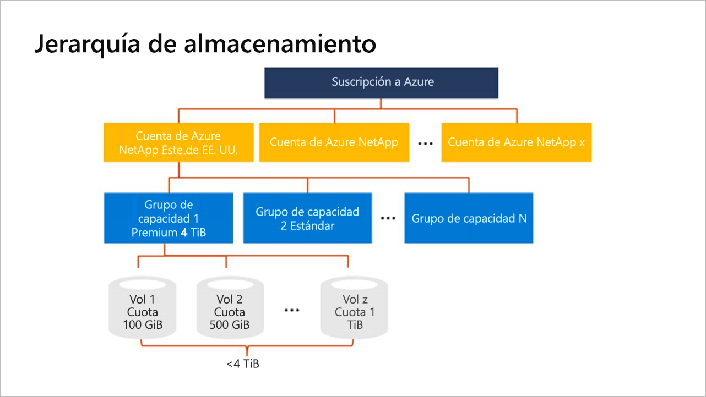

# Información sobre la jerarquía del almacenamiento de Azure NetApp Files

Antes de crear un volumen en Azure NetApp Files, debe adquirir y configurar un grupo para la capacidad aprovisionada.  Para configurar un grupo de capacidad, debe tener una cuenta de NetApp. Conocer la jerarquía de almacenamiento le ayuda a configurar y administrar los recursos de Azure NetApp Files.

## Cuentas de NetApp

- Una cuenta de NetApp actúa como una agrupación administrativa de los grupos de capacidad constituyentes.  
- No es lo mismo que la cuenta de almacenamiento general de Azure. 
- Una cuenta de NetApp es regional en el ámbito.   
- Puede tener varias cuentas de NetApp en una región, pero cada una está asociada solo a una única región.

## Grupos de capacidad

- Un grupo de capacidad se mide por su capacidad aprovisionada.  
- La capacidad se aprovisiona con las SKU fijas que adquirió (por ejemplo, una capacidad de 4 TiB).
- Un grupo de capacidad puede tener solo un nivel de servicio.  
- Cada grupo de capacidad puede pertenecer a una sola cuenta de NetApp. Sin embargo, puede tener varios grupos de capacidad dentro de una cuenta de NetApp.  
- Un grupo de capacidad no se puede mover entre las cuentas de NetApp.   
  Por ejemplo, en el [Diagrama conceptual de la jerarquía de almacenamiento](#conceptual_diagram_of_storage_hierarchy) a continuación, el grupo de capacidad 1 no se puede mover de la cuenta de NetApp Este de EE. UU. a la cuenta de NetApp Oeste de EE. UU. 2.  

## Volúmenes

- Un volumen se mide según el consumo de capacidad lógica y es escalable. 
- El consumo de la capacidad de un volumen se descuenta de la capacidad aprovisionada de su grupo.
- Cada volumen pertenece a un solo grupo, pero un grupo puede contener varios volúmenes. 
- En la misma cuenta de NetApp, puede mover un volumen a través de los grupos.    
  Por ejemplo, en el [diagrama conceptual de la jerarquía de almacenamiento](#conceptual_diagram_of_storage_hierarchy) a continuación, puede mover los volúmenes del grupo de capacidad 1 al grupo de capacidad 2.

## Diagrama conceptual de la jerarquía de almacenamiento 
El ejemplo siguiente muestra las relaciones de la suscripción de Azure, las cuentas de NetApp, los grupos de capacidad y los volúmenes.   

## Pasos siguientes

- [Límites de recursos para Azure NetApp Files](azure-netapp-files-resource-limits.md)
- [Registro en Azure NetApp Files](azure-netapp-files-register.md)
