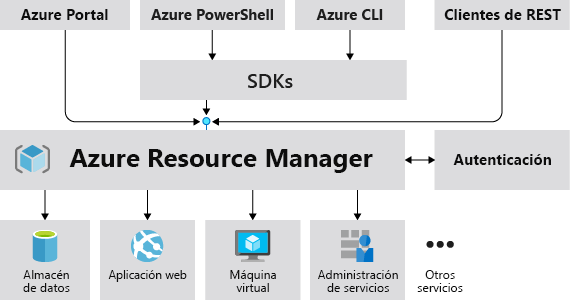
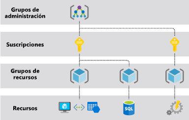

# Información general del Administrador de recursos de Azure

Azure Resource Manager es el servicio de implementación y administración para Azure. Proporciona una capa de administración que le permite crear, actualizar y eliminar recursos de su suscripción de Azure. Se usan las características de administración, como el control de acceso, la auditoría y las etiquetas, para proteger y organizar los recursos después de la implementación.

Para información acerca de las plantillas de Azure Resource Manager, consulte [Información general de la implementación de plantillas](../templates/overview.md).

## Capa de administración coherente

Cuando un usuario envía una solicitud de cualquiera de las herramientas, las API o los SDK de Azure, Resource Manager recibe la solicitud. Autentica y autoriza la solicitud. Resource Manager envía la solicitud al servicio de Azure, que lleva a cabo la acción solicitada. Dado que todas las solicitudes se controlan mediante la misma API, verá resultados y funcionalidades coherentes en todas las distintas herramientas.

En la imagen siguiente se muestra el rol que Azure Resource Manager desempeña en el control de solicitudes de Azure. 

Todas las funcionalidades que están disponibles en el portal también lo están con Azure PowerShell, la CLI de Azure, las API REST y los SDK de cliente. Las funcionalidades disponibles originalmente mediante las API se incluirán en el portal a los 180 días de su lanzamiento inicial.

## Terminología

Si no conoce Azure Resource Manager, estos son algunos términos con los que puede no estar familiarizado.

* **recurso**: elemento administrable que está disponible a través de Azure. Las máquinas virtuales, cuentas de almacenamiento, aplicaciones web, bases de datos y redes virtuales son ejemplos de recursos.
* **grupo de recursos**: contenedor que almacena los recursos relacionados con una solución de Azure. El grupo de recursos incluye los recursos que se desean administrar como grupo. Decida qué recursos pertenecen a un grupo de recursos según lo que más convenga a su organización. Consulte [Grupos de recursos](#resource-groups).
* **proveedor de recursos**: un servicio que proporciona recursos de Azure. Por ejemplo, un proveedor de recursos común es Microsoft.Compute, que proporciona el recurso de máquina virtual. Microsoft.Storage es otro proveedor de recursos común. Consulte [Tipos y proveedores de recursos](resource-providers-and-types.md).
* **Plantilla de Resource Manager**: archivo de notación de objetos JavaScript (JSON) que define uno o más recursos para implementar en un grupo de recursos o suscripción. La plantilla se puede usar para implementar los recursos de manera repetida y uniforme. Consulte [Información general de la implementación de plantillas](../templates/overview.md).
* **sintaxis declarativa**: sintaxis que permite establecer lo que pretende crear sin tener que escribir la secuencia de comandos de programación para crearla. La plantilla de Resource Manager es un ejemplo de sintaxis declarativa. En el archivo, puede definir las propiedades de la infraestructura que se va a implementar en Azure.  Consulte [Información general de la implementación de plantillas](../templates/overview.md).

## Ventajas de usar Administrador de recursos

Con Resource Manager puede:

* Administrar la infraestructura mediante plantillas declarativas en lugar de scripts.

* Implementar, administrar y supervisar todos los recursos de la solución en grupo, en lugar de controlarlos individualmente.

* Volver a implementar la solución repetidamente a lo largo del ciclo de vida del desarrollo y tener la seguridad de que los recursos se implementan de forma coherente.

* Definir las dependencias entre recursos de modo que se implementen en el orden correcto.

* Aplicar control de acceso a todos los servicios del grupo de recursos al integrarse de forma nativa Control de acceso basado en rol (RBAC) en la plataforma de administración.

* Aplicar etiquetas a los recursos para organizar de manera lógica todos los recursos de la suscripción.

* Aclarar la facturación de su organización viendo los costos de un grupo de recursos que compartan la misma etiqueta.

## Descripción del ámbito

Azure proporciona cuatro niveles de ámbito: [grupos de administración](../../governance/management-groups/overview.md), suscripciones, [grupos de recursos](#resource-groups) y recursos. En la imagen siguiente se muestra un ejemplo de estos niveles:

Aplicará la configuración de administración en cualquiera de estos niveles de ámbito. El nivel que seleccione determina el grado de amplitud con que se aplica la configuración. Los niveles inferiores heredan la configuración de los niveles superiores. Por ejemplo, al aplicar una [directiva](../../governance/policy/overview.md) a la suscripción, esta se aplica a todos los grupos de recursos y recursos de la suscripción. Al aplicar una directiva al grupo de recursos, esta también se aplica al grupo de recursos y a todos sus recursos. Sin embargo, otro grupo de recursos no tiene la asignación de dicha directiva.

Puede implementar plantillas en grupos de administración, suscripciones o grupos de recursos.

## Grupos de recursos

Hay algunos factores importantes que se deben tener en cuenta al definir el grupo de recursos:

* Todos los recursos del grupo deben compartir el mismo ciclo de vida. Se implementan, actualizan y eliminan de forma conjunta. Si un recurso, como un servidor de base de datos, debe existir en un ciclo de implementación diferente, debe estar en otro grupo de recursos.

* Cada recurso solo puede existir en un grupo de recursos.

* Puede agregar o quitar un recurso de un grupo de recursos en cualquier momento.

* Puede mover un recurso de un grupo de recursos a otro. Para obtener más información, consulte [Traslado de los recursos a un nuevo grupo de recursos o a una nueva suscripción](move-resource-group-and-subscription.md).

* Un grupo de recursos puede contener recursos que estén ubicados en diferentes regiones.

* Un grupo de recursos puede utilizarse para definir el ámbito de control de acceso para las acciones administrativas.

* Un recurso puede interactuar con los recursos de otros grupos. Esta interacción es común cuando ambos recursos están relacionados, pero no comparten el mismo ciclo de vida (por ejemplo, aplicaciones web que se conectan a una base de datos).

Al crear un grupo de recursos, es preciso proporcionar una ubicación para dicho grupo de recursos. Pero puede preguntarse: "¿Por qué necesita un grupo de recursos una ubicación? Y si los recursos pueden tener ubicaciones distintas de las del grupo de recursos, ¿por qué es importante la ubicación de este?" Los grupos de recursos almacenan metadatos acerca de los recursos. Al especificar la ubicación del grupo de recursos, se especifica el lugar en que dichos metadatos se almacenan. Por motivos de compatibilidad, es posible que sea preciso asegurarse de que los datos se almacenan en una región concreta.

Si la región del grupo de recursos no está disponible temporalmente, no puede actualizar los recursos del grupo de recursos porque los metadatos no están disponibles. Los recursos de otras regiones seguirán funcionando según lo previsto, pero no podrá actualizarlos. Para más información sobre la creación de aplicaciones confiables, consulte [Diseño de aplicaciones de Azure confiables](/azure/architecture/checklist/resiliency-per-service).

## Resistencia de Azure Resource Manager

El servicio Azure Resource Manager está diseñado para proporcionar resistencia y disponibilidad continua. Las operaciones de Resource Manager y del plano de control (solicitudes enviadas a management.azure.com) en la API REST:

* Se distribuyen entre regiones. Algunos servicios son regionales.

* Se distribuyen entre las zonas de disponibilidad (así como regiones) en aquellas ubicaciones que tienen varias zonas de disponibilidad.

* No dependen de un solo centro de datos lógicos.

* Nunca se interrumpen debido a actividades de mantenimiento.

Esta resistencia se aplica a los servicios que reciben las solicitudes a través de Resource Manager. Por ejemplo, Key Vault se beneficia de esta resistencia.

## Pasos siguientes

* Para todas las operaciones que ofrecen los proveedores de recursos, consulte [las API REST de Azure](/rest/api/azure/).

* Para más información sobre cómo mover recursos, consulte [Traslado de los recursos a un nuevo grupo de recursos o a una nueva suscripción](move-resource-group-and-subscription.md).

* Para información sobre el etiquetado de recursos, consulte [Uso de etiquetas para organizar los recursos](tag-resources.md).

* Para más información sobre el bloqueo de recursos, consulte [Bloqueo de recursos para impedir cambios inesperados](lock-resources.md).

* Para información sobre la creación de plantillas para implementaciones, consulte [Información general sobre la implementación de plantillas](../templates/overview.md).
