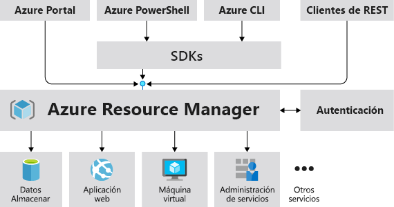
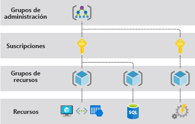
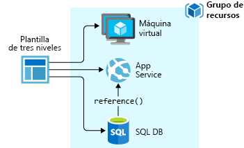
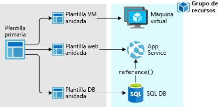
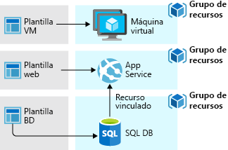

# <a name="azure-resource-manager-overview"></a>Información general del Administrador de recursos de Azure

Azure Resource Manager es el servicio de implementación y administración para Azure. Proporciona una capa de administración coherente que le permite crear, actualizar y eliminar recursos de su suscripción de Azure. Puede usar sus características de control de acceso, auditoría y etiquetado para proteger y organizar sus recursos después de la implementación.

Al realizar acciones mediante el portal, PowerShell, CLI de Azure, las API REST o los SDK de cliente, la API de Azure Resource Manager controla la solicitud. Dado que todas las solicitudes se controlan mediante la misma API, verá resultados y funcionalidades coherentes en todas las distintas herramientas. Todas las funcionalidades que están disponibles en el portal también lo están con Azure PowerShell, la CLI de Azure, las API REST y los SDK de cliente. Las funcionalidades disponibles originalmente mediante las API se incluirán en el portal a los 180 días de su lanzamiento inicial.

La siguiente imagen muestra cómo todas las herramientas interactúan con la misma API de Azure Resource Manager. La API pasa las solicitudes al servicio Resource Manager que las autentica y autoriza. A continuación, Resource Manager enruta las solicitudes al servicio adecuado.



## <a name="terminology"></a>Terminología

Si no conoce Azure Resource Manager, estos son algunos términos con los que puede no estar familiarizado.

* **recurso** : elemento administrable que está disponible a través de Azure. Las máquinas virtuales, cuentas de almacenamiento, aplicaciones web, bases de datos y redes virtuales son ejemplos de recursos.
* **grupo de recursos**: contenedor que almacena los recursos relacionados con una solución de Azure. El grupo de recursos incluye los recursos que se desean administrar como grupo. Para decidir cómo asignar los recursos a los grupos de recursos, tenga en cuenta lo que más conviene a su organización. Consulte [Grupos de recursos](#resource-groups).
* **proveedor de recursos**: un servicio que proporciona recursos de Azure. Por ejemplo, un proveedor de recursos común es **Microsoft.Compute**, que proporciona el recurso de máquina virtual. **Microsoft.Storage** es otro proveedor de recursos común. Consulte [Proveedores de recursos](#resource-providers).
* **Plantilla de Resource Manager**: archivo de notación de objetos JavaScript (JSON) que define uno o más recursos para implementar en un grupo de recursos o suscripción. La plantilla se puede usar para implementar los recursos de manera repetida y uniforme. Consulte [Implementación de plantilla](#template-deployment).
* **sintaxis declarativa** : sintaxis que permite establecer lo que pretende crear sin tener que escribir la secuencia de comandos de programación para crearla. La plantilla de Resource Manager es un ejemplo de sintaxis declarativa. En el archivo, puede definir las propiedades de la infraestructura que se va a implementar en Azure.

## <a name="the-benefits-of-using-resource-manager"></a>Ventajas de usar Administrador de recursos

Administrador de recursos ofrece varias ventajas:

* Puede implementar, administrar y supervisar todos los recursos de la solución en grupo, en lugar de controlarlos individualmente.
* Puede implementar la solución repetidamente a lo largo del ciclo de vida del desarrollo y tener la seguridad de que los recursos se implementan de forma coherente.
* Puede administrar la infraestructura mediante plantillas declarativas en lugar de scripts.
* Puede definir las dependencias entre recursos de modo que se implementen en el orden correcto.
* Puede aplicar control de acceso a todos los servicios del grupo de recursos al integrarse de forma nativa Control de acceso basado en rol (RBAC) en la plataforma de administración.
* Puede aplicar etiquetas a los recursos para organizar de manera lógica todos los recursos de la suscripción.
* Puede aclarar la facturación de su organización viendo los costos de un grupo de recursos que compartan la misma etiqueta.

## <a name="understand-management-scope"></a>Información sobre el ámbito de administración

Azure proporciona cuatro niveles de ámbito administración: [grupos de administración](../governance/management-groups/index.md), suscripciones, [grupos de recursos](#resource-groups) y recursos. En la imagen siguiente se muestra un ejemplo de estos niveles:



Aplicará la configuración de administración en cualquiera de estos niveles de ámbito. El nivel que seleccione determina el grado de amplitud con que se aplica la configuración. Los niveles inferiores heredan la configuración de los niveles superiores. Por ejemplo, al aplicar una [directiva](../governance/policy/overview.md) a la suscripción, esta se aplica a todos los grupos de recursos y recursos de la suscripción. Al aplicar una directiva al grupo de recursos, esta también se aplica al grupo de recursos y a todos sus recursos. Sin embargo, otro grupo de recursos no tiene la asignación de dicha directiva.

## <a name="guidance"></a>Guía

Las siguientes sugerencias le ayudarán a sacar el máximo partido de Resource Manager cuando trabaje con sus soluciones.

* Defina e implemente la infraestructura mediante la sintaxis declarativa en las plantillas de Administrador de recursos, en lugar de comandos imperativos.
* Defina todos los pasos de implementación y configuración de la plantilla. No debería tener ningún paso manual para configurar la solución.
* Ejecute comandos imperativos para administrar los recursos, como iniciar o detener una aplicación o un equipo.
* Organice los recursos con el mismo ciclo de vida en un grupo de recursos. Use etiquetas para organizar los demás recursos.

Para obtener instrucciones sobre cómo las empresas pueden utilizar Resource Manager para administrar eficazmente las suscripciones, vea [Scaffold empresarial de Azure: Gobernanza de suscripción prescriptiva](/azure/architecture/cloud-adoption-guide/subscription-governance?toc=%2fazure%2fazure-resource-manager%2ftoc.json).

Para más recomendaciones sobre creación de platillas, consulte [Procedimientos recomendados de plantillas de Azure Resource Manager](template-best-practices.md).

## <a name="resource-groups"></a>Grupos de recursos
Hay algunos factores importantes que se deben tener en cuenta al definir el grupo de recursos:

* Todos los recursos del grupo deben compartir el mismo ciclo de vida. Se implementan, actualizan y eliminan de forma conjunta. Si un recurso, como un servidor de base de datos, debe existir en un ciclo de implementación diferente, debe estar en otro grupo de recursos.
* Cada recurso solo puede existir en un grupo de recursos.
* Puede agregar o quitar un recurso de un grupo de recursos en cualquier momento.
* Puede mover un recurso de un grupo de recursos a otro. Para obtener más información, consulte [Traslado de los recursos a un nuevo grupo de recursos o a una nueva suscripción](resource-group-move-resources.md).
* Un grupo de recursos puede contener recursos que estén ubicados en diferentes regiones.
* Un grupo de recursos puede utilizarse para definir el ámbito de control de acceso para las acciones administrativas.
* Un recurso puede interactuar con los recursos de otros grupos. Esta interacción es común cuando ambos recursos están relacionados, pero no comparten el mismo ciclo de vida (por ejemplo, aplicaciones web que se conectan a una base de datos).

Al crear un grupo de recursos, es preciso proporcionar una ubicación para dicho grupo de recursos. Pero puede preguntarse: "¿Por qué necesita un grupo de recursos una ubicación? Y si los recursos pueden tener ubicaciones distintas de las del grupo de recursos, ¿por qué es importante la ubicación de este?" Los grupos de recursos almacenan metadatos acerca de los recursos. Por consiguiente, al especificar la ubicación del grupo de recursos, se especifica el lugar en que se almacenan dichos metadatos. Por motivos de compatibilidad, es posible que sea preciso asegurarse de que los datos se almacenan en una región concreta.

Si la región del grupo de recursos no está disponible temporalmente, no puede actualizar los recursos del grupo de recursos porque los metadatos no están disponibles. Los recursos de otras regiones seguirán funcionando según lo previsto, pero no podrá actualizarlos. Para minimizar el riesgo, busque el grupo de recursos y los recursos en la misma región.

## <a name="resource-providers"></a>Proveedores de recursos

Cada proveedor de recursos ofrece un conjunto de recursos y operaciones para trabajar con esos recursos. Por ejemplo, si desea almacenar claves y secretos, trabajará con el proveedor de recursos **Microsoft.KeyVault**. Este proveedor de recursos ofrece un tipo de recurso denominado **almacenes** para crear el almacén de claves.

El nombre de un tipo de recurso tiene el formato: **{proveedor de recursos}/{tipo de recurso}** . El tipo de recurso para un almacén de claves es **Microsoft.KeyVault/vaults**.

Antes de comenzar a implementar los recursos, debe conocer los proveedores de recursos disponibles. Conocer los nombres de los recursos y sus proveedores ayuda a definir los recursos que desea implementar en Azure. Además, es necesario que conozca las ubicaciones y las versiones de API válidas de cada tipo de recurso. Para más información, consulte [Tipos y proveedores de recursos](resource-manager-supported-services.md).

Para todas las operaciones que ofrecen los proveedores de recursos, consulte [las API REST de Azure](/rest/api/azure/).

## <a name="template-deployment"></a>Implementación de plantilla

Con Resource Manager, puede crear una plantilla (en formato JSON) que defina la infraestructura y la configuración de su solución de Azure. Mediante una plantilla, puede implementar la solución repetidamente a lo largo del ciclo de vida y tener la seguridad de que los recursos se implementan de forma coherente.

Para más información acerca del formato de la plantilla y cómo se crea, consulte [Nociones sobre la estructura y la sintaxis de las plantillas de Azure Resource Manager](resource-group-authoring-templates.md). Para ver la sintaxis JSON para los tipos de recursos, consulte [Define resources in Azure Resource Manager templates](/azure/templates/) (Definición de recursos en plantillas de Azure Resource Manager).

Resource Manager procesa la plantilla como cualquier otra solicitud. Analiza la plantilla y convierte su sintaxis en operaciones de API de REST para los proveedores de recursos adecuados. Por ejemplo, cuando Resource Manager recibe una plantilla con la siguiente definición de recursos:

```json
"resources": [
  {
    "apiVersion": "2016-01-01",
    "type": "Microsoft.Storage/storageAccounts",
    "name": "mystorageaccount",
    "location": "westus",
    "sku": {
      "name": "Standard_LRS"
    },
    "kind": "Storage",
    "properties": {
    }
  }
]
```

Convierte la definición en la siguiente operación de API de REST, que se envía al proveedor de recursos Microsoft.Storage:

```HTTP
PUT
https://management.azure.com/subscriptions/{subscriptionId}/resourceGroups/{resourceGroupName}/providers/Microsoft.Storage/storageAccounts/mystorageaccount?api-version=2016-01-01
REQUEST BODY
{
  "location": "westus",
  "properties": {
  }
  "sku": {
    "name": "Standard_LRS"
  },
  "kind": "Storage"
}
```

La definición de plantillas y grupos de recursos depende únicamente de usted, al igual que la administración de la solución. Por ejemplo, puede implementar su aplicación de tres niveles a través de una única plantilla en un único grupo de recursos.



No obstante, no es necesario que defina toda la infraestructura en una sola plantilla. A menudo, tiene sentido dividir los requisitos de implementación en un conjunto de plantillas seleccionadas, específicas para un propósito. Estas plantillas se pueden reutilizar fácilmente para distintas soluciones. Para implementar una solución concreta, cree una plantilla maestra que vincule todas las plantillas necesarias. La imagen siguiente muestra cómo implementar una solución de tres niveles mediante una plantilla principal que incluye tres plantillas anidadas.



Si desea que sus niveles tengan ciclos de vida independientes, puede implementar los tres niveles en grupos de recursos independientes. Observe que todavía se pueden vincular los recursos a los recursos de otros grupos.



Para más información acerca de las plantillas anidadas, consulte [Uso de plantillas vinculadas con Azure Resource Manager](resource-group-linked-templates.md).

Azure Resource Manager analiza las dependencias para asegurarse de que los recursos se crean en el orden correcto. Si un recurso se basa en un valor de otro recurso (por ejemplo, una máquina virtual que necesita una cuenta de almacenamiento para los discos), establezca una dependencia. Para obtener más información, consulte [Definición de dependencias en plantillas del Administrador de recursos de Azure](resource-group-define-dependencies.md).

También puede utilizar la plantilla para las actualizaciones de la infraestructura. Por ejemplo, puede agregar un recurso a la solución y agregar reglas de configuración para los recursos que ya están implementados. Si la plantilla define un recurso que ya existe, Resource Manager actualiza el recurso existente en lugar de crear uno nuevo.

Resource Manager proporciona extensiones para escenarios en los que se necesitan operaciones adicionales, como la instalación de un software determinado que no está incluido en el programa de instalación. Si ya utiliza un servicio de administración de configuración, como DSC, Chef o Puppet, puede seguir trabajando con ese servicio mediante las extensiones. Para más información acerca de las extensiones de máquina virtual, consulte [Acerca de las características y extensiones de las máquinas virtuales](../virtual-machines/windows/extensions-features.md?toc=%2fazure%2fvirtual-machines%2fwindows%2ftoc.json).

Cuando crea una solución desde el Portal, la solución incluye automáticamente una plantilla de implementación. No tiene que crear la plantilla desde cero; puede empezar con la plantilla para la solución y personalizarla para satisfacer sus necesidades específicas. Para obtener un ejemplo, consulte [Inicio rápido: Creación e implementación de plantillas de Azure Resource Manager mediante Azure Portal](./resource-manager-quickstart-create-templates-use-the-portal.md). También puede recuperar una plantilla de un grupo de recursos existente mediante la exportación del estado actual del grupo de recursos o la visualización de la plantilla de una implementación determinada. Una buena estrategia para aprender sobre la sintaxis de una plantilla es consultar la [plantilla exportada](./manage-resource-groups-portal.md#export-resource-groups-to-templates).

Por último, la plantilla se convierte en parte del código fuente de la aplicación. Puede protegerla en el repositorio de código fuente y actualizarla a medida que evoluciona la aplicación. Puede editar la plantilla mediante Visual Studio.

Después de definir la plantilla, está listo para implementar los recursos en Azure. Para implementar los recursos, consulte:

* [Implementación de recursos con las plantillas de Resource Manager y Azure PowerShell](resource-group-template-deploy.md)
* [Implementación de recursos con plantillas de Resource Manager y la CLI de Azure](resource-group-template-deploy-cli.md)
* [Implementación de recursos con las plantillas de Resource Manager y Azure Portal](resource-group-template-deploy-portal.md)
* [Implementación de recursos con las plantillas de Resource Manager y la API de REST de Resource Manager](resource-group-template-deploy-rest.md)

## <a name="safe-deployment-practices"></a>Procedimientos de implementación seguros

Al implementar un servicio complejo en Azure, es posible que necesite implementar el servicio en varias regiones y comprobar su estado antes de continuar con el paso siguiente. Use [Azure Deployment Manager](deployment-manager-overview.md) para coordinar un lanzamiento por fases del servicio. Mediante el establecimiento de fases en el lanzamiento del servicio, puede encontrar posibles problemas antes de que se haya implementado en todas las regiones. Si no necesita estas precauciones, las operaciones de implementación de la sección anterior son la mejor opción.

Deployment Manager se encuentra actualmente en versión preliminar pública.

## <a name="resiliency-of-azure-resource-manager"></a>Resistencia de Azure Resource Manager

El servicio Azure Resource Manager está diseñado para proporcionar resistencia y disponibilidad continua. Las operaciones de Resource Manager y del plano de control (solicitudes enviadas a management.azure.com) en la API REST:

* Se distribuyen entre regiones. Algunos servicios son regionales.

* Se distribuyen entre las zonas de disponibilidad (así como regiones) en aquellas ubicaciones que tienen varias zonas de disponibilidad.

* No dependen de un solo centro de datos lógicos.

* Nunca se interrumpen debido a actividades de mantenimiento.

Esta resistencia se aplica a los servicios que reciben las solicitudes a través de Resource Manager. Por ejemplo, Key Vault se beneficia de esta resistencia.

[!INCLUDE [arm-tutorials-quickstarts](../../includes/resource-manager-tutorials-quickstarts.md)]

## <a name="next-steps"></a>Pasos siguientes

En este artículo, ha aprendido a utilizar Azure Resource Manager para la implementación, la administración y el control de acceso de los recursos en Azure. Continúe con el siguiente artículo para aprender a crear la primera plantilla de Azure Resource Manager.

> [!div class="nextstepaction"]
> [Inicio rápido: Creación e implementación de plantillas de Azure Resource Manager mediante Azure Portal](./resource-manager-quickstart-create-templates-use-the-portal.md)
