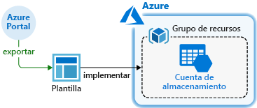
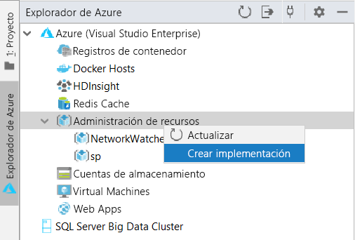
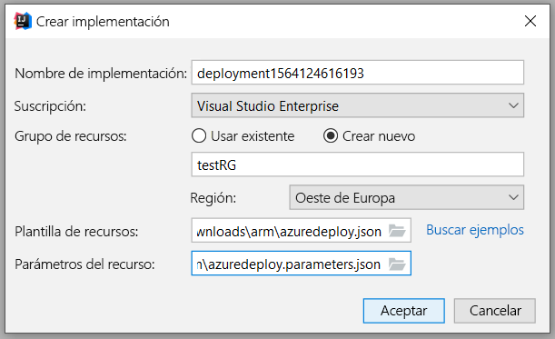
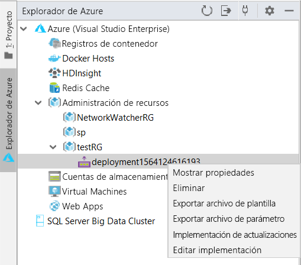
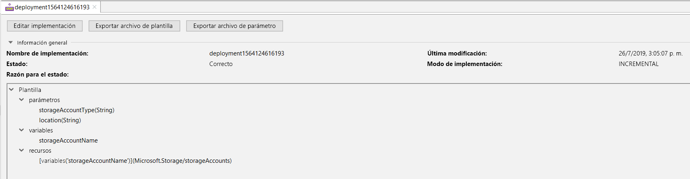
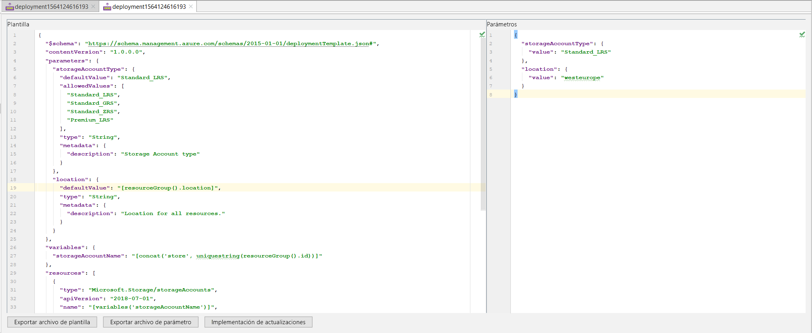
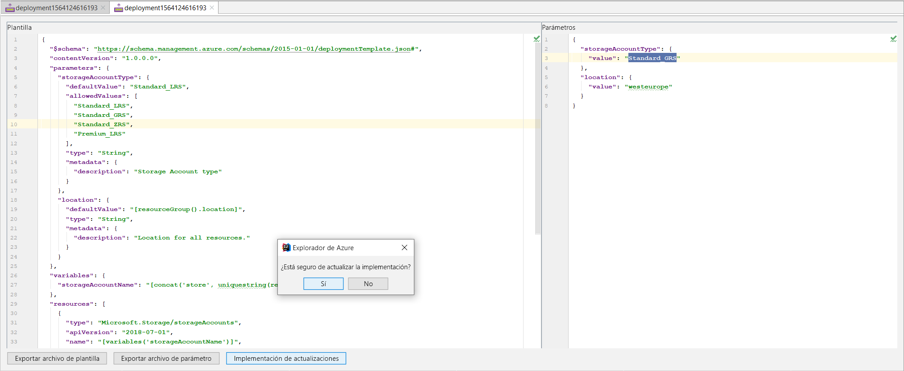
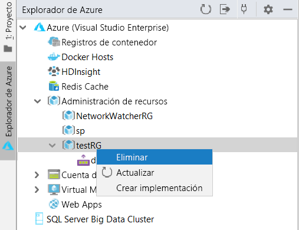

# Inicio rápido: Creación e implementación de plantillas de Azure Resource Manager mediante IntelliJ IDEA

Aprenda a implementar una plantilla de Resource Manager en Azure con IntelliJ IDEA y el proceso de edición y actualización de la plantilla directamente desde el entorno de desarrollo integrado. Las plantillas de Resource Manager son archivos JSON que definen los recursos que necesita para implementar la solución. Para entender los conceptos asociados a la implementación y administración de sus soluciones de Azure, consulte [Introducción a Azure Resource Manager](resource-group-overview.md).

Tras completar el tutorial implemente una cuenta de Azure Storage. El mismo proceso se puede usar para implementar otros recursos de Azure.

Si no tiene una suscripción a Azure, cree una [cuenta gratuita](https://azure.microsoft.com/free/) antes de empezar.

## Requisitos previos

Para completar este artículo, necesitará lo siguiente:

* [IntelliJ IDEA](https://www.jetbrains.com/idea/download/) Ultimate Edition o Community Edition instalado
* [Azure Toolkit for IntelliJ](https://plugins.jetbrains.com/plugin/8053) instalado; consulte la [guía de administración de complementos de IntelliJ](https://www.jetbrains.com/help/idea/managing-plugins.html) para más información.
* Haber [iniciado sesion](https://docs.microsoft.com/java/azure/intellij/azure-toolkit-for-intellij-sign-in-instructions) en su cuenta de Azure para Azure Toolkit for IntelliJ.

## Implementación de una plantilla de inicio rápido

En lugar de crear una plantilla desde cero, abra una plantilla en las [plantillas de inicio rápido de Azure](https://azure.microsoft.com/resources/templates/). Plantillas de inicio rápido de Azure es un repositorio de plantillas de Resource Manager. La plantilla usada en esta guía de inicio rápido se denomina [Crear una cuenta de almacenamiento estándar](https://github.com/Azure/azure-quickstart-templates/tree/master/101-storage-account-create/). Define un recurso de la cuenta de almacenamiento de Azure.

1. Haga clic con el botón derecho y guarde [`azuredeploy.json`](https://raw.githubusercontent.com/Azure/azure-quickstart-templates/master/101-storage-account-create/azuredeploy.json) y [`azuredeploy.parameters.json`](https://raw.githubusercontent.com/Azure/azure-quickstart-templates/master/101-storage-account-create/azuredeploy.parameters.json) en el equipo local.

1. Si el kit de herramientas de Azure está instalado y se ha iniciado sesión correctamente, debería ver el Explorador de Azure en la barra lateral de IntelliJ IDEA. Haga clic con el botón derecho en **Administración de recursos** y seleccione **Crear implementación**.

    

1. Configure el **Nombre de implementación**, la **Suscripción**, el **Grupo de recursos** y la **Región**. Aquí implementamos la plantilla en un nuevo grupo de recursos, `testRG`. A continuación, seleccione la ruta de acceso de **Resource Template** (Plantilla del recurso) como `azuredeploy.json` y los **Parámetros del recurso** como el archivo `azuredeploy.parameters.json` que descargó.

    

1. Al hacer clic en Aceptar, se inicia la implementación. Hasta que la implementación se complete, encontrará el progreso en la **barra de estado** de IntelliJ IDEA en la parte inferior.

    

## Examinar una implementación existente

1. Una vez finalizada la implementación, puede ver el nuevo grupo de recursos, `testRG`, y una nueva implementación creada. Haga clic con el botón derecho en la implementación para ver una lista de acciones posibles. Seleccione **Mostrar propiedades**.

    

1. Se abrirá una vista de pestaña para mostrar algunas propiedades útiles, como el estado de la implementación y la estructura de la plantilla.

    

## Edición y actualización de una implementación existente

1. Seleccione **Edit Deployment** (Editar implementación) en el menú que aparece al hacer clic con el botón derecho o en la vista Mostrar propiedades anterior. Se abrirá otra vista de pestaña que muestra los archivos de la plantilla y de parámetros para la implementación en Azure. Para guardar esos archivos en el entorno local, puede hacer clic en **Export Template File** (Exportar archivo de plantilla) o **Export Parameter Files** (Exportar archivos de parámetros).

    

1. Puede editar los dos archivos de esta página e implementar los cambios en Azure. Aquí se modifica el valor de **storageAccountType** en los archivos de parámetros, de `Standard_LRS` a `Standard_GRS`. A continuación, haga clic en **Implementación de actualizaciones** en la parte inferior y confirme la actualización.

    

1. Una vez finalizada la implementación de la actualización, puede comprobar en el portal que la cuenta de almacenamiento creada ha cambiado a `Standard_GRS`.

## Limpieza de recursos

1. Cuando los recursos de Azure ya no sean necesarios, limpie los recursos que implementó eliminando el grupo de recursos. Puede hacerlo desde Azure Portal o mediante la CLI de Azure. En el explorador de Azure de IntelliJ IDEA, haga clic con el botón derecho en el **grupo de recursos** creado y seleccione Eliminar.

    

> [!NOTE]
> Tenga en cuenta que la eliminación de una implementación no elimina los recursos creados por la implementación. Elimine el grupo de recursos o los recursos correspondientes si ya no los necesita.

## Pasos siguientes

El objetivo principal de este inicio rápido consiste en utilizar IntelliJ IDEA para implementar una plantilla existente de las plantillas de inicio rápido de Azure. También ha aprendido a ver y actualizar una implementación existente en Azure. Es posible que las plantillas de inicio rápido de Azure no le proporcionen todo lo que necesita. Para más información sobre el desarrollo de plantillas, consulte nuestra nueva serie de tutoriales para principiantes:

> [!div class="nextstepaction"]
> [Tutoriales para principiantes](./template-tutorial-create-first-template.md)

> [!div class="nextstepaction"]
> [Visite Java en el centro de desarrollo de Azure](https://docs.microsoft.com/azure/java)
