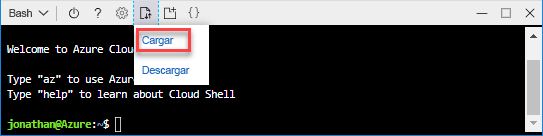
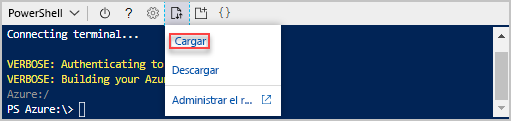

# <a name="quickstart-create-azure-resource-manager-templates-by-using-visual-studio-code"></a>Inicio rápido: Creación de plantillas de Azure Resource Manager mediante Visual Studio Code

Obtenga información sobre cómo usar el código de Visual Studio y la extensión de herramientas de Azure Resource Manager para crear y modificar las plantillas de Azure Resource Manager. Puede crear plantillas de Resource Manager en Visual Studio Code sin la extensión, pero la extensión proporciona opciones de autocompletar que simplifican el desarrollo de la plantilla. Para entender los conceptos asociados a la implementación y administración de sus soluciones de Azure, consulte [Introducción a Azure Resource Manager](resource-group-overview.md).

Si no tiene una suscripción a Azure, cree una [cuenta gratuita](https://azure.microsoft.com/free/) antes de empezar.

## <a name="prerequisites"></a>Requisitos previos

Para completar este artículo, necesitará lo siguiente:

- [Visual Studio Code](https://code.visualstudio.com/)
- Extensión de herramientas de Resource Manager Para instalarla, siga estos pasos:

    1. Abra Visual Studio Code.
    2. Presione **CTRL + MAYÚS + X** para abrir el panel de extensiones.
    3. Busque **Herramientas de Azure Resource Manager** y seleccione **Instalar**.
    4. Seleccione **Recargar** para finalizar la instalación de la extensión.

## <a name="open-a-quickstart-template"></a>Abra una plantilla de inicio rápido.

En lugar de crear una plantilla desde cero, abra una plantilla en las [plantillas de inicio rápido de Azure](https://azure.microsoft.com/resources/templates/). Las plantillas de inicio rápido de Azure consisten en un repositorio de plantillas de Resource Manager.

La plantilla usada en esta guía de inicio rápido se denomina [Crear una cuenta de almacenamiento estándar](https://azure.microsoft.com/resources/templates/101-storage-account-create/). La plantilla define un recurso de la cuenta de almacenamiento de Azure.

1. En Visual Studio Code, seleccione **Archivo**>**Abrir archivo**.
2. En **Nombre de archivo**, pegue el código URL siguiente:

    ```url
    https://raw.githubusercontent.com/Azure/azure-quickstart-templates/master/101-storage-account-create/azuredeploy.json
    ```

3. Seleccione **Abrir** para abrir el archivo.
4. Seleccione **Archivo**>**Guardar como** para guardar el archivo como **azuredeploy.json** en el equipo local.

## <a name="edit-the-template"></a>Edición de la plantilla

Para experimentar cómo se edita una plantilla mediante Visual Studio Code, agregue un elemento más a la sección `outputs` para mostrar el identificador URI.

1. Agregue una salida más a la plantilla exportada:

    ```json
    "storageUri": {
      "type": "string",
      "value": "[reference(variables('storageAccountName')).primaryEndpoints.blob]"
    }
    ```

    Cuando haya terminado, la sección outputs tendrá este aspecto:

    ```json
    "outputs": {
      "storageAccountName": {
        "type": "string",
        "value": "[variables('storageAccountName')]"
      },
      "storageUri": {
        "type": "string",
        "value": "[reference(variables('storageAccountName')).primaryEndpoints.blob]"
      }
    }
    ```

    Si ha copiado y pegado el código en Visual Studio Code, intente volver a escribir el elemento **value** para probar la funcionalidad IntelliSense de la extensión de herramientas de Resource Manager.

    

2. Seleccione **File**>**Guardar** para guardar los cambios.

## <a name="deploy-the-template"></a>Implementación de la plantilla

Existen muchos métodos para la implementación de plantillas.  En esta guía de inicio rápido, va a utilizar Azure Cloud Shell. Cloud Shell es una aplicación web que no requiere ninguna configuración. Es compatible tanto con la CLI de Azure como con Azure PowerShell.

[!INCLUDE [updated-for-az](../../includes/updated-for-az.md)]


1. Inicio de sesión en [Azure Cloud Shell](https://shell.azure.com)

    
2. Elija el entorno que prefiera seleccionando **PowerShell** o **Bash** en la esquina superior izquierda. Para usar la CLI, deberá abrir una sesión de Bash. Para ejecutar Azure PowerShell, es preciso abrir una sesión de PowerShell. Seleccione la flecha abajo para alternar entre Bash y PowerShell. Consulte la captura de pantalla anterior. Es necesario reiniciar el shell cuando realiza el cambio.
3. Seleccione **Cargar/descargar archivos** y, después, seleccione **Cargar**.

    # <a name="clitabcli"></a>[CLI](#tab/CLI)

    
   
    # <a name="powershelltabpowershell"></a>[PowerShell](#tab/PowerShell)
    
    
    
    ---

    Seleccione el archivo que guardó en la sección anterior. El nombre predeterminado es **azuredeploy.json**. Al archivo de plantilla se debe poder acceder desde el shell.

    Si lo desea, puede usar el comando **ls** y el comando **cat** para comprobar que el archivo se ha cargado correctamente. 

    # <a name="clitabcli"></a>[CLI](#tab/CLI)

    
   
    # <a name="powershelltabpowershell"></a>[PowerShell](#tab/PowerShell)
    
    
    
    ---
4. En Cloud Shell, ejecute los comandos siguientes. Seleccione la pestaña para mostrar el código de PowerShell o el código de la CLI.

    # <a name="clitabcli"></a>[CLI](#tab/CLI)
    ```azurecli
    echo "Enter the Resource Group name:" &&
    read resourceGroupName &&
    echo "Enter the location (i.e. centralus):" &&
    read location &&
    az group create --name $resourceGroupName --location "$location" &&
    az group deployment create --resource-group $resourceGroupName --template-file "$HOME/azuredeploy.json"
    ```
   
    # <a name="powershelltabpowershell"></a>[PowerShell](#tab/PowerShell)
    
    ```azurepowershell
    $resourceGroupName = Read-Host -Prompt "Enter the Resource Group name"
    $location = Read-Host -Prompt "Enter the location (i.e. centralus)"
    
    New-AzResourceGroup -Name $resourceGroupName -Location "$location"
    New-AzResourceGroupDeployment -ResourceGroupName $resourceGroupName -TemplateFile "$HOME/azuredeploy.json"
    ```
    
    ---

    Actualice el nombre del archivo de plantilla si guarda el archivo en un nombre distinto a **azuredeploy.json**. 

    En la captura de pantalla siguiente se muestra una implementación de ejemplo:

    # <a name="clitabcli"></a>[CLI](#tab/CLI)

    
   
    # <a name="powershelltabpowershell"></a>[PowerShell](#tab/PowerShell)
    
    
    
    ---

    El nombre de la cuenta de almacenamiento y la dirección URL de almacenamiento en la sección outputs se resaltan en la captura de pantalla. Necesita el nombre de la cuenta de almacenamiento en el paso siguiente.

5. Ejecute el siguiente comando de la CLI o de PowerShell para enumerar la cuenta de almacenamiento recién creada:

    # <a name="clitabcli"></a>[CLI](#tab/CLI)
    ```azurecli
    echo "Enter the Resource Group name:" &&
    read resourceGroupName &&
    echo "Enter the Storage Account name:" &&
    read storageAccountName &&
    az storage account show --resource-group $resourceGroupName --name $storageAccountName
    ```
   
    # <a name="powershelltabpowershell"></a>[PowerShell](#tab/PowerShell)
    
    ```azurepowershell
    $resourceGroupName = Read-Host -Prompt "Enter the Resource Group name"
    $storageAccountName = Read-Host -Prompt "Enter the Storage Account name"
    Get-AzStorageAccount -ResourceGroupName $resourceGroupName -Name $storageAccountName
    ```
    
    ---

Para más información sobre las cuentas de almacenamiento de Azure, consulte [Inicio rápido: Carga, descarga y enumeración de blobs mediante Azure Portal](../storage/blobs/storage-quickstart-blobs-portal.md).

## <a name="clean-up-resources"></a>Limpieza de recursos

Cuando los recursos de Azure ya no sean necesarios, limpie los recursos que implementó eliminando el grupo de recursos.

1. En Azure Portal, seleccione **Grupos de recursos** en el menú de la izquierda.
2. Escriba el nombre del grupo de recursos en el campo **Filtrar por nombre**.
3. Seleccione el nombre del grupo de recursos.  Verá un total de seis recursos en el grupo de recursos.
4. Seleccione **Eliminar grupo de recursos** del menú superior.

## <a name="next-steps"></a>Pasos siguientes

El objetivo principal de este tutorial consiste en utilizar Visual Studio Code para editar una plantilla existente de las plantillas de inicio rápido de Azure. También ha aprendido a implementar la plantilla mediante la CLI o mediante PowerShell desde Azure Cloud Shell. Es posible que las plantillas de inicio rápido de Azure no le proporcionen todo lo que necesita. En el siguiente tutorial se indica cómo encontrar la información en la referencia sobre plantillas para que pueda crear una cuenta de Azure Storage cifrada.

> [!div class="nextstepaction"]
> [Creación de una cuenta de almacenamiento cifrada](./resource-manager-tutorial-create-encrypted-storage-accounts.md)
