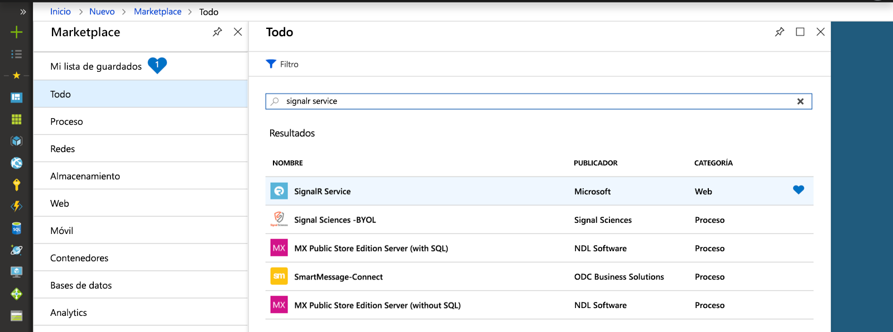
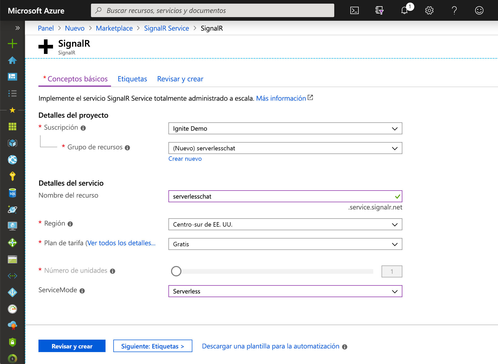

## Creación de una instancia del servicio Azure SignalR

La aplicación se conectará a una instancia del servicio SignalR en Azure.

1. Seleccione el botón Nuevo de la esquina superior izquierda en Azure Portal. En la pantalla Nuevo, escriba *SignalR Service* (Servicio SignalR) en el cuadro de búsqueda y presione Entrar.

    

1. Seleccione **SignalR Service** (Servicio SignalR) en los resultados de la búsqueda y, a continuación, seleccione **Crear**.

1. Escriba la siguiente configuración.

    | Configuración      | Valor sugerido  | DESCRIPCIÓN                                        |
    | ------------ |  ------- | -------------------------------------------------- |
    | **Nombre del recurso** | Nombre único globalmente | Nombre que identifica la nueva instancia del servicio SignalR. Los caracteres válidos son `a-z`, `0-9` y `-`.  | 
    | **Suscripción** | Su suscripción | Suscripción en que se creará esta nueva instancia del servicio SignalR. | 
    | **[Grupo de recursos](../../azure-resource-manager/resource-group-overview.md)** |  myResourceGroup | Nombre del nuevo grupo de recursos en el que se va a crear la instancia del servicio SignalR. | 
    | **Ubicación** | Oeste de EE. UU. | Seleccione una [región](https://azure.microsoft.com/regions/) cerca de usted. |
    | **Plan de tarifa** | Gratuito | Pruebe el servicio Azure SignalR de forma gratuita. |
    | **Recuento de unidades** |  No aplicable | El recuento de unidades especifica cuántas conexiones puede aceptar la instancia del servicio SignalR. Solo es configurable en el nivel Estándar. |

    

1. Seleccione **Crear** para empezar a implementar la instancia del servicio SignalR.
