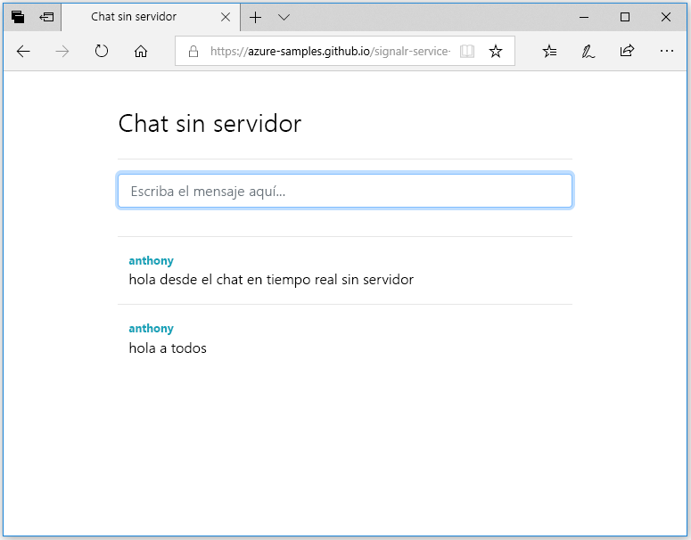

## Ejecución de la aplicación web

1. Hay una aplicación web de ejemplo de una sola página hospedada en GitHub para su comodidad. Abra [https://azure-samples.github.io/signalr-service-quickstart-serverless-chat/demo/chat-v2/](https://azure-samples.github.io/signalr-service-quickstart-serverless-chat/demo/chat-v2/) en el explorador.

    > [!NOTE]
    > El origen del archivo HTML se encuentra en [/docs/demo/chat-v2/index.html](https://github.com/Azure-Samples/signalr-service-quickstart-serverless-chat/blob/master/docs/demo/chat-v2/index.html).

1. Cuando se le pida la dirección URL base de la aplicación de función, escriba `http://localhost:7071`.

1. Escriba un nombre de usuario cuando se le solicite.

1. La aplicación web llama a la función *GetSignalRInfo* de la aplicación de función para recuperar la información de conexión y conectarse al servicio de Azure SignalR. Cuando se completa la conexión, aparece el cuadro de entrada de mensajes del chat.

1. Escriba un mensaje y presione ENTRAR. La aplicación envía el mensaje a la función *SendMessage* de la aplicación Azure Function que, a continuación, usa el enlace saliente de SignalR para difundir el mensaje a todos los clientes conectados. Si todo funciona correctamente, debería aparecer el mensaje en la aplicación.

    

1. Abra otra instancia de la aplicación web en otra ventana del explorador. Verá que los mensajes enviados aparecerán en todas las instancias de la aplicación.

> [!IMPORTANT]
> Como la página HTML se sirve con HTTPS pero el entorno de ejecución local de Azure Functions usa HTTP de manera predeterminada, el explorador (como Firefox) puede aplicar una directiva de contenido mixto que bloquee la solicitudes de la página web a las funciones. Para resolver este problema, use un explorador sin esta restricción o inicie un servidor HTTP local, como [http-server](https://www.npmjs.com/package/http-server) en el directorio */docs/demo/chat-v2*. Asegúrese de que el origen se agrega a la configuración `CORS` en *local.settings.json*.