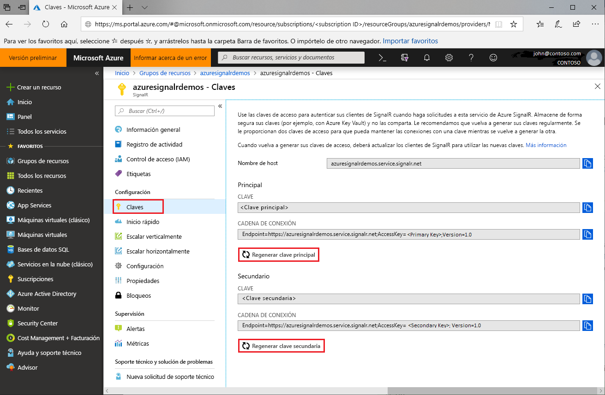

# Rotación de claves de acceso para Azure SignalR Service

Cada instancia de Azure SignalR Service tiene un par de claves de acceso: claves principales y secundarias. Se usan para autenticar a los clientes de SignalR al realizar solicitudes al servicio. Las claves están asociadas con la dirección URL del punto de conexión de instancia. Mantenga seguras las claves y realice su rotación de forma periódica. Como se le proporcionan dos claves de acceso, puede mantener las conexiones con una mientras se regenera la otra.

## ¿Por qué se deben rotar las claves de acceso?

Por motivos de seguridad y para satisfacer los requisitos de cumplimiento, se recomienda a los desarrolladores rotar periódicamente las claves de acceso.

## ¿Cómo se regeneran las claves de acceso?

1. Vaya a [Azure Portal](https://portal.azure.com/) e inicie sesión con sus credenciales.

1. Busque la sección **Claves** en la instancia de Azure SignalR Service para la que desee regenerar las claves.

1. Haga clic en **Claves** en el menú de navegación.

1. Haga clic en **Regenerar clave principal** o **Regenerar clave secundaria**.

Se creará y se mostrará una nueva clave y la cadena de conexión correspondiente.

 

También puede regenerar claves mediante la [CLI de Azure](/cli/azure/ext/signalr/signalr/key?view=azure-cli-latest#ext-signalr-az-signalr-key-renew).

## Actualización de configuraciones con nuevas cadenas de conexión

1. Copie la cadena de conexión recién generada.

1. Actualice todas las configuraciones para usar la nueva cadena de conexión.

1. Reinicie la aplicación según sea necesario.

## Regeneración forzada de claves de acceso

En determinadas situaciones, Azure SignalR Service puede exigir una regeneración obligatoria de las claves de acceso. El servicio lo notificará a los clientes por correo electrónico y el portal. Si recibe este tipo de comunicación o encuentra errores del servicio debido a la clave de acceso, siga esta guía para rotar las claves.

## Pasos siguientes

Como buena práctica de seguridad, se recomienda rotar las claves de acceso con frecuencia.

En esta guía ha aprendido sobre cómo volver a generar las claves de acceso. Continúe con los siguientes tutoriales sobre la autenticación con OAuth o Azure Functions.

> [!div class="nextstepaction"]
> [Integración con la identidad de ASP.NET Core](./signalr-authenticate-oauth.md)

> [!div class="nextstepaction"]
> [Creación de una aplicación en tiempo real sin servidor con autenticación](./signalr-authenticate-azure-functions.md)