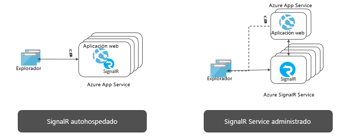

# ¿Qué es Azure SignalR Service?

Azure SignalR Service simplifica la incorporación de funcionalidades web en tiempo real a las aplicaciones a través de HTTP. Esta funcionalidad en tiempo real permite al servicio insertar las actualizaciones de contenido en los clientes conectados, como una única página web o aplicaciones móviles. Como resultado, los clientes se actualizan sin necesidad de sondear el servidor ni de enviar nuevas solicitudes HTTP para las actualizaciones.

En este artículo se proporciona una introducción a Azure SignalR Service.

## ¿Para qué se usa Azure SignalR Service?

En cualquier escenario que requiera la inserción de datos del servidor al cliente en tiempo real, puede usar Azure SignalR Service.

Las características tradicionales en tiempo real que a menudo requieren el sondeo del servidor también pueden usar Azure SignalR Service.

Azure SignalR Service se ha utilizado en una amplia variedad de sectores, para cualquier tipo de aplicación que requiera actualizaciones de contenido en tiempo real. A continuación se enumeran algunos ejemplos en los que conviene usar Azure SignalR Service:

* **Actualizaciones de datos de alta frecuencia:** juegos, votos, sondeos, subastas.
* **Paneles y supervisión:** panel de empresas, datos de mercados financieros, actualización instantánea de ventas, panel de líderes de juegos multijugador y supervisión de IoT.
* **Chat:** salón de chat en directo, bot de chat, soporte técnico al cliente en línea, asistente para la compra en tiempo real, messenger, chat en juego, etc.
* **Ubicación en tiempo real en el mapa:** seguimiento de la logística, seguimiento del estado de entrega, actualizaciones del estado de transporte, aplicaciones GPS.
* **Anuncios con objetivo en tiempo real:** ofertas y anuncios de inserción en tiempo de lectura, anuncios interactivos.
* **Aplicaciones de colaboración:** las aplicaciones de pizarra y coautoría, y el software de reuniones de equipo.
* **Notificaciones de inserción:** redes sociales, correo electrónico, juegos, alerta de viaje.
* **Difusión en tiempo real:** difusión de audio y vídeo en directo, subtítulos (CC), traducción, difusión de eventos y noticias.
* **IoT y dispositivos conectados:** métricas de IoT en tiempo real, control remoto, estado en tiempo real y seguimiento de la ubicación.
* **Automatización:** desencadenador en tiempo real de los eventos de nivel superior.

## ¿Cuáles son las ventajas de usar Azure SignalR Service?

**Basadas en el estándar:**

SignalR proporciona una abstracción de una serie de técnicas que se usan para compilar aplicaciones web en tiempo real. [WebSockets](https://wikipedia.org/wiki/WebSocket) es el transporte óptimo, pero otras técnicas, como [Server-Sent Events (SSE)](https://wikipedia.org/wiki/Server-sent_events) y Long Polling, se usan cuando otras opciones no están disponibles. SignalR detecta e inicializa automáticamente el transporte adecuado en función de las características admitidas en el servidor y el cliente.

**Compatibilidad nativa con ASP.NET Core:**

SignalR Service proporciona una experiencia de programación nativa con ASP.NET Core y ASP.NET. Desarrollar nuevas aplicaciones de SignalR con SignalR Service o migrar una aplicación basada en SignalR existente a SignalR Service requiere un esfuerzo mínimo.
SignalR Service también es compatible con la nueva característica de ASP.NET Core, Blazor de servidor.

**Compatibilidad con clientes extranjeros:**

SignalR Service funciona con una amplia gama de clientes, como los exploradores móviles y web, las aplicaciones de escritorio, las aplicaciones móviles, el proceso de servidor, los dispositivos IoT y las consolas de juegos. SignalR Service ofrece SDK en diferentes idiomas. Además de los SDK nativos ASP.NET Core o ASP.NET C#, SignalR Service también proporciona el SDK cliente de JavaScript a fin de habilitar los clientes web y numerosos marcos JavaScript. El SDK cliente de Java también se admite para las aplicaciones Java, incluidas las nativas de Android. SignalR Service es compatible con la API REST y sin servidor mediante las integraciones con Azure Functions y Event Grid.

**Control de las conexiones de cliente a gran escala:**

SignalR Service está diseñado para las aplicaciones en tiempo real a gran escala. SignalR Service permite que funcionen varias instancias conjuntamente para escalar a millones de conexiones de cliente. El servicio también admite varias regiones globales para el particionamiento, la alta disponibilidad o la recuperación ante desastres.

**Se quita la carga de SignalR autohospedado:**

En comparación con las aplicaciones autohospedadas de SignalR, al cambiar a SignalR Service se evitará tener que administrar planos posteriores que controlen las escalas y las conexiones de cliente. El servicio totalmente administrado también simplifica las aplicaciones web y ahorra el costo del hospedaje. SignalR Service ofrece un alcance global y un centro de datos y una red global, se escala a millones de conexiones, garantiza el SLA, al tiempo que proporciona todo el cumplimiento y seguridad del estándar de Azure.

**Se ofrecen API enriquecidas para diferentes patrones de mensajes:**

SignalR Service permite al servidor enviar mensajes a una conexión en particular, a todas o a un subconjunto de conexiones que pertenecen a un usuario específico o que se han colocado en un grupo arbitrario.

## Cómo usar Azure SignalR Service

Hay muchas maneras diferentes de programar con Azure SignalR Service, como algunas de las muestras enumeradas aquí:

- **[Escalar una aplicación de ASP.NET Core SignalR](signalr-concept-scale-aspnet-core.md)** : integre Azure SignalR Service con una aplicación de ASP.NET Core SignalR para escalar horizontalmente cientos de miles de conexiones.
- **[Compilar aplicaciones en tiempo real sin servidor](signalr-concept-azure-functions.md)** : use la integración de Azure Functions con Azure SignalR Service para crear aplicaciones en tiempo real sin servidor en lenguajes como JavaScript, C# y Java.
- **[Enviar mensajes desde el servidor a clientes a través de la API REST](https://github.com/Azure/azure-signalr/blob/dev/docs/rest-api.md)** : Azure SignalR Service proporciona la API REST para permitir que las aplicaciones envíen mensajes a los clientes conectados con SignalR Service, en cualquier lenguaje de programación compatible con REST.
