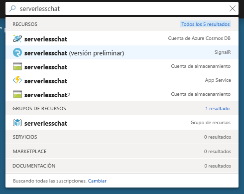
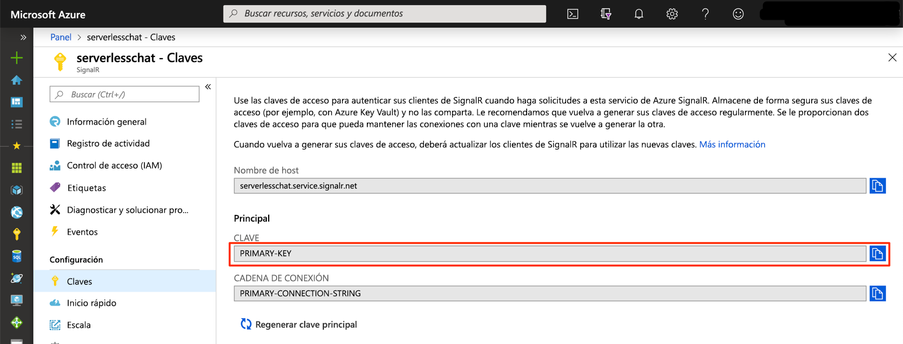

# <a name="quickstart-use-java-to-create-a-chat-room-with-azure-functions-and-signalr-service"></a>Inicio rápido: Uso de Java para crear un salón de chat con Azure Functions y SignalR Service

Azure SignalR Service permite agregar fácilmente funciones en tiempo real a una aplicación y Azure Functions es una plataforma sin servidor que permite ejecutar el código sin tener que administrar ninguna infraestructura. En este inicio rápido, se usa Java para crear una aplicación de chat en tiempo real sin servidor mediante SignalR Service y Functions.

## <a name="prerequisites"></a>Prerrequisitos

- Un editor de código como [Visual Studio Code](https://code.visualstudio.com/)
- Una cuenta de Azure con una suscripción activa. [Cree una cuenta gratuita](https://azure.microsoft.com/free/?ref=microsoft.com&utm_source=microsoft.com&utm_medium=docs&utm_campaign=visualstudio).
- [Azure Functions Core Tools](https://github.com/Azure/azure-functions-core-tools#installing). Se usa para ejecutar aplicaciones de Azure Functions de forma local.

   > [!NOTE]
   > Los enlaces de SignalR Service necesarios en Java solo se admiten en la versión 2.4.419 (versión de host 2.0.12332) de Azure Functions Core Tools, o en las versiones superiores.

   > [!NOTE]
   > Para instalar extensiones, Azure Functions Core Tools requiere que esté instalado el [SDK de .NET Core](https://www.microsoft.com/net/download). Sin embargo, no se requiere de ningún conocimiento de .NET para compilar aplicaciones de Azure Function de JavaScript.

- [Kit para desarrolladores de Java](https://www.azul.com/downloads/zulu/), versión 8
- [Apache Maven](https://maven.apache.org), versión 3.0 o posterior

> [!NOTE]
> Esta guía de inicio rápido se puede ejecutar en macOS, Windows o Linux.

## <a name="log-in-to-azure"></a>Inicio de sesión en Azure

Inicie sesión en Azure Portal en <https://portal.azure.com/> con su cuenta de Azure.

[!INCLUDE [Create instance](includes/signalr-quickstart-create-instance.md)]

[!INCLUDE [Clone application](includes/signalr-quickstart-clone-application.md)]

## <a name="configure-and-run-the-azure-function-app"></a>Configuración y ejecución de la aplicación Azure Function

1. En el explorador que se muestra al abrir Azure Portal, confirme que la instancia del servicio SignalR que implementó anteriormente se ha creado correctamente buscando su nombre en el cuadro de búsqueda de la parte superior del portal. Seleccione la instancia para abrirla.

    

1. Seleccione **Claves** para ver las cadenas de conexión para la instancia del servicio SignalR.

1. Seleccione y copie la cadena de conexión principal.

    

1. En el editor de código, abra la carpeta *src/chat/java* en el repositorio clonado.

1. Cambie el nombre de *local.settings.sample.json* a *local.settings.json*.

1. En **local.settings.json**, pegue la cadena de conexión en el valor de la configuración **AzureSignalRConnectionString**. Guarde el archivo.

1. El archivo principal que contiene las funciones está en *src/chat/java/src/main/java/com/function/Functions.java*:

    - **negotiate**: usa el enlace de entrada *SignalRConnectionInfo* para generar y devolver información de conexión válida.
    - **sendMessage**: recibe un mensaje de chat en el cuerpo de la solicitud y usa el enlace de salida *SignalR* para difundir el mensaje a todas las aplicaciones cliente conectadas.

1. En el terminal, asegúrese de que se encuentra en la carpeta *src/chat/java*. Compile la aplicación de función.

    ```bash
    mvn clean package
    ```

1. Ejecute la aplicación de función de forma local.

    ```bash
    mvn azure-functions:run
    ```

[!INCLUDE [Run web application](includes/signalr-quickstart-run-web-application.md)]

[!INCLUDE [Cleanup](includes/signalr-quickstart-cleanup.md)]

## <a name="next-steps"></a>Pasos siguientes

En este inicio rápido, ha compilado y ejecutado una aplicación sin servidor en tiempo real con Maven. A continuación, puede obtener información sobre cómo crear instancias de Azure Functions en Java desde cero.

> [!div class="nextstepaction"]
> [Creación de la primera función con Java y Maven](../azure-functions/functions-create-first-java-maven.md)