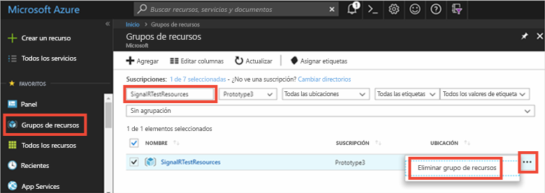

# <a name="quickstart-create-a-chat-room-with-aspnet-and-signalr-service"></a>Inicio rápido: Creación de un salón de chat con ASP.NET y SignalR Service

Azure SignalR Service se basa en [SignalR para ASP.NET Core 2.0](https://docs.microsoft.com/aspnet/core/signalr/introduction), que **no** es totalmente compatible con ASP.NET SignalR. Azure SignalR Service ha reimplementado el protocolo de datos de ASP.NET SignalR según las últimas tecnologías de ASP.NET Core. Al usar Azure SignalR Service para ASP.NET SignalR, ya no se admiten algunas características de ASP.NET SignalR, por ejemplo, Azure SignalR no reproduce los mensajes cuando el cliente se vuelve a conectar. Además, el transporte Forever Frame y JSONP no son compatibles. Se necesitan algunos cambios de código y la versión apropiada de las bibliotecas dependientes para que al aplicación de ASP.NET SignalR funcione con SignalR Service. 

Consulte el [documento con las diferencias entre versiones](https://docs.microsoft.com/aspnet/core/signalr/version-differences?view=aspnetcore-2.2) para ver una lista de la comparación de características entre ASP.NET SignalR y ASP.NET Core SignalR.

En esta guía de inicio rápido, obtendrá información sobre cómo empezar a trabajar con ASP.NET y Azure SignalR Service para una [aplicación de salón de chat](./signalr-quickstart-dotnet-core.md) similar.


[!INCLUDE [quickstarts-free-trial-note](../../includes/quickstarts-free-trial-note.md)]
## <a name="prerequisites"></a>Requisitos previos

* [Visual Studio 2019](https://visualstudio.microsoft.com/downloads/)
* [.NET 4.6.1](https://www.microsoft.com/net/download/windows)
* [ASP.NET SignalR 2.4.1](https://www.nuget.org/packages/Microsoft.AspNet.SignalR/)

## <a name="sign-in-to-azure"></a>Inicio de sesión en Azure

Inicie sesión en [Azure Portal](https://portal.azure.com/) con su cuenta de Azure.

[!INCLUDE [Create instance](includes/signalr-quickstart-create-instance.md)]

El modo *sin servidor* no es compatible para aplicaciones de ASP.NET SignalR. Use siempre las opciones *Predeterminada* o *Clásica* para la instancia de Azure SignalR Service.

También puede crear los recursos de Azure utilizados en esta guía de inicio rápido con la [creación de un script de SignalR Service](scripts/signalr-cli-create-service.md).

## <a name="clone-the-sample-application"></a>Clonación de la aplicación de ejemplo

Mientras se implementa el servicio, pasaremos a trabajar con el código. Clone la [aplicación de ejemplo de GitHub](https://github.com/aspnet/AzureSignalR-samples/tree/master/aspnet-samples/ChatRoom), establezca la cadena de conexión del servicio SignalR y ejecute la aplicación de forma local.

1. Abra una ventana de terminal de GIT. Cambie a la carpeta donde quiere clonar el proyecto de ejemplo.

1. Ejecute el comando siguiente para clonar el repositorio de ejemplo. Este comando crea una copia de la aplicación de ejemplo en el equipo.

    ```bash
    git clone https://github.com/aspnet/AzureSignalR-samples.git
    ```

## <a name="configure-and-run-chat-room-web-app"></a>Configuración y ejecución de una aplicación web de salón de chat

1. Inicie Visual Studio y abra la solución en la carpeta *aspnet-samples/ChatRoom/* del repositorio clonado.

1. En el explorador en el que se abre Azure Portal, busque y seleccione la instancia que creó.

1. Seleccione **Claves** para ver las cadenas de conexión para la instancia del servicio SignalR.

1. Seleccione y copie la cadena de conexión principal.

1. Ahora puede establecer la cadena de conexión en el archivo web.config.

    ```xml
    <configuration>
    <connectionStrings>
        <add name="Azure:SignalR:ConnectionString" connectionString="<Replace By Your Connection String>"/>
    </connectionStrings>
    ...
    </configuration>
    ```

1. En *Startup.cs*, en lugar de llamar a `MapSignalR()`, se debe llamar a `MapAzureSignalR({your_applicationName})` y pasar la cadena de conexión para que la aplicación se conecte al servicio en lugar de hospedar SignalR por sí mismo. Reemplace `{YourApplicationName}` en el nombre de la aplicación. Este nombre es un nombre único para distinguir esta aplicación de las otras aplicaciones. Puede usar `this.GetType().FullName` como valor.

    ```cs
    public void Configuration(IAppBuilder app)
    {
        // Any connection or hub wire up and configuration should go here
        app.MapAzureSignalR(this.GetType().FullName);
    }
    ```

    También debe hacer referencia al SDK del servicio antes de usar estas API. Abra **Herramientas | Administrador de paquetes NuGet | Consola del Administrador de paquetes** y ejecute el comando:

    ```powershell
    Install-Package Microsoft.Azure.SignalR.AspNet
    ```

    Aparte de estos cambios, todo lo demás permanece igual; todavía puede usar la interfaz de concentrador con la que está familiarizado para escribir la lógica de negocios.

    > [!NOTE]
    > En la implementación, se expone un punto de conexión `/signalr/negotiate` para la negociación mediante el SDK de Azure SignalR Service. Devolverá una respuesta de negociación especial cuando los clientes intenten conectarse y redirigir a los clientes al punto de conexión de servicio definido en la cadena de conexión.

1. Presione **F5** para ejecutar el proyecto en modo de depuración. Puede observar que la aplicación se ejecuta localmente. En lugar de que la propia aplicación hospede una instancia de SignalR en tiempo de ejecución, ahora se conecta a Azure SignalR Service.

[!INCLUDE [Cleanup](includes/signalr-quickstart-cleanup.md)]


> [!IMPORTANT]
> La eliminación de un grupo de recursos es irreversible y el grupo de recursos y todos los recursos que contiene se eliminarán de forma permanente. Asegúrese de no eliminar por accidente el grupo de recursos o los recursos equivocados. Si ha creado los recursos para hospedar este ejemplo dentro de un grupo de recursos existente que contiene recursos que desea mantener, puede eliminar cada recurso individualmente de sus hojas respectivas, en lugar de eliminar el grupo de recursos.
> 
> 

Inicie sesión en [Azure Portal](https://portal.azure.com) y haga clic en **Grupos de recursos**.

Escriba el nombre del grupo de recursos en el cuadro de texto **Filtrar por nombre...**. Las instrucciones de esta guía de inicio rápido usan un grupo de recursos llamado *SignalRTestResources*. En el grupo de recursos de la lista de resultados, haga clic en **...** y, a continuación, en **Eliminar grupo de recursos**.

   


Transcurridos unos instantes, el grupo de recursos y todos los recursos que contiene se eliminan.

## <a name="next-steps"></a>Pasos siguientes

En esta guía de inicio rápido, ha creado un recurso de Azure SignalR Service y lo ha usado con una aplicación web de ASP.NET. A continuación, obtenga información sobre cómo desarrollar aplicaciones en tiempo real mediante Azure SignalR Service con ASP.NET Core.

> [!div class="nextstepaction"]
> [Azure SignalR Service con ASP.NET Core](./signalr-quickstart-dotnet-core.md)
